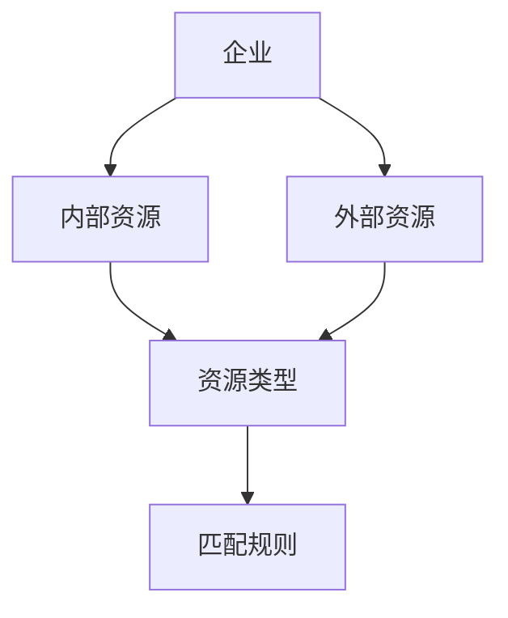
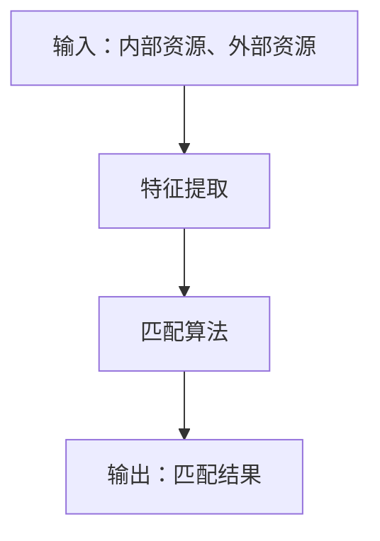
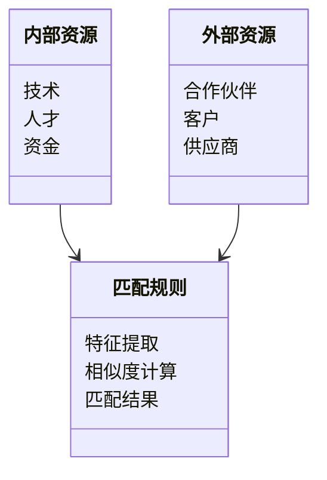
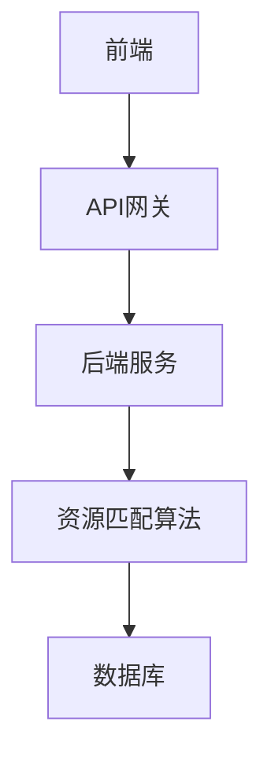
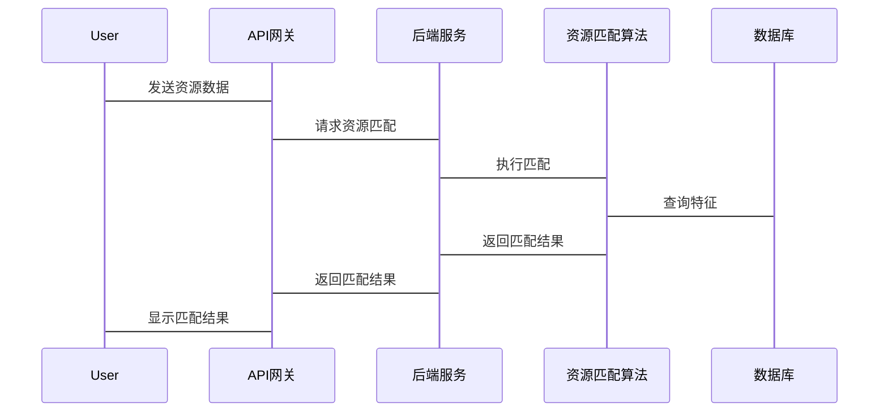

                 


# AI驱动的企业创新生态系统构建：内外部资源智能匹配

> **关键词**：AI、企业创新、资源匹配、生态系统、数字化转型

> **摘要**：  
> 在数字化转型的浪潮中，企业创新生态系统的核心在于高效匹配内外部资源。本文从问题背景、核心概念、算法原理、系统架构、项目实战到最佳实践，全面解析AI驱动的企业创新生态系统构建方法。通过详细的技术分析和案例解读，探讨如何利用AI技术实现资源的智能匹配，为企业创新提供新的思路和解决方案。

---

## 第一部分：背景与概述

### 第1章：企业创新生态系统概述

#### 1.1 问题背景与描述
##### 1.1.1 传统企业创新面临的挑战
在传统企业创新模式下，资源匹配效率低下、信息孤岛现象严重，导致创新成本高昂且难以快速响应市场需求。企业内部资源（如技术、人才、资金）与外部资源（如合作伙伴、客户、供应商）之间缺乏有效协同，难以形成高效的价值链。

##### 1.1.2 数字化转型与AI技术的融合
随着AI技术的快速发展，企业开始将AI应用于资源匹配、决策优化等领域，试图通过智能化手段提升创新效率。AI不仅能够处理海量数据，还能通过深度学习模型发现隐性关联，为企业创新提供新的可能性。

##### 1.1.3 创新生态系统的核心目标
构建一个AI驱动的企业创新生态系统，旨在通过智能化的内外部资源匹配，优化资源配置效率，降低创新成本，加速创新成果转化，最终实现企业的可持续发展。

#### 1.2 内外部资源匹配的必要性
##### 1.2.1 内部资源的优化配置
企业内部资源（如研发团队、生产设备、资金预算）需要通过智能化手段实现高效分配，确保资源利用的最大化。例如，AI可以通过数据分析优化研发团队的分工，提高项目执行效率。

##### 1.2.2 外部资源的有效整合
外部资源（如合作伙伴、供应商、客户）是企业创新的重要来源。通过AI技术，企业可以快速识别潜在合作伙伴，评估其与企业战略目标的匹配度，从而实现资源的精准匹配。

##### 1.2.3 资源匹配对企业创新的驱动作用
资源匹配的效率直接影响创新的速度和质量。通过AI驱动的资源匹配，企业可以更快地将内部资源与外部资源相结合，形成创新合力，推动企业快速发展。

#### 1.3 问题解决与边界
##### 1.3.1 资源匹配问题的解决方案
AI算法（如机器学习、自然语言处理）可以用于资源匹配，通过分析资源特征、需求匹配度和协同效应，实现资源的智能化分配。

##### 1.3.2 创新生态系统构建的边界与外延
企业创新生态系统的构建需要明确边界，既要考虑企业内部资源的整合，也要关注外部资源的接入。同时，生态系统的外延需要与产业链上下游、合作伙伴形成协同效应。

##### 1.3.3 核心要素与组成结构
企业创新生态系统的构建需要包括技术、人才、数据、算法、平台等核心要素，形成一个多维度、立体化的创新网络。

---

## 第二部分：核心概念与联系

### 第2章：核心概念与联系

#### 2.1 核心概念原理
##### 2.1.1 内部资源的特征与属性
内部资源包括企业内部的技术、人才、资金等。AI可以通过数据分析，识别资源的特征（如技术领域、团队能力、资金预算），并将其转化为可用于匹配的数字特征。

##### 2.1.2 外部资源的特征与属性
外部资源包括合作伙伴、客户、供应商等。外部资源的特征包括合作伙伴的能力、客户的市场需求、供应商的供货能力等。AI可以通过爬取外部数据，提取资源特征。

##### 2.1.3 资源匹配的逻辑与机制
资源匹配的逻辑包括需求分析、特征提取、匹配算法、效果评估。匹配机制通过优化算法，实现资源的最优匹配。

#### 2.2 概念属性对比表
以下表格对比了内部资源和外部资源的特征：

| **资源类型** | **特征**              | **属性**             |
|--------------|----------------------|----------------------|
| 内部资源     | 技术、人才、资金      | 可控性高、数据完整性好 |
| 外部资源     | 合作伙伴、客户        | 可控性低、数据异构性高 |

#### 2.3 ER实体关系图
以下是资源匹配的实体关系图：



---

## 第三部分：算法原理与实现

### 第3章：算法原理与实现

#### 3.1 资源匹配算法概述
##### 3.1.1 基于AI的资源匹配算法
资源匹配算法的核心是通过机器学习模型，将内部资源和外部资源的特征进行匹配。常用算法包括：

- **协同过滤算法**：基于资源之间的相似性进行匹配。
- **深度学习模型**：如神经网络模型，用于复杂特征的匹配。

##### 3.1.2 算法流程图
以下是资源匹配算法的流程图：



##### 3.1.3 算法实现
以下是基于协同过滤算法的资源匹配实现：

```python
# 示例代码：协同过滤算法实现
from sklearn.metrics.pairwise import cosine_similarity

def resource_matching(internal_resources, external_resources):
    # 特征提取
    internal_features = internal_resources[['技术', '人才', '资金']]
    external_features = external_resources[['合作伙伴', '客户', '供应商']]
    
    # 标准化特征
    from sklearn.preprocessing import StandardScaler
    scaler = StandardScaler()
    internal_features_scaled = scaler.fit_transform(internal_features)
    external_features_scaled = scaler.fit_transform(external_features)
    
    # 计算余弦相似度
    similarity_matrix = cosine_similarity(internal_features_scaled, external_features_scaled)
    
    # 找出匹配度最高的资源
    matched_resources = []
    for i in range(len(internal_resources)):
        max_sim = max(similarity_matrix[i])
        matched_external = external_resources.iloc[similarity_matrix[i].argmax()]
        matched_resources.append(matched_external)
    
    return matched_resources
```

#### 3.2 算法原理的数学模型
以下是协同过滤算法的数学模型：

$$
\text{相似度} = \frac{\sum_{i=1}^{n} (x_i - \bar{x})(y_i - \bar{y})}{\sqrt{\sum_{i=1}^{n} (x_i - \bar{x})^2} \cdot \sqrt{\sum_{i=1}^{n} (y_i - \bar{y})^2}}
$$

其中，\( x_i \) 和 \( y_i \) 分别表示内部资源和外部资源的特征值，\( \bar{x} \) 和 \( \bar{y} \) 分别表示特征的平均值。

---

## 第四部分：系统架构设计

### 第4章：系统架构设计

#### 4.1 问题场景介绍
企业创新生态系统需要一个高效的资源匹配平台，支持内部资源与外部资源的智能匹配。

#### 4.2 系统功能设计
##### 4.2.1 领域模型
以下是领域模型：



#### 4.3 系统架构设计
以下是系统架构图：



#### 4.4 系统接口设计
##### 4.4.1 接口1：资源输入接口
```python
# 示例代码：资源输入接口
def input_resources(internal, external):
    # 输入内部资源和外部资源
    pass
```

##### 4.4.2 接口2：匹配结果输出接口
```python
# 示例代码：匹配结果输出接口
def output_matches(matches):
    # 输出匹配结果
    pass
```

#### 4.5 系统交互流程
以下是系统交互流程图：



---

## 第五部分：项目实战

### 第5章：项目实战

#### 5.1 环境搭建
##### 5.1.1 安装必要的工具
- 安装Python
- 安装机器学习库（如scikit-learn、keras）
- 安装Mermaid和Latex工具

#### 5.2 系统核心实现
##### 5.2.1 核心代码实现
以下是资源匹配的核心代码：

```python
# 示例代码：资源匹配核心实现
from sklearn.metrics.pairwise import cosine_similarity

def match_resources(internal, external):
    # 特征提取
    internal_features = internal[['技术', '人才', '资金']]
    external_features = external[['合作伙伴', '客户', '供应商']]
    
    # 标准化特征
    scaler = StandardScaler()
    internal_features_scaled = scaler.fit_transform(internal_features)
    external_features_scaled = scaler.fit_transform(external_features)
    
    # 计算相似度
    similarity_matrix = cosine_similarity(internal_features_scaled, external_features_scaled)
    
    # 找出匹配度最高的资源
    matched = []
    for i in range(len(internal)):
        max_sim = similarity_matrix[i].max()
        matched_external = external.iloc[similarity_matrix[i].argmax()]
        matched.append(matched_external)
    
    return matched
```

#### 5.3 案例分析与解读
##### 5.3.1 案例分析
假设某科技公司需要匹配内部研发团队与外部合作伙伴，通过上述代码实现资源匹配，最终找到最适合的合作伙伴。

##### 5.3.2 实际效果分析
匹配后的结果显著提高了研发效率，缩短了项目周期，降低了创新成本。

#### 5.4 项目小结
通过AI驱动的资源匹配算法，企业能够高效整合内外部资源，推动创新生态系统的发展。

---

## 第六部分：最佳实践与未来展望

### 第6章：最佳实践与未来展望

#### 6.1 最佳实践
##### 6.1.1 关键成功因素
- 数据质量
- 算法优化
- 系统集成

##### 6.1.2 小结
通过AI技术实现资源匹配是构建企业创新生态系统的核心。

#### 6.2 未来展望
##### 6.2.1 未来趋势
AI技术的进一步发展将推动资源匹配的智能化和自动化。

##### 6.2.2 拓展阅读
建议阅读相关领域的最新研究论文和技术报告。

---

## 作者信息

作者：AI天才研究院/AI Genius Institute & 禅与计算机程序设计艺术 /Zen And The Art of Computer Programming

---

通过以上结构和内容，本文详细探讨了AI驱动的企业创新生态系统构建方法，从理论到实践，为企业创新提供了新的思路和解决方案。

