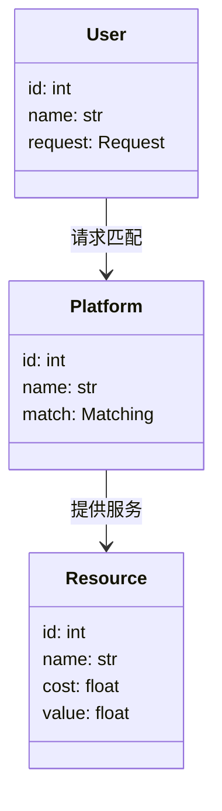
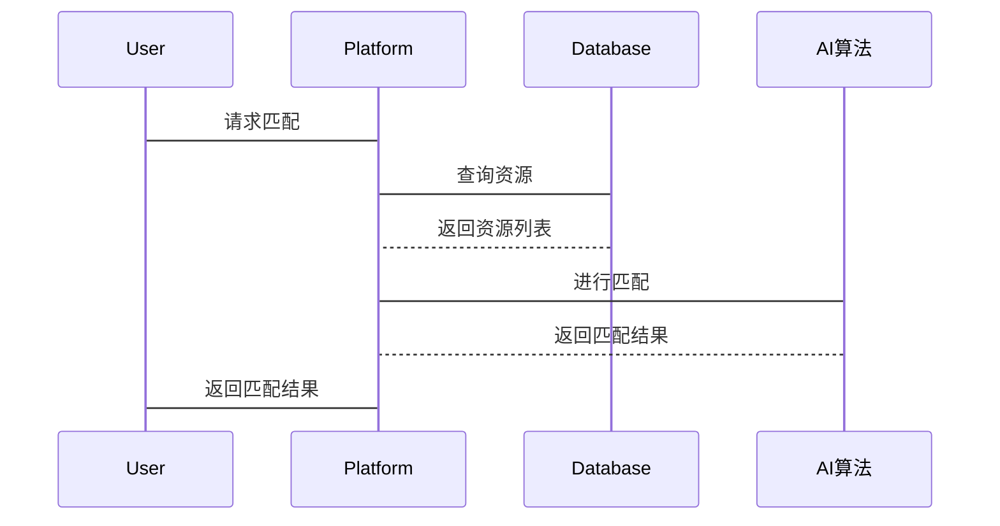

                 


# AI驱动的企业创新生态系统构建：内外部资源智能匹配与协作平台

## 关键词：AI，企业创新，资源匹配，协作平台，生态系统

## 摘要：  
本文深入探讨了AI驱动的企业创新生态系统构建的核心方法，重点分析了如何通过AI技术实现企业内外部资源的智能匹配与协作。文章从背景、概念、算法原理、系统架构到项目实战，全面阐述了AI在企业创新生态系统中的应用与价值。通过详细的技术分析和案例解读，为读者提供了构建高效创新生态系统的实践指南。

---

# 第一部分: 背景与概念

## 第1章: 问题背景与问题描述

### 1.1 企业创新生态系统的核心概念  
企业在面对快速变化的市场环境时，创新是保持竞争力的关键。然而，传统的企业创新模式往往面临资源分散、协作低效、匹配不当等问题，导致创新效率低下。AI技术的引入为企业创新生态系统带来了新的可能性，通过智能化的资源匹配与协作，帮助企业构建更高效、更具韧性的创新体系。

#### 1.1.1 企业创新生态系统的定义  
企业创新生态系统是指由企业内部资源（如员工、技术、数据）和外部资源（如合作伙伴、客户、第三方服务）共同构成的动态网络，通过协作与共享实现创新价值的最大化。

#### 1.1.2 创新生态系统的核心要素  
- **内部资源**：包括员工、技术、资金、数据等。
- **外部资源**：包括供应商、客户、合作伙伴、学术机构等。
- **AI平台**：作为资源匹配与协作的核心工具，通过算法优化资源配置。

#### 1.1.3 企业内外部资源的定义与分类  
- **内部资源**：企业内部可控的资源，如员工技能、研发能力等。
- **外部资源**：企业外部可获取的资源，如合作伙伴的能力、市场数据等。

### 1.2 问题背景与问题描述  
企业在创新过程中面临的主要问题包括：  
1. **资源分散**：企业内外部资源分布零散，难以高效整合。  
2. **协作低效**：资源匹配缺乏智能化，导致协作效率低下。  
3. **匹配不当**：传统的人工匹配方式难以满足复杂场景的需求。  

### 1.3 问题解决思路与边界  
通过AI技术实现资源的智能匹配与协作，构建一个动态、灵活的创新生态系统，能够实时优化资源配置，提升创新效率。  
- **核心思路**：利用AI算法分析资源需求，动态匹配最优资源组合。  
- **系统边界**：聚焦于企业内外部资源的匹配与协作，不涉及企业的核心业务流程。  

### 1.4 核心概念结构与组成  
- **输入**：企业内外部资源的需求与供给。  
- **输出**：优化后的资源匹配方案与协作流程。  
- **价值流**：通过资源优化匹配，提升创新效率与企业价值。

---

## 第2章: 核心概念与联系  

### 2.1 创新生态系统的核心要素  
- **企业内部资源**：员工技能、技术能力、数据资源等。  
- **企业外部资源**：供应商、合作伙伴、客户反馈等。  
- **AI驱动的匹配平台**：通过算法实现资源的智能匹配与协作。

### 2.2 核心概念的属性特征对比  
| 特性       | 内部资源         | 外部资源         | AI平台         |
|------------|------------------|------------------|----------------|
| 所有权     | 企业自有         | 第三方拥有        | 平台所有        |
| 灵活性     | 较低             | 较高             | 极高           |
| 匹配效率   | 低               | 一般             | 高             |

### 2.3 ER实体关系图  
```mermaid
er
  actor: 用户
  resource: 资源
  platform: 平台
  relation: 匹配关系
  actor --> resource: 需求
  actor --> platform: 请求匹配
  platform --> resource: 提供服务
  resource --> relation: 匹配记录
```

---

## 第3章: 资源匹配算法原理  

### 3.1 算法原理概述  
资源匹配算法通过分析资源的需求与供给，利用AI技术优化资源配置，实现高效匹配。

#### 3.1.1 资源匹配的基本原理  
资源匹配算法的目标是最大化资源利用率，最小化匹配成本。

#### 3.1.2 AI驱动的优化目标  
- 最小化匹配时间。  
- 最大化资源利用率。  
- 提高匹配精准度。  

#### 3.1.3 算法的数学模型  
资源匹配问题可以转化为一个线性规划问题：

$$ \text{最大化} \sum_{i=1}^{n} x_i \cdot v_i $$  
$$ \text{约束条件} $$  
- $$ \sum_{i=1}^{n} x_i \cdot u_i \leq C $$  
- $$ x_i \in \{0,1\} $$  

其中，$x_i$ 表示资源 $i$ 是否被选中，$v_i$ 是资源的价值，$u_i$ 是资源的成本，$C$ 是总成本预算。

### 3.2 资源匹配算法的数学模型  
#### 3.2.1 线性规划模型  
$$ \text{最大化} \sum_{i=1}^{n} x_i \cdot v_i $$  
$$ \sum_{i=1}^{n} x_i \cdot u_i \leq C $$  
$$ x_i \in \{0,1\} $$  

#### 3.2.2 算法实现步骤  
1. 收集资源需求与供给数据。  
2. 构建资源匹配模型。  
3. 优化模型参数。  
4. 输出匹配结果。

### 3.3 算法实现代码示例  

```python
import numpy as np

# 示例数据：资源需求与供给
resources = {
    'A': {'cost': 10, 'value': 5},
    'B': {'cost': 15, 'value': 7},
    'C': {'cost': 20, 'value': 10}
}

# 线性规划求解
from pulp import *

# 创建问题实例
prob = LpProblem("Resource_Matching", LpMaximize)

# 定义变量
x = {}
for r in resources:
    x[r] = LpVariable(name=r, binary=True)

# 定义目标函数
prob += lpSum([resources[r]['value'] * x[r] for r in resources]), "Total_Value"

# 定义约束条件
prob += lpSum([resources[r]['cost'] * x[r] for r in resources]) <= 20, "Cost_Constraint"

# 解决问题
prob.solve()

# 输出结果
for r in resources:
    print(f"{r}: {x[r].value()}")
```

---

## 第4章: 系统分析与架构设计  

### 4.1 问题场景介绍  
企业需要一个AI驱动的平台，实现内外部资源的智能匹配与协作。

### 4.2 系统功能设计  
#### 4.2.1 领域模型设计  


### 4.3 系统架构设计  
#### 4.3.1 架构图  


### 4.4 系统接口设计  
- **输入接口**：用户请求匹配资源。  
- **输出接口**：平台返回匹配结果。  

### 4.5 系统交互设计  


---

## 第5章: 项目实战  

### 5.1 环境安装  
- 安装Python、NumPy、Pulp等依赖库。  

### 5.2 核心代码实现  
```python
from pulp import *

# 示例数据
resources = {
    'A': {'cost': 10, 'value': 5},
    'B': {'cost': 15, 'value': 7},
    'C': {'cost': 20, 'value': 10}
}

# 创建问题实例
prob = LpProblem("Resource_Matching", LpMaximize)

# 定义变量
x = {}
for r in resources:
    x[r] = LpVariable(name=r, binary=True)

# 定义目标函数
prob += lpSum([resources[r]['value'] * x[r] for r in resources]), "Total_Value"

# 定义约束条件
prob += lpSum([resources[r]['cost'] * x[r] for r in resources]) <= 20, "Cost_Constraint"

# 解决问题
prob.solve()

# 输出结果
for r in resources:
    print(f"{r}: {x[r].value()}")
```

### 5.3 案例分析  
假设企业需要匹配一个价值高、成本低的资源，算法会优先选择资源B和资源C，因为它们的价值与成本比更高。

---

## 第6章: 最佳实践  

### 6.1 小结  
通过AI技术实现企业内外部资源的智能匹配与协作，能够显著提升创新效率。  

### 6.2 注意事项  
- 确保数据质量。  
- 定期优化算法。  

### 6.3 拓展阅读  
- 《AI驱动的资源优化配置》  
- 《企业创新生态系统构建的实践》  

---

# 结语  
AI驱动的企业创新生态系统构建是一个复杂而重要的任务，通过智能化的资源匹配与协作，企业能够更高效地实现创新目标。希望本文的内容能够为企业提供有价值的指导。

---

# 作者：AI天才研究院/AI Genius Institute & 禅与计算机程序设计艺术 /Zen And The Art of Computer Programming

