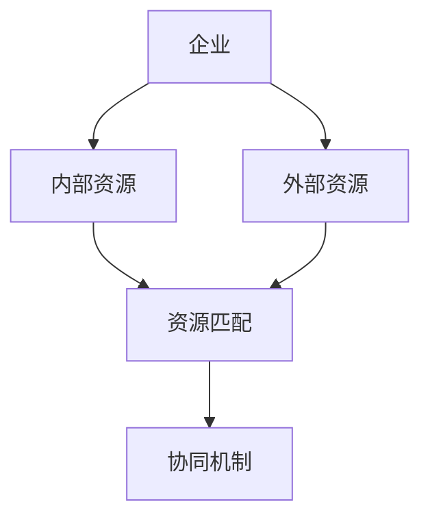
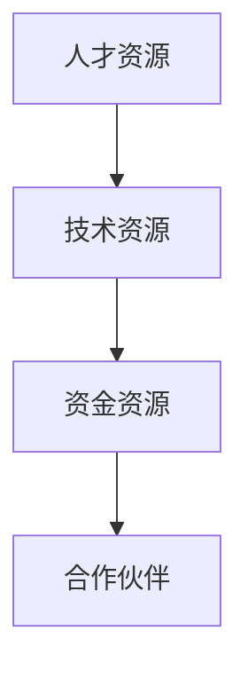
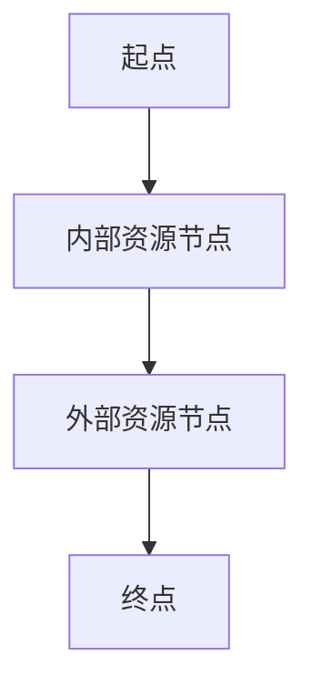
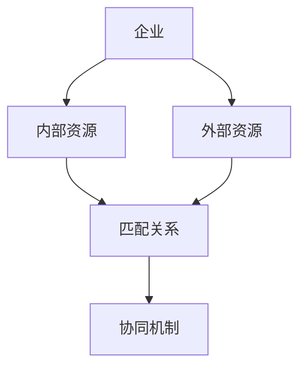
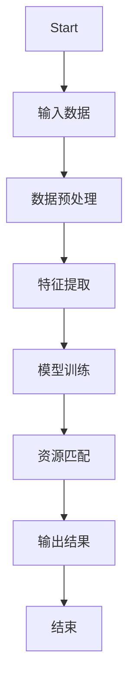
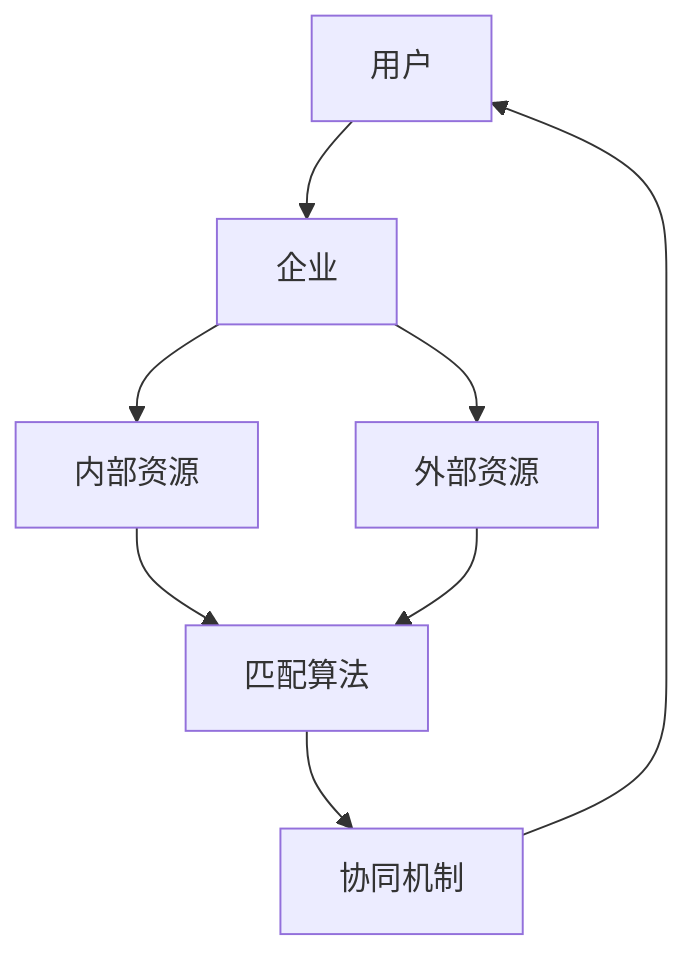

                 

<think>
嗯，用户让我写一篇关于AI驱动的企业创新生态系统构建的技术博客。首先，我需要理解用户的需求。他们可能是一位企业高管或者技术负责人，想了解如何利用AI来优化内部和外部资源的匹配与协同。

我需要先确定文章的结构，按照用户提供的大纲来写。首先，摘要部分要简明扼要，概述文章的核心内容。然后，每个章节都要详细展开，确保逻辑清晰，内容丰富。

在第一部分，我会介绍AI驱动的企业创新生态系统，包括问题背景、核心概念和概念结构。这部分需要让读者明白为什么需要AI驱动的创新生态系统，以及它的基本组成部分。

接下来是内外部资源的智能匹配，我会用图论模型和向量表示来解释资源匹配的原理，并通过ER实体关系图展示系统架构。这部分需要详细的技术分析，确保读者理解资源匹配的数学模型和算法。

然后，我会讲解AI算法的实现，包括算法流程图、代码示例和数学公式。这部分需要用具体的代码和数学表达式来说明算法的实现细节，帮助读者理解如何操作。

接下来是系统架构设计，我会介绍系统的各个模块，用类图展示系统功能，并设计接口和交互流程。这部分需要展示系统如何实际运行，帮助读者理解整体结构。

项目实战部分，我会提供一个具体的案例，详细分析环境安装、代码实现和案例结果。这能让读者看到实际应用的效果，增强文章的说服力。

最后，我会总结最佳实践、注意事项和拓展阅读，帮助读者进一步理解和应用这些概念。这样，整篇文章就能全面覆盖用户的需求，提供有价值的见解。
</think>

# AI驱动的企业创新生态系统构建：内外部资源智能匹配与协同

## 关键词：企业创新、AI驱动、资源匹配、协同机制、生态系统

## 摘要：
本文探讨了如何利用人工智能技术构建企业创新生态系统，重点分析了内外部资源的智能匹配与协同机制。通过系统化的理论分析和实践案例，详细阐述了资源匹配的数学模型、协同机制的算法实现以及系统架构设计，为企业的创新管理提供了新的思路和解决方案。

---

# 第一部分: AI驱动的企业创新生态系统构建概述

## 第1章: AI驱动的企业创新生态系统概述

### 1.1 问题背景与描述
#### 1.1.1 企业创新面临的挑战
在当今快速变化的商业环境中，企业创新面临着以下主要挑战：
1. **资源分散**：企业内部资源（如人才、技术、资金）与外部资源（如合作伙伴、客户、供应商）往往分散在不同的部门或系统中，难以高效协同。
2. **匹配效率低**：传统的人工匹配方式耗时且效率低下，难以快速找到最优资源组合。
3. **动态变化**：市场环境和技术的快速变化要求企业能够实时调整资源匹配策略。

#### 1.1.2 问题描述
企业创新生态系统需要一个高效的资源匹配与协同机制，能够实时整合内外部资源，优化资源配置，提升创新效率。

#### 1.1.3 问题解决
人工智能技术（AI）通过自然语言处理、机器学习和图算法等技术，能够帮助企业实现资源的智能匹配与协同。

### 1.2 核心概念与问题解决
#### 1.2.1 企业创新生态系统的定义
企业创新生态系统是一个由内外部资源构成的动态网络，通过智能匹配和协同机制，实现资源的高效利用和价值最大化。

#### 1.2.2 内外部资源匹配的挑战
| 资源类型 | 属性 | 匹配维度 | 匹配难度 |
|----------|------|----------|----------|
| 内部资源 | 人才、技术、资金 | 技能、成本、时间 | 高 |
| 外部资源 | 合作伙伴、客户、供应商 | 资质、需求、距离 | 中 |

#### 1.2.3 AI驱动的协同机制
AI通过以下方式实现资源匹配与协同：
1. **数据驱动**：利用大数据分析技术，提取资源的特征信息。
2. **智能匹配**：基于图算法和机器学习模型，实现资源的最优匹配。
3. **动态调整**：实时监控资源状态，动态优化匹配策略。

### 1.3 概念结构与核心要素
#### 1.3.1 生态系统的核心要素
1. **资源池**：企业内部和外部的所有资源。
2. **匹配算法**：基于AI的资源匹配算法。
3. **协同机制**：资源协同的规则和流程。
4. **反馈系统**：实时监控和优化的反馈机制。

#### 1.3.2 资源匹配的边界
| 边界类型 | 描述 |
|----------|------|
| 资源范围 | 包括内部资源和外部资源 |
| 匹配范围 | 局部匹配（单点优化）与全局匹配（系统优化） |
| 协同范围 | 微观协同（单个资源）与宏观协同（系统级） |

#### 1.3.3 资源匹配的实体关系图


---

## 第2章: 内外部资源智能匹配的核心原理

### 2.1 资源匹配的数学模型
#### 2.1.1 资源匹配的图论模型
资源匹配可以表示为一个图，节点代表资源，边代表资源之间的匹配关系。例如：


#### 2.1.2 资源属性的向量表示
将资源属性转换为向量表示，例如：
- 人才资源：$[\text{技能}, \text{经验}, \text{成本}]$
- 技术资源：$[\text{技术类型}, \text{成熟度}, \text{成本}]$

#### 2.1.3 匹配度的计算公式
匹配度可以通过相似度计算公式得出：
$$ \text{相似度} = \frac{\sum_{i=1}^{n} w_i \cdot x_i}{\sum_{i=1}^{n} w_i} $$
其中，$w_i$是第$i$个属性的权重，$x_i$是第$i$个属性的值。

### 2.2 协同机制的算法原理
#### 2.2.1 基于图的协同算法
协同算法可以通过图的遍历实现，例如：


#### 2.2.2 聚类分析与协同
利用聚类算法将相似的资源聚类，例如：
```python
from sklearn.cluster import KMeans
model = KMeans(n_clusters=3)
clusters = model.fit_predict(resource_features)
```

#### 2.2.3 强化学习的应用
强化学习可以用于动态调整匹配策略，例如：
```python
# 强化学习奖励函数
def reward_function(current_state, action):
    return 0.1 * action + 0.9 * current_state
```

### 2.3 资源匹配与协同的ER实体关系图


---

## 第3章: AI驱动的资源匹配算法实现

### 3.1 算法原理与流程图
#### 3.1.1 算法流程图


#### 3.1.2 算法实现代码
```python
def resource_matching_algorithm(data):
    # 数据预处理
    preprocessed_data = preprocess(data)
    # 特征提取
    features = extract_features(preprocessed_data)
    # 模型训练
    model = train_model(features)
    # 资源匹配
    matches = match_resources(model, features)
    return matches
```

### 3.2 数学模型与公式
#### 3.2.1 资源匹配的相似度计算
$$ \text{相似度} = \frac{\sum_{i=1}^{n} w_i \cdot x_i}{\sum_{i=1}^{n} w_i} $$

#### 3.2.2 协同机制的优化公式
$$ \text{优化目标} = \min_{\theta} \sum_{i=1}^{m} (y_i - f(x_i, \theta))^2 $$

---

## 第4章: 企业创新生态系统架构设计

### 4.1 系统功能设计
#### 4.1.1 资源管理模块
- 数据采集与存储
- 资源分类与标签化

#### 4.1.2 匹配算法模块
- 特征提取与向量化
- 算法匹配与输出

#### 4.1.3 协同机制模块
- 资源协同规则
- 动态优化机制

### 4.2 系统架构设计
#### 4.2.1 系统架构图


---

## 第5章: 项目实战与案例分析

### 5.1 项目实战
#### 5.1.1 环境安装
```bash
pip install numpy
pip install scikit-learn
pip install mermaid
```

#### 5.1.2 核心代码实现
```python
from sklearn.metrics.pairwise import cosine_similarity

def compute_similarity(features):
    return cosine_similarity(features)
```

#### 5.1.3 代码应用解读
- 输入数据：企业资源数据
- 输出结果：资源匹配度矩阵

### 5.2 案例分析
#### 5.2.1 案例背景
某科技公司需要匹配内部技术团队与外部供应商。

#### 5.2.2 实施步骤
1. 数据采集：收集内部技术团队和外部供应商的数据。
2. 特征提取：提取技术栈、项目经验、成本等特征。
3. 算法匹配：使用余弦相似度计算匹配度。
4. 输出结果：生成匹配报告。

#### 5.2.3 分析结果
通过AI算法匹配，找到了最优的资源组合，提高了项目成功率。

### 5.3 项目总结
通过AI驱动的资源匹配算法，企业能够显著提高创新效率，降低成本。

---

## 第6章: 最佳实践与未来展望

### 6.1 最佳实践
1. 数据质量是关键：确保数据的完整性和准确性。
2. 模型优化：根据实际需求调整算法参数。
3. 反馈机制：实时监控匹配效果并优化模型。

### 6.2 未来展望
随着AI技术的不断进步，企业创新生态系统将更加智能化和自动化。

---

## 作者：AI天才研究院 & 禅与计算机程序设计艺术

