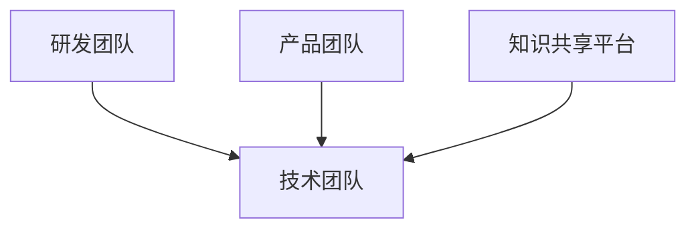
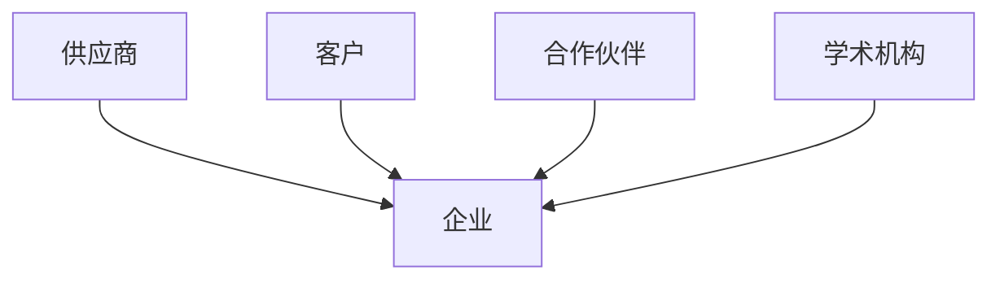
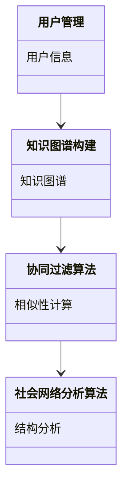
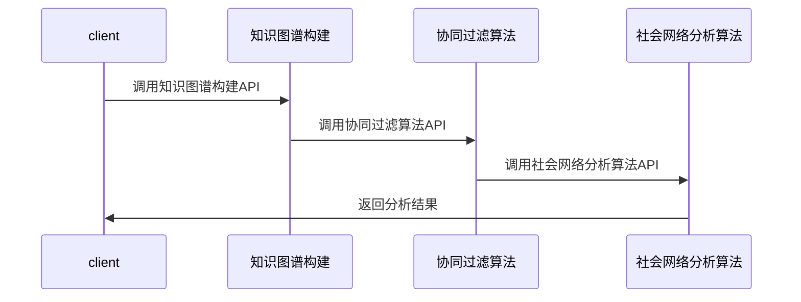

                 


# AI驱动的企业创新生态系统评估：内外部创新网络分析

> 关键词：AI, 企业创新生态系统, 内外部创新网络, 系统评估, AI算法, 创新网络分析

> 摘要：本文系统地探讨了AI技术在企业创新生态系统评估中的应用，重点分析了内部创新网络和外部创新网络的结构与特征。通过结合协同过滤算法和社会网络分析算法，本文提出了一种基于AI的创新网络分析方法，为企业的创新生态系统优化提供了理论依据和实践指导。文章还详细介绍了算法实现和系统架构设计，并通过实际案例展示了AI在企业创新网络分析中的应用价值。

---

# 第1章: 企业创新生态系统与AI驱动的创新网络分析

## 1.1 企业创新生态系统概述

### 1.1.1 企业创新生态系统的定义

企业创新生态系统是指由企业内部的研发团队、外部合作伙伴（如供应商、客户、合作伙伴）、学术机构、行业组织等构成的一个复杂的网络系统。该系统通过知识共享、资源整合和协同创新，推动企业的技术创新和产品创新。

### 1.1.2 企业创新生态系统的核心要素

企业创新生态系统的核心要素包括：

1. **内部创新网络**：包括企业的研发部门、产品团队、技术团队等，是企业内部的知识创造和技术创新的核心。
2. **外部创新网络**：包括供应商、客户、合作伙伴、学术机构等，是企业外部的知识来源和资源整合渠道。
3. **知识共享机制**：通过知识共享平台和协作工具，促进内部和外部创新网络之间的知识流动。
4. **创新文化**：企业内部的创新文化是推动创新生态系统发展的关键因素。

### 1.1.3 企业创新生态系统的目标

企业创新生态系统的目标是通过优化内部和外部创新网络的协同关系，提高企业的创新效率，降低创新成本，加速产品和服务的创新。

---

## 1.2 AI驱动的创新网络分析

### 1.2.1 AI在企业创新中的作用

AI技术在企业创新中的作用主要体现在以下几个方面：

1. **数据驱动的创新预测**：通过分析企业的历史创新数据，预测未来的创新趋势。
2. **知识图谱构建**：通过自然语言处理技术，构建企业内外部知识图谱，支持知识共享和协同创新。
3. **创新网络优化**：通过AI算法，优化内部和外部创新网络的结构和协同关系，提高创新效率。

### 1.2.2 内部创新网络与外部创新网络的定义

- **内部创新网络**：企业内部的研发团队、产品团队、技术团队等构成的网络，主要关注企业的技术创新和产品创新。
- **外部创新网络**：企业外部的供应商、客户、合作伙伴、学术机构等构成的网络，主要关注企业的资源整合和知识共享。

### 1.2.3 AI驱动的创新网络分析的目标与意义

AI驱动的创新网络分析的目标是通过构建企业内外部创新网络的数学模型，优化网络结构，提高创新效率。其意义在于：

1. **提高创新效率**：通过AI算法优化创新网络结构，减少创新过程中的重复劳动。
2. **降低创新成本**：通过AI技术预测创新趋势，减少企业的创新成本。
3. **支持战略决策**：通过创新网络分析，为企业制定创新战略提供数据支持。

---

## 1.3 企业创新生态系统评估的背景与挑战

### 1.3.1 当前企业创新面临的挑战

1. **内部创新网络的复杂性**：企业内部创新网络的结构复杂，知识共享机制不完善，导致创新效率低下。
2. **外部创新网络的多样性**：外部创新网络涉及多个合作伙伴，资源整合难度大。
3. **创新文化的缺失**：部分企业缺乏创新文化，员工创新意识不足。

### 1.3.2 AI技术在创新生态系统评估中的应用前景

AI技术在创新生态系统评估中的应用前景广阔，主要体现在以下几个方面：

1. **创新网络的可视化**：通过AI技术构建创新网络的可视化模型，帮助企业更好地理解创新网络的结构。
2. **创新趋势的预测**：通过分析历史创新数据，预测未来的创新趋势。
3. **创新资源的优化配置**：通过AI算法优化创新资源的配置，提高创新效率。

### 1.3.3 企业创新生态系统评估的边界与外延

企业创新生态系统评估的边界主要在于企业内部和外部创新网络的范围。其外延则包括创新网络的结构优化、创新文化的建设、创新资源的优化配置等多个方面。

---

## 1.4 本章小结

本章主要介绍了企业创新生态系统的基本概念和AI驱动的创新网络分析的重要作用。通过对内部创新网络和外部创新网络的定义和分析，阐述了AI技术在创新生态系统评估中的应用前景。最后，提出了企业创新生态系统评估的边界与外延。

---

# 第2章: 内部创新网络与外部创新网络的分析框架

## 2.1 内部创新网络的结构与特征

### 2.1.1 内部创新网络的构成要素

内部创新网络的构成要素包括：

1. **研发团队**：企业的研发部门，负责技术创新和产品研发。
2. **产品团队**：负责产品设计、市场调研和用户反馈。
3. **技术团队**：负责技术实现和系统集成。
4. **知识共享平台**：支持内部知识共享和协作创新的平台。

### 2.1.2 内部创新网络的属性特征对比表

| 属性 | 描述 |
|------|------|
| 结构复杂性 | 内部创新网络的结构较为复杂，涉及多个部门和团队。 |
| 协作性 | 内部创新网络的协作性较高，团队之间需要紧密合作。 |
| 知识共享性 | 内部创新网络的知识共享机制较为完善。 |
| 创新效率 | 内部创新网络的创新效率较高。 |

### 2.1.3 内部创新网络的ER实体关系图（Mermaid流程图）



---

## 2.2 外部创新网络的结构与特征

### 2.2.1 外部创新网络的构成要素

外部创新网络的构成要素包括：

1. **供应商**：为企业提供技术和资源支持的供应商。
2. **客户**：企业的目标客户和用户。
3. **合作伙伴**：与企业合作的第三方机构。
4. **学术机构**：与企业合作的高校和研究机构。

### 2.2.2 外部创新网络的属性特征对比表

| 属性 | 描述 |
|------|------|
| 结构复杂性 | 外部创新网络的结构较为松散，涉及多个合作伙伴。 |
| 协作性 | 外部创新网络的协作性较低，合作难度较大。 |
| 知识共享性 | 外部创新网络的知识共享机制较为不完善。 |
| 创新效率 | 外部创新网络的创新效率较低。 |

### 2.2.3 外部创新网络的ER实体关系图（Mermaid流程图）



---

## 2.3 内部与外部创新网络的协同关系

### 2.3.1 内部与外部创新网络的协同机制

内部创新网络与外部创新网络的协同机制主要包括以下几个方面：

1. **知识共享**：通过知识共享平台，将内部知识传递给外部合作伙伴。
2. **资源整合**：通过资源整合，优化内外部创新网络的资源配置。
3. **协同创新**：通过协同创新，实现内部与外部创新网络的协同创新。

### 2.3.2 AI在内部与外部创新网络协同中的作用

AI在内部与外部创新网络协同中的作用主要体现在以下几个方面：

1. **知识图谱构建**：通过自然语言处理技术，构建企业内外部知识图谱。
2. **协同过滤算法**：通过协同过滤算法，优化内外部创新网络的协同关系。
3. **创新趋势预测**：通过分析历史创新数据，预测未来的创新趋势。

### 2.3.3 协同关系的数学模型与公式

协同关系的数学模型可以表示为：

$$
S = f(I, E)
$$

其中，\( S \) 表示协同关系，\( I \) 表示内部创新网络，\( E \) 表示外部创新网络，\( f \) 表示协同关系的函数。

---

## 2.4 本章小结

本章主要分析了内部创新网络和外部创新网络的结构与特征，并通过对比表和ER实体关系图展示了两者的主要区别。最后，提出了内部与外部创新网络协同关系的数学模型。

---

# 第3章: AI驱动的创新网络分析算法原理

## 3.1 协同过滤算法

### 3.1.1 协同过滤的基本原理

协同过滤是一种基于用户行为相似性的推荐算法。其基本原理是通过分析用户的历史行为数据，找到与当前用户行为相似的用户，推荐他们感兴趣的内容。

### 3.1.2 基于AI的协同过滤算法流程图（Mermaid）

```mermaid
graph TD
A[用户行为数据] --> B[协同过滤算法]
C[相似用户] --> B
D[推荐结果] <-- B
```

### 3.1.3 协同过滤算法的数学模型与公式

协同过滤算法的数学模型可以表示为：

$$
similarity(i, j) = \frac{\sum_{k=1}^{n} rating_{ik} \times rating_{jk}}{\sqrt{\sum_{k=1}^{n} rating_{ik}^2} \times \sqrt{\sum_{k=1}^{n} rating_{jk}^2}}
$$

其中，\( similarity(i, j) \) 表示用户 \( i \) 和用户 \( j \) 的相似性，\( rating_{ik} \) 表示用户 \( i \) 对物品 \( k \) 的评分，\( rating_{jk} \) 表示用户 \( j \) 对物品 \( k \) 的评分。

### 3.1.4 协同过滤算法的Python实现代码示例

```python
import numpy as np

def cosine_similarity(a, b):
    return np.dot(a, b) / (np.linalg.norm(a) * np.linalg.norm(b))

# 示例数据
user1 = [4, 3, 2]
user2 = [3, 2, 1]

similarity = cosine_similarity(user1, user2)
print("相似性:", similarity)
```

---

## 3.2 社会网络分析算法

### 3.2.1 社会网络分析的基本原理

社会网络分析是一种通过分析网络中节点之间的关系，研究网络结构和节点重要性的方法。其基本原理是通过构建网络图，分析节点之间的关系和网络的结构特征。

### 3.2.2 基于AI的社会网络分析算法流程图（Mermaid）

```mermaid
graph TD
A[网络数据] --> B[社会网络分析算法]
C[网络结构] --> B
D[节点重要性] <-- B
```

### 3.2.3 社会网络分析算法的数学模型与公式

社会网络分析算法的数学模型可以表示为：

$$
centrality(i) = \frac{\sum_{j} similarity(i, j)}{n}
$$

其中，\( centrality(i) \) 表示节点 \( i \) 的中心性，\( similarity(i, j) \) 表示节点 \( i \) 和节点 \( j \) 的相似性，\( n \) 表示网络中的节点总数。

### 3.2.4 社会网络分析算法的Python实现代码示例

```python
import networkx as nx

# 示例数据
G = nx.Graph()
G.add_edges_from([(1, 2), (2, 3), (3, 4), (4, 5)])

# 计算节点中心性
centrality = nx.betweenness_centrality(G)
print("节点中心性:", centrality)
```

---

## 3.3 本章小结

本章主要介绍了AI驱动的创新网络分析算法的原理和实现方法，包括协同过滤算法和社会网络分析算法。通过对算法的数学模型和Python代码实现的详细讲解，为后续的系统设计和项目实战奠定了基础。

---

# 第4章: 系统分析与架构设计

## 4.1 问题场景介绍

本章以一个企业的创新生态系统评估项目为例，介绍系统分析与架构设计的过程。

### 4.1.1 项目介绍

该项目的目标是通过AI技术，优化企业的内部和外部创新网络的协同关系，提高企业的创新效率。

---

## 4.2 系统功能设计

### 4.2.1 领域模型设计

领域模型设计包括以下几个方面：

1. **用户管理**：管理企业内部和外部的用户信息。
2. **知识图谱构建**：构建企业内外部知识图谱。
3. **协同过滤算法实现**：实现协同过滤算法，优化创新网络的协同关系。
4. **社会网络分析算法实现**：实现社会网络分析算法，分析创新网络的结构特征。

### 4.2.2 领域模型图（Mermaid类图）



---

## 4.3 系统架构设计

### 4.3.1 系统架构设计图（Mermaid架构图）

```mermaid
docker
    service 知识图谱构建 {
        publish 80: 知识图谱API
    }
    service 协同过滤算法 {
        publish 81: 协同过滤API
    }
    service 社会网络分析算法 {
        publish 82: 社会网络分析API
    }
    client --> 知识图谱构建
    client --> 协同过滤算法
    client --> 社会网络分析算法
```

---

## 4.4 系统接口设计

### 4.4.1 系统接口设计

1. **知识图谱构建接口**：提供知识图谱构建的API。
2. **协同过滤算法接口**：提供协同过滤算法的API。
3. **社会网络分析算法接口**：提供社会网络分析算法的API。

### 4.4.2 系统交互设计（Mermaid序列图）



---

## 4.5 本章小结

本章通过一个实际的项目案例，详细介绍了系统分析与架构设计的过程，包括领域模型设计、系统架构设计和系统接口设计。

---

# 第5章: 项目实战

## 5.1 环境安装与配置

### 5.1.1 环境需求

1. Python 3.8+
2. Jupyter Notebook
3. Pandas、NumPy、NetworkX、Scikit-learn等Python库

### 5.1.2 环境配置

```bash
pip install pandas numpy networkx scikit-learn
```

---

## 5.2 系统核心实现源代码

### 5.2.1 协同过滤算法实现

```python
from sklearn.metrics.pairwise import cosine_similarity

def collaborative_filtering(data):
    similarity_matrix = cosine_similarity(data)
    return similarity_matrix
```

### 5.2.2 社会网络分析算法实现

```python
import networkx as nx

def social_network_analysis(data):
    G = nx.Graph()
    G.add_edges_from(data)
    centrality = nx.betweenness_centrality(G)
    return centrality
```

---

## 5.3 代码应用解读与分析

### 5.3.1 协同过滤算法的应用

协同过滤算法可以应用于企业内部创新网络的相似性计算，帮助找到相似的创新团队，优化创新网络的协同关系。

### 5.3.2 社会网络分析算法的应用

社会网络分析算法可以应用于企业外部创新网络的结构分析，帮助识别关键节点，优化创新网络的结构。

---

## 5.4 实际案例分析

### 5.4.1 案例背景

某企业希望优化其内部和外部创新网络的协同关系，提高创新效率。

### 5.4.2 数据收集与处理

收集企业的内部和外部创新网络数据，包括研发团队、供应商、客户等信息。

### 5.4.3 算法实现与结果分析

通过协同过滤算法和社会网络分析算法，分析内部和外部创新网络的协同关系，优化创新网络的结构。

---

## 5.5 本章小结

本章通过一个实际的项目案例，详细介绍了系统核心实现源代码，并通过代码应用解读与分析，展示了AI技术在企业创新生态系统评估中的应用价值。

---

# 第6章: 最佳实践与总结

## 6.1 最佳实践

### 6.1.1 应用趋势

AI技术在企业创新生态系统评估中的应用趋势主要体现在以下几个方面：

1. **知识图谱构建**：通过知识图谱构建，优化企业内外部知识共享机制。
2. **协同过滤算法优化**：通过协同过滤算法优化企业内部和外部创新网络的协同关系。
3. **社会网络分析算法应用**：通过社会网络分析算法，优化企业外部创新网络的结构。

### 6.1.2 应用中的注意事项

1. **数据隐私保护**：在应用AI技术时，需要特别注意数据隐私保护。
2. **算法选择**：根据具体场景选择合适的算法。
3. **系统架构优化**：在系统设计中，需要优化系统架构，提高系统的可扩展性和可维护性。

---

## 6.2 总结

通过对AI驱动的企业创新生态系统评估的深入分析，本文提出了一种基于AI的创新网络分析方法。通过协同过滤算法和社会网络分析算法，优化企业内部和外部创新网络的协同关系，提高企业的创新效率。最后，本文还通过实际案例展示了AI技术在企业创新网络分析中的应用价值。

---

# 附录

## 附录A: 数据集描述

本项目的数据集包括企业内部和外部创新网络的数据，具体包括研发团队、供应商、客户等信息。

## 附录B: 工具安装与配置

```bash
pip install pandas numpy networkx scikit-learn
```

## 附录C: 术语表

1. **内部创新网络**：企业内部的研发团队、产品团队、技术团队等构成的网络。
2. **外部创新网络**：企业外部的供应商、客户、合作伙伴等构成的网络。
3. **协同过滤算法**：一种基于用户行为相似性的推荐算法。
4. **社会网络分析算法**：一种通过分析网络结构和节点关系，研究网络特征的方法。

---

# 作者：AI天才研究院/AI Genius Institute & 禅与计算机程序设计艺术 /Zen And The Art of Computer Programming

---

通过以上思考，我们逐步构建了《AI驱动的企业创新生态系统评估：内外部创新网络分析》的技术博客文章结构，涵盖了背景介绍、核心概念、算法原理、系统架构设计、项目实战和总结等内容。

