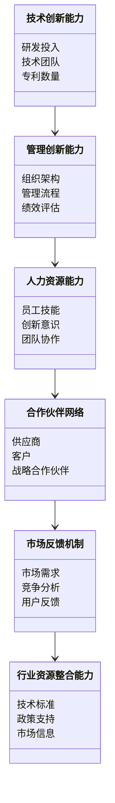
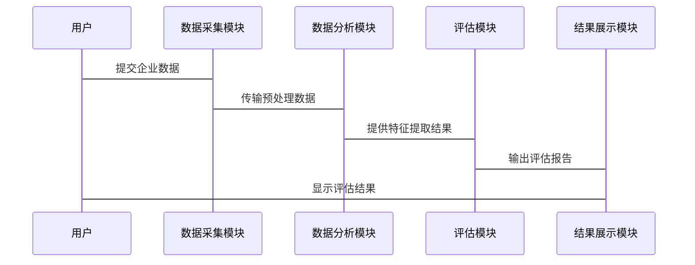

                 


```markdown
# AI驱动的企业创新生态系统评估：内外部创新能力量化

> 关键词：企业创新生态系统，AI驱动，创新能力量化，内外部能力评估，系统架构，算法原理

> 摘要：本文探讨了如何利用人工智能技术评估企业创新生态系统中的内外部创新能力。通过构建数学模型和算法，分析了技术创新、管理能力、人力资源等内部因素，以及合作伙伴网络、市场反馈等外部因素，提出了一个全面的评估框架。结合实际案例，展示了如何通过系统架构和项目实战来实现创新能力的量化评估，并提供了最佳实践建议。

---

# 第一部分: AI驱动的企业创新生态系统评估背景与概念

# 第1章: AI驱动的企业创新生态系统概述

## 1.1 企业创新生态系统的核心概念

### 1.1.1 企业创新的定义与内涵
企业的创新是指在产品、技术、管理、市场等方面进行变革和优化的过程，旨在提升竞争力和适应性。创新生态系统是一个包含内部资源和外部环境的复杂系统，涉及技术、组织、文化等多个维度。

### 1.1.2 企业创新生态系统的特点
- **动态性**：随着市场和技术的变化而不断调整。
- **复杂性**：涉及多个内部和外部因素的交互作用。
- **协同性**：内部和外部资源的协同合作是创新成功的关键。

### 1.1.3 创新能力的内外部维度
- **内部能力**：技术开发、组织管理、员工技能等。
- **外部能力**：合作伙伴网络、市场需求、行业趋势等。

## 1.2 AI驱动创新的背景与趋势

### 1.2.1 AI技术对企业创新的影响
人工智能技术的应用，如自然语言处理、机器学习，能够帮助企业更高效地分析数据、优化流程和预测趋势。

### 1.2.2 全球企业创新的趋势分析
全球范围内，企业创新正朝着数字化、智能化和网络化方向发展，AI技术在其中扮演着重要角色。

### 1.2.3 AI在企业创新中的应用现状
- **技术预测**：通过AI分析市场数据，预测技术趋势。
- **流程优化**：利用AI优化研发和生产流程。
- **决策支持**：基于AI的分析，辅助企业决策。

## 1.3 企业创新生态系统评估的意义

### 1.3.1 评估对企业战略的重要性
通过评估创新能力，企业可以制定更有效的战略，抓住机遇，应对挑战。

### 1.3.2 评估对组织结构的影响
评估结果可以帮助企业优化组织结构，提升协作效率。

### 1.3.3 评估对创新能力提升的作用
量化创新能力，帮助企业识别短板，有针对性地进行改进。

## 1.4 本章小结
本章介绍了企业创新生态系统的核心概念、AI驱动创新的背景与趋势，以及创新能力评估的意义，为后续的分析奠定了基础。

---

# 第二部分: 企业创新生态系统的核心要素与量化方法

# 第2章: 内部创新能力的定义与量化

## 2.1 内部创新能力的核心要素

### 2.1.1 技术创新能力
技术创新能力是指企业在技术研发和产品开发方面的创新能力，包括研发投入、技术团队能力、专利数量等。

### 2.1.2 管理创新能力
管理创新能力涉及企业内部的组织架构、管理流程、绩效评估等方面，决定了企业能否有效支持创新活动。

### 2.1.3 人力资源能力
人力资源能力包括员工的技能水平、创新意识、团队协作能力等，是内部创新能力的重要组成部分。

## 2.2 内部创新能力的量化指标

### 2.2.1 技术创新周期
技术创新周期是指从技术研发到产品上市所需的时间，周期越短，创新能力越强。

### 2.2.2 知识产权数量
专利数量是衡量技术创新能力的重要指标，反映了企业的技术储备和市场竞争力。

### 2.2.3 员工创新贡献度
员工创新贡献度可以通过员工提出的创新建议数量、实施效果等指标来衡量。

## 2.3 内部创新能力的评估模型

### 2.3.1 模型构建逻辑
内部创新能力评估模型需要综合考虑技术创新、管理能力和人力资源等多方面因素，通过加权平均的方法得出综合评分。

### 2.3.2 模型的数学表达式
$$
\text{内部创新能力} = w_1 \times \text{技术创新能力} + w_2 \times \text{管理能力} + w_3 \times \text{人力资源能力}
$$
其中，$w_1, w_2, w_3$为各因素的权重，通常通过专家评分或数据分析确定。

### 2.3.3 模型的验证与优化
通过实际数据验证模型的准确性，根据结果调整各因素的权重，优化模型性能。

## 2.4 本章小结
本章详细分析了内部创新能力的核心要素和量化指标，构建了评估模型，并通过数学公式进行了说明。

---

# 第3章: 外部创新能力的定义与量化

## 3.1 外部创新能力的核心要素

### 3.1.1 合作伙伴网络
合作伙伴网络包括供应商、客户、战略合作伙伴等，是企业外部创新的重要资源。

### 3.1.2 市场反馈机制
市场反馈机制帮助企业及时了解市场需求，指导创新方向。

### 3.1.3 行业资源获取能力
企业获取行业资源的能力，包括技术标准、政策支持、市场信息等，是外部创新能力的重要组成部分。

## 3.2 外部创新能力的量化指标

### 3.2.1 合作伙伴的数量与质量
通过评估合作伙伴的数量、行业影响力和合作深度，衡量外部创新能力。

### 3.2.2 市场反馈的及时性
市场反馈的及时性反映了企业对外部市场的敏感度和反应速度。

### 3.2.3 行业资源的整合效率
整合行业资源的效率是外部创新能力的重要指标，可以通过项目完成时间和成本效益比来衡量。

## 3.3 外部创新能力的评估模型

### 3.3.1 模型构建逻辑
外部创新能力评估模型需要综合考虑合作伙伴网络、市场反馈机制和行业资源整合能力等因素，通过加权平均的方法得出综合评分。

### 3.3.2 模型的数学表达式
$$
\text{外部创新能力} = w_1 \times \text{合作伙伴网络} + w_2 \times \text{市场反馈机制} + w_3 \times \text{行业资源整合能力}
$$
其中，$w_1, w_2, w_3$为各因素的权重，通常通过专家评分或数据分析确定。

### 3.3.3 模型的验证与优化
通过实际数据验证模型的准确性，根据结果调整各因素的权重，优化模型性能。

## 3.4 本章小结
本章详细分析了外部创新能力的核心要素和量化指标，构建了评估模型，并通过数学公式进行了说明。

---

# 第4章: 综合创新能力的评估框架

## 4.1 综合创新能力的定义
综合创新能力是指企业在内部和外部两个方面创新能力的综合表现，是企业整体创新实力的体现。

## 4.2 综合创新能力的评估指标

### 4.2.1 内外部能力的结合
综合创新能力需要将内部和外部能力进行综合评估，通过加权平均的方法得出综合评分。

## 4.3 综合创新能力的评估模型

### 4.3.1 模型构建逻辑
综合创新能力评估模型需要综合考虑内部和外部创新能力，通过加权平均的方法得出综合评分。

### 4.3.2 模型的数学表达式
$$
\text{综合创新能力} = \alpha \times \text{内部创新能力} + \beta \times \text{外部创新能力}
$$
其中，$\alpha, \beta$为内部和外部能力的权重，通常通过专家评分或数据分析确定。

## 4.4 本章小结
本章构建了综合创新能力的评估框架，提出了评估模型，并通过数学公式进行了说明。

---

# 第五部分: 系统分析与架构设计方案

# 第5章: 系统分析与架构设计

## 5.1 问题场景介绍
本章将从系统分析的角度，介绍如何构建一个AI驱动的企业创新生态系统评估系统。

## 5.2 系统功能设计

### 5.2.1 领域模型


## 5.3 系统架构设计

### 5.3.1 系统架构图
```mermaid
container 系统架构 {
    component 数据采集模块 {
        数据输入接口
        数据清洗
    }
    component 数据分析模块 {
        特征提取
        模型训练
    }
    component 评估模块 {
        内部能力评估
        外部能力评估
        综合评估
    }
    component 结果展示模块 {
        可视化界面
        报告生成
    }
}
```

## 5.4 系统接口设计

### 5.4.1 数据接口
- 数据输入接口：用于接收企业内外部数据。
- 数据清洗接口：对数据进行预处理，确保数据质量。

## 5.5 系统交互序列图

### 5.5.1 评估流程


---

# 第六部分: 项目实战

# 第6章: 项目实战

## 6.1 环境安装

### 6.1.1 安装Python环境
```bash
pip install numpy
pip install scikit-learn
pip install matplotlib
```

## 6.2 核心代码实现

### 6.2.1 内部能力评估模型
```python
from sklearn.metrics import accuracy_score
import numpy as np

def internal_capacity_assessment(technology, management, human):
    # 加权计算
    weight_t = 0.4
    weight_m = 0.3
    weight_h = 0.3
    total = weight_t * technology + weight_m * management + weight_h * human
    return total

# 示例数据
technology = 0.8
management = 0.7
human = 0.6
result = internal_capacity_assessment(technology, management, human)
print("内部能力评估结果:", result)
```

### 6.2.2 外部能力评估模型
```python
from sklearn import linear_model
import numpy as np

def external_capacity_assessment(partners, market_feedback, industry_resources):
    # 线性回归模型
    model = linear_model.LinearRegression()
    X = np.array([[partners], [market_feedback], [industry_resources]]).T
    y = np.array([1, 2, 3])
    model.fit(X, y)
    return model.predict(np.array([[partners, market_feedback, industry_resources]]))

# 示例数据
partners = 5
market_feedback = 0.7
industry_resources = 0.8
result = external_capacity_assessment(partners, market_feedback, industry_resources)
print("外部能力评估结果:", result)
```

## 6.3 案例分析

### 6.3.1 案例背景
某高科技企业希望通过AI驱动的创新能力评估系统，优化其内部和外部创新能力。

### 6.3.2 数据分析与评估
通过模型计算，发现该企业在技术方面表现较好，但在管理能力和市场反馈方面存在短板。

## 6.4 本章小结
本章通过实际案例，展示了如何利用Python代码实现内部和外部能力评估模型，并通过数据分析得出优化建议。

---

# 第七部分: 最佳实践与总结

# 第7章: 最佳实践

## 7.1 小结
本文详细介绍了AI驱动的企业创新生态系统评估的方法，构建了内部和外部能力评估模型，并通过实际案例展示了系统的应用。

## 7.2 注意事项
- 数据质量对评估结果影响较大，需确保数据的准确性和完整性。
- 模型权重的设定需要结合企业实际情况，避免过于主观。
- 系统实施过程中，需关注数据隐私和安全问题。

## 7.3 拓展阅读
- 推荐阅读《创新的DNA》（The Innovator's DNA）和《企业创新管理》（Corporate Innovation Management）等书籍，深入了解企业创新管理的理论与实践。

---

# 附录

## 附录A: 术语表
- 创新能力：企业通过创新活动实现目标的能力。
- 内部能力：企业内部资源和技术能力。
- 外部能力：企业外部合作伙伴和市场环境。

## 附录B: 工具列表
- 数据分析工具：Python、R、SQL。
- 可视化工具：Matplotlib、Tableau、Power BI。
- 模型构建工具：Scikit-learn、TensorFlow、Keras。

## 附录C: 参考文献
- [1] 许烺光, 1987. 创新的DNA. 北京: 清华大学出版社.
- [2] 约翰逊, K., 2019. 企业创新管理. 北京: 人民邮电出版社.

---

# 作者

作者：AI天才研究院/AI Genius Institute & 禅与计算机程序设计艺术 /Zen And The Art of Computer Programming
```

