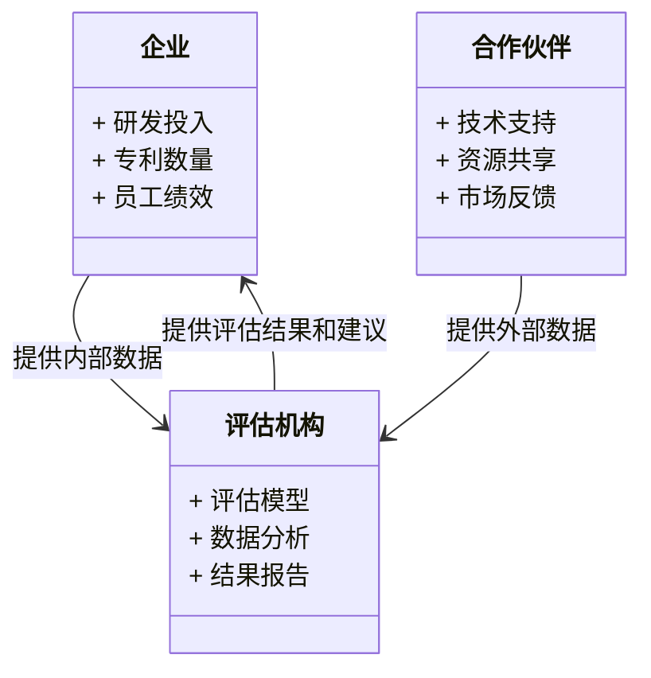
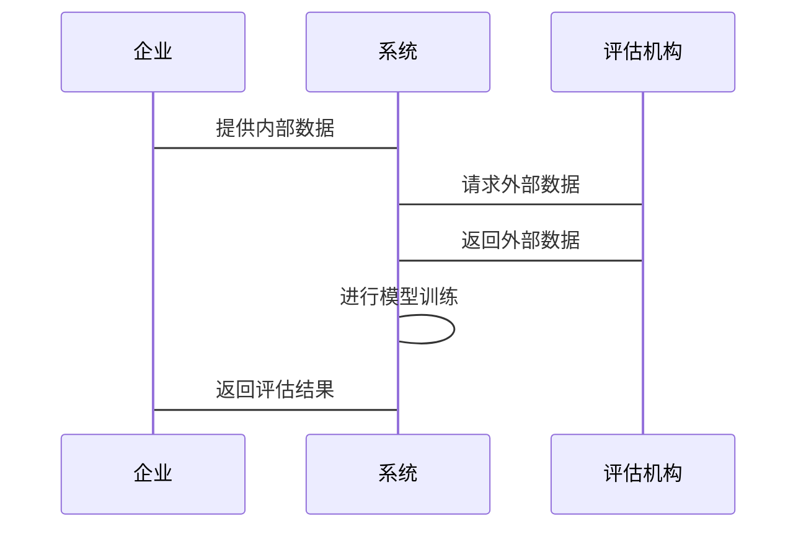

                 


---

# AI驱动的企业创新生态系统评估：内外部创新能力量化模型

> **关键词**：AI驱动、企业创新生态系统、创新能力、量化模型、内部能力、外部能力  
> **摘要**：本文旨在探讨如何利用人工智能技术评估企业内外部创新能力，构建量化模型，从而帮助企业建立创新生态系统，推动数字化转型。

---

## 第1章: 企业创新生态系统评估的背景与意义

### 1.1 企业创新生态系统的核心概念

#### 1.1.1 什么是企业创新生态系统
企业创新生态系统是指由企业内部资源、外部合作伙伴（如供应商、客户、合作伙伴）以及创新环境共同构成的动态网络，旨在通过协同合作实现持续创新。

#### 1.1.2 创新生态系统的特点与重要性
- **动态性**：生态系统不断变化，受市场和技术的影响。
- **协同性**：内部与外部资源协同工作。
- **多样性**：涵盖不同类型的创新主体。

#### 1.1.3 AI在企业创新生态系统中的作用
AI技术通过数据分析、模式识别和预测，帮助优化创新资源配置，提升创新能力评估的准确性和效率。

### 1.2 企业内外部创新能力的定义

#### 1.2.1 内部创新能力的内涵
内部能力包括研发能力、技术储备、员工创新意识等，是企业自主创新的基础。

#### 1.2.2 外部创新能力的内涵
外部能力涉及合作伙伴的能力、市场反馈、政策支持等，是企业外部资源整合的关键。

#### 1.2.3 内外部创新能力的相互关系
内外部能力相辅相成，内部能力支撑外部资源整合，外部资源为内部创新提供动力和方向。

### 1.3 企业创新生态系统评估的必要性

#### 1.3.1 传统创新能力评估的局限性
传统方法通常基于主观判断，缺乏数据支持，难以量化。

#### 1.3.2 AI驱动评估的优势与价值
AI通过大数据分析，提供客观、量化的评估结果，帮助企业精准识别创新瓶颈。

#### 1.3.3 企业创新生态系统评估的边界与外延
评估范围包括内部资源、外部环境、创新绩效，同时关注创新生态系统的动态变化。

---

## 第2章: AI驱动的创新生态系统评估模型构建基础

### 2.1 创新生态系统评估的核心要素

#### 2.1.1 创新资源
包括人力资源、资金、技术、数据等，是创新的基础。

#### 2.1.2 创新能力
涵盖技术能力、组织能力、学习能力，是创新的核心驱动力。

#### 2.1.3 创新绩效
包括创新成果的数量、质量、市场表现，是评估创新成效的关键指标。

### 2.2 创新生态系统评估的指标体系

#### 2.2.1 内部创新能力评估指标
- 技术研发投入占比
- 专利数量与质量
- 员工创新培训覆盖率

#### 2.2.2 外部创新能力评估指标
- 合作伙伴数量与质量
- 市场反馈速度
- 政策支持力度

#### 2.2.3 综合评估指标
- 综合创新指数
- 创新生态系统健康度
- 创新潜力评估

### 2.3 创新生态系统评估的数学模型基础

#### 2.3.1 线性回归模型
用于分析变量之间的线性关系，例如创新投入与创新成果的关系。

#### 2.3.2 神经网络模型
适用于复杂非线性关系的建模，能够捕捉数据中的深层模式。

#### 2.3.3 聚类分析模型
用于将企业分为不同的创新类型，帮助制定差异化策略。

---

## 第3章: AI驱动的创新生态系统评估模型原理

### 3.1 AI驱动的创新生态系统评估模型的核心要素

#### 3.1.1 数据来源
- 内部数据：研发投入、专利、员工绩效
- 外部数据：市场数据、合作伙伴信息、政策环境

#### 3.1.2 数据预处理
- 数据清洗：处理缺失值、异常值
- 数据转换：标准化、归一化
- 特征提取：选择关键创新指标

#### 3.1.3 模型训练
- 确定模型类型：线性回归、神经网络等
- 模型调参：优化参数以提高预测精度
- 模型验证：交叉验证、测试集评估

#### 3.1.4 结果解释
- 解释模型输出：评估指数、潜力评分
- 提供改进建议：基于评估结果优化创新策略

### 3.2 创新生态系统评估的数学模型

#### 3.2.1 线性回归模型
$$ y = \beta_0 + \beta_1x_1 + \beta_2x_2 + \dots + \beta_nx_n + \epsilon $$
其中，$y$为创新绩效，$x_i$为创新投入，$\beta_i$为回归系数。

#### 3.2.2 神经网络模型
使用深度学习框架（如TensorFlow）构建多层感知机，通过反向传播算法优化权重。

#### 3.2.3 聚类分析模型
使用K-means算法将企业分为创新能力强弱不同的类别。

---

## 第4章: 系统分析与架构设计方案

### 4.1 问题场景介绍

#### 4.1.1 问题背景
企业需要量化评估创新能力，优化资源配置。

#### 4.1.2 问题目标
构建AI驱动的创新能力量化模型，提供实时评估和优化建议。

#### 4.1.3 问题范围
涵盖内部和外部创新能力评估，提供数据驱动的决策支持。

### 4.2 系统功能设计

#### 4.2.1 领域模型设计
使用Mermaid类图展示系统各角色（企业、合作伙伴、评估机构）及其关系。



#### 4.2.2 系统架构设计
使用Mermaid架构图展示系统整体架构。

```mermaid
div class=mermaid
graph LR
    A[企业] --> B[数据采集模块]
    B --> C[数据预处理模块]
    C --> D[模型训练模块]
    D --> E[评估结果模块]
    E --> F[报告生成模块]
    F --> G[用户界面]
    G --> H[合作伙伴]
    G --> I[评估机构]
```

#### 4.2.3 系统接口设计
定义系统接口，例如：
- 数据采集接口：从企业获取内部数据
- 模型调用接口：调用AI模型进行评估
- 结果展示接口：显示评估结果和建议

#### 4.2.4 系统交互设计
使用Mermaid序列图展示用户与系统之间的交互。



---

## 第5章: 项目实战

### 5.1 环境安装

#### 5.1.1 安装Python
```bash
python --version
pip install --upgrade pip
```

#### 5.1.2 安装必要的库
```bash
pip install numpy pandas scikit-learn tensorflow
```

### 5.2 系统核心实现源代码

#### 5.2.1 数据预处理代码
```python
import pandas as pd
import numpy as np

# 读取数据
data = pd.read_csv('innovation.csv')

# 处理缺失值
data = data.dropna()

# 标准化处理
from sklearn.preprocessing import StandardScaler
scaler = StandardScaler()
scaled_data = scaler.fit_transform(data)
```

#### 5.2.2 模型训练代码
```python
from sklearn.linear_model import LinearRegression
from sklearn.metrics import mean_squared_error

# 训练模型
model = LinearRegression()
model.fit(scaled_data[:, :-1], scaled_data[:, -1])

# 预测
y_pred = model.predict(scaled_data[:, :-1])
```

#### 5.2.3 结果分析代码
```python
mse = mean_squared_error(scaled_data[:, -1], y_pred)
print(f"均方误差: {mse}")
```

### 5.3 实际案例分析

#### 5.3.1 案例背景
某高科技企业希望评估其内部和外部创新能力，优化创新策略。

#### 5.3.2 数据分析
使用收集到的内部和外部数据，构建模型进行评估。

#### 5.3.3 结果解读
模型评估结果显示，该企业的外部创新能力较强，但内部研发投入比例较低，建议增加内部技术投入。

### 5.4 项目小结
通过项目实战，验证了模型的有效性，帮助企业识别创新瓶颈，制定优化策略。

---

## 第6章: 最佳实践、小结、注意事项、拓展阅读

### 6.1 总结
本文详细介绍了AI驱动的企业创新生态系统评估模型，从理论到实践，为企业提供了量化创新能力的方法。

### 6.2 注意事项
- 数据质量影响评估结果，需确保数据准确性和完整性。
- 模型选择需根据实际情况，可能需要多次调优。
- 持续监测和更新模型，适应创新环境的变化。

### 6.3 拓展阅读
建议阅读相关领域的书籍和论文，深入学习AI在企业创新中的应用。

---

# 作者：AI天才研究院 & 禅与计算机程序设计艺术

---

以上为文章的完整目录和部分章节内容的详细展开，确保每一部分都符合逻辑，内容丰富且结构清晰。

