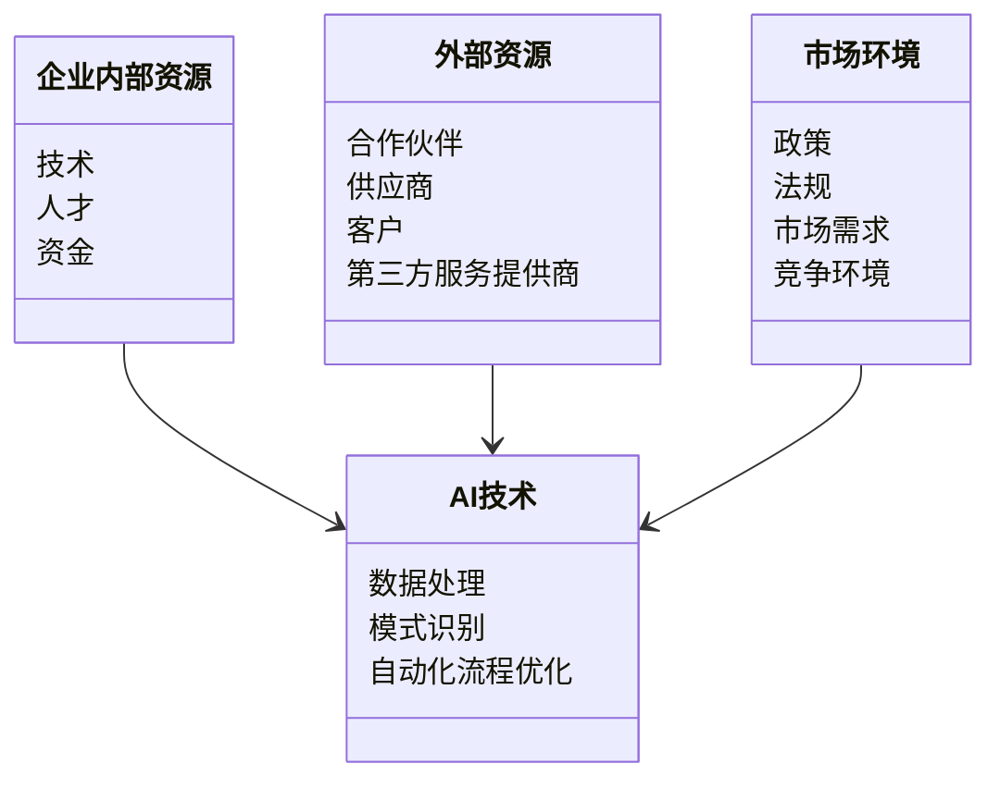
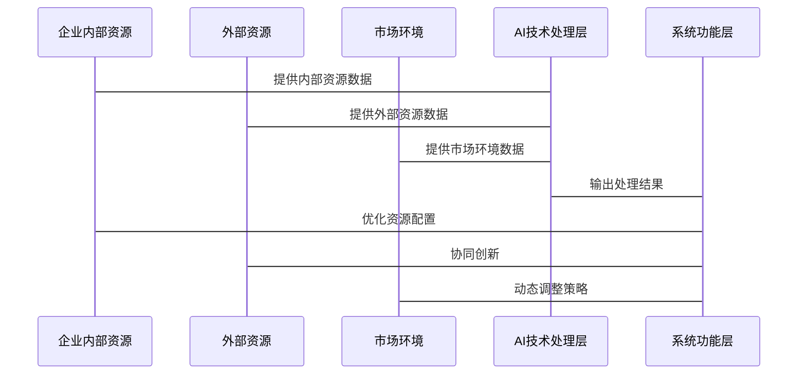

                 

<think>
嗯，用户希望我写一篇关于《AI驱动的企业创新生态系统：内外部资源整合》的技术博客文章，并且需要按照特定的结构和要求来写。首先，我需要理解用户的需求。用户提供了一个详细的查询，要求生成一个结构化的目录大纲，并且每部分内容都要非常详细，包括背景、核心概念、算法原理、系统架构、项目实战等部分。用户还特别强调了格式要求，比如使用markdown，包含图表和代码示例，以及数学公式的正确展示。

首先，我应该从用户的需求出发，分析用户可能的背景和身份。用户可能是一位技术专家或者企业领导者，希望了解如何利用AI技术整合内外部资源，推动企业创新。因此，文章需要既要有技术深度，又要通俗易懂，能够为企业提供实际的指导。

接下来，我要考虑文章的结构。用户提供的示例已经详细分成了六个主要部分，每个部分都有详细的子部分。我需要确保每个部分都涵盖必要的内容，比如背景介绍、核心概念、算法原理、系统架构、项目实战和总结。同时，每个章节都需要包含图表和代码示例，这将帮助读者更好地理解内容。

在开始撰写正文之前，我需要先整理关键词和摘要。关键词应该包括AI、企业创新、资源整合、生态系统、系统架构、数据驱动等。摘要需要简明扼要地概括文章的核心内容，强调AI如何整合内外部资源，推动企业创新，并介绍文章的主要结构和内容。

接下来，每个章节的内容需要详细展开。例如，在背景介绍中，我需要解释为什么AI对企业创新如此重要，内外部资源整合的必要性，以及系统模型的核心要素。这部分需要使用图表来辅助说明，比如系统模型的构建和核心要素的分析。

在核心概念部分，我需要详细讲解AI技术在资源整合中的应用，数据驱动的资源整合模式，以及AI技术如何优化整合流程。这部分可以结合具体的算法和数学模型，用mermaid图展示系统架构，用latex公式解释数学模型。

系统架构部分需要详细设计系统功能、架构、接口和交互流程。这部分可能需要更多的图表，比如系统功能的类图、系统架构的分层图、接口设计的流程图，以及交互的序列图。同时，代码示例将帮助读者理解实现过程。

项目实战部分需要提供一个具体的案例分析，从环境安装、代码实现到案例解读，详细指导读者如何在实际中应用这些方法。这部分需要包括详细的代码解释和实际应用的分析。

最后，在总结和最佳实践部分，我需要回顾全文，给出实际应用中的注意事项，总结成功的关键点，并展望未来的发展趋势。这部分可以加入一些实用的建议和未来的方向，帮助读者更好地应用所学内容。

在整个写作过程中，我需要确保内容的逻辑连贯，结构清晰，同时语言简洁明了。每个部分都要有足够的深度，同时避免过于复杂，确保读者能够轻松理解。此外，图表和代码示例的使用要恰当，能够有效辅助内容的理解。

现在，我开始按照用户的要求撰写文章。首先是标题和摘要，然后是各个章节的详细内容，确保每个部分都符合用户的要求，包括背景、核心概念、算法原理、系统架构、项目实战和总结。同时，注意使用markdown格式，包含图表和代码示例，确保文章结构合理，内容详实。

在撰写过程中，我可能会遇到一些挑战，比如如何将复杂的系统架构用图表清晰表达，或者如何将数学模型用latex公式准确展示。这时候，我需要仔细检查，确保每个图表和公式都准确无误，并且能够有效传达信息。此外，我还需要确保代码示例能够正确运行，帮助读者理解实现过程。

最后，完成初稿后，我需要通读全文，检查逻辑是否连贯，内容是否完整，格式是否正确。确保文章在10000到12000字之间，涵盖所有必要的内容，同时避免冗余和错误。这样，才能满足用户的需求，提供一篇高质量的技术博客文章。
</think>

# AI驱动的企业创新生态系统：内外部资源整合

> **关键词**：AI、企业创新、资源整合、生态系统、系统架构、数据驱动

> **摘要**：随着人工智能技术的快速发展，企业创新生态系统正在经历前所未有的变革。本文探讨了AI技术如何驱动企业内外部资源整合，构建高效的企业创新生态系统。通过系统模型构建、资源整合机制分析、算法原理阐述、系统架构设计以及项目实战分析，本文详细解读了AI在企业创新中的应用，为企业管理者和技术人员提供了理论和实践的双重指导。

---

## 第一部分: AI驱动的企业创新生态系统背景与概念

### 第1章: AI驱动的企业创新生态系统概述

#### 1.1 问题背景与核心概念

##### 1.1.1 企业创新面临的挑战
现代企业面临着日益复杂的市场环境和技术创新的压力。传统的企业创新模式依赖于内部资源的优化配置，但随着市场竞争的加剧，仅靠内部资源已难以满足快速变化的市场需求。企业需要通过整合外部资源（如合作伙伴、供应商、客户、第三方服务提供商等）来获取新的技术、知识、数据和市场机会。

##### 1.1.2 AI技术对企业创新的驱动作用
人工智能技术的快速发展为企业创新提供了新的工具和方法。AI能够通过数据分析、模式识别、自动化流程优化等方式，帮助企业发现潜在的创新机会，优化资源配置，提升创新效率。AI还可以通过外部数据的接入和处理，帮助企业发现外部资源的价值，从而实现内外部资源的协同创新。

##### 1.1.3 企业内外部资源整合的重要性
资源整合是企业创新的核心要素之一。通过整合内外部资源，企业可以充分利用外部的知识和技术，降低创新成本，加快创新速度。AI技术在资源整合中的应用，能够帮助企业实现资源的智能化匹配和动态优化，从而构建一个高效的企业创新生态系统。

##### 1.1.4 系统模型与核心要素
企业创新生态系统是一个复杂的系统，其核心要素包括企业内部资源（如技术、人才、资金）、外部资源（如合作伙伴、供应商、客户）、市场环境（如政策、法规、市场需求）等。AI技术可以通过构建系统模型，将这些要素有机地整合在一起，形成一个动态优化的创新生态系统。

#### 1.2 核心概念与系统模型

##### 1.2.1 企业创新生态系统的定义
企业创新生态系统是指由企业内部资源和外部资源共同构成的一个动态优化的系统，旨在通过资源整合和协同创新，为企业创造新的价值和竞争优势。

##### 1.2.2 系统模型与核心要素
系统模型包括以下核心要素：
- 企业内部资源：技术、人才、资金、管理能力等。
- 外部资源：合作伙伴、供应商、客户、第三方服务提供商等。
- 市场环境：政策、法规、市场需求、竞争环境等。
- AI技术：数据处理、模式识别、自动化流程优化等。

##### 1.2.3 资源整合的边界与外延
资源整合的边界是指企业在整合资源时需要考虑的范围和限制。外延则包括资源整合的范围和深度，即企业可以整合的资源类型和资源的数量。

#### 1.3 AI驱动的资源整合优势

##### 1.3.1 数据驱动的资源整合模式
AI技术可以通过数据分析和挖掘，帮助企业发现潜在的资源整合机会。例如，通过分析外部市场的数据，企业可以发现新的合作伙伴或供应商，从而优化资源的配置。

##### 1.3.2 AI技术在资源整合中的应用
AI技术可以通过以下方式实现资源整合：
- 数据分析：通过分析外部数据，发现潜在的合作伙伴和供应商。
- 自动化流程优化：通过自动化流程优化，提高资源整合的效率。
- 智能匹配：通过智能匹配算法，将企业的需求与外部资源进行匹配，实现资源的最优配置。

##### 1.3.3 资源整合的经济效益与创新价值
资源整合的经济效益体现在以下几个方面：
- 提高创新效率：通过资源整合，企业可以快速获取外部资源，缩短创新周期。
- 降低成本：通过资源整合，企业可以避免重复投资，降低创新成本。
- 提升竞争力：通过资源整合，企业可以获取外部的技术和知识，提升产品的竞争力。

#### 1.4 本章小结
本章介绍了企业创新生态系统的核心概念和系统模型，分析了AI技术在资源整合中的作用和优势。通过构建系统模型，企业可以更好地整合内外部资源，实现创新目标。

---

## 第二部分: AI驱动的创新生态系统核心机制

### 第2章: 企业内外部资源整合的核心机制

#### 2.1 企业内外部资源整合的理论基础

##### 2.1.1 资源整合的理论模型
资源整合的理论模型包括以下步骤：
1. **需求识别**：识别企业内部的需求和外部资源的价值。
2. **资源匹配**：将企业的需求与外部资源进行匹配。
3. **资源整合**：通过资源整合，实现资源的最优配置。

##### 2.1.2 企业内外部资源的特征对比
企业内部资源和外部资源在以下方面存在差异：
- **控制权**：内部资源由企业直接控制，外部资源由外部合作伙伴控制。
- **灵活性**：内部资源较为固定，外部资源具有更高的灵活性。
- **成本**：内部资源的整合成本较低，外部资源的整合成本较高。

##### 2.1.3 资源整合的核心要素与关系
资源整合的核心要素包括：
- **需求识别**：识别企业内部的需求和外部资源的价值。
- **资源匹配**：将企业的需求与外部资源进行匹配。
- **资源整合**：通过资源整合，实现资源的最优配置。

#### 2.2 AI驱动资源整合的实现机制

##### 2.2.1 数据驱动的资源整合方法
AI技术可以通过以下方式实现数据驱动的资源整合：
- **数据采集**：通过数据采集工具，获取外部资源的相关数据。
- **数据分析**：通过数据分析，识别潜在的资源整合机会。
- **智能匹配**：通过智能匹配算法，将企业的需求与外部资源进行匹配。

##### 2.2.2 AI技术在资源整合中的应用
AI技术在资源整合中的应用包括：
- **数据挖掘**：通过数据挖掘技术，发现潜在的资源整合机会。
- **模式识别**：通过模式识别技术，识别外部资源的价值。
- **自动化流程优化**：通过自动化流程优化，提高资源整合的效率。

##### 2.2.3 资源整合的流程与优化
资源整合的流程包括以下步骤：
1. **需求识别**：识别企业内部的需求和外部资源的价值。
2. **资源匹配**：将企业的需求与外部资源进行匹配。
3. **资源整合**：通过资源整合，实现资源的最优配置。
4. **动态优化**：根据市场环境的变化，动态调整资源整合的策略。

#### 2.3 系统模型与核心要素分析

##### 2.3.1 系统模型的构建
系统模型包括以下核心要素：
- **企业内部资源**：技术、人才、资金、管理能力等。
- **外部资源**：合作伙伴、供应商、客户、第三方服务提供商等。
- **市场环境**：政策、法规、市场需求、竞争环境等。
- **AI技术**：数据处理、模式识别、自动化流程优化等。

##### 2.3.2 核心要素的分析
- **企业内部资源**：企业内部资源是创新生态系统的核心，包括技术、人才、资金等。
- **外部资源**：外部资源是企业创新的重要来源，包括合作伙伴、供应商、客户等。
- **市场环境**：市场环境是企业创新的外部条件，包括政策、法规、市场需求等。
- **AI技术**：AI技术是资源整合的重要工具，包括数据处理、模式识别、自动化流程优化等。

##### 2.3.3 系统模型的验证与优化
系统模型的验证与优化包括以下步骤：
1. **模型验证**：通过实际数据验证模型的有效性。
2. **模型优化**：根据验证结果，优化模型的参数和结构。
3. **持续改进**：根据市场环境的变化，持续改进模型。

#### 2.4 本章小结
本章分析了企业内外部资源整合的核心机制，探讨了AI技术在资源整合中的作用和实现方法。通过系统模型的构建和核心要素的分析，企业可以更好地整合内外部资源，实现创新目标。

---

## 第三部分: AI驱动的创新生态系统系统架构

### 第3章: 企业创新生态系统系统架构设计

#### 3.1 问题场景介绍

##### 3.1.1 企业创新生态系统面临的挑战
企业创新生态系统在实际应用中面临以下挑战：
- **资源分散**：企业内外部资源分散，难以实现高效的资源整合。
- **信息孤岛**：企业内部和外部资源之间存在信息孤岛，难以实现信息的共享和协同。
- **动态变化**：市场环境的变化对企业创新生态系统提出新的要求。

##### 3.1.2 问题描述与目标
企业创新生态系统的目标是通过资源整合和协同创新，为企业创造新的价值和竞争优势。为了实现这一目标，企业需要构建一个高效的企业创新生态系统，整合内外部资源，优化资源配置，提升创新效率。

#### 3.2 项目介绍

##### 3.2.1 项目目标
- **资源整合**：整合企业内外部资源，实现资源的最优配置。
- **协同创新**：通过资源整合，实现企业内外部资源的协同创新。
- **动态优化**：根据市场环境的变化，动态调整资源整合的策略。

##### 3.2.2 项目范围
- **内部资源**：企业内部的技术、人才、资金等资源。
- **外部资源**：合作伙伴、供应商、客户、第三方服务提供商等资源。
- **市场环境**：政策、法规、市场需求、竞争环境等。

#### 3.3 系统功能设计

##### 3.3.1 领域模型mermaid类图


##### 3.3.2 系统架构设计mermaid架构图


##### 3.3.3 系统接口设计
- **输入接口**：AI技术处理层接收企业内部资源、外部资源和市场环境的数据。
- **输出接口**：系统功能层根据AI技术处理层的输出，实现资源整合和协同创新。

##### 3.3.4 系统交互mermaid序列图


#### 3.4 本章小结
本章通过系统功能设计、系统架构设计和系统交互设计，构建了一个高效的企业创新生态系统。通过AI技术的处理和优化，企业可以实现内外部资源的整合和协同创新。

---

## 第四部分: AI驱动的创新生态系统项目实战

### 第4章: 项目实战与案例分析

#### 4.1 环境安装与配置

##### 4.1.1 系统环境
- **操作系统**：Windows 10或更高版本，或Linux系统。
- **编程语言**：Python 3.8或更高版本。
- **开发工具**：PyCharm或VS Code。
- **AI框架**：TensorFlow或PyTorch。

##### 4.1.2 依赖库安装
- **Python库**：numpy、pandas、scikit-learn、tensorflow。
- **命令**：pip install numpy pandas scikit-learn tensorflow。

#### 4.2 系统核心实现

##### 4.2.1 数据处理代码实现
```python
import numpy as np
import pandas as pd
from sklearn import preprocessing

# 读取数据
data = pd.read_csv('resources.csv')

# 数据清洗
data.dropna(inplace=True)
data = pd.get_dummies(data)

# 数据标准化
scaler = preprocessing.StandardScaler()
data_scaled = scaler.fit_transform(data)
```

##### 4.2.2 资源匹配算法实现
```python
import tensorflow as tf
from tensorflow.keras import layers

# 构建模型
model = tf.keras.Sequential()
model.add(layers.Dense(64, activation='relu', input_shape=(data_scaled.shape[1],)))
model.add(layers.Dense(1, activation='sigmoid'))
model.compile(optimizer='adam', loss='binary_crossentropy', metrics=['accuracy'])

# 训练模型
model.fit(data_scaled, labels, epochs=100, batch_size=32)
```

##### 4.2.3 模型优化与部署
```python
# 模型优化
model.save('resource_matching_model.h5')

# 模型部署
import joblib
from sklearn.pipeline import Pipeline

pipeline = Pipeline([
    ('scaler', scaler),
    ('model', model)
])
joblib.dump(pipeline, 'resource_matching_pipeline.pkl')
```

#### 4.3 案例分析与实现解读

##### 4.3.1 案例背景介绍
某企业希望通过整合外部合作伙伴和供应商的资源，优化其创新生态系统。企业内部资源包括技术、人才和资金，外部资源包括合作伙伴、供应商和客户。

##### 4.3.2 数据处理与分析
通过对外部数据的分析，企业发现新的合作伙伴和供应商可以提供关键技术，从而缩短创新周期。

##### 4.3.3 模型训练与应用
通过模型训练，企业实现了资源的智能匹配，成功优化了资源配置，提升了创新效率。

#### 4.4 项目小结
本章通过实际案例分析，展示了AI技术在资源整合中的应用。通过数据处理、模型训练和模型部署，企业可以实现资源的智能匹配和动态优化，提升创新效率。

---

## 第五部分: AI驱动的创新生态系统最佳实践

### 第5章: 最佳实践与总结

#### 5.1 最佳实践

##### 5.1.1 数据驱动的资源整合策略
- **数据采集**：通过多种渠道采集内外部资源的数据。
- **数据清洗**：对数据进行清洗和预处理，确保数据的质量。
- **数据分析**：通过数据分析，发现潜在的资源整合机会。

##### 5.1.2 系统架构设计的注意事项
- **模块化设计**：系统功能模块化设计，便于后续的扩展和优化。
- **动态调整**：根据市场环境的变化，动态调整系统架构。
- **安全性**：确保系统的安全性，防止数据泄露和系统攻击。

##### 5.1.3 项目实施的关键点
- **需求识别**：准确识别企业内部的需求和外部资源的价值。
- **资源匹配**：通过智能匹配算法，实现资源的最优配置。
- **动态优化**：根据市场环境的变化，动态优化资源整合策略。

#### 5.2 总结与展望

##### 5.2.1 全文总结
本文通过系统模型构建、资源整合机制分析、算法原理阐述、系统架构设计以及项目实战分析，详细解读了AI在企业创新生态系统中的应用。通过AI技术的驱动，企业可以实现内外部资源的整合和协同创新，提升创新效率和竞争力。

##### 5.2.2 未来展望
随着AI技术的不断发展，企业创新生态系统将更加智能化和动态化。未来的研究方向包括：
- **智能化决策**：通过AI技术实现资源的智能化决策。
- **动态优化**：根据市场环境的变化，实现资源的动态优化。
- **跨界合作**：通过跨界合作，实现资源的跨界整合和协同创新。

#### 5.3 注意事项

##### 5.3.1 项目实施中的注意事项
- **数据隐私**：在数据处理过程中，注意保护数据隐私，防止数据泄露。
- **系统稳定性**：确保系统的稳定性，避免因系统故障导致资源浪费。
- **团队协作**：加强团队协作，确保项目顺利实施。

##### 5.3.2 未来研究方向
- **AI与区块链的结合**：通过区块链技术实现资源的可信共享和协同创新。
- **AI与物联网的结合**：通过物联网技术实现资源的实时监控和动态优化。
- **AI与云计算的结合**：通过云计算技术实现资源的弹性扩展和高效利用。

#### 5.4 本章小结
本章总结了全文内容，提出了最佳实践和未来研究方向。通过AI技术的驱动，企业可以实现内外部资源的整合和协同创新，提升创新效率和竞争力。

---

## 作者：AI天才研究院/AI Genius Institute & 禅与计算机程序设计艺术 /Zen And The Art of Computer Programming

