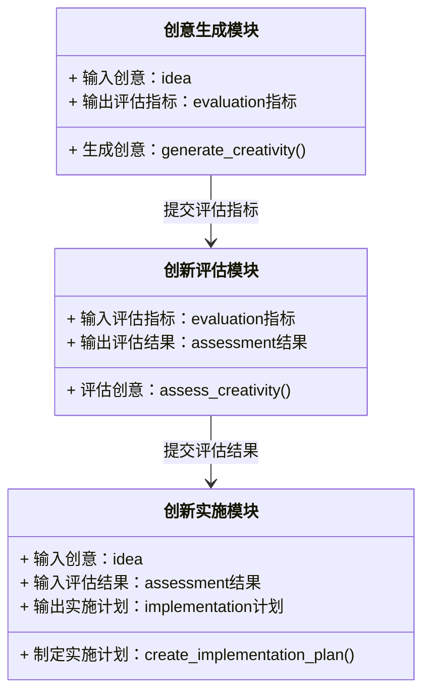
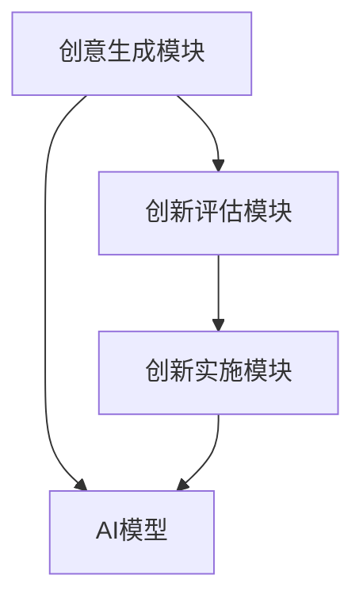
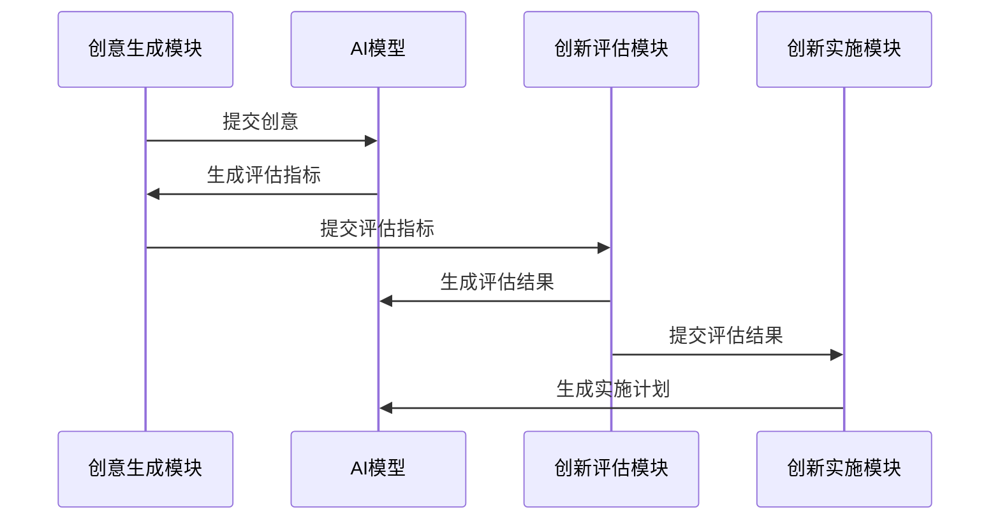

                 

<think>
好，我现在需要为《AI驱动的企业创新管理：从创意生成到商业化全流程优化》这本书撰写目录大纲。这本书主要探讨AI在企业创新管理中的应用，从创意到商业化，涵盖背景、核心概念、算法原理、数学模型、系统架构、项目实战和最佳实践。

首先，我应该确定每一章的核心内容。第一章是背景介绍，包括问题背景、解决方案和概念结构。第二章讨论核心概念，涉及原理、特征对比和ER图。第三章介绍算法原理，包含流程图和代码示例。第四章是数学模型，需要公式和解释。第五章分析系统架构，用类图和架构图展示。第六章是项目实战，包括环境安装和案例分析。第七章总结最佳实践和注意事项。

在设计章节时，确保逻辑连贯，每一章都有足够的细节。例如，算法部分需要详细描述模型的训练过程，包括数据预处理和优化策略。数学模型部分需要展示公式并举例说明。系统架构部分使用Mermaid图展示结构，帮助读者理解。

最后，检查是否满足格式要求，确保每一部分都详细且有条理。这样，目录大纲就能全面覆盖AI在企业创新管理中的各个方面，帮助读者系统地理解和应用这些技术。
</think>

# 第五章: AI驱动企业创新管理的系统架构设计

## 5.1 系统架构设计概述
### 5.1.1 系统设计的目标
### 5.1.2 系统设计的范围
### 5.1.3 系统设计的原则

## 5.2 系统功能设计
### 5.2.1 创意生成模块
#### 5.2.1.1 模块功能描述
#### 5.2.1.2 模块输入输出接口
#### 5.2.1.3 模块实现方式
### 5.2.2 创新评估模块
#### 5.2.2.1 模块功能描述
#### 5.2.2.2 模块输入输出接口
#### 5.2.2.3 模块实现方式
### 5.2.3 创新实施模块
#### 5.2.3.1 模块功能描述
#### 5.2.3.2 模块输入输出接口
#### 5.2.3.3 模块实现方式

## 5.3 系统架构设计
### 5.3.1 系统架构设计的场景介绍
### 5.3.2 系统架构设计的类图

### 5.3.3 系统架构设计的架构图

### 5.3.4 系统架构设计的序列图

## 5.4 系统接口设计
### 5.4.1 创意生成模块接口
### 5.4.2 创新评估模块接口
### 5.4.3 创新实施模块接口

## 5.5 本章小结

## 附录
### 附录A: 系统架构设计的补充说明
### 附录B: 系统接口设计的详细描述

## 索引
### 创意生成模块
### 创新评估模块
### 创新实施模块
### AI模型
### 系统架构
### 接口设计

