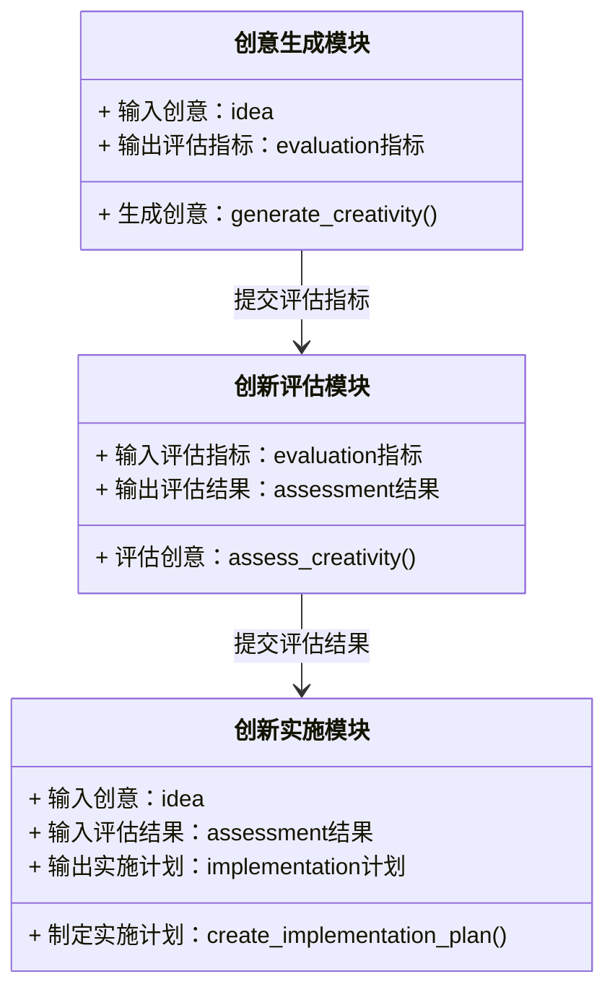
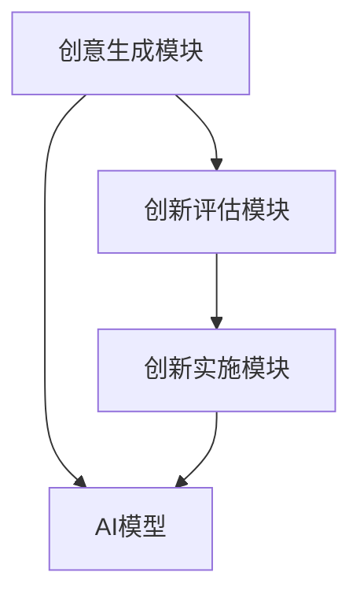
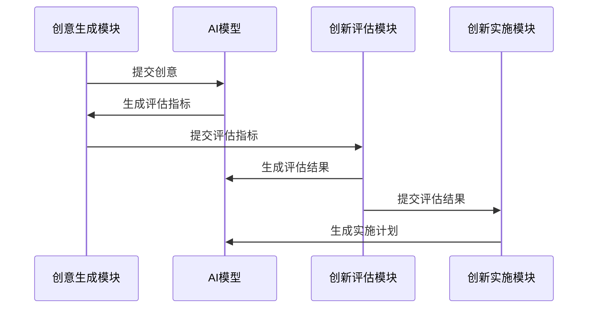

                 

# 第五章: AI驱动企业创新管理的系统架构设计

## 5.1 系统架构设计概述
### 5.1.1 系统设计的目标
### 5.1.2 系统设计的范围
### 5.1.3 系统设计的原则

## 5.2 系统功能设计
### 5.2.1 创意生成模块
#### 5.2.1.1 模块功能描述
#### 5.2.1.2 模块输入输出接口
#### 5.2.1.3 模块实现方式
### 5.2.2 创新评估模块
#### 5.2.2.1 模块功能描述
#### 5.2.2.2 模块输入输出接口
#### 5.2.2.3 模块实现方式
### 5.2.3 创新实施模块
#### 5.2.3.1 模块功能描述
#### 5.2.3.2 模块输入输出接口
#### 5.2.3.3 模块实现方式

## 5.3 系统架构设计
### 5.3.1 系统架构设计的场景介绍
### 5.3.2 系统架构设计的类图

### 5.3.3 系统架构设计的架构图

### 5.3.4 系统架构设计的序列图

## 5.4 系统接口设计
### 5.4.1 创意生成模块接口
### 5.4.2 创新评估模块接口
### 5.4.3 创新实施模块接口

## 5.5 本章小结

## 附录
### 附录A: 系统架构设计的补充说明
### 附录B: 系统接口设计的详细描述

## 索引
### 创意生成模块
### 创新评估模块
### 创新实施模块
### AI模型
### 系统架构
### 接口设计

