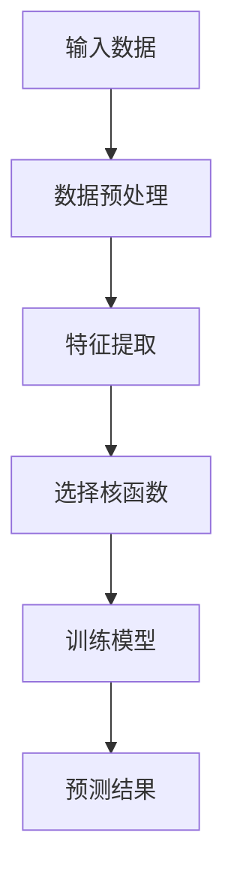
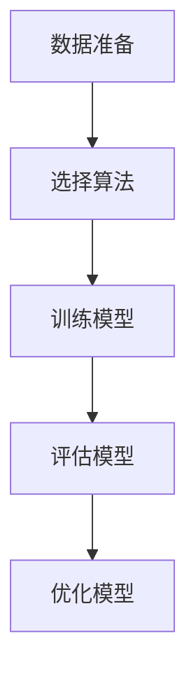
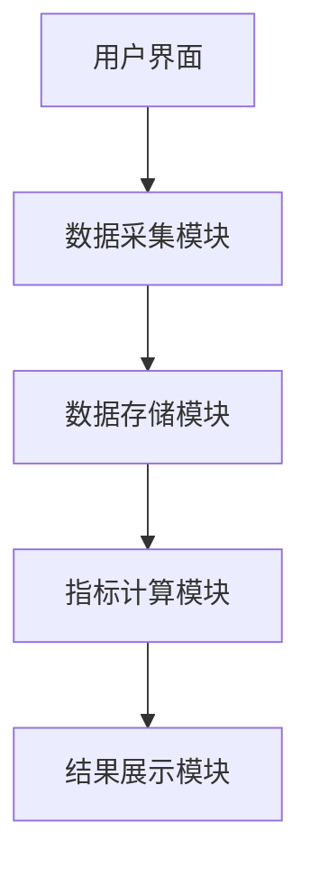
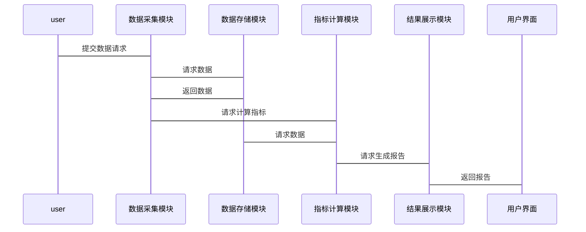

                 


# AI驱动的企业创新绩效评估：多维度创新指标量化与分析

## 关键词
- 人工智能, 创新绩效评估, 多维度创新指标, 创新指标量化, AI驱动评估

## 摘要
本文深入探讨了如何利用人工智能技术对企业创新绩效进行多维度量化评估。通过构建创新绩效评估模型、分析多维度创新指标、应用AI算法和设计系统架构，文章详细展示了如何将AI技术应用于企业创新绩效评估。结合实际案例分析和系统设计，本文为企业提供了一套高效、可操作的创新绩效评估解决方案。

---

# 第1章: 背景介绍

## 1.1 问题背景

### 1.1.1 企业创新绩效评估的重要性
企业的创新绩效是衡量企业核心竞争力的重要指标。在快速变化的商业环境中，企业需要不断优化其创新策略，以保持竞争优势。传统的创新绩效评估方法通常依赖于主观判断和简单的指标分析，存在数据维度单一、评估结果不够精准等问题。

### 1.1.2 当前评估方法的局限性
传统的创新绩效评估方法通常基于有限的几个指标，如研发投入、专利数量等，难以全面反映企业的创新能力。此外，这些方法往往忽略了时间维度、创新过程中的动态变化以及跨部门协作的影响。

### 1.1.3 AI技术在创新评估中的潜力
人工智能技术可以通过分析海量数据，提取非结构化信息，构建多维度的创新指标体系，并通过机器学习算法预测和优化创新绩效。AI技术的应用可以显著提升创新绩效评估的准确性和效率。

## 1.2 核心概念与联系

### 1.2.1 创新绩效评估的定义
创新绩效评估是通过量化企业的创新能力、创新成果和创新过程中的表现，对企业创新活动的效果进行综合评价的过程。

### 1.2.2 多维度创新指标的特征对比
下表展示了多维度创新指标的主要特征对比：

| 指标维度 | 定义 | 数据来源 | 数据类型 |
|----------|------|----------|----------|
| 技术创新 | 企业在技术研发方面的投入和成果 | 研发部门数据、专利数据库 | 结构化、非结构化 |
| 产品创新 | 产品开发的效率和市场表现 | 产品生命周期数据、销售数据 | 结构化 |
| 管理创新 | 创新管理的效率和效果 | 管理流程数据、员工反馈 | 结构化、非结构化 |

### 1.2.3 ER实体关系图架构
下图展示了创新绩效评估的实体关系架构：

```mermaid
erd
    entity 创新绩效评估 {
        key 评估ID
        标称 评估名称
        属性 评估时间
    }
    entity 创新指标 {
        key 指标ID
        标称 指标名称
        属性 指标类型
    }
    entity 企业创新数据 {
        key 企业ID
        标称 企业名称
        属性 创新成果
    }
    relationship 创新绩效评估 和 企业创新数据 通过 评估ID 关联
    relationship 创新绩效评估 和 创新指标 通过 指标ID 关联
```

---

# 第2章: AI驱动的创新绩效评估模型

## 2.1 模型设计与构建

### 2.1.1 多维度指标的选择标准
在选择创新指标时，需要考虑指标的可量化性、相关性和独立性。以下是几个关键指标的定义和作用：

- **技术创新指标**：衡量企业在技术研发方面的投入和成果，如研发投入占比、专利申请数量等。
- **产品创新指标**：衡量产品开发的效率和市场表现，如新产品上市时间、产品生命周期价值等。
- **管理创新指标**：衡量创新管理的效率和效果，如创新项目成功率、管理流程优化程度等。

### 2.1.2 数据预处理方法
在构建模型之前，需要对数据进行预处理，包括数据清洗、特征提取和数据标准化。以下是一个数据预处理的示例：

```python
import pandas as pd
from sklearn.preprocessing import StandardScaler

# 数据清洗
data = pd.read_csv('innovation_data.csv')
data = data.dropna()
data = data.drop_duplicates()

# 特征提取
features = data[['R&D投入', '专利数量', '新产品上市时间']]
target = data['创新绩效']

# 数据标准化
scaler = StandardScaler()
features_scaled = scaler.fit_transform(features)
```

### 2.1.3 模型的验证与优化
在模型验证阶段，可以使用交叉验证和网格搜索来优化模型参数。以下是一个逻辑回归模型的优化示例：

```python
from sklearn.model_selection import GridSearchCV
from sklearn.linear_model import LogisticRegression

param_grid = {'C': [0.1, 1, 10], 'penalty': ['l1', 'l2']}
grid_search = GridSearchCV(LogisticRegression(), param_grid, cv=5)
grid_search.fit(features_scaled, target)
print("最佳参数：", grid_search.best_params_)
```

## 2.2 创新绩效评估的关键算法

### 2.2.1 算法原理
支持向量机（SVM）是一种常用的监督学习算法，适用于分类和回归问题。其基本原理是通过构建一个超平面，将数据点分为两类，使得两类数据点之间的距离最大化。

### 2.2.2 算法流程图
下图展示了SVM算法的流程图：



### 2.2.3 算法实现代码
以下是SVM算法的实现代码示例：

```python
from sklearn import svm

# 训练模型
model = svm.SVC(kernel='rbf', C=1)
model.fit(features_scaled, target)

# 预测结果
predictions = model.predict(features_scaled)
print("预测结果：", predictions)
```

---

# 第3章: 多维度创新指标量化

## 3.1 创新指标的定义与分类

### 3.1.1 技术创新指标
技术创新指标主要用于衡量企业在技术研发方面的投入和成果。例如，研发投入占比、专利申请数量等。

### 3.1.2 产品创新指标
产品创新指标用于衡量产品开发的效率和市场表现。例如，新产品上市时间、产品生命周期价值等。

### 3.1.3 管理创新指标
管理创新指标用于衡量创新管理的效率和效果。例如，创新项目成功率、管理流程优化程度等。

## 3.2 创新指标的量化方法

### 3.2.1 数据采集与处理
在采集数据时，需要考虑数据的完整性和准确性。例如，可以从企业的财务报表、专利数据库、产品生命周期管理系统中获取相关数据。

### 3.2.2 量化模型构建
通过构建多元回归模型，可以量化各个创新指标对企业整体创新绩效的影响程度。以下是一个多元回归模型的示例：

$$ y = \beta_0 + \beta_1x_1 + \beta_2x_2 + \epsilon $$

其中，$y$ 是创新绩效，$x_1$ 和 $x_2$ 是两个创新指标，$\beta_0$ 是截距项，$\beta_1$ 和 $\beta_2$ 是回归系数，$\epsilon$ 是误差项。

---

# 第4章: AI算法在创新绩效分析中的应用

## 4.1 算法原理与流程

### 4.1.1 算法选择依据
在选择AI算法时，需要考虑数据类型、问题类型以及模型的可解释性。例如，对于分类问题，可以使用决策树、随机森林等算法；对于回归问题，可以使用线性回归、支持向量回归等算法。

### 4.1.2 算法流程图
下图展示了AI算法在创新绩效分析中的应用流程：



### 4.1.3 算法实现代码
以下是随机森林算法的实现代码示例：

```python
from sklearn.ensemble import RandomForestRegressor

# 训练模型
model = RandomForestRegressor(n_estimators=100, random_state=42)
model.fit(features_scaled, target)

# 预测结果
importances = model.feature_importances_
print("特征重要性：", importances)
```

---

# 第5章: 系统架构与设计方案

## 5.1 系统功能设计

### 5.1.1 数据采集模块
数据采集模块负责从企业内部系统和外部数据库中获取相关数据。例如，可以从企业的财务系统中获取研发投入数据，从专利数据库中获取专利申请数量。

### 5.1.2 指标计算模块
指标计算模块负责对采集到的数据进行清洗、转换和计算。例如，计算研发投入占比、新产品上市时间等指标。

### 5.1.3 结果展示模块
结果展示模块负责将计算出的创新绩效结果以可视化的方式展示给用户。例如，可以使用仪表盘的形式展示各个创新指标的得分和排名。

## 5.2 系统架构设计

### 5.2.1 系统架构图
下图展示了创新绩效评估系统的架构图：



### 5.2.2 系统交互流程图
下图展示了系统的交互流程：



---

# 第6章: 项目实战

## 6.1 环境安装

### 6.1.1 安装Python和相关库
需要安装Python 3.x以及以下库：
- pandas
- numpy
- scikit-learn
- matplotlib

安装命令：
```bash
pip install pandas numpy scikit-learn matplotlib
```

## 6.2 核心实现

### 6.2.1 数据预处理
```python
import pandas as pd
import numpy as np

# 数据加载
data = pd.read_csv('innovation_data.csv')

# 数据清洗
data = data.dropna()
data = data.drop_duplicates()

# 特征提取
features = data[['R&D投入', '专利数量', '新产品上市时间']]
target = data['创新绩效']
```

### 6.2.2 模型训练
```python
from sklearn.model_selection import train_test_split
from sklearn.ensemble import RandomForestRegressor

# 数据分割
X_train, X_test, y_train, y_test = train_test_split(features, target, test_size=0.2, random_state=42)

# 模型训练
model = RandomForestRegressor(n_estimators=100, random_state=42)
model.fit(X_train, y_train)

# 模型预测
y_pred = model.predict(X_test)
print("预测结果：", y_pred)
```

## 6.3 案例分析

### 6.3.1 数据分析
通过对实际案例数据的分析，可以发现各个创新指标对企业创新绩效的影响程度。例如，研发投入占比对创新绩效的影响较大，而新产品上市时间的影响相对较小。

### 6.3.2 模型评估
通过模型评估，可以验证模型的准确性和可靠性。例如，使用R²系数来衡量模型的拟合程度。

---

# 第7章: 总结与建议

## 7.1 总结
本文详细探讨了如何利用人工智能技术对企业创新绩效进行多维度量化评估。通过构建创新绩效评估模型、分析多维度创新指标、应用AI算法和设计系统架构，为企业提供了一套高效、可操作的创新绩效评估解决方案。

## 7.2 最佳实践
- 在实际应用中，建议结合企业的实际情况选择合适的算法和模型。
- 数据的准确性和完整性对模型的性能影响较大，需要重视数据预处理工作。
- 在模型部署和应用过程中，需要考虑模型的可解释性和维护成本。

## 7.3 未来趋势
随着AI技术的不断发展，创新绩效评估将更加智能化和个性化。未来的研究方向可以包括多模态数据的融合、实时评估、动态优化等方面。

## 7.4 拓展阅读
- 《机器学习实战》
- 《深度学习》
- 《企业创新管理》

---

# 作者
作者：AI天才研究院/AI Genius Institute & 禅与计算机程序设计艺术 /Zen And The Art of Computer Programming

