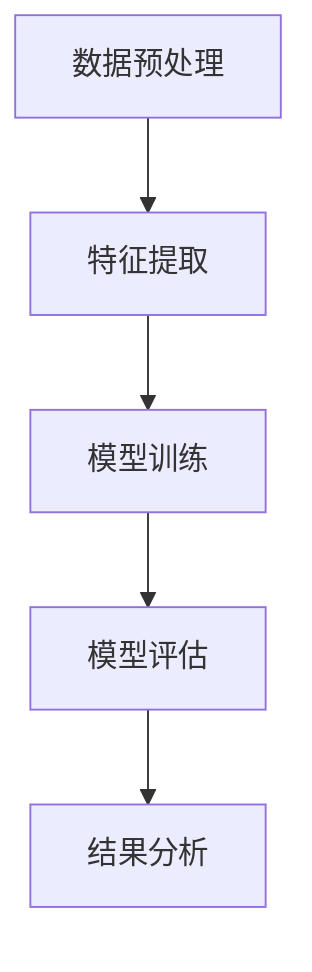
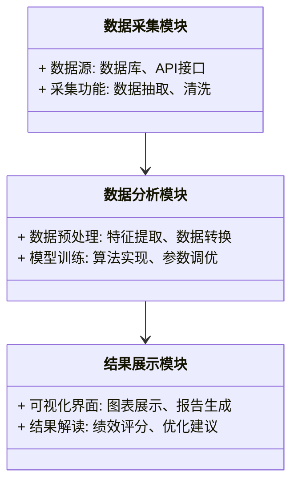
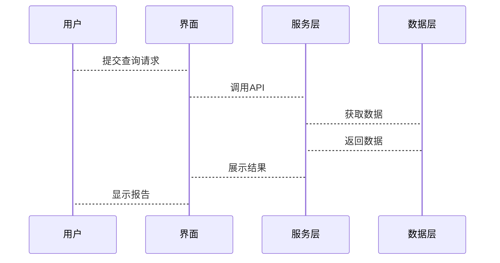

                 


# AI驱动的企业创新绩效评估：量化创新价值与影响

## 关键词：AI技术，企业创新，绩效评估，创新价值，量化分析

## 摘要：  
在数字化转型的背景下，企业创新绩效评估正面临前所未有的挑战和机遇。传统的评估方法往往依赖主观判断和静态数据，难以捕捉创新过程中的动态变化和潜在价值。本文将探讨如何利用人工智能技术，构建一套系统化、动态化的创新绩效评估体系，量化创新价值与影响，为企业决策提供科学依据。通过分析AI在数据处理、模型构建和结果解读中的应用，本文旨在为企业创新绩效评估提供新的思路和方法。

---

# 第一部分：AI驱动的企业创新绩效评估概述

## 第1章：AI驱动的企业创新绩效评估背景与概念

### 1.1 企业创新绩效评估的背景

#### 1.1.1 传统企业创新评估的局限性  
传统的企业创新评估方法通常依赖于财务指标、市场份额等宏观数据，难以反映创新活动的真实价值和潜力。此外，传统方法往往忽视了创新过程中的动态变化和非量化因素，例如员工创造力、团队协作等。

#### 1.1.2 AI技术对企业创新评估的变革  
人工智能技术的快速发展为企业创新评估带来了新的可能性。通过机器学习、自然语言处理和深度学习等技术，企业可以实时分析海量数据，捕捉创新活动中的关键指标，从而实现对创新绩效的动态评估。

#### 1.1.3 数字化转型与创新绩效评估的新需求  
在数字化转型的背景下，企业需要更加精准和动态的创新评估方法，以应对快速变化的市场环境。AI技术的应用可以帮助企业在创新过程中实现数据驱动的决策，提升创新效率和成果的价值。

### 1.2 AI驱动创新绩效评估的核心概念

#### 1.2.1 创新绩效的定义与维度  
创新绩效是指企业在创新活动中所取得的成果与目标的匹配程度。其维度包括创新投入、创新成果、创新效率和创新影响等。

#### 1.2.2 AI在创新评估中的作用  
AI技术可以通过数据挖掘、模式识别和预测分析，帮助企业发现创新过程中的潜在规律，优化创新资源配置，提升创新效率。

#### 1.2.3 量化创新价值的意义与挑战  
量化创新价值是将创新成果转化为可量化的指标，以便于比较和评估。然而，创新活动的复杂性和不确定性使得量化创新价值面临诸多挑战。

### 1.3 企业创新绩效评估的框架与流程

#### 1.3.1 传统评估框架的优缺点  
传统评估框架通常基于财务指标和市场份额，具有一定的局限性，例如难以反映创新过程中的动态变化。

#### 1.3.2 AI驱动的创新评估框架  
AI驱动的创新评估框架包括数据采集、数据预处理、模型构建、结果分析和反馈优化等环节。

#### 1.3.3 从数据采集到结果输出的完整流程  
通过AI技术，企业可以实现从数据采集到结果输出的全自动化流程，包括数据清洗、特征提取、模型训练和结果解读等步骤。

### 1.4 本章小结  
本章介绍了AI驱动的企业创新绩效评估的背景、核心概念和框架流程，为后续章节的深入分析奠定了基础。

---

## 第2章：AI驱动创新绩效评估的核心理论与方法

### 2.1 创新绩效评估的核心要素

#### 2.1.1 创新投入与产出的关系  
创新投入是指企业在创新活动中的资源投入，包括人力、物力和财力等。创新产出则是指创新活动所产生的一切成果，包括产品、服务、技术等。

#### 2.1.2 创新成果的量化指标  
创新成果的量化指标包括新产品推出速度、市场占有率、专利数量等。

#### 2.1.3 创新绩效的动态变化特征  
创新绩效是一个动态变化的过程，需要通过实时数据采集和分析来捕捉其变化趋势。

### 2.2 AI技术在创新评估中的应用原理

#### 2.2.1 机器学习在数据处理中的应用  
机器学习可以通过监督学习、无监督学习和强化学习等方法，对创新相关的数据进行分类、聚类和预测。

#### 2.2.2 自然语言处理对文本数据的分析  
自然语言处理技术可以对企业的创新文档、专利申请等文本数据进行分析，提取关键词和主题，帮助评估创新方向和趋势。

#### 2.2.3 深度学习在复杂模型中的作用  
深度学习可以通过构建复杂的神经网络模型，对创新活动中的非线性关系进行建模和预测。

### 2.3 创新绩效评估的ER实体关系图

```mermaid
er
    entity 创新项目 {
        key 项目ID
        attribute 项目名称, 开始时间, 结束时间, 投入资金
    }
    entity 创新成果 {
        key 成果ID
        attribute 成果名称, 成果类型, 成果价值
    }
    entity 评估指标 {
        key 指标ID
        attribute 指标名称, 指标权重
    }
    entity 创新绩效 {
        key 绩效ID
        attribute 绩效得分, 绩效等级
    }
    relation 关联关系 {
        创新项目 -> 创新成果 : 产生
        创新成果 -> 评估指标 : 影响
        创新项目 -> 创新绩效 : 决定
    }
```

### 2.4 本章小结  
本章详细探讨了AI技术在创新绩效评估中的核心理论与方法，强调了机器学习、自然语言处理和深度学习在数据处理和模型构建中的作用。

---

## 第3章：创新绩效评估的数学模型与算法原理

### 3.1 创新绩效评估的数学模型

#### 3.1.1 线性回归模型  
线性回归模型是一种常用的回归分析方法，可以用于预测创新绩效与投入之间的线性关系。

$$ y = \beta_0 + \beta_1x + \epsilon $$

其中，\( y \) 表示创新绩效，\( x \) 表示创新投入，\( \beta_0 \) 和 \( \beta_1 \) 是回归系数，\( \epsilon \) 是误差项。

#### 3.1.2 随机森林模型  
随机森林是一种基于决策树的集成学习方法，可以用于分类和回归问题。

$$ y = \sum_{i=1}^{n} \text{Tree}(x) $$

其中，\( \text{Tree}(x) \) 表示每个决策树的预测结果，\( n \) 表示决策树的数量。

#### 3.1.3 神经网络模型  
神经网络模型是一种多层感知机模型，可以用于处理复杂的非线性关系。

$$ y = f(x, \theta) $$

其中，\( f \) 是神经网络模型，\( \theta \) 是模型参数。

### 3.2 基于机器学习的创新评估算法

#### 3.2.1 算法流程图



#### 3.2.2 代码实现与解读

```python
import pandas as pd
from sklearn.model_selection import train_test_split
from sklearn.ensemble import RandomForestRegressor
from sklearn.metrics import mean_squared_error

# 数据加载与预处理
data = pd.read_csv('innovation_performance.csv')
X = data[['投入资金', '团队规模', '研发周期']]
y = data['创新绩效']

# 数据分割
X_train, X_test, y_train, y_test = train_test_split(X, y, test_size=0.2, random_state=42)

# 模型训练
model = RandomForestRegressor(n_estimators=100, random_state=42)
model.fit(X_train, y_train)

# 模型评估
y_pred = model.predict(X_test)
mse = mean_squared_error(y_test, y_pred)
print(f"均方误差: {mse}")
```

### 3.3 本章小结  
本章介绍了创新绩效评估的数学模型和算法原理，重点讲解了线性回归、随机森林和神经网络等方法，并通过代码实现展示了模型的应用。

---

## 第4章：企业创新绩效评估的系统架构与实现

### 4.1 系统架构设计

#### 4.1.1 系统功能模块设计



#### 4.1.2 系统架构设计


### 4.2 系统实现与优化

#### 4.2.1 系统接口设计  
系统接口包括数据接口、模型接口和用户接口，分别用于数据交换、模型调用和用户交互。

#### 4.2.2 系统交互流程图



### 4.3 本章小结  
本章详细描述了企业创新绩效评估系统的架构设计与实现过程，展示了如何通过系统化的方法实现创新绩效的动态评估。

---

## 第5章：AI驱动创新绩效评估的项目实战与案例分析

### 5.1 项目背景与目标

#### 5.1.1 项目背景  
某高科技企业希望通过AI技术优化其创新绩效评估体系，提升创新效率和成果的价值。

#### 5.1.2 项目目标  
构建一套基于AI的创新绩效评估系统，量化创新价值，优化创新资源配置。

### 5.2 项目实施步骤

#### 5.2.1 数据收集与预处理  
从企业的历史数据中提取创新投入、创新成果和创新绩效相关数据，并进行清洗和标注。

#### 5.2.2 模型训练与优化  
基于机器学习算法，训练创新绩效预测模型，并通过交叉验证优化模型性能。

#### 5.2.3 系统集成与测试  
将模型集成到企业现有系统中，进行功能测试和性能调优。

### 5.3 案例分析与结果解读

#### 5.3.1 案例分析  
通过具体案例，展示AI技术在创新绩效评估中的应用效果。

#### 5.3.2 实施效果评估  
评估系统实施后的效果，包括模型准确率、效率提升和成本节约等。

### 5.4 本章小结  
本章通过一个具体项目案例，展示了AI技术在企业创新绩效评估中的实际应用，为企业提供可借鉴的经验。

---

## 第6章：总结与展望

### 6.1 本章总结  
本文详细探讨了AI技术在企业创新绩效评估中的应用，从理论到实践，系统地介绍了创新绩效评估的核心概念、算法原理、系统架构和项目实施。

### 6.2 未来展望  
未来，随着AI技术的不断进步，创新绩效评估将更加智能化和动态化。企业可以通过实时数据分析和自适应模型优化，进一步提升创新效率和成果的价值。

### 6.3 最佳实践 tips  
- 数据质量是创新绩效评估的基础，需确保数据的完整性和准确性。
- 模型的可解释性是实际应用的关键，需注重模型的透明性和可理解性。
- 创新绩效评估是一个动态过程，需结合企业的实际情况进行定制化设计。

---

## 作者：AI天才研究院/AI Genius Institute & 禅与计算机程序设计艺术 /Zen And The Art of Computer Programming

---

以上是《AI驱动的企业创新绩效评估：量化创新价值与影响》的技术博客文章目录大纲，按照要求设计完成。

