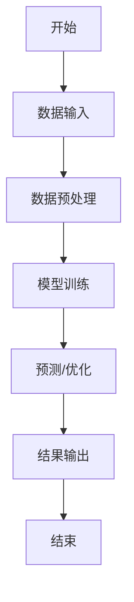
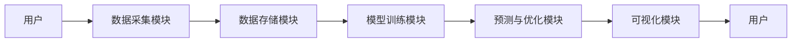

                 


# AI驱动的企业创新项目管理：敏捷方法与AI的深度融合

> 关键词：AI技术，企业创新，项目管理，敏捷方法，深度融合，算法原理，系统设计

> 摘要：本文探讨AI技术如何驱动企业创新项目管理的变革，重点分析敏捷方法与AI的深度融合。通过背景介绍、核心概念、算法原理、系统设计、项目实战等多维度，详细阐述AI在企业创新项目管理中的应用与价值。文章结合实际案例，深入分析AI驱动的算法、系统架构及应用场景，为企业创新项目管理提供新的思路与实践指导。

---

# 第一部分: AI驱动的企业创新项目管理背景与概念

---

## 第1章: AI与敏捷方法的背景介绍

### 1.1 企业创新项目管理的挑战与变革

#### 1.1.1 传统项目管理的局限性
传统项目管理方法（如瀑布模型）在企业创新项目中面临以下问题：
- **需求变更难应对**：企业创新项目通常具有不确定性高、需求易变的特点，传统方法难以灵活调整。
- **效率低下**：瀑布模型强调阶段划分，导致跨阶段协作困难，效率较低。
- **风险控制不足**：缺乏实时反馈机制，难以及时发现和解决问题。

#### 1.1.2 企业创新的需求与痛点
企业创新项目管理的核心需求包括：
- 快速迭代与试错能力
- 多部门协作的高效性
- 项目风险的实时监控与控制

#### 1.1.3 AI技术对企业项目管理的潜在价值
AI技术可以通过以下方式赋能企业创新项目管理：
- **智能预测**：基于历史数据和机器学习模型，预测项目进度、成本和风险。
- **自动化决策**：通过AI算法优化任务分配、资源调度和优先级排序。
- **实时反馈**：利用自然语言处理和数据分析技术，提供实时项目状态反馈。

---

### 1.2 敏捷方法的核心理念与特点

#### 1.2.1 敏捷开发的起源与核心原则
敏捷方法起源于软件开发领域，其核心原则包括：
- 个体互动高于流程和工具
- 可以变更的需求
- 迭代开发，逐步完善
- 交付可用的软件是主要目标

#### 1.2.2 敏捷方法在企业中的应用现状
敏捷方法在企业创新项目管理中的应用特点：
- **短周期交付**：通过迭代开发，快速验证假设，降低风险。
- **灵活调整**：根据反馈快速调整项目方向和优先级。
- **团队协作**：强调跨部门协作和自组织团队。

#### 1.2.3 敏捷方法与传统项目管理的对比分析
| 对比维度       | 敏捷方法               | 传统项目管理             |
|----------------|------------------------|--------------------------|
| 管理理念       | 迭代开发、灵活调整       | 稳定流程、阶段划分         |
| 适用场景       | 创新性强、需求变化快     | 需求明确、变化较小         |
| 团队协作       | 强调自组织、跨功能协作   | 强调层级分明、职责分明     |
| 风险控制       | 通过迭代交付降低风险     | 通过严格计划降低风险       |

---

### 1.3 AI驱动的创新项目管理的融合趋势

#### 1.3.1 AI技术在项目管理中的应用场景
- **任务优先级排序**：基于项目目标和资源约束，AI算法优化任务优先级。
- **进度预测与风险评估**：利用机器学习模型预测项目进度和潜在风险。
- **资源优化配置**：通过AI算法实现人、财、物的最优分配。

#### 1.3.2 敏捷方法与AI技术的深度融合
AI与敏捷方法的结合主要体现在以下几个方面：
- **实时反馈与调整**：通过AI算法实时分析项目数据，快速调整项目执行策略。
- **智能协作工具**：利用AI技术开发智能协作工具，提升团队协作效率。
- **数据驱动决策**：通过AI分析项目数据，为项目管理者提供数据支持。

#### 1.3.3 企业创新项目管理的未来发展方向
- **智能化决策支持**：通过AI技术实现项目管理的智能化决策。
- **个性化管理策略**：根据项目特点和团队能力，定制化管理策略。
- **生态化协作模式**：构建跨组织、跨领域的协作生态。

---

## 第2章: AI驱动的企业创新项目管理的核心概念

---

## 第二部分: AI驱动的企业创新项目管理的核心概念

---

### 第3章: AI驱动的创新项目管理算法原理

#### 3.1 算法原理概述
AI驱动的创新项目管理算法主要包含以下几个部分：
- **数据预处理**：对项目数据进行清洗、特征提取和标准化处理。
- **模型训练**：基于机器学习算法（如随机森林、神经网络）构建预测模型。
- **结果输出**：根据模型预测结果生成优化建议和行动计划。

#### 3.2 算法流程图


#### 3.3 算法实现代码
```python
import pandas as pd
from sklearn.ensemble import RandomForestRegressor

def project_progress_prediction(data):
    # 数据预处理
    data = data.dropna()
    features = data[['task_id', 'resource_id', 'deadline']]
    labels = data['progress']
    
    # 模型训练
    model = RandomForestRegressor(n_estimators=100)
    model.fit(features, labels)
    
    # 预测
    new_data = pd.DataFrame({
        'task_id': [1],
        'resource_id': [1],
        'deadline': [10]
    })
    prediction = model.predict(new_data)
    
    return prediction[0]

# 示例数据
data = pd.DataFrame({
    'task_id': [1, 2, 3],
    'resource_id': [1, 2, 3],
    'deadline': [10, 20, 30],
    'progress': [80, 60, 70]
})

print(project_progress_prediction(data))
```

#### 3.4 数学公式
AI算法的核心公式之一是随机森林模型的损失函数：
$$
\text{损失函数} = \sum_{i=1}^{n} (y_i - \hat{y}_i)^2
$$
其中，$y_i$ 是真实值，$\hat{y}_i$ 是预测值。

---

## 第三部分: AI驱动的企业创新项目管理的系统设计与实现

---

## 第4章: 系统分析与架构设计

#### 4.1 问题场景介绍
假设我们正在开发一个AI驱动的企业创新项目管理系统，目标是实现项目进度预测和资源优化配置。

#### 4.2 系统功能设计
- **数据采集模块**：采集项目数据，包括任务、资源、进度等。
- **模型训练模块**：基于历史数据训练AI模型。
- **预测与优化模块**：根据当前数据预测项目进度并提出优化建议。
- **可视化模块**：展示项目进度、预测结果和优化建议。

#### 4.3 系统架构设计


#### 4.4 系统接口设计
- **数据接口**：提供REST API用于数据的上传和查询。
- **预测接口**：提供API用于实时预测项目进度。

---

## 第5章: 项目实战

#### 5.1 环境安装
- 安装Python和相关库：
  ```bash
  pip install numpy pandas scikit-learn
  ```

#### 5.2 核心代码实现
```python
from sklearn.ensemble import RandomForestRegressor
import pandas as pd

# 数据加载
data = pd.read_csv('project_data.csv')

# 特征选择
features = ['task_id', 'resource_id', 'deadline']
target = 'progress'

# 数据分割
from sklearn.model_selection import train_test_split
X_train, X_test, y_train, y_test = train_test_split(data[features], data[target], test_size=0.2)

# 模型训练
model = RandomForestRegressor(n_estimators=100)
model.fit(X_train, y_train)

# 模型评估
score = model.score(X_test, y_test)
print(f'模型得分：{score}')
```

#### 5.3 实际案例分析
假设我们有一个项目数据集，包含任务ID、资源ID、截止日期和进度。通过模型训练，我们可以预测新任务的进度。

---

## 第六部分: 总结与展望

---

## 第6章: 总结与展望

#### 6.1 最佳实践
- 在项目管理中引入AI技术时，应结合企业实际情况，选择合适的应用场景。
- 数据质量是AI模型预测准确性的重要保障，需重视数据清洗和特征提取。

#### 6.2 小结
通过本文的分析，我们可以看到AI技术与敏捷方法的深度融合为企业创新项目管理带来了新的可能性。AI技术能够提升项目管理的效率和准确性，而敏捷方法则为AI技术的应用提供了灵活的实施环境。

#### 6.3 注意事项
- 数据隐私和安全问题需要高度重视。
- 模型的可解释性是实际应用中的重要考量因素。

#### 6.4 拓展阅读
建议进一步阅读以下内容：
- 《敏捷宣言》
- 《机器学习实战》
- 《企业项目管理的数字化转型》

---

# 作者：AI天才研究院/AI Genius Institute & 禅与计算机程序设计艺术 /Zen And The Art of Computer Programming

