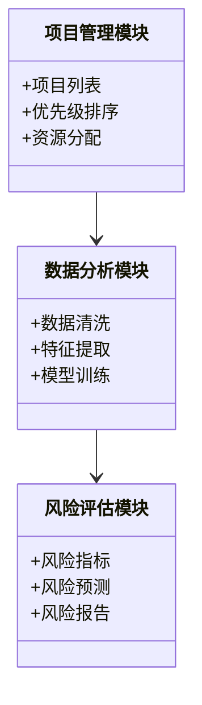
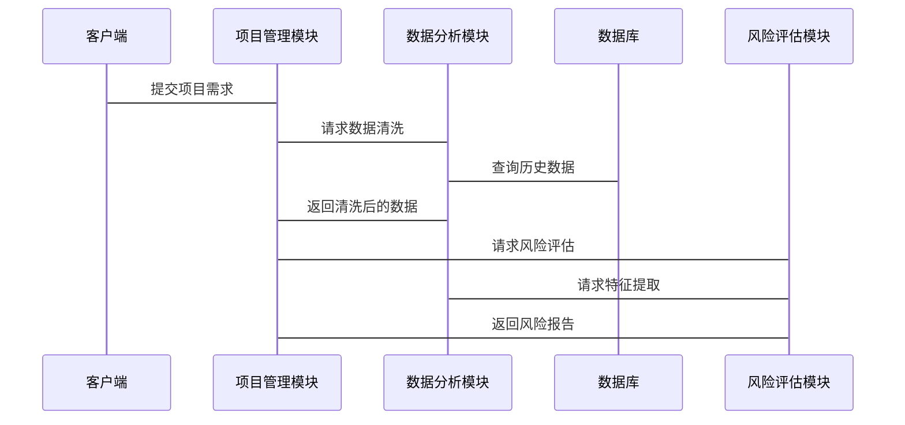

                 


# AI驱动的企业创新项目组合管理

> **关键词**：AI驱动、项目组合管理、机器学习、创新管理、企业战略

> **摘要**：  
本文探讨了人工智能（AI）如何驱动企业创新项目组合管理的优化。通过结合数据驱动的决策模型、机器学习算法和数学优化方法，企业可以更高效地评估项目风险、预测项目成功概率，并优化资源分配。文章详细介绍了AI在项目组合管理中的核心概念、算法原理、系统架构设计以及实际项目应用，并提供了丰富的案例分析和代码实现，帮助读者全面理解AI驱动的企业创新项目组合管理的理论与实践。

---

# 第一部分：AI驱动的企业创新项目组合管理概述

## 第1章：AI驱动的企业创新项目组合管理背景

### 1.1 项目组合管理的传统模式

#### 1.1.1 项目组合管理的基本概念  
项目组合管理（Project Portfolio Management，PPM）是指对企业中多个项目进行优先级排序、资源分配和风险管理的过程。传统的项目组合管理依赖于人工判断和经验，存在以下问题：  
- **信息不全**：缺乏对历史数据的系统分析，难以准确预测项目成功概率。  
- **主观性高**：决策依赖于个体经验，容易受到主观因素的影响。  
- **效率低下**：手动评估多个项目的时间成本高，难以快速响应变化。

#### 1.1.2 传统项目组合管理的局限性  
传统项目组合管理方法在面对复杂的企业创新项目时，往往难以应对以下挑战：  
- **数据孤岛**：各部门数据分散，难以形成统一的决策依据。  
- **计算复杂**：多目标优化问题难以在有限时间内解决。  
- **动态调整困难**：市场环境变化快，静态的项目评估难以适应动态需求。

#### 1.1.3 企业创新项目管理的挑战  
企业创新项目管理的核心目标是通过优化项目组合，实现企业战略目标的最大化。然而，创新项目具有以下特点：  
- **不确定性高**：创新项目的结果往往难以预测。  
- **资源有限**：企业资源（如预算、时间）有限，需要优先选择高价值项目。  
- **动态变化**：市场需求和技术进步不断推动项目评估标准的更新。

### 1.2 AI技术对企业创新的推动作用

#### 1.2.1 AI技术的基本概念  
人工智能（AI）是指计算机系统模拟人类智能的技术，包括学习、推理、决策等能力。AI的核心技术包括：  
- **机器学习**：通过数据训练模型，实现对未知数据的预测。  
- **自然语言处理**：理解和生成人类语言。  
- **优化算法**：解决复杂问题的数学方法。

#### 1.2.2 AI在企业创新中的应用领域  
AI技术在企业创新中的应用非常广泛，包括：  
- **项目评估**：预测项目成功概率、估算项目周期。  
- **风险分析**：识别项目中的潜在风险并制定应对策略。  
- **资源优化**：合理分配人力、时间和预算资源。

#### 1.2.3 AI驱动项目组合管理的优势  
AI驱动的项目组合管理相比传统方法具有以下优势：  
- **数据驱动决策**：通过分析历史数据，提高决策的准确性。  
- **自动化评估**：利用机器学习算法快速评估大量项目。  
- **动态优化**：实时调整项目优先级，适应市场变化。

---

## 第2章：AI驱动项目组合管理的核心概念

### 2.1 数据驱动的决策模型

#### 2.1.1 数据在项目组合管理中的作用  
数据是AI驱动决策的基础。在项目组合管理中，数据来源包括：  
- **项目历史数据**：过去项目的成功与否、周期、成本等。  
- **市场数据**：市场需求、竞争环境、技术趋势。  
- **资源数据**：企业可用的预算、人力资源等。

#### 2.1.2 数据驱动决策的数学模型  
数据驱动的决策模型通常包括以下步骤：  
1. 数据清洗与预处理。  
2. 数据特征提取。  
3. 建立预测模型。  
4. 模型优化与验证。

#### 2.1.3 数据质量与清洗方法  
数据质量直接影响模型的准确性。常见的数据清洗方法包括：  
- **去除重复数据**：确保每个数据点唯一。  
- **处理缺失值**：使用均值、中位数或删除方法处理缺失值。  
- **异常值处理**：通过统计方法或模型识别并处理异常值。

### 2.2 机器学习在项目预测中的应用

#### 2.2.1 机器学习的基本原理  
机器学习是一种通过数据训练模型的技术，分为监督学习、无监督学习和强化学习。  
- **监督学习**：基于标记数据训练模型，常用于分类和回归问题。  
- **无监督学习**：基于未标记数据发现数据结构，常用于聚类问题。  
- **强化学习**：通过试错学习策略，常用于动态环境中的决策问题。

#### 2.2.2 项目成功概率的预测模型  
项目成功概率预测是AI驱动项目组合管理的核心任务之一。常用算法包括：  
- **逻辑回归**：用于二分类问题，预测项目成功的概率。  
- **随机森林**：通过特征重要性分析，识别影响项目成功的因素。  
- **梯度提升树**：通过多棵树的组合提高预测精度。

#### 2.2.3 项目风险评估的算法选择  
项目风险评估需要考虑多种因素，如市场需求、技术可行性等。常用算法包括：  
- **支持向量机（SVM）**：适用于小样本数据的分类问题。  
- **K-近邻（KNN）**：基于距离的分类算法。  
- **朴素贝叶斯**：基于概率的分类算法。

### 2.3 项目组合优化的数学模型

#### 2.3.1 多目标优化问题的定义  
项目组合优化通常是一个多目标优化问题，目标函数包括：  
- **最大化项目价值**：如 ROI（投资回报率）。  
- **最小化项目风险**：如失败概率。  
- **最大化资源利用率**：如预算和时间的合理分配。

#### 2.3.2 数学模型的构建与求解  
数学模型的构建通常包括以下步骤：  
1. 确定目标函数和约束条件。  
2. 选择优化算法（如遗传算法、粒子群优化）。  
3. 训练模型并验证结果。

#### 2.3.3 优化算法的选择与实现  
优化算法的选择取决于问题的规模和复杂性。常用的优化算法包括：  
- **线性规划**：适用于线性目标函数和约束条件。  
- **非线性规划**：适用于非线性目标函数。  
- **遗传算法**：适用于复杂的组合优化问题。

---

## 第3章：基于机器学习的项目预测算法

### 3.1 项目成功概率预测的算法选择

#### 3.1.1 线性回归模型  
线性回归是一种简单但有效的回归算法，适用于线性关系的预测。其数学模型为：  
$$ y = \beta_0 + \beta_1x + \epsilon $$  
其中，$y$ 是目标变量（项目成功概率），$x$ 是特征变量，$\epsilon$ 是误差项。

#### 3.1.2 支持向量机（SVM）  
SVM是一种强大的分类算法，适用于小样本数据。其核心思想是通过找到一个超平面，将数据分为两类。

#### 3.1.3 随机森林与梯度提升树  
随机森林和梯度提升树是两种常用的集成学习算法，具有较高的预测精度。  
- **随机森林**：通过随机采样构建多棵树，并取结果的平均值。  
- **梯度提升树**：通过不断优化损失函数，逐步提高模型性能。

### 3.2 项目风险评估的算法实现

#### 3.2.1 风险评估指标的定义  
项目风险评估需要定义多个指标，如：  
- **技术风险**：技术实现的难度。  
- **市场风险**：市场需求的不确定性。  
- **财务风险**：项目的成本超支可能性。

#### 3.2.2 基于XGBoost的风险评估模型  
XGBoost是一种高效的梯度提升算法，适用于分类和回归问题。其核心思想是通过正则化和剪枝优化模型性能。

#### 3.2.3 模型调参与优化  
模型调优通常包括：  
- **参数调优**：如学习率、树深度等。  
- **交叉验证**：通过多次训练验证模型性能。  
- **特征选择**：去除冗余特征，提高模型效率。

### 3.3 项目组合优化的数学模型

#### 3.3.1 基于线性规划的优化模型  
线性规划适用于目标函数和约束条件均为线性的情况。其数学模型为：  
$$ \text{最大化} \quad c_1x_1 + c_2x_2 + \dots + c_nx_n $$  
$$ \text{满足} \quad a_1x_1 + a_2x_2 + \dots + a_nx_n \leq b $$  

#### 3.3.2 非线性规划模型  
非线性规划适用于目标函数或约束条件为非线性的情况。其数学模型为：  
$$ \text{最大化} \quad f(x_1, x_2, \dots, x_n) $$  
$$ \text{满足} \quad g(x_1, x_2, \dots, x_n) \leq 0 $$  

#### 3.3.3 遗传算法的应用  
遗传算法是一种基于生物进化原理的优化算法，适用于复杂的组合优化问题。其核心步骤包括：  
1. 初始化种群。  
2. 计算适应度。  
3. 选择、交叉和变异。  
4. 迭代优化。

---

## 第4章：系统分析与架构设计

### 4.1 项目组合管理系统的功能设计

#### 4.1.1 领域模型（Mermaid 类图）  


#### 4.1.2 系统架构设计（Mermaid 架构图）  


#### 4.1.3 系统接口设计（Mermaid 序列图）  


---

## 第5章：项目实战

### 5.1 环境安装与配置

```bash
# 安装所需库
pip install numpy
pip install pandas
pip install scikit-learn
pip install xgboost
```

### 5.2 核心代码实现

#### 5.2.1 数据清洗与特征提取

```python
import pandas as pd
import numpy as np

# 加载数据
data = pd.read_csv('projects.csv')

# 处理缺失值
data = data.dropna()

# 去除异常值
outliers = data[(data['cost'].std() > 3)].index
data = data.drop(outliers)
```

#### 5.2.2 项目成功概率预测

```python
from sklearn.ensemble import RandomForestClassifier
from sklearn.model_selection import train_test_split
from sklearn.metrics import accuracy_score

# 数据分割
X = data[['cost', 'time', 'team_size']]
y = data['success']

X_train, X_test, y_train, y_test = train_test_split(X, y, test_size=0.2)

# 模型训练
model = RandomForestClassifier()
model.fit(X_train, y_train)

# 模型评估
y_pred = model.predict(X_test)
print("准确率:", accuracy_score(y_test, y_pred))
```

#### 5.2.3 项目组合优化

```python
import numpy as np
from scipy.optimize import minimize

# 定义目标函数
def objective_function(x):
    return -sum(c * x for c in [1, 2, 3])

# 定义约束条件
constraints = [
    {'type': 'eq', 'fun': lambda x: sum(x) - 1 == 0}
]

# 模型训练
result = minimize(objective_function, x0=[1/3, 1/3, 1/3], constraints=constraints)

print("最优解:", result.x)
```

### 5.3 案例分析与解读

#### 5.3.1 案例背景  
某科技公司计划启动多个创新项目，希望通过AI驱动的项目组合管理优化资源分配。

#### 5.3.2 数据分析  
通过数据清洗和特征提取，筛选出影响项目成功的关键因素：成本、时间和团队规模。

#### 5.3.3 模型训练  
使用随机森林算法预测项目成功概率，并优化项目组合以最大化投资回报率。

---

## 第6章：总结与展望

### 6.1 总结  
本文详细介绍了AI驱动的企业创新项目组合管理的核心概念、算法原理和系统设计。通过机器学习和数学优化方法，企业可以更高效地评估项目风险、预测项目成功概率，并优化资源分配。

### 6.2 展望  
未来，随着AI技术的不断发展，项目组合管理将更加智能化和自动化。企业可以利用更先进的算法和工具，进一步提升决策效率和准确性。

---

**作者：AI天才研究院/AI Genius Institute & 禅与计算机程序设计艺术 /Zen And The Art of Computer Programming**

