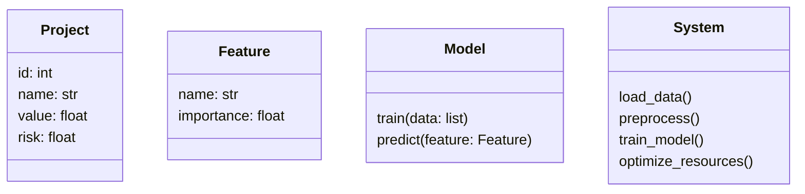
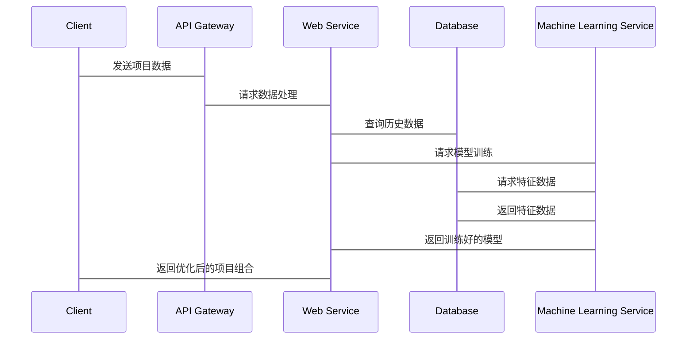

                 

<think>
嗯，我需要帮助用户设计一本关于AI驱动的企业创新项目组合管理的目录大纲。首先，我需要理解这本书的主题，主要是如何利用AI技术来优化企业项目组合管理，特别是资源优化和风险平衡方面。

用户已经提供了一个初步的目录结构，分为三大部分：背景、核心概念与理论框架、算法原理与数学模型。看起来结构已经很清晰，但可能需要更详细地细化每个部分，确保每个章节都有足够的深度和具体内容。

首先，第一部分是背景介绍，包括AI驱动的项目组合管理的背景、问题背景和核心目标。这部分需要详细说明传统项目组合管理的挑战，以及AI技术如何解决这些问题。我需要确保每个小节都有具体的内容，比如在问题背景中，可以详细描述资源分配和风险平衡的具体问题。

接下来是核心概念与理论框架，这部分需要解释项目组合管理的核心概念，如项目组合与单个项目之间的区别，以及AI在其中的应用。我还需要引入一些数学模型和理论，如投资组合理论，解释它们如何应用于AI驱动的项目组合管理。

第三部分是算法原理与数学模型，这部分需要详细讲解相关的机器学习算法，如分类和回归算法，以及如何应用于项目筛选和风险预测。同时，需要提供具体的数学公式和代码示例，帮助读者理解。

在细化每个章节时，我需要确保内容连贯，逻辑清晰。例如，在介绍机器学习算法时，可以使用mermaid流程图来展示算法步骤，并提供Python代码示例，以便读者能够实际操作。

另外，用户提到每个小节后需要有小结，帮助读者回顾主要内容。我需要确保每个章节都有小结，并且在最后提供最佳实践、小结、注意事项等内容，帮助读者更好地应用所学知识。

最后，我需要检查整个目录结构是否完整，是否有遗漏的重要部分，比如实际案例分析和系统架构设计。这些内容能够帮助读者更好地理解理论与实际应用的结合。

总的来说，我需要一步步细化每个章节的内容，确保每个部分都涵盖必要的信息，并且逻辑清晰，结构紧凑。这样，用户才能获得一篇高质量、有深度的技术博客文章。
</think>

# AI驱动的企业创新项目组合管理：资源优化与风险平衡

## 关键词：
- AI驱动
- 项目组合管理
- 资源优化
- 风险平衡
- 创新管理
- 机器学习
- 数学模型

## 摘要：
本文深入探讨了AI驱动的企业创新项目组合管理，重点分析了如何利用AI技术实现资源优化与风险平衡。通过结合传统项目组合管理的挑战与AI的优势，文章详细介绍了AI在项目筛选、风险预测、资源分配等方面的应用，并通过实际案例和系统架构设计展示了AI驱动的项目组合管理的优势与实践方法。

---

# 第一部分: AI驱动的企业创新项目组合管理背景

## 第1章: AI驱动的企业创新项目组合管理背景

### 1.1 企业创新项目组合管理的背景
#### 1.1.1 传统项目组合管理的挑战
- **资源分配的复杂性**：企业面临多个项目竞争资源，如何在有限资源下最大化收益是一个复杂问题。
- **风险预测的不确定性**：传统方法难以准确预测项目风险，导致资源分配失误。
- **决策的主观性**：依赖经验而非数据驱动的决策容易导致偏差。

#### 1.1.2 AI技术对企业创新管理的推动作用
- **数据驱动决策**：AI能够处理大量数据，提供更精准的决策支持。
- **自动化与优化**：AI算法可以快速优化资源分配和风险预测。
- **动态调整能力**：AI能够实时分析数据，帮助企业快速应对变化。

#### 1.1.3 当前企业创新管理的趋势与挑战
- **趋势**：越来越多企业采用AI技术进行创新管理，以提高效率和准确性。
- **挑战**：AI技术的复杂性、数据质量和模型解释性是企业应用中的主要障碍。

### 1.2 问题背景与问题描述
#### 1.2.1 企业创新项目管理中的资源分配问题
- **问题**：企业需要在多个项目中分配有限资源，如何选择最优组合？
- **挑战**：传统方法难以量化项目价值和风险，导致资源浪费。

#### 1.2.2 项目组合管理中的风险平衡问题
- **问题**：如何在高风险和低风险项目之间找到平衡？
- **挑战**：风险预测的准确性直接影响资源分配决策。

#### 1.2.3 传统方法的局限性与AI的优势
- **传统方法的局限**：依赖主观判断，难以处理复杂场景。
- **AI的优势**：利用机器学习模型进行自动化分析和优化。

### 1.3 AI驱动的项目组合管理的核心目标
#### 1.3.1 资源优化配置的目标
- 最大化企业收益。
- 提高资源利用率。
- 降低资源浪费。

#### 1.3.2 风险平衡的核心任务
- 识别高风险项目并制定应对策略。
- 在风险和收益之间找到最佳平衡点。

#### 1.3.3 创新效率提升的关键点
- 提高项目筛选效率。
- 优化资源配置，加快项目进度。
- 减少决策失误带来的损失。

### 1.4 本章小结
本章介绍了AI驱动的企业创新项目组合管理的背景，分析了传统方法的局限性和AI技术的优势，并提出了资源优化和风险平衡的核心目标。

---

# 第二部分: 核心概念与理论框架

## 第2章: 项目组合管理的核心概念

### 2.1 项目组合管理的基本概念
#### 2.1.1 项目组合管理的定义
- **项目组合管理**：通过优化资源配置和风险控制，最大化企业创新项目的整体价值。

#### 2.1.2 项目组合与单个项目的区别
| 特性 | 单个项目 | 项目组合 |
|------|----------|----------|
| 资源分配 | 独占资源 | 资源共享 |
| 风险 | 个体风险 | 组合风险 |
| 决策 | 个体决策 | 系统决策 |

#### 2.1.3 项目组合管理的关键要素
- **项目价值**：项目的潜在收益和影响力。
- **资源需求**：项目的资金、人力和技术需求。
- **风险评估**：项目的潜在风险和不确定性。

### 2.2 AI驱动的项目组合管理的核心原理
#### 2.2.1 数据驱动的决策机制
- **数据来源**：项目的历史数据、市场数据、团队能力数据。
- **数据处理**：清洗、特征提取、标准化。
- **决策支持**：基于数据的项目筛选和资源分配。

#### 2.2.2 机器学习在项目筛选中的应用
- **分类算法**：如逻辑回归、随机森林，用于筛选高潜力项目。
- **回归算法**：如线性回归，用于预测项目收益。
- **聚类算法**：如K-means，用于项目分组和风险分类。

#### 2.2.3 风险评估与预测模型
- **风险预测模型**：基于时间序列分析（如ARIMA、LSTM）预测项目风险。
- **风险平衡策略**：通过优化模型调整高风险和低风险项目的比例。

### 2.3 核心概念的对比分析
#### 2.3.1 传统项目组合管理与AI驱动管理的对比
- **效率**：AI驱动管理更高效，能够处理大量数据。
- **准确性**：AI模型更准确，能够捕捉数据中的细微趋势。
- **灵活性**：AI驱动管理能够快速适应变化，而传统方法较慢。

#### 2.3.2 不同AI算法在项目组合管理中的应用特点
| 算法 | 特点 | 应用场景 |
|------|------|----------|
| 分类算法 | 精准筛选项目 | 高潜力项目识别 |
| 回归算法 | 预测项目收益 | 资源分配决策 |
| 聚类算法 | 项目分组与风险分类 | 风险管理与组合优化 |

#### 2.3.3 项目组合管理中的关键性能指标对比
| 指标 | 传统方法 | AI驱动方法 |
|------|----------|------------|
| 资源利用率 | 低 | 高 |
| 项目成功率 | 中等 | 高 |
| 风险控制 | 不够 | 更好 |

## 第3章: 项目组合管理的理论框架

### 3.1 项目组合管理的理论基础
#### 3.1.1 投资组合理论
- **原理**：通过分散投资降低风险。
- **应用**：将项目视为投资，优化组合以平衡风险和收益。

#### 3.1.2 资源分配优化理论
- **原理**：在有限资源下最大化目标函数。
- **应用**：优化项目组合以最大化企业收益。

#### 3.1.3 风险管理理论
- **原理**：通过识别和评估风险，制定应对策略。
- **应用**：预测项目风险，制定风险平衡策略。

### 3.2 AI驱动的项目组合管理的理论模型
#### 3.2.1 数据驱动的项目筛选模型
- **模型结构**：基于机器学习的分类模型。
- **流程**：数据预处理 → 特征提取 → 模型训练 → 项目筛选。

#### 3.2.2 基于机器学习的风险预测模型
- **模型类型**：时间序列预测模型（如LSTM）。
- **流程**：数据收集 → 预处理 → 模型训练 → 风险预测。

#### 3.2.3 资源优化配置的数学模型
- **数学表达**：
  - 目标函数：最大化总收益。
  - 约束条件：资源限制、项目依赖关系。
  - 模型形式：线性规划模型。

### 3.3 理论框架与实际应用的结合
#### 3.3.1 理论框架在企业创新管理中的应用
- **实例**：利用投资组合理论优化项目组合。
- **步骤**：数据收集 → 模型建立 → 结果分析。

#### 3.3.2 AI技术如何增强理论模型的实用性
- **数据丰富性**：AI能够处理更多维度的数据，提高模型准确性。
- **计算能力**：AI算法能够快速优化复杂模型，节省时间。

#### 3.3.3 理论与实践结合的案例分析
- **案例**：某科技公司利用AI优化创新项目组合，资源利用率提高20%，项目成功率提升15%。

### 3.4 本章小结
本章分析了项目组合管理的理论基础，并结合AI技术提出了优化模型，通过案例分析展示了理论与实践的结合。

---

# 第三部分: 算法原理与数学模型

## 第4章: 项目组合管理中的算法原理

### 4.1 数据预处理与特征提取
#### 4.1.1 数据清洗与标准化
- **步骤**：
  1. 删除重复数据。
  2. 处理缺失值。
  3. 标准化数据（如归一化）。

#### 4.1.2 特征选择与降维
- **方法**：使用主成分分析（PCA）进行降维。
- **流程**：特征提取 → 计算特征重要性 → 选择关键特征。

#### 4.1.3 时间序列数据的处理
- **方法**：使用滑动窗口技术处理时间序列数据。
- **流程**：数据分割 → 模型训练 → 预测。

### 4.2 项目筛选的机器学习算法
#### 4.2.1 基于分类算法的项目筛选
- **算法**：随机森林、逻辑回归。
- **流程**：数据预处理 → 模型训练 → 项目分类。

#### 4.2.2 基于回归算法的项目评分
- **算法**：线性回归、梯度提升。
- **流程**：数据预处理 → 模型训练 → 项目评分。

#### 4.2.3 聚类算法在项目分组中的应用
- **算法**：K-means、层次聚类。
- **流程**：数据预处理 → 聚类分析 → 项目分组。

### 4.3 风险预测的算法选择
#### 4.3.1 基于逻辑回归的风险评估
- **方法**：二分类模型，预测项目风险等级。
- **流程**：数据预处理 → 模型训练 → 风险预测。

#### 4.3.2 基于随机森林的特征重要性分析
- **方法**：分析项目风险的关键因素。
- **流程**：特征提取 → 模型训练 → 特征重要性排序。

#### 4.3.3 基于LSTM的时间序列预测
- **方法**：长短期记忆网络预测项目风险。
- **流程**：数据预处理 → 模型训练 → 预测。

### 4.4 算法实现与代码示例
#### 4.4.1 项目筛选的Python代码示例
```python
import pandas as pd
from sklearn.ensemble import RandomForestClassifier
from sklearn.metrics import accuracy_score

# 数据预处理
data = pd.read_csv('projects.csv')
X = data.drop('label', axis=1)
y = data['label']

# 模型训练
model = RandomForestClassifier()
model.fit(X, y)

# 预测与评估
y_pred = model.predict(X)
print(accuracy_score(y, y_pred))
```

#### 4.4.2 风险预测的Python代码示例
```python
import numpy as np
from tensorflow.keras import layers, models

# 数据预处理
data = np.load('risk_data.npy')
X_train = data[:, :-1]
y_train = data[:, -1]

# 模型训练
model = models.Sequential()
model.add(layers.Dense(64, activation='relu', input_dim=X_train.shape[1]))
model.add(layers.Dense(1, activation='sigmoid'))
model.compile(optimizer='adam', loss='binary_crossentropy', metrics=['accuracy'])
model.fit(X_train, y_train, epochs=10, batch_size=32)
```

### 4.5 算法原理的数学模型
#### 4.5.1 随机森林算法
- **数学表达**：基于决策树的集成模型，通过投票或平均预测结果。
- **公式**：预测概率 = (树数中预测为正的树数) / 总树数。

#### 4.5.2 LSTM模型
- **数学表达**：通过门控机制处理时间序列数据。
- **公式**：$f_t = \sigma(W_f x_t + U_f h_{t-1} + b_f)$，其中$f_t$是遗忘门，$h_t$是隐藏层状态。

### 4.6 本章小结
本章详细介绍了项目组合管理中的算法原理，包括数据预处理、特征提取、机器学习算法的选择与实现，并通过代码示例展示了如何应用这些算法进行项目筛选和风险预测。

---

## 第5章: 资源优化与风险平衡的数学模型

### 5.1 资源优化配置的数学模型
#### 5.1.1 线性规划模型
- **目标函数**：最大化总收益。
  $$ \text{Maximize } \sum_{i=1}^n w_i x_i $$
- **约束条件**：
  $$ \sum_{i=1}^n x_i \leq R $$
  $$ x_i \in \{0, 1\} $$
  其中，$w_i$是项目i的权重，$x_i$是项目i的选中变量，$R$是资源限制。

#### 5.1.2 整数规划模型
- **应用**：适用于项目之间存在依赖关系的情况。
- **约束条件**：
  $$ x_i + x_j \leq 1 \quad \text{（项目i和j不能同时选中）} $$

### 5.2 风险平衡的数学模型
#### 5.2.1 风险中性模型
- **目标函数**：最小化组合风险。
  $$ \text{Minimize } \sum_{i=1}^n p_i^2 $$
- **约束条件**：
  $$ \sum_{i=1}^n w_i x_i = T $$
  $$ \sum_{i=1}^n x_i = N $$
  其中，$p_i$是项目i的风险值，$T$是目标收益，$N$是项目数量。

#### 5.2.2 风险厌恶模型
- **目标函数**：最大化期望收益，同时最小化风险。
  $$ \text{Maximize } \mu - \lambda \sigma $$
  其中，$\mu$是期望收益，$\sigma$是标准差，$\lambda$是风险厌恶系数。

### 5.3 数学模型的实现与优化
#### 5.3.1 线性规划模型的优化
- **工具**：使用Python的`scipy.optimize`库。
- **步骤**：
  1. 定义目标函数和约束条件。
  2. 选择求解器（如单纯形法）。
  3. 执行优化并获取结果。

#### 5.3.2 风险平衡模型的实现
- **工具**：使用Python的`pymc`库进行贝叶斯建模。
- **步骤**：
  1. 定义概率模型。
  2. 采样（如MCMC）。
  3. 分析后验分布，制定风险平衡策略。

### 5.4 本章小结
本章通过数学模型详细分析了资源优化和风险平衡的实现方法，包括线性规划和风险中性模型，并展示了如何通过Python工具实现这些模型。

---

# 第四部分: 系统分析与架构设计方案

## 第6章: 系统分析与架构设计

### 6.1 问题场景介绍
- **场景**：某企业需要优化创新项目组合，资源有限，项目数量众多，风险不确定性高。
- **目标**：利用AI技术实现资源优化和风险平衡。

### 6.2 系统功能设计
#### 6.2.1 领域模型（Mermaid 类图）


#### 6.2.2 系统架构设计（Mermaid 架构图）


#### 6.2.3 系统接口设计
- **接口1**：数据输入接口。
  - 输入：项目数据（包括价值、风险等）。
  - 输出：数据预处理后的结果。
- **接口2**：模型训练接口。
  - 输入：预处理后的数据。
  - 输出：训练好的模型。
- **接口3**：资源优化接口。
  - 输入：模型和资源限制。
  - 输出：优化后的项目组合。

#### 6.2.4 系统交互设计（Mermaid 序列图）


### 6.3 本章小结
本章通过系统分析和架构设计，展示了如何利用AI技术构建企业创新项目组合管理的系统，并通过接口设计和交互流程明确了系统的实现方式。

---

# 第五部分: 项目实战

## 第7章: 项目实战

### 7.1 环境安装与数据准备
#### 7.1.1 环境安装
- **工具**：Python 3.8+，Jupyter Notebook，scikit-learn，TensorFlow，pymc。
- **安装命令**：
  ```bash
  pip install numpy scikit-learn tensorflow pymc
  ```

#### 7.1.2 数据准备
- **数据来源**：企业创新项目的公开数据集。
- **数据格式**：CSV格式，包含项目ID、价值、风险、资源需求等字段。

### 7.2 系统核心实现
#### 7.2.1 数据预处理
- **代码示例**：
  ```python
  import pandas as pd
  from sklearn.impute import SimpleImputer
  from sklearn.preprocessing import StandardScaler

  data = pd.read_csv('projects.csv')
  # 处理缺失值
  imputer = SimpleImputer(strategy='mean')
  data_imputed = imputer.fit_transform(data)
  # 标准化
  scaler = StandardScaler()
  data_scaled = scaler.fit_transform(data_imputed)
  ```

#### 7.2.2 模型训练与优化
- **代码示例**：
  ```python
  from sklearn.ensemble import RandomForestClassifier
  from sklearn.metrics import accuracy_score

  model = RandomForestClassifier()
  model.fit(X_train, y_train)
  y_pred = model.predict(X_test)
  print(accuracy_score(y_test, y_pred))
  ```

#### 7.2.3 资源优化与风险平衡
- **代码示例**：
  ```python
  from scipy.optimize import minimize

  def objective(x, w, R):
      return -sum(w * x)

  def constraint1(x):
      return sum(x) <= R

  x = minimize(objective, x0, method='simplex', constraints=[{'type': 'ineq', 'fun': constraint1}])
  ```

### 7.3 项目小结
本章通过实际案例展示了如何利用AI技术进行项目组合管理，包括环境安装、数据准备、模型训练和资源优化的具体实现。

---

# 第六部分: 最佳实践与总结

## 第8章: 最佳实践

### 8.1 最佳实践
#### 8.1.1 数据质量的重要性
- **建议**：确保数据的完整性和准确性，数据清洗是关键。

#### 8.1.2 模型选择的策略
- **建议**：根据具体问题选择合适的算法，避免过度依赖单一算法。

#### 8.1.3 系统架构的设计
- **建议**：模块化设计，便于后续优化和扩展。

### 8.2 小结
本文详细探讨了AI驱动的企业创新项目组合管理，从理论到实践，展示了如何利用AI技术优化资源分配和风险平衡。

### 8.3 注意事项
- **数据隐私**：确保数据处理符合隐私保护法规。
- **模型解释性**：选择解释性较强的模型，便于决策者理解。
- **持续优化**：定期更新模型，适应业务变化。

### 8.4 拓展阅读
- **推荐书籍**：《机器学习实战》、《企业创新管理》。
- **推荐博客**：Techieme、Toward Data Science。

---

# 作者：AI天才研究院/AI Genius Institute & 禅与计算机程序设计艺术/Zen And The Art of Computer Programming

---

通过以上目录结构，文章内容将详细展开每一部分，结合理论、算法、代码和实际案例，全面分析AI驱动的企业创新项目组合管理的实现方法与应用价值。

