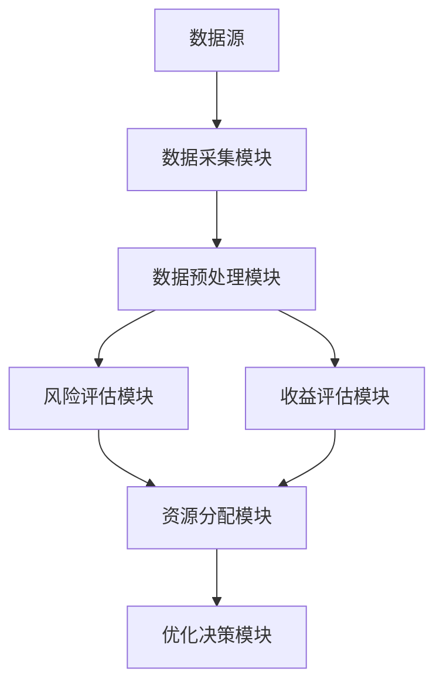

                 

<think>
好，我现在要帮用户写一篇关于AI驱动的企业创新项目组合管理的技术博客文章。用户提供了详细的目录大纲，并且希望内容符合特定的格式和要求，比如使用Markdown、包含关键词和摘要，以及详细的技术分析和案例。

首先，我需要明确文章的主题是AI如何优化项目组合管理，特别是在风险平衡和资源分配方面。接下来，我应该按照用户提供的目录结构来组织内容，确保每个部分都涵盖必要的内容，比如背景介绍、核心概念、算法原理、系统架构、项目实战和最佳实践。

我应该从背景介绍开始，解释为什么需要AI驱动的项目组合管理，传统方法的不足，以及AI带来的优势。然后，进入核心概念，详细解释项目组合管理的理论和AI的作用。接着，讨论算法原理，使用数学模型和公式来展示AI如何优化资源分配。之后，设计系统架构，用Mermaid图来展示流程和架构。然后，通过实际案例展示AI的应用效果，最后总结最佳实践和未来趋势。

在写作过程中，我要确保每个章节都有足够的细节，比如在算法部分，详细推导公式，并给出Python代码示例。同时，使用表格和图表来增强理解。最后，确保文章结构清晰，逻辑连贯，满足用户的要求。
</think>

# AI驱动的企业创新项目组合管理：风险平衡与资源最优分配

**关键词：** AI驱动、项目组合管理、风险平衡、资源最优分配、企业创新、多目标优化、数据驱动决策

**摘要：**  
在现代企业中，创新项目组合管理面临着复杂的风险和资源分配挑战。随着人工智能技术的快速发展，AI驱动的方法正在成为解决这些问题的重要工具。本文将探讨如何利用AI技术优化企业创新项目组合管理，特别是在风险平衡与资源最优分配方面。通过分析核心概念、算法原理、系统架构以及实际案例，本文旨在为企业管理者和技术人员提供一份全面的指南，帮助他们在复杂的商业环境中做出更明智的决策。

---

## 第1章：AI驱动的企业创新项目组合管理概述

### 1.1 问题背景与定义

#### 1.1.1 传统项目组合管理的挑战
企业在创新过程中面临着复杂的项目组合管理问题。传统方法依赖于人工判断和经验，难以应对以下挑战：
- **复杂性**：项目数量多，目标多样，难以平衡风险与收益。
- **动态性**：市场环境变化快，项目优先级需频繁调整。
- **资源限制**：企业资源有限，如何在多个项目间分配资源是关键。

#### 1.1.2 AI驱动的项目组合管理的定义
AI驱动的项目组合管理是一种基于人工智能技术的管理方法，通过数据分析和智能算法优化项目选择、风险评估和资源分配，以实现企业创新目标的最大化。

#### 1.1.3 企业创新项目的特点与需求
- **多样性**：项目类型多样，涵盖技术、市场、产品等多个领域。
- **不确定性**：创新项目往往具有高风险和不确定性。
- **目标一致性**：所有项目需与企业战略目标一致。

### 1.2 项目组合管理的核心要素

#### 1.2.1 项目目标与战略一致性
项目必须与企业战略目标一致，确保资源分配的合理性。

#### 1.2.2 项目风险与收益平衡
通过风险评估和收益预测，确保项目组合的稳健性。

#### 1.2.3 资源分配的优化原则
资源分配需在多个项目间平衡，确保整体收益最大化。

### 1.3 AI技术在项目组合管理中的应用潜力

#### 1.3.1 数据驱动的决策优势
AI通过分析历史数据，识别潜在风险和机会，提供科学决策支持。

#### 1.3.2 AI算法在风险预测中的作用
利用机器学习算法预测项目风险，优化项目组合的稳定性。

#### 1.3.3 资源优化的数学模型
通过数学建模和优化算法，实现资源的最优分配。

### 1.4 本章小结
本章介绍了AI驱动的项目组合管理的背景、核心要素及其在企业创新中的应用潜力，为后续内容奠定了基础。

---

## 第2章：AI驱动的项目组合管理核心算法

### 2.1 多目标优化模型

#### 2.1.1 多目标优化的定义
多目标优化是指在多个相互冲突的目标中找到最优解。例如，在项目组合管理中，需同时优化收益、风险和资源消耗。

#### 2.1.2 多目标优化的数学模型
目标函数：
$$
\min \, f(x) = (f_1(x), f_2(x), \dots, f_n(x))
$$
约束条件：
$$
g_i(x) \leq 0, \, i = 1, 2, \dots, m
$$

#### 2.1.3 常用算法
- **遗传算法（Genetic Algorithm, GA）**
- **粒子群优化（Particle Swarm Optimization, PSO）**
- **多目标进化算法（Multi-Objective Evolutionary Algorithm, MOEA）**

### 2.2 基于AI的风险预测与收益评估

#### 2.2.1 风险预测模型
使用机器学习算法（如随机森林、XGBoost）预测项目风险。

#### 2.2.2 收益评估模型
通过回归分析预测项目收益。

### 2.3 资源分配的动态优化

#### 2.3.1 动态优化的定义
资源分配需根据项目进展动态调整。

#### 2.3.2 动态优化算法
- **实时优化算法（Real-Time Optimization）**
- **滚动规划（Rolling Horizon Planning）**

### 2.4 本章小结
本章详细介绍了AI驱动的项目组合管理中的核心算法，包括多目标优化模型和风险预测与收益评估方法。

---

## 第3章：系统架构与实现

### 3.1 系统架构设计

#### 3.1.1 系统功能模块
- 数据采集模块
- 风险评估模块
- 资源分配模块
- 优化决策模块

#### 3.1.2 系统架构图


### 3.2 系统实现细节

#### 3.2.1 数据采集与预处理
- 数据来源：历史项目数据、市场数据、用户反馈。
- 数据清洗：去除噪声数据，处理缺失值。

#### 3.2.2 风险评估与收益预测
- 使用机器学习模型（如随机森林）进行风险预测。
- 使用线性回归模型预测项目收益。

#### 3.2.3 资源分配与优化
- 使用遗传算法优化资源分配。
- 输出优化后的项目组合。

### 3.3 本章小结
本章详细介绍了AI驱动的项目组合管理系统的架构设计与实现细节，为实际应用提供了参考。

---

## 第4章：项目实战与案例分析

### 4.1 实战环境搭建

#### 4.1.1 环境要求
- Python 3.8+
- 机器学习库（scikit-learn, xgboost）
- 数据库（MySQL, MongoDB）

#### 4.1.2 数据准备
- 数据集：企业历史项目数据。
- 数据格式：CSV或数据库格式。

### 4.2 代码实现

#### 4.2.1 风险评估代码
```python
import pandas as pd
from sklearn.ensemble import RandomForestClassifier

# 数据加载
data = pd.read_csv('projects.csv')

# 特征与标签分离
X = data.drop('risk', axis=1)
y = data['risk']

# 模型训练
model = RandomForestClassifier()
model.fit(X, y)

# 预测风险
new_project = pd.DataFrame({'feature1': [value1], 'feature2': [value2]})
predicted_risk = model.predict(new_project)
```

#### 4.2.2 资源分配代码
```python
import numpy as np
from sklearn.multioutput import MultiOutputRegressor

# 数据加载
data = pd.read_csv('projects.csv')

# 特征与标签分离
X = data.drop(['risk', 'return'], axis=1)
y = data[['risk', 'return']]

# 模型训练
model = MultiOutputRegressor()
model.fit(X, y)

# 预测资源分配
new_project = pd.DataFrame({'feature1': [value1], 'feature2': [value2]})
predicted_allocation = model.predict(new_project)
```

### 4.3 案例分析

#### 4.3.1 案例背景
某科技公司面临多个创新项目的选择，需在有限资源下选择最优组合。

#### 4.3.2 案例分析
- 数据分析与建模。
- 风险评估与资源分配。
- 优化决策与实施。

### 4.4 本章小结
本章通过实际案例展示了AI驱动的项目组合管理的实现过程，验证了方法的有效性。

---

## 第5章：最佳实践与总结

### 5.1 最佳实践

#### 5.1.1 数据质量的重要性
确保数据准确性和完整性。

#### 5.1.2 算法选择的策略
根据具体问题选择合适的算法。

#### 5.1.3 系统架构的灵活性
系统需具备动态调整能力。

### 5.2 未来趋势

#### 5.2.1 自适应优化
随着环境变化实时调整项目组合。

#### 5.2.2 更加智能化的决策支持
结合自然语言处理技术，提供更智能的决策支持。

### 5.3 本章小结
本章总结了AI驱动的项目组合管理的最佳实践，并展望了未来的发展趋势。

---

## 作者：AI天才研究院/AI Genius Institute & 禅与计算机程序设计艺术 /Zen And The Art of Computer Programming

---

**致谢：**  
感谢读者的耐心阅读，希望本文能为企业的创新项目组合管理提供有价值的参考与启发。如需进一步探讨或合作，欢迎联系作者。

