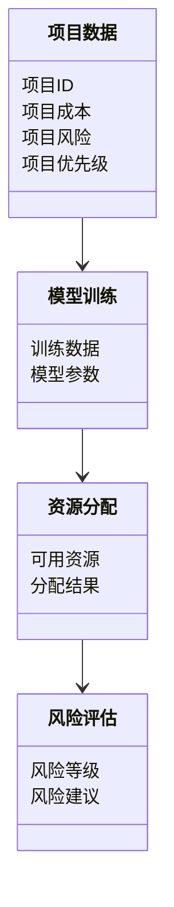
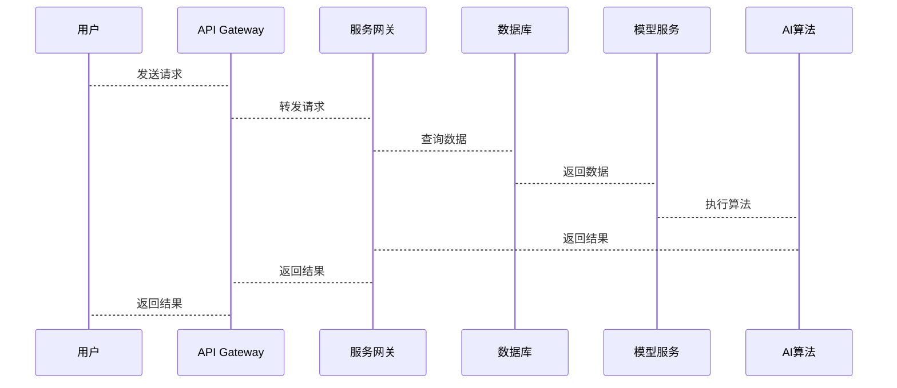

                 


# AI驱动的企业创新项目组合管理：风险平衡与资源最优分配模型

> 关键词：AI驱动、项目组合管理、风险平衡、资源分配、企业创新

> 摘要：本文探讨了AI在企业创新项目组合管理中的应用，重点分析了如何通过AI技术实现风险平衡与资源最优分配。文章从理论基础、算法实现、系统架构设计等多个维度进行深入分析，并结合实际案例，提出了基于AI的创新项目组合管理模型。

---

# 第1章: 项目组合管理与AI的结合

## 1.1 项目组合管理的背景与意义

### 1.1.1 项目组合管理的基本概念

项目组合管理（Project Portfolio Management，PPM）是企业在多个项目中进行选择、优化和资源配置的过程，旨在最大化企业目标的实现。传统的项目组合管理依赖于人工经验和数据统计，难以在复杂场景下实现高效决策。

### 1.1.2 传统项目组合管理的挑战

- 数据量大：企业创新项目涉及多个维度的数据，传统方法难以处理。
- 风险多样性：创新项目的风险类型多样，难以量化和平衡。
- 资源分配复杂：资源的有限性和项目的多样性导致资源分配难度大。

### 1.1.3 AI技术在项目组合管理中的应用潜力

AI技术可以通过数据分析、模型优化和自动化决策，帮助企业在创新项目组合管理中实现以下目标：

- **风险预测**：利用机器学习模型预测项目风险。
- **资源优化**：通过算法优化资源分配，提高效率。
- **决策支持**：基于实时数据提供动态决策支持。

---

## 1.2 企业创新项目的特点与需求

### 1.2.1 创新项目的定义与分类

创新项目可以分为技术型创新、市场型创新和管理型创新等类型，每种类型的项目在风险、资源需求和预期收益上都有显著差异。

### 1.2.2 企业创新项目管理的核心问题

- **资源分配不均**：有限资源难以满足多个项目的竞争需求。
- **风险控制不足**：创新项目不确定性高，传统方法难以有效控制风险。
- **决策滞后**：传统方法依赖人工判断，导致决策速度慢。

### 1.2.3 资源分配与风险平衡的重要性

资源分配与风险平衡是企业创新项目管理的核心问题，直接关系到项目的成功率和企业的整体收益。

---

## 1.3 AI驱动的项目组合管理的优势

### 1.3.1 数据驱动的决策优势

AI技术能够从海量数据中提取有价值的信息，为项目组合管理提供科学依据。

### 1.3.2 AI在风险预测与资源优化中的作用

- **风险预测**：通过历史数据和机器学习模型，预测项目的潜在风险。
- **资源优化**：利用强化学习和优化算法，实现资源的最优分配。

### 1.3.3 提高企业创新效率的潜力

AI技术能够提高项目组合管理的效率，降低管理成本，同时提高决策的准确性和及时性。

---

# 第2章: 风险平衡与资源分配的核心概念

## 2.1 风险平衡的基本原理

### 2.1.1 风险的定义与分类

风险是项目可能发生的负面事件，通常可以分为市场风险、技术风险、操作风险等。

### 2.1.2 风险平衡的数学模型

风险平衡的目标是在不同项目之间找到风险与收益的最佳平衡点。常见的风险平衡模型包括：

$$ \text{风险平衡} = \frac{\sum_{i=1}^{n} w_i r_i}{\sum_{i=1}^{n} w_i} $$

其中，$w_i$ 是项目的权重，$r_i$ 是项目的风险值。

### 2.1.3 风险平衡与企业目标的关系

风险平衡需要与企业的长期战略目标一致，确保在控制风险的同时实现收益最大化。

---

## 2.2 资源分配的优化方法

### 2.2.1 资源分配的基本问题

资源分配的核心问题是如何在有限的资源条件下，选择最优的项目组合，实现企业目标的最大化。

### 2.2.2 资源分配的数学模型

资源分配的优化目标可以表示为：

$$ \min \sum_{i=1}^{n} c_i x_i $$

$$ \text{subject to} \quad \sum_{i=1}^{n} x_i 

其中，$c_i$ 是资源分配的成本，$x_i$ 是分配给项目的资源量。

### 2.2.3 资源分配的优化算法

常用的资源分配优化算法包括遗传算法、模拟退火和粒子群优化等。

---

## 2.3 风险与资源的关联性分析

### 2.3.1 风险与资源的相互作用

资源分配的多少直接影响项目的风险水平，反之，项目的风险也会影响资源分配的决策。

### 2.3.2 风险-资源权衡曲线

风险-资源权衡曲线描述了在不同资源分配水平下，项目的风险水平的变化趋势。

### 2.3.3 风险平衡的边界条件

风险平衡的边界条件包括企业的资源约束、风险承受能力和项目的战略目标。

---

# 第3章: AI驱动的项目组合管理模型

## 3.1 模型构建的基本思路

### 3.1.1 数据收集与预处理

AI驱动的项目组合管理模型需要收集项目相关的数据，包括项目成本、时间、风险等。

### 3.1.2 模型假设与约束条件

模型假设包括：项目的独立性、资源的有限性等。约束条件包括：总资源限制、项目优先级等。

### 3.1.3 模型的输入输出关系

模型输入包括项目数据和资源约束，输出包括项目选择、资源分配和风险平衡方案。

---

## 3.2 风险平衡的AI算法设计

### 3.2.1 基于机器学习的风险预测模型

机器学习模型（如随机森林、支持向量机）可以用于预测项目的潜在风险。

### 3.2.2 基于强化学习的资源分配策略

强化学习可以通过试错的方式，找到最优的资源分配策略。

### 3.2.3 混合模型的设计与实现

混合模型结合了机器学习和强化学习的优势，能够在复杂场景下实现风险平衡与资源优化。

---

## 3.3 资源最优分配的数学模型

### 3.3.1 资源分配的线性规划模型

线性规划模型可以用于解决资源分配的优化问题。

### 3.3.2 基于动态规划的优化算法

动态规划算法可以用于解决资源分配的多阶段优化问题。

### 3.3.3 资源分配的约束条件与目标函数

资源分配的目标函数和约束条件需要根据企业的具体需求进行定制。

---

# 第4章: 算法原理与实现

## 4.1 风险平衡算法的实现步骤

### 4.1.1 数据预处理与特征提取

数据预处理包括数据清洗和特征提取，特征提取可以使用主成分分析（PCA）等方法。

### 4.1.2 模型训练与参数优化

模型训练包括选择合适的算法和优化参数，以提高模型的准确性和效率。

### 4.1.3 模型评估与验证

模型评估包括验证集测试和交叉验证，确保模型的泛化能力。

---

## 4.2 资源分配算法的实现细节

### 4.2.1 基于遗传算法的资源分配优化

遗传算法通过模拟自然选择和遗传过程，找到资源分配的最优解。

### 4.2.2 基于模拟退火的全局优化

模拟退火算法可以通过逐步降温的方式，找到全局最优解。

### 4.2.3 算法的收敛性分析

收敛性分析是确保算法在有限次数内找到最优解的重要步骤。

---

## 4.3 算法的数学模型与公式

### 4.3.1 风险平衡的数学公式

$$ \text{风险平衡} = \frac{\sum_{i=1}^{n} w_i r_i}{\sum_{i=1}^{n} w_i} $$

### 4.3.2 资源分配的优化目标

$$ \min \sum_{i=1}^{n} c_i x_i $$

$$ \text{subject to} \quad \sum_{i=1}^{n} x_i 

---

# 第5章: 系统架构设计

## 5.1 问题场景介绍

### 5.1.1 项目组合管理的场景描述

企业在创新项目管理中面临资源分配和风险控制的双重挑战。

### 5.1.2 系统目标

系统目标是通过AI技术实现创新项目的风险平衡与资源优化。

---

## 5.2 系统功能设计

### 5.2.1 系统功能模块

系统功能模块包括数据输入、模型训练、资源分配、风险评估和结果输出。

### 5.2.2 领域模型Mermaid类图



---

## 5.3 系统架构设计Mermaid架构图


---

## 5.4 系统交互设计Mermaid序列图



---

# 第6章: 项目实战

## 6.1 环境配置

### 6.1.1 系统环境

建议使用Python 3.8及以上版本，安装必要的库（如numpy、scikit-learn、tensorflow）。

### 6.1.2 数据集准备

准备创新项目的相关数据，包括项目成本、时间、风险等。

---

## 6.2 系统核心实现源代码

### 6.2.1 风险预测模型

```python
import numpy as np
from sklearn.ensemble import RandomForestClassifier

# 数据预处理
def preprocess(data):
    # 假设data是一个数据框
    # 这里进行特征提取和归一化处理
    pass

# 模型训练
def train_model(X, y):
    model = RandomForestClassifier()
    model.fit(X, y)
    return model

# 风险预测
def predict_risk(model, data):
    return model.predict(data)
```

### 6.2.2 资源分配优化

```python
import numpy as np
from sklearn.linear_model import LinearRegression

# 资源分配优化
def optimize_resources(costs, constraints):
    model = LinearRegression()
    model.fit(costs, constraints)
    return model.predict(costs)
```

---

## 6.3 代码应用解读与分析

### 6.3.1 风险预测模型的实现细节

风险预测模型使用随机森林算法，通过特征提取和模型训练，实现对项目风险的预测。

### 6.3.2 资源分配优化的实现细节

资源分配优化使用线性回归模型，通过数据拟合找到最优的资源分配方案。

---

## 6.4 实际案例分析

### 6.4.1 案例背景

假设某企业有三个创新项目，分别属于技术型、市场型和管理型创新。

### 6.4.2 案例分析

通过AI驱动的项目组合管理模型，企业在风险可控的前提下，实现了资源的最优分配。

---

## 6.5 项目小结

通过实际案例分析，验证了AI驱动的项目组合管理模型的有效性和实用性。

---

# 第7章: 总结与展望

## 7.1 本文总结

本文提出了基于AI的创新项目组合管理模型，通过风险平衡与资源最优分配，帮助企业实现创新目标。

## 7.2 未来研究方向

未来的研究方向包括模型的可解释性、算法的实时性以及多目标优化问题的解决。

---

## 7.3 最佳实践 Tips

- 数据质量是模型准确性的关键。
- 模型调优需要结合企业的具体需求。
- 系统实现需要考虑可扩展性和可维护性。

---

## 7.4 注意事项

- 风险预测模型需要定期更新。
- 资源分配方案需要结合企业的实际资源情况。
- 系统实现需要考虑数据隐私和安全问题。

---

## 7.5 拓展阅读

推荐阅读以下书籍和论文：

- 《机器学习实战》
- 《强化学习入门》
- 《项目组合管理》

---

# 作者：AI天才研究院/AI Genius Institute & 禅与计算机程序设计艺术 /Zen And The Art of Computer Programming

