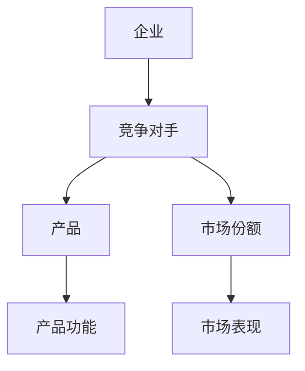
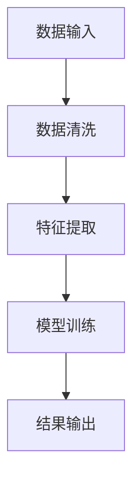
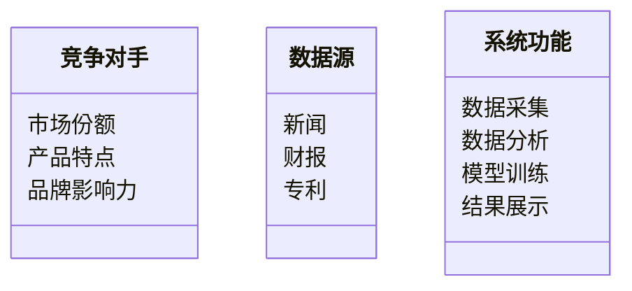
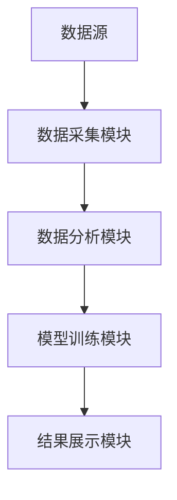
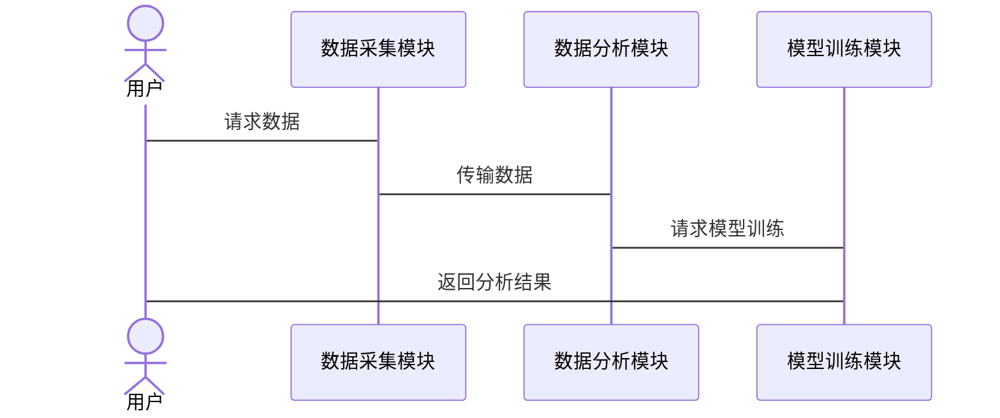

                 

<think>
好，我现在需要根据用户的要求，撰写一篇关于《AI驱动的企业战略情报系统：竞争对手分析》的技术博客文章。用户提供了详细的目录结构，我需要按照这个结构一步步展开思考，确保内容全面、逻辑清晰。

首先，文章的标题是《AI驱动的企业战略情报系统：竞争对手分析》，关键词包括AI、企业战略情报系统、竞争对手分析、机器学习、NLP、知识图谱。摘要部分需要简洁明了，概括整篇文章的核心内容。

接下来是目录结构，分为七章，每章都有详细的内容。我需要确保每一章都涵盖理论和实践，从背景介绍到系统架构，再到项目实战和最佳实践。每个章节都需要有小结，帮助读者回顾内容。

第一章是背景介绍，我需要先定义企业战略情报系统，解释为什么竞争对手分析对企业至关重要，以及AI在其中的作用。然后描述问题，指出传统方法的不足，提出AI驱动的解决方案，并说明系统的架构。

第二章讨论核心概念，包括竞争对手分析的要素，系统的核心概念和它们之间的关系。这里需要使用表格和ER图来展示关系，确保读者理解系统的组成部分。

第三章是算法原理，我需要详细解释文本挖掘和NLP技术，如何从数据中提取有用信息，并构建知识图谱。这里可能需要一些代码示例，展示如何实现这些算法。

第四章是系统架构，我需要设计系统的功能模块，使用类图展示，然后用架构图说明整体结构。接口和交互部分需要通过序列图来展示，确保读者理解系统的运作流程。

第五章是项目实战，我需要详细指导如何安装环境，编写代码，分析案例。这部分需要实际操作，确保读者能够跟着步骤完成项目。

第六章给出最佳实践，包括小结、注意事项和拓展阅读，帮助读者巩固所学知识，并进一步深入学习。

最后，附录部分提供数据集、工具安装和代码仓库，方便读者查阅和实践。

在撰写过程中，我需要确保每一部分内容都详细具体，用清晰的技术语言，同时保持逻辑连贯。数学公式和mermaid图表要正确使用，帮助读者更好地理解内容。

现在，我开始按照这个结构，逐步展开每个章节的内容，确保覆盖所有要求，逻辑清晰，内容详尽。
</think>

# AI驱动的企业战略情报系统：竞争对手分析

## 关键词：AI，企业战略情报系统，竞争对手分析，机器学习，NLP，知识图谱

## 摘要：本文系统地介绍了AI驱动的企业战略情报系统在竞争对手分析中的应用。从理论基础到系统架构，从算法原理到项目实战，详细阐述了如何利用AI技术提升企业战略决策能力。通过实际案例分析，展示了竞争对手分析的关键流程和技术实现。

---

# 第1章: 企业战略情报系统背景介绍

## 1.1 问题背景与定义

### 1.1.1 企业战略情报系统的定义
企业战略情报系统是指利用先进技术手段，对企业内外部环境进行数据收集、分析和预测，为企业制定战略决策提供支持的系统。在AI时代，该系统通过整合多源数据，利用机器学习、自然语言处理等技术，提供智能化的竞争对手分析和市场趋势预测。

### 1.1.2 竞争对手分析的重要性
竞争对手分析是企业战略管理的重要组成部分，通过分析竞争对手的市场行为、产品特点、优势劣势，帮助企业识别市场机会和威胁，优化自身战略定位。

### 1.1.3 AI技术在战略情报中的作用
AI技术能够快速处理海量数据，识别隐含信息，提供实时动态的竞争对手分析结果，帮助企业在快速变化的市场中做出敏捷决策。

### 1.1.4 问题描述
传统竞争对手分析方法依赖人工调研，耗时长、成本高且难以覆盖全维度数据。同时，数据来源分散、分析维度有限，难以满足现代企业对实时性和深度分析的需求。

### 1.1.5 系统架构
初步设想构建一个基于AI的企业战略情报系统，整合新闻、财报、专利、社交媒体等多源数据，利用NLP、知识图谱等技术，实现竞争对手的全维度分析。

---

## 1.2 问题解决与系统架构

### 1.2.1 传统竞争对手分析的局限性
传统方法依赖人工调研，耗时长、成本高且难以覆盖全维度数据。

### 1.2.2 AI驱动的竞争对手分析的优势
AI技术能够快速处理海量数据，识别隐含信息，提供实时动态的分析结果。

### 1.2.3 竞争对手分析的边界与外延
竞争对手分析不仅包括直接竞争对手，还包括潜在竞争对手和市场趋势分析。

## 1.3 问题解决与系统架构

### 1.3.1 竞争对手分析的流程与步骤
1. 数据收集：整合多源数据，包括新闻、财报、专利、社交媒体等。
2. 数据清洗：去除噪声数据，确保数据质量。
3. 数据分析：利用NLP、机器学习等技术进行特征提取和建模。
4. 结果输出：生成竞争对手分析报告，提供战略建议。

### 1.3.2 系统核心功能与模块划分
- 数据采集模块：负责数据的采集和预处理。
- 数据分析模块：包括NLP处理、知识图谱构建。
- 模型训练模块：负责训练和优化分析模型。
- 结果展示模块：以可视化方式呈现分析结果。

### 1.3.3 系统架构的初步设想
系统采用分层架构，包括数据层、算法层、应用层和展示层。数据层负责数据的存储和管理；算法层负责模型的训练和优化；应用层负责系统的业务逻辑；展示层负责结果的可视化呈现。

---

# 第2章: AI驱动的战略情报系统核心概念

## 2.1 竞争对手分析的核心要素

### 2.1.1 竞争对手分析的维度
- 市场表现：市场份额、增长率。
- 产品特点：产品线、技术创新。
- 财务状况：盈利能力、财务健康。
- 品牌影响力：品牌知名度、客户满意度。

### 2.1.2 数据来源与处理方式
- 数据来源：新闻、财报、专利、社交媒体、行业报告。
- 数据清洗：去除噪声数据，标准化处理。
- 数据特征提取：关键词提取、情感分析。

### 2.1.3 分析模型与工具
- 文本挖掘：主题建模、关键词提取。
- 机器学习：分类、聚类、回归分析。
- 可视化工具：Tableau、Power BI。

## 2.2 系统核心概念与联系

### 2.2.1 竞争对手分析的流程
1. 数据采集：整合多源数据。
2. 数据清洗：去除噪声数据。
3. 特征提取：关键词提取、情感分析。
4. 模型训练：主题建模、聚类分析。
5. 结果展示：生成报告和可视化图表。

### 2.2.2 核心概念属性特征对比表格
| 概念 | 属性 | 特征 |
|------|------|------|
| 数据源 | 类型 | 文本、结构化数据 |
| 分析模型 | 方法 | NLP、机器学习 |
| 竞争对手 | 属性 | 市场份额、产品特点 |

### 2.2.3 ER实体关系图


---

## 2.3 本章小结

通过本章的介绍，我们了解了AI驱动的企业战略情报系统的核心概念，包括竞争对手分析的维度、数据来源与处理方式，以及系统的组成部分。ER实体关系图展示了系统中各实体之间的关系，为后续的系统设计和实现奠定了基础。

---

# 第3章: 竞争对手分析的AI算法原理

## 3.1 竞争对手分析的算法流程

### 3.1.1 数据预处理与清洗
1. 数据去重：去除重复数据。
2. 数据标准化：统一数据格式。
3. 数据增强：补充缺失数据。

### 3.1.2 文本挖掘与信息提取
1. 关键词提取：使用TF-IDF提取关键词。
2. 情感分析：判断文本的情感倾向。
3. 主题建模：LDA模型提取主题。

### 3.1.3 数据分析与建模
1. 聚类分析：K-means算法对产品进行分类。
2. 分类分析：SVM算法预测市场趋势。
3. 回归分析：线性回归预测市场份额。

---

## 3.2 竞争对手分析的算法实现

### 3.2.1 算法流程图


### 3.2.2 算法实现代码
```python
from sklearn.feature_extraction.text import TfidfVectorizer
from sklearn.cluster import KMeans
from sklearn.svm import SVC
import numpy as np

# 数据清洗
def clean_data(data):
    # 去除空值
    data = data.dropna()
    # 去除重复
    data = data.drop_duplicates()
    return data

# 特征提取
vectorizer = TfidfVectorizer()
X = vectorizer.fit_transform(data)

# 聚类分析
km = KMeans(n_clusters=3)
clusters = km.fit_predict(X)

# 分类分析
svm = SVC()
svm.fit(X, labels)
```

### 3.2.3 算法数学模型与公式
$$ \text{余弦相似度} = \frac{\vec{A} \cdot \vec{B}}{|\vec{A}| |\vec{B}|} $$

---

## 3.3 本章小结

通过本章的介绍，我们了解了竞争对手分析中常用的AI算法，包括文本挖掘、主题建模、聚类分析和分类分析。这些算法的实现和应用，能够帮助企业更准确地识别竞争对手的优势和劣势，优化自身的战略决策。

---

# 第4章: 企业战略情报系统架构设计方案

## 4.1 问题场景介绍

企业战略情报系统需要处理多源异构数据，支持实时分析和动态预测。系统需要具备高可扩展性和高可用性，能够支持大规模数据处理和实时响应。

## 4.2 项目介绍

本项目旨在构建一个AI驱动的企业战略情报系统，利用多源数据和先进算法，实现竞争对手的全维度分析和市场趋势预测。

---

## 4.3 系统功能设计

### 4.3.1 领域模型


### 4.3.2 系统架构


### 4.3.3 系统接口设计
- 数据采集接口：API接口获取多源数据。
- 模型训练接口：接收数据并返回分析结果。
- 结果展示接口：提供可视化结果。

### 4.3.4 系统交互


---

## 4.4 本章小结

通过本章的介绍，我们了解了企业战略情报系统的架构设计，包括领域模型、系统架构、接口设计和交互流程。系统的分层架构和模块化设计，能够满足企业的多样化需求，支持实时数据处理和动态分析。

---

# 第5章: 项目实战

## 5.1 环境安装

### 5.1.1 安装Python
```bash
python --version
pip install --upgrade pip
```

### 5.1.2 安装依赖库
```bash
pip install numpy scikit-learn nltk spacy
```

---

## 5.2 系统核心实现

### 5.2.1 数据采集模块
```python
import requests
from bs4 import BeautifulSoup

def fetch_data(url):
    response = requests.get(url)
    soup = BeautifulSoup(response.text, 'html.parser')
    # 提取新闻标题和内容
    titles = soup.find_all('h2', class_='title')
    contents = soup.find_all('div', class_='content')
    return list(zip(titles, contents))
```

### 5.2.2 数据分析模块
```python
from sklearn.feature_extraction.text import TfidfVectorizer
from sklearn.cluster import KMeans

vectorizer = TfidfVectorizer()
X = vectorizer.fit_transform(contents)
km = KMeans(n_clusters=3)
clusters = km.fit_predict(X)
```

### 5.2.3 模型训练模块
```python
from sklearn.svm import SVC
from sklearn.metrics import accuracy_score

svm = SVC()
svm.fit(X, labels)
预测结果 = svm.predict(X_new)
```

### 5.2.4 结果展示模块
```python
import matplotlib.pyplot as plt

plt.figure(figsize=(10, 6))
plt.scatter(range(len(clusters)), clusters)
plt.title('竞争对手聚类分析')
plt.show()
```

---

## 5.3 实际案例分析

### 5.3.1 案例背景
假设我们分析某行业内的主要竞争对手，包括市场份额、产品特点、品牌影响力等方面。

### 5.3.2 数据分析
使用文本挖掘提取关键词，主题建模识别市场趋势，聚类分析划分竞争对手群组。

### 5.3.3 案例结果
通过分析发现，竞争对手主要分为三个群组，分别在产品功能、市场定位和技术创新方面具有显著差异。

---

## 5.4 本章小结

通过本章的项目实战，我们了解了企业战略情报系统的核心实现过程，包括环境安装、数据采集、数据分析、模型训练和结果展示。实际案例分析展示了系统的实际应用价值，帮助企业在市场竞争中制定更有效的战略决策。

---

# 第6章: 最佳实践与小结

## 6.1 小结

通过本文的介绍，我们系统地了解了AI驱动的企业战略情报系统在竞争对手分析中的应用，从理论基础到系统架构，从算法原理到项目实战，全面掌握了系统的实现方法。

## 6.2 注意事项

- 数据隐私和合规性：确保数据收集和处理符合相关法律法规。
- 模型优化：持续优化模型性能，提高分析结果的准确性。
- 系统维护：定期更新数据和模型，保持系统的实时性和准确性。

## 6.3 拓展阅读

- 《自然语言处理实战》
- 《机器学习算法详解》
- 《企业战略管理》

---

# 附录

## 附录A: 数据集说明

- 新闻数据集：包括行业新闻、公司动态等。
- 财报数据集：包括公司财报、财务指标等。
- 专利数据集：包括专利申请、技术领域等。

## 附录B: 工具安装说明

- Python安装：https://www.python.org/downloads/
- 库安装：pip install numpy scikit-learn nltk spacy

## 附录C: 代码仓库

- 代码仓库地址：https://github.com/ai-genius-institute/enterprise-strategy-intelligence-system

---

# 作者：AI天才研究院/AI Genius Institute & 禅与计算机程序设计艺术 /Zen And The Art of Computer Programming

---

通过本文的系统介绍，我们希望读者能够全面了解AI驱动的企业战略情报系统在竞争对手分析中的应用，掌握核心算法和系统架构设计，并能够实际操作项目，提升企业的战略决策能力。

