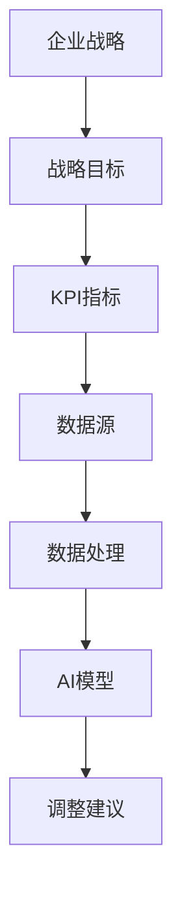
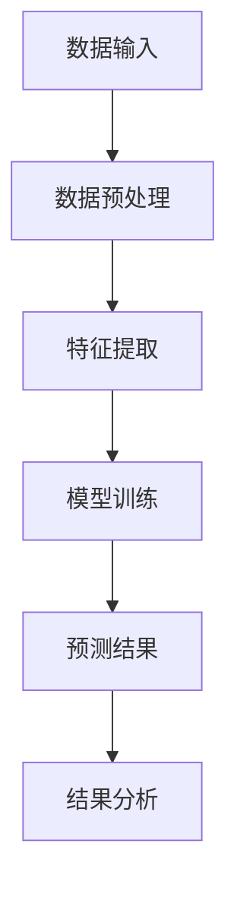
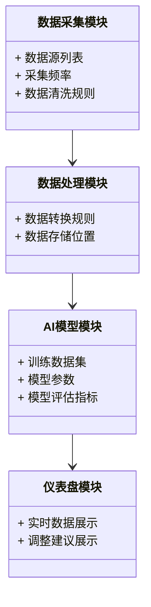
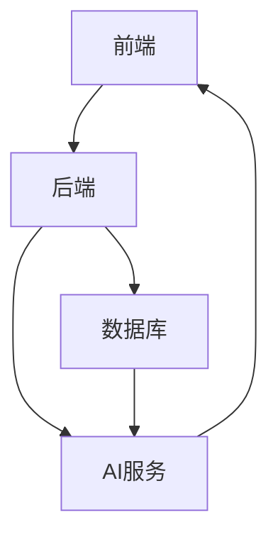
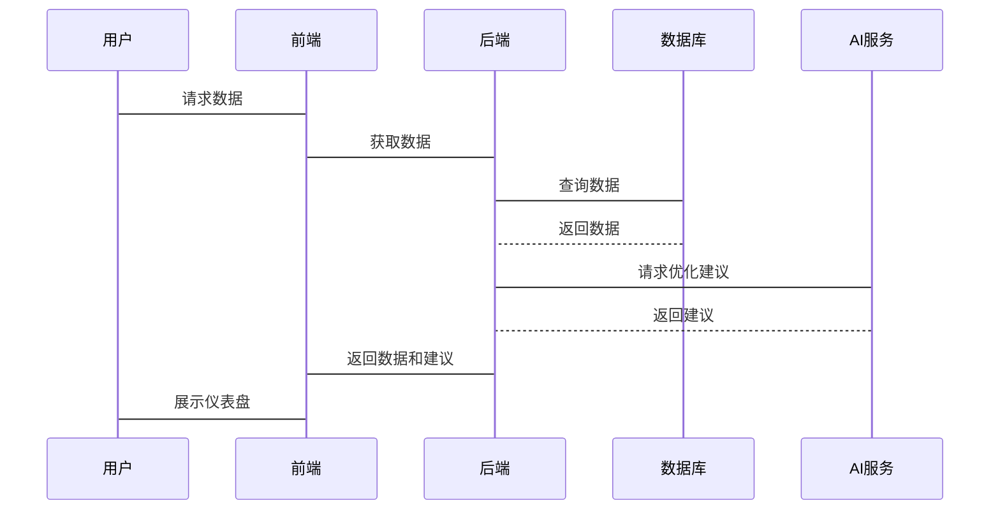

                 

<think>
好的，我现在需要帮用户撰写一篇关于《AI驱动的企业战略执行仪表盘：实时KPI追踪与自动调整》的技术博客文章。首先，我需要明确文章的结构和内容，确保符合用户的要求。

用户已经提供了一个详细的目录大纲，包括从背景介绍到项目实战，再到最佳实践的各个部分。我的任务是根据这个大纲，逐步展开每个章节的内容，确保每个部分都详细、准确，并且符合技术博客的风格。

首先，我会从第一部分开始，概述AI驱动的企业战略执行仪表盘。这里需要介绍问题背景、核心概念以及它们之间的关系。我需要解释为什么企业战略执行需要AI驱动的仪表盘，以及KPI追踪和调整的重要性。

接下来，我会深入讲解核心概念与联系，使用表格和Mermaid图来展示实体关系。这部分需要清晰地说明AI和KPI之间的相互作用，以及它们如何共同优化企业战略执行。

然后，我会进入算法原理部分，使用Mermaid流程图和Python代码来展示算法的工作流程。这部分需要详细解释机器学习模型如何预测和调整KPI，同时提供数学公式和代码示例，帮助读者理解技术细节。

在系统分析与架构设计部分，我需要介绍系统的功能模块、架构设计以及接口设计。这部分需要使用Mermaid图来展示系统架构和交互流程，确保读者能够清晰地理解系统的组成部分和协作方式。

项目实战部分，我会提供详细的安装步骤、代码实现和案例分析。这部分需要读者能够动手实践，理解如何将理论应用到实际中，并通过案例分析展示仪表盘的实际效果。

最后，我会总结最佳实践，包括小结、注意事项和拓展阅读，帮助读者巩固所学内容，并引导他们进一步学习相关知识。

在整个过程中，我需要确保语言简洁、逻辑清晰，并且每个部分都紧密联系，形成一个完整的知识体系。同时，我需要避免过于复杂的术语，确保文章易于理解，吸引更多的读者。

现在，我开始撰写每个章节的内容，确保每个部分都涵盖用户要求的要点，并且结构紧凑，内容详实。
</think>

# AI驱动的企业战略执行仪表盘：实时KPI追踪与自动调整

> 关键词：AI驱动、企业战略、KPI追踪、自动调整、仪表盘设计

> 摘要：本文探讨了AI在企业战略执行中的应用，重点介绍如何通过AI技术构建实时KPI追踪与自动调整的仪表盘，从而优化企业战略执行过程。

---

## 第一部分: AI驱动的企业战略执行仪表盘概述

## 第1章: 问题背景与核心概念

### 1.1 问题背景

#### 1.1.1 企业战略执行的痛点

现代企业在执行战略目标时，常常面临以下痛点：

- **复杂性**：企业战略涉及多部门协作，目标分解和执行过程中容易出现信息不对称和执行偏差。
- **延迟性**：传统的KPI追踪依赖定期报告，无法实现实时监控和快速响应。
- **数据孤岛**：企业内部数据分散在不同系统中，难以整合和分析，导致决策滞后。
- **人工干预**：KPI调整和优化通常需要大量人工分析，效率低且易出错。

#### 1.1.2 问题描述

企业战略执行的核心是确保各层级目标与整体战略保持一致。然而，传统的KPI追踪方法存在以下问题：

- 数据采集和处理效率低下。
- 缺乏实时监控能力，无法及时发现和解决问题。
- 人工调整KPI耗时且难以做到精准优化。

#### 1.1.3 问题解决方法

引入AI技术，构建实时KPI追踪与自动调整的仪表盘，可以有效解决上述问题。通过AI算法，企业能够实时监控KPI，自动识别异常，并提出优化建议。

#### 1.1.4 概念结构与核心要素

AI驱动的企业战略执行仪表盘由以下核心要素组成：

- **数据源**：企业各个业务系统中的数据，如销售数据、财务数据等。
- **数据处理**：对数据进行清洗、转换和整合。
- **AI模型**：基于机器学习的算法，用于预测和优化KPI。
- **仪表盘界面**：实时展示KPI状态，并提供调整建议。

### 1.2 核心概念与定义

#### 1.2.1 AI驱动的定义

AI驱动是指利用人工智能技术（如机器学习、自然语言处理等）来自动化处理数据、分析模式并做出决策。

#### 1.2.2 企业战略执行仪表盘的定义

企业战略执行仪表盘是一种可视化工具，用于实时监控和管理企业战略执行过程中的关键绩效指标（KPI）。

#### 1.2.3 实时KPI追踪的定义

实时KPI追踪是指通过AI技术，对企业的关键绩效指标进行实时数据采集、分析和监控。

#### 1.2.4 自动调整的定义

自动调整是指AI系统根据实时KPI数据，自动识别问题并提出优化建议，以确保战略目标的实现。

### 1.3 核心概念之间的关系

#### 1.3.1 问题背景与核心概念的联系

企业战略执行的痛点（如复杂性、延迟性）是引入AI驱动仪表盘的主要原因。通过实时KPI追踪和自动调整，企业能够更高效地解决问题。

#### 1.3.2 AI与KPI的关系

AI技术能够通过分析KPI数据，识别趋势和异常，并提出优化建议，从而提升KPI的管理水平。

#### 1.3.3 仪表盘在战略执行中的作用

仪表盘作为可视化工具，能够将复杂的KPI数据直观展示，帮助管理者快速做出决策。

---

## 第2章: 核心概念与联系

### 2.1 AI与KPI的核心原理

#### 2.1.1 AI算法的基本原理

AI算法通过学习数据中的模式，能够预测未来的趋势和结果。例如，机器学习算法可以通过历史数据，预测未来的KPI值。

#### 2.1.2 KPI的核心特征

KPI的核心特征包括：

- **可测量性**：能够通过数据量化。
- **相关性**：与企业战略目标密切相关。
- **时间性**：需要在一定时间内完成。

#### 2.1.3 AI驱动KPI优化的机制

AI通过分析KPI数据，识别影响KPI的关键因素，并提出优化建议。例如，通过回归分析，识别影响销售额的关键因素。

### 2.2 核心概念的对比分析

#### 2.2.1 AI与传统数据分析的对比

| 特性          | AI驱动的数据分析 | 传统数据分析 |
|---------------|------------------|-------------|
| 数据处理      | 自动化、实时性   | 手动、周期性 |
| 模型复杂性     | 高               | 低           |
| 决策支持       | 自动优化建议     | 人工分析     |

#### 2.2.2 实时KPI与传统KPI的对比

| 特性          | 实时KPI          | 传统KPI      |
|---------------|------------------|-------------|
| 数据采集频率  | 实时             | 定期         |
| 响应速度       | 快               | 慢           |
| 调整能力       | 自动             | 人工         |

#### 2.2.3 自动调整与人工调整的对比

| 特性          | 自动调整          | 人工调整      |
|---------------|------------------|-------------|
| 调整速度       | 快               | 慢           |
| 精准性         | 高               | 中           |
| 资源消耗       | 低               | 高           |

### 2.3 ER实体关系图



---

## 第3章: 算法原理讲解

### 3.1 算法原理概述

#### 3.1.1 机器学习算法的基本原理

机器学习算法通过学习数据中的模式，能够预测未来的趋势和结果。例如，线性回归算法可以用于预测KPI的趋势。

#### 3.1.2 监督学习与无监督学习的区别

| 特性          | 监督学习          | 无监督学习     |
|---------------|------------------|-------------|
| 数据类型       | 标签数据          | 无标签数据    |
| 任务类型       | 分类、回归        | 聚类、降维     |
| 应用场景       | 预测、分类        | 数据挖掘       |

#### 3.1.3 算法在KPI追踪中的应用

AI算法可以通过分析历史KPI数据，预测未来的KPI值，并识别影响KPI的关键因素。

### 3.2 算法流程图



### 3.3 算法实现代码

```python
# 示例代码
import pandas as pd
from sklearn.linear_model import LinearRegression

# 数据加载
data = pd.read_csv('kpi_data.csv')

# 特征与目标变量分离
X = data[['sales', 'profit']]
y = data['revenue']

# 模型训练
model = LinearRegression()
model.fit(X, y)

# 预测结果
predicted_revenue = model.predict(X)
print(predicted_revenue)
```

### 3.4 算法原理的数学模型

线性回归的数学模型可以表示为：

$$ y = \beta_0 + \beta_1 x_1 + \beta_2 x_2 + \epsilon $$

其中，$y$ 是目标变量，$x_1$ 和 $x_2$ 是特征变量，$\beta_0$ 是截距，$\beta_1$ 和 $\beta_2$ 是回归系数，$\epsilon$ 是误差项。

---

## 第4章: 系统分析与架构设计

### 4.1 系统功能设计

#### 4.1.1 功能模块

- 数据采集模块：实时采集企业各系统的数据。
- 数据处理模块：清洗、转换和整合数据。
- AI模型模块：训练和部署机器学习模型。
- 仪表盘模块：展示实时KPI数据和优化建议。

#### 4.1.2 领域模型类图



### 4.2 系统架构设计

#### 4.2.1 系统架构图



#### 4.2.2 接口设计

- 前端接口：用于展示仪表盘数据和用户交互。
- 后端接口：用于处理数据和调用AI服务。
- 数据库接口：用于存储和检索数据。
- AI服务接口：用于调用机器学习模型。

#### 4.2.3 系统交互流程图



---

## 第5章: 项目实战

### 5.1 环境安装

#### 5.1.1 安装Python

```bash
# 示例代码
python --version
```

#### 5.1.2 安装依赖库

```bash
pip install pandas scikit-learn matplotlib
```

### 5.2 系统核心实现

#### 5.2.1 数据采集与处理

```python
import pandas as pd

# 数据加载
data = pd.read_csv('kpi_data.csv')

# 数据清洗
data = data.dropna()
```

#### 5.2.2 AI模型实现

```python
from sklearn.linear_model import LinearRegression

# 模型训练
model = LinearRegression()
model.fit(X_train, y_train)

# 模型预测
y_pred = model.predict(X_test)
```

### 5.3 代码应用解读

#### 5.3.1 数据展示

```python
import matplotlib.pyplot as plt

plt.plot(y_true, y_pred)
plt.xlabel('True Values')
plt.ylabel('Predictions')
plt.show()
```

### 5.4 案例分析与解读

#### 5.4.1 案例分析

假设某企业希望优化销售额KPI，通过AI驱动的仪表盘实时监控销售数据，并根据模型预测提出优化建议。

#### 5.4.2 详细讲解

通过分析销售数据，AI模型识别出影响销售额的关键因素（如广告投入、产品价格等），并提出优化建议（如增加广告投入、调整产品价格等）。

### 5.5 项目小结

通过本项目，读者可以掌握如何利用AI技术构建实时KPI追踪与自动调整的仪表盘，并能够实际应用于企业战略执行中。

---

## 第6章: 最佳实践

### 6.1 小结

本文详细介绍了AI驱动的企业战略执行仪表盘的核心概念、算法原理、系统架构设计以及项目实战。通过AI技术，企业能够实现KPI的实时监控和自动调整，从而优化战略执行过程。

### 6.2 注意事项

- 数据质量是关键，需确保数据的准确性和完整性。
- 模型选择需根据具体业务需求，选择合适的算法。
- 系统设计需考虑可扩展性和可维护性。

### 6.3 拓展阅读

- 《机器学习实战》
- 《深度学习入门》
- 《企业级数据分析与可视化》

---

## 作者：AI天才研究院/AI Genius Institute & 禅与计算机程序设计艺术 /Zen And The Art of Computer Programming

---

通过以上结构，我们可以看到，AI驱动的企业战略执行仪表盘在实时KPI追踪与自动调整方面具有巨大的潜力。企业可以通过这种技术手段，显著提升战略执行效率和效果。

