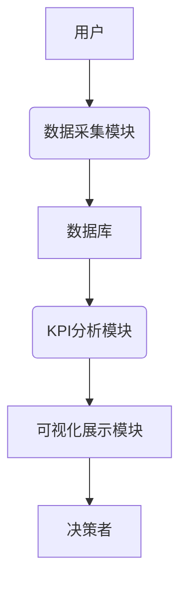

                 


# AI驱动的企业战略执行仪表盘：实时KPI追踪与调整

## 关键词：AI，企业战略，KPI，实时追踪，数据可视化，机器学习

## 摘要：本文深入探讨AI如何驱动企业战略执行仪表盘的实时KPI追踪与调整。通过分析背景、核心概念、算法原理、系统架构、项目实战及最佳实践，为读者提供全面的技术指导。

---

# 第一部分: 背景与概述

## 第1章: 问题背景与挑战

### 1.1 企业战略执行的痛点

#### 1.1.1 传统KPI管理的局限性
传统的KPI管理依赖定期报告，存在数据滞后、信息孤岛和难以实时调整的问题。

#### 1.1.2 数据孤岛与信息滞后
数据分散在不同部门和系统中，导致信息无法及时整合，影响决策。

#### 1.1.3 战略执行中的实时反馈需求
企业需要实时了解战略执行情况，以便快速调整。

### 1.2 AI驱动的解决方案
AI技术通过实时数据分析和智能调整，提升KPI管理的效率和准确性。

---

## 第2章: 核心概念与框架

### 2.1 仪表盘的核心要素

#### 2.1.1 数据源与采集方式
多源数据的采集和整合是实时KPI追踪的基础。

#### 2.1.2 KPI指标体系的构建
构建合理的指标体系，确保数据的全面性。

#### 2.1.3 可视化展示方式
直观的可视化工具帮助用户快速理解数据。

### 2.2 AI算法与实时反馈机制

#### 2.2.1 机器学习模型的应用
AI算法用于预测和优化KPI。

#### 2.2.2 实时数据处理流程
实时数据流处理是关键。

#### 2.2.3 智能调整规则的制定
基于AI的规则引擎实现动态调整。

---

# 第二部分: 技术基础与算法原理

## 第4章: 机器学习模型与算法

### 4.1 用于KPI预测的回归分析

#### 线性回归模型
使用Python实现线性回归，预测KPI趋势。

```python
import numpy as np
from sklearn.linear_model import LinearRegression

X = np.array([i for i in range(10)]).reshape(-1, 1)
y = np.array([2*i + 1 for i in range(10)])

model = LinearRegression()
model.fit(X, y)
print("预测的KPI值为:", model.predict(X))
```

### 4.2 时间序列分析

#### ARIMA模型
用于时间序列预测，代码如下：

```python
from statsmodels.tsa.arima_model import ARIMA

data = [1, 2, 3, 4, 5, 6, 7, 8, 9, 10]
model = ARIMA(data, order=(1, 1, 1))
model_fit = model.fit()
print("预测结果:", model_fit.forecast(steps=3))
```

### 4.3 实时数据处理流程

#### 数据预处理
清洗和转换数据，确保模型输入正确。

#### 模型训练
使用实时数据训练模型，保持模型的更新。

---

# 第三部分: 系统架构与设计

## 第5章: 系统架构设计

### 5.1 功能模块划分

#### 数据采集模块
负责数据的实时采集和预处理。

#### KPI分析模块
执行数据分析和预测。

#### 可视化展示模块
将分析结果以图表形式展示。

### 5.2 系统架构图



### 5.3 数据流设计

```mermaid
flowchart TD
    start --> 数据采集
    数据采集 --> 数据预处理
    数据预处理 --> 模型训练
    模型训练 --> KPI预测
    KPI预测 --> 可视化展示
    可视化展示 --> 结果反馈
    结果反馈 --> end
```

---

# 第四部分: 项目实战

## 第6章: 项目实战

### 6.1 环境搭建

#### 安装必要的库
使用Anaconda和Jupyter Notebook环境。

### 6.2 核心代码实现

#### 数据处理代码
```python
import pandas as pd
from sklearn.preprocessing import StandardScaler

data = pd.read_csv('data.csv')
scaler = StandardScaler()
scaled_data = scaler.fit_transform(data)
```

#### 模型训练代码
```python
from sklearn.ensemble import RandomForestRegressor

model = RandomForestRegressor(n_estimators=100)
model.fit(scaled_data, target)
```

### 6.3 测试与优化

#### 模型评估
使用交叉验证评估模型性能。

### 6.4 部署与集成

#### 在Flask中部署API
```python
from flask import Flask, jsonify

app = Flask(__name__)
model = ...

@app.route('/predict', methods=['POST'])
def predict():
    # 处理请求并返回预测结果
    return jsonify(result)
```

---

# 第五部分: 最佳实践与未来展望

## 第7章: 最佳实践

### 7.1 数据质量管理

#### 数据清洗的重要性
确保数据的准确性和完整性。

### 7.2 模型维护

#### 定期更新模型
防止模型性能下降。

## 第8章: 未来展望

### 8.1 更智能的反馈机制

#### 自适应调整规则
提升系统的自适应能力。

### 8.2 新兴技术的融合

#### 区块链与AI的结合
增强数据安全性和透明度。

---

# 作者

作者：AI天才研究院 & 禅与计算机程序设计艺术

---

通过以上结构，读者可以系统地了解AI驱动的企业战略执行仪表盘的设计与实现，从理论到实践，全面掌握相关技术。

