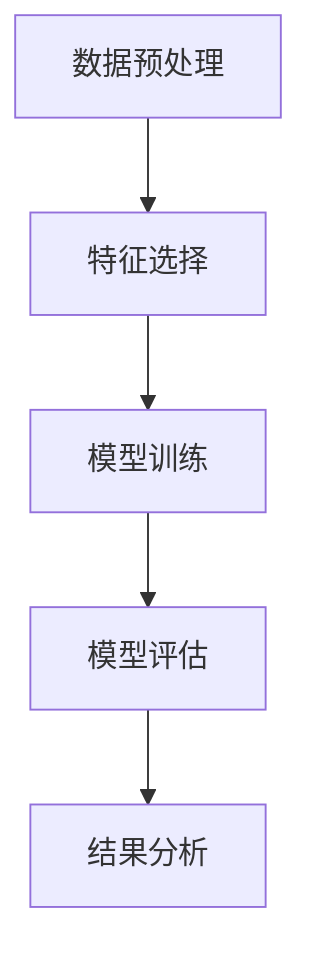
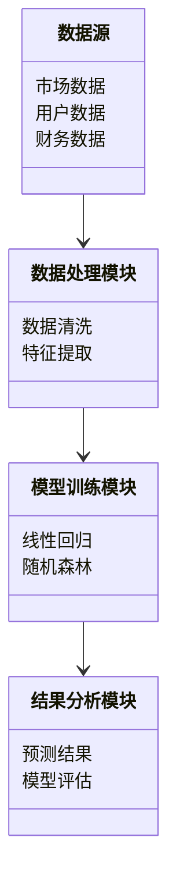
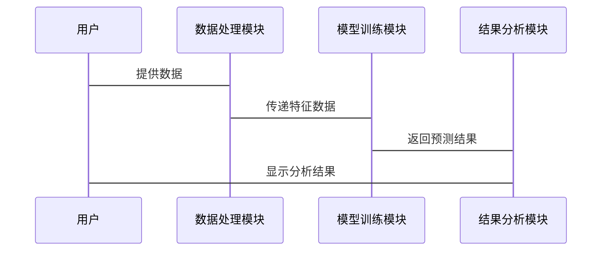

                 


# AI驱动的企业战略规划：大数据分析与预测性建模

---

## 关键词：
AI, 企业战略规划, 大数据分析, 预测性建模, 机器学习, 数据驱动决策, 业务价值

---

## 摘要：
随着数据科学和人工智能技术的快速发展，企业战略规划正在经历一场深刻的变革。传统的基于经验和直觉的战略制定方法正在被数据驱动的决策所取代。本文将探讨如何利用AI和大数据分析技术，构建预测性建模系统，帮助企业制定更加科学、精准和前瞻性的战略规划。通过分析大数据中的潜在模式和趋势，企业能够更有效地识别机会和风险，从而在竞争激烈的市场中保持领先地位。

---

# 第1章: AI驱动的企业战略规划背景

## 1.1 问题背景与描述

### 1.1.1 传统企业战略规划的局限性
传统的企业战略规划主要依赖于管理者的经验和市场调研数据。这种方法虽然有一定的参考价值，但存在以下问题：
- 数据来源有限，难以捕捉市场中的潜在机会和风险。
- 分析方法单一，难以从海量数据中提取有价值的信息。
- 预测结果不够精准，难以应对复杂多变的市场环境。

### 1.1.2 数据驱动决策的兴起
随着大数据技术的普及和AI算法的进步，企业开始利用海量数据和先进算法进行决策。数据驱动决策的优势在于：
- 能够从海量数据中提取有价值的洞察。
- 可以通过历史数据预测未来趋势。
- 能够提供实时、动态的决策支持。

### 1.1.3 AI在企业战略规划中的作用
AI技术通过以下方式推动企业战略规划的升级：
- 自动化数据处理和分析，提高效率。
- 利用机器学习算法发现数据中的潜在模式。
- 构建预测模型，帮助企业在未来趋势中做出前瞻性决策。

## 1.2 问题解决与边界

### 1.2.1 AI如何解决企业战略规划问题
AI通过以下方式解决传统战略规划中的问题：
- 提供更全面的数据支持。
- 帮助发现潜在市场机会和风险。
- 通过预测模型优化战略决策。

### 1.2.2 问题的边界与外延
本章主要探讨AI在企业战略规划中的应用，具体包括：
- 数据收集、处理和分析。
- 预测模型的构建与优化。
- 模型结果在战略规划中的应用。

### 1.2.3 核心要素与组成
AI驱动的企业战略规划的核心要素包括：
- 数据来源：市场数据、用户行为数据、财务数据等。
- 分析方法：机器学习、统计分析、数据挖掘等。
- 预测模型：回归模型、决策树、随机森林等。

## 1.3 本章小结
本章介绍了AI在企业战略规划中的背景、作用以及核心要素，为后续章节的分析奠定了基础。

---

# 第2章: 核心概念与联系

## 2.1 核心概念原理

### 2.1.1 AI的基本原理
人工智能通过模拟人类学习和推理过程，利用算法从数据中提取知识。核心算法包括机器学习、深度学习和自然语言处理。

### 2.1.2 大数据分析的核心概念
大数据分析是指对海量、多样化数据进行处理、分析和可视化的过程。核心步骤包括数据清洗、特征提取、数据分析和数据可视化。

### 2.1.3 预测性建模的原理
预测性建模是利用历史数据训练模型，预测未来趋势的过程。模型类型包括回归模型、分类模型和聚类模型。

## 2.2 概念对比表格

| 概念                | 描述                                                                 |
|---------------------|----------------------------------------------------------------------|
| AI                  | 模拟人类智能的技术，包括学习、推理和决策。                             |
| 大数据分析          | 对海量数据进行处理和分析，提取有价值的信息。                           |
| 预测性建模          | 利用历史数据训练模型，预测未来趋势。                                   |

## 2.3 ER实体关系图
```mermaid
er
  entity 企业战略规划 {
    <战略目标>
    <关键绩效指标>
    <市场数据>
  }
  entity 预测模型 {
    <预测变量>
    <目标变量>
    <数据特征>
  }
  relationship 关联关系 {
    企业战略规划 -- 预测模型
  }
```

## 2.4 本章小结
本章详细介绍了AI、大数据分析和预测性建模的核心概念及其相互关系，为后续章节的分析提供了理论基础。

---

# 第3章: 算法原理与实现

## 3.1 算法原理

### 3.1.1 线性回归
线性回归是一种简单但强大的预测模型，适用于回归问题。模型公式为：
$$ y = mx + b $$
其中，$m$是斜率，$b$是截距。

### 3.1.2 决策树
决策树是一种基于树状结构的分类模型，适用于分类和回归问题。模型通过特征分裂构建决策树，最终预测目标变量。

### 3.1.3 随机森林
随机森林是一种基于决策树的集成模型，通过组合多个决策树的结果提高模型的准确性和稳定性。

## 3.2 算法流程图


## 3.3 Python代码实现

### 3.3.1 线性回归示例
```python
import pandas as pd
from sklearn.linear_model import LinearRegression

# 示例数据加载
data = pd.read_csv('strategic_data.csv')

# 特征与目标变量分离
X = data[['revenue', 'market_size']]
y = data['profit']

# 模型训练
model = LinearRegression()
model.fit(X, y)

# 模型预测
print(model.predict(X))
```

### 3.3.2 随机森林示例
```python
from sklearn.ensemble import RandomForestRegressor

# 模型训练
rf_model = RandomForestRegressor(n_estimators=100)
rf_model.fit(X, y)

# 模型预测
print(rf_model.predict(X))
```

## 3.4 本章小结
本章详细讲解了AI驱动企业战略规划中的核心算法及其实现方法，为后续章节的系统设计和项目实战提供了技术支持。

---

# 第4章: 系统分析与架构设计

## 4.1 问题场景介绍
企业需要构建一个基于AI的预测性建模系统，用于支持战略规划。系统需要处理海量数据，构建多个预测模型，并提供可视化结果。

## 4.2 系统功能设计

### 4.2.1 领域模型


### 4.2.2 系统架构设计


## 4.3 接口与交互流程

### 4.3.1 系统交互流程


## 4.4 本章小结
本章详细描述了AI驱动的企业战略规划系统的架构设计和功能模块，为项目的实施提供了明确的方向。

---

# 第5章: 项目实战

## 5.1 环境安装与配置

### 5.1.1 安装Python和相关库
```bash
pip install numpy pandas scikit-learn matplotlib
```

## 5.2 核心代码实现

### 5.2.1 数据预处理
```python
import pandas as pd

data = pd.read_csv('strategic_data.csv')
data = data.dropna()
data = pd.get_dummies(data)
```

### 5.2.2 模型训练与评估
```python
from sklearn.model_selection import train_test_split
from sklearn.metrics import mean_squared_error

X_train, X_test, y_train, y_test = train_test_split(X, y, test_size=0.2)
model = LinearRegression()
model.fit(X_train, y_train)
y_pred = model.predict(X_test)
print(mean_squared_error(y_test, y_pred))
```

## 5.3 案例分析与结果解读
通过实际案例分析，展示模型在战略规划中的应用价值。例如，预测市场需求变化，优化资源配置。

## 5.4 本章小结
本章通过实际项目展示了AI驱动的企业战略规划系统的实现过程，验证了系统的可行性和实用性。

---

# 第6章: 最佳实践与注意事项

## 6.1 最佳实践

### 6.1.1 数据质量管理
确保数据的准确性和完整性，避免数据偏差影响模型结果。

### 6.1.2 模型选择与优化
根据具体业务需求选择合适的模型，并通过参数调优和模型集成提高预测精度。

### 6.1.3 结果可视化与解释
通过数据可视化工具将模型结果以直观的方式呈现，帮助决策者理解和应用。

## 6.2 小结与注意事项
- 数据质量和模型选择直接影响系统性能。
- 模型解释性和可维护性是系统长期运行的关键。
- 持续优化和更新模型以适应市场变化。

---

# 附录

## 附录A: 工具安装与配置
列出所需工具的安装命令和配置方法。

## 附录B: 术语表
解释文章中涉及的专业术语。

## 附录C: 参考文献
列出文章中引用的文献和资料。

---

# 作者：AI天才研究院 & 禅与计算机程序设计艺术

---

以上是《AI驱动的企业战略规划：大数据分析与预测性建模》的技术博客文章大纲和内容。通过逐步分析和详细讲解，本文为企业提供了利用AI技术优化战略规划的思路和方法，帮助企业更好地应对复杂多变的市场环境。

