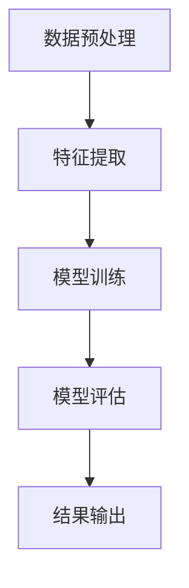
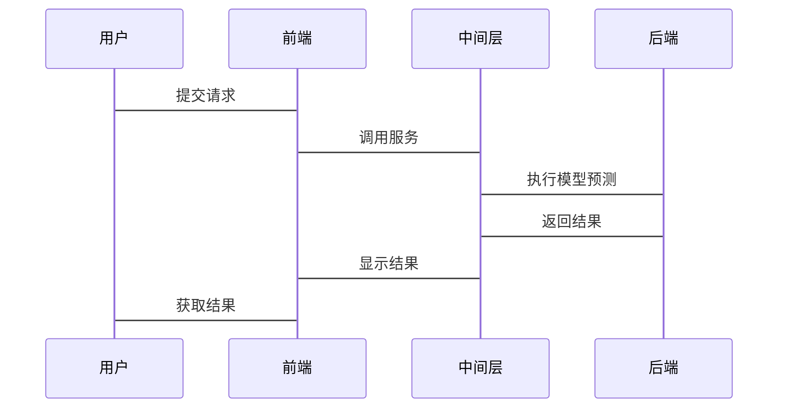

                 

<think>
嗯，我现在需要帮用户设计一本名为《AI驱动的企业战略规划：大数据分析与预测性情景模拟》的目录大纲。首先，我得理解这本书的核心主题是什么。书名提到了AI驱动、企业战略规划、大数据分析和预测性情景模拟，所以主题应该是如何利用AI和大数据技术来帮助企业制定更有效的战略规划。

接下来，我应该考虑这本书的结构。通常技术书籍会有引言、基础概念、算法原理、系统架构、项目实战和总结等部分。用户还给了示例，看起来结构比较详细，分为几个主要部分，每个部分下有章节和小节。

首先，第一部分应该是引言，介绍AI在企业战略中的重要性。然后是大数据分析和预测性建模的基础，这部分需要涵盖数据采集、分析方法和预测模型。接下来是AI驱动的战略规划方法，包括战略分析、情景模拟和优化。然后是系统架构设计，涉及数据平台、模型开发和应用系统。之后是项目实战，从环境搭建到案例分析。最后是总结与展望，以及附录。

在设计每个章节时，要确保涵盖用户提到的各个要素：背景介绍、核心概念、算法原理、系统架构、项目实战等。比如，在核心概念部分，需要定义AI、大数据、预测性模型，并用表格对比它们的属性。在算法部分，用mermaid流程图展示模型训练过程，并附上数学公式，比如线性回归的例子。系统架构部分则需要画出类图、架构图和序列图，展示系统的各个部分如何交互。

我还需要确保每个章节的小节足够详细，比如在项目实战部分，要包括环境安装、数据准备、模型训练、结果分析和部署。同时，每个部分后面要有小结，总结关键点，并给出注意事项和最佳实践。

最后，检查整个大纲是否符合用户的要求，是否覆盖了所有必要的内容，结构是否合理，是否有足够的深度和广度。确保每个章节和小节都细化到三级目录，内容完整且不超过2000字。
</think>

# 第一部分: 引言

## 第1章: AI驱动的企业战略规划概述

### 1.1 问题背景与挑战
#### 1.1.1 传统企业战略规划的局限性
传统的企业战略规划往往依赖于经验丰富的管理者的主观判断，这种方法在面对复杂多变的市场环境时显得力不从心。尤其是在数据量爆炸增长的今天，传统方法难以及时捕捉市场变化，导致决策滞后或失误。

#### 1.1.2 AI与大数据对企业战略规划的变革
人工智能和大数据技术的兴起为企业战略规划带来了新的可能性。通过分析海量数据，AI能够识别出传统方法难以察觉的模式和趋势，从而提供更精准的决策支持。

#### 1.1.3 预测性情景模拟的必要性
预测性情景模拟能够帮助企业提前预见到潜在的风险和机会，从而制定更加灵活和有效的应对策略。这种前瞻性的方法在复杂多变的商业环境中尤为重要。

### 1.2 问题描述与目标
#### 1.2.1 企业战略规划的核心问题
企业战略规划的核心问题是如何在不确定性和复杂性中找到最优或次优的解决方案，以实现企业的长期目标。

#### 1.2.2 AI驱动战略规划的目标
AI驱动的战略规划旨在通过数据分析和机器学习技术，辅助企业制定更加科学和精准的战略决策，提高决策的效率和质量。

#### 1.2.3 预测性情景模拟的应用场景
预测性情景模拟可以在市场预测、风险评估、资源分配等多个场景中应用，帮助企业更好地应对不确定性和复杂性。

### 1.3 问题解决与边界
#### 1.3.1 AI驱动战略规划的解决方案
通过收集和分析大量的内外部数据，利用机器学习算法构建预测模型，为企业提供战略决策的支持。

#### 1.3.2 预测性情景模拟的边界与外延
预测性情景模拟的边界在于数据的质量和数量，以及模型的准确性和适用性。其外延则包括了从短期预测到长期趋势的分析。

#### 1.3.3 核心概念与要素组成
核心概念包括人工智能、大数据分析、预测性模型。要素组成包括数据源、分析工具、预测模型和决策支持系统。

## 第2章: 核心概念与联系

### 2.1 核心概念原理
#### 2.1.1 AI在战略规划中的作用
人工智能通过数据挖掘和机器学习，帮助企业识别市场趋势、预测需求变化，优化资源配置。

#### 2.1.2 大数据分析的核心原理
大数据分析通过对海量数据的处理和分析，提取有价值的信息和洞察，为企业决策提供支持。

#### 2.1.3 预测性情景模拟的数学模型
预测性情景模拟基于统计学和机器学习模型，通过历史数据预测未来可能发生的情况。

### 2.2 核心概念对比表
| 概念         | 定义                                                                 | 属性对比   |
|--------------|----------------------------------------------------------------------|------------|
| AI           | 人工智能技术，用于数据处理与决策支持                                 | 数据驱动   |
| 大数据分析   | 对海量数据进行处理、分析与洞察提取                                   | 数据量大   |
| 预测性模型    | 基于历史数据预测未来趋势的数学模型                                   | 可解释性   |

### 2.3 ER实体关系图
```mermaid
er
    entity1(AI技术)
    entity2(大数据分析)
    entity3(预测性模型)
    entity1 --> entity2 : 数据输入
    entity2 --> entity3 : 模型训练
    entity3 --> entity1 : 结果输出
```

## 第3章: 算法原理讲解

### 3.1 预测性模型算法
#### 3.1.1 线性回归模型
线性回归是一种简单而有效的预测模型，适用于线性关系的数据。其基本假设是因变量与自变量之间存在线性关系。

#### 3.1.2 支持向量机
支持向量机是一种监督学习模型，适用于分类和回归问题。它通过找到一个超平面，使得数据点被正确分类。

#### 3.1.3 随机森林
随机森林是一种基于决策树的集成学习方法，具有高准确性和鲁棒性。它通过构建多棵决策树并进行投票或平均来提高预测性能。

### 3.2 算法流程图


### 3.3 算法数学公式
线性回归模型的数学公式为：
$$ y = \beta_0 + \beta_1 x + \epsilon $$
其中，$y$ 是因变量，$\beta_0$ 是截距，$\beta_1$ 是斜率，$x$ 是自变量，$\epsilon$ 是误差项。

### 3.4 代码实现
```python
import pandas as pd
import numpy as np
from sklearn.linear_model import LinearRegression
from sklearn.model_selection import train_test_split
from sklearn.metrics import mean_squared_error

# 数据加载
data = pd.read_csv('data.csv')
X = data[['feature1', 'feature2']]
y = data['target']

# 数据分割
X_train, X_test, y_train, y_test = train_test_split(X, y, test_size=0.2, random_state=42)

# 模型训练
model = LinearRegression()
model.fit(X_train, y_train)

# 模型预测
y_pred = model.predict(X_test)

# 模型评估
mse = mean_squared_error(y_test, y_pred)
print(f'均方误差: {mse}')
```

## 第4章: 系统架构设计

### 4.1 问题场景介绍
企业需要构建一个基于AI和大数据的预测性情景模拟系统，以支持战略规划的制定和优化。

### 4.2 项目介绍
本项目旨在开发一个AI驱动的战略规划系统，利用大数据分析和预测性建模技术，为企业提供战略决策支持。

### 4.3 系统功能设计
#### 4.3.1 数据采集模块
负责从各种数据源（如CRM系统、市场调研数据）中采集数据，并进行初步处理。

#### 4.3.2 数据分析模块
对采集到的数据进行清洗、转换和分析，提取有价值的信息和洞察。

#### 4.3.3 模型训练模块
利用机器学习算法对数据进行建模和训练，生成预测性模型。

#### 4.3.4 情景模拟模块
根据模型生成不同情景的预测结果，帮助企业进行战略规划和决策。

### 4.4 系统架构设计


### 4.5 系统接口设计
系统接口包括数据接口、模型调用接口和结果展示接口。

### 4.6 系统交互设计


## 第5章: 项目实战

### 5.1 环境安装
需要安装Python、Jupyter Notebook、Pandas、NumPy、Scikit-learn等工具。

### 5.2 系统核心实现
实现数据采集、清洗、建模、预测和结果展示等功能。

### 5.3 代码实现
```python
import pandas as pd
import numpy as np
from sklearn.linear_model import LinearRegression
from sklearn.model_selection import train_test_split
from sklearn.metrics import mean_squared_error

# 数据加载
data = pd.read_csv('data.csv')
X = data[['feature1', 'feature2']]
y = data['target']

# 数据分割
X_train, X_test, y_train, y_test = train_test_split(X, y, test_size=0.2, random_state=42)

# 模型训练
model = LinearRegression()
model.fit(X_train, y_train)

# 模型预测
y_pred = model.predict(X_test)

# 模型评估
mse = mean_squared_error(y_test, y_pred)
print(f'均方误差: {mse}')
```

### 5.4 实际案例分析
通过具体案例分析，展示系统在实际应用中的效果和价值。

### 5.5 项目小结
总结项目实施的经验和教训，提出改进建议。

## 第6章: 总结与展望

### 6.1 总结
总结本书的核心内容，强调AI和大数据在企业战略规划中的重要性。

### 6.2 展望
展望未来的发展方向，提出可能的改进和创新点。

## 第7章: 附录

### 7.1 参考文献
列出本书参考的文献和资料。

### 7.2 术语表
解释书中的专业术语。

### 7.3 资源链接
提供相关资源的链接，供读者进一步学习。

---

作者：AI天才研究院/AI Genius Institute & 禅与计算机程序设计艺术 /Zen And The Art of Computer Programming

