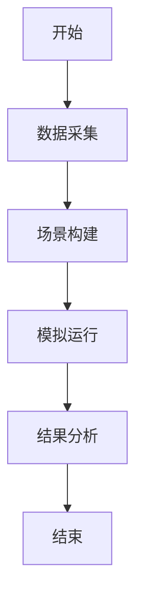
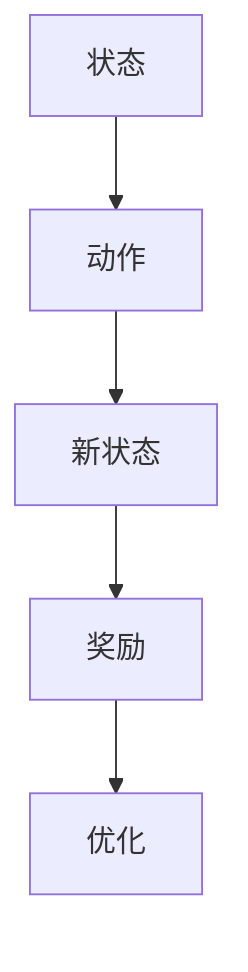
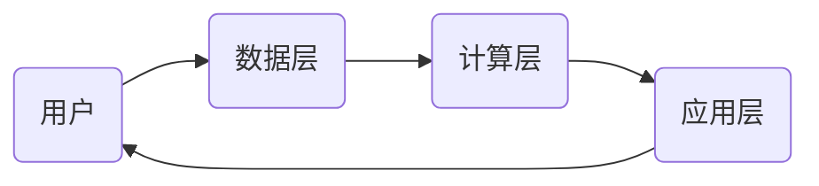
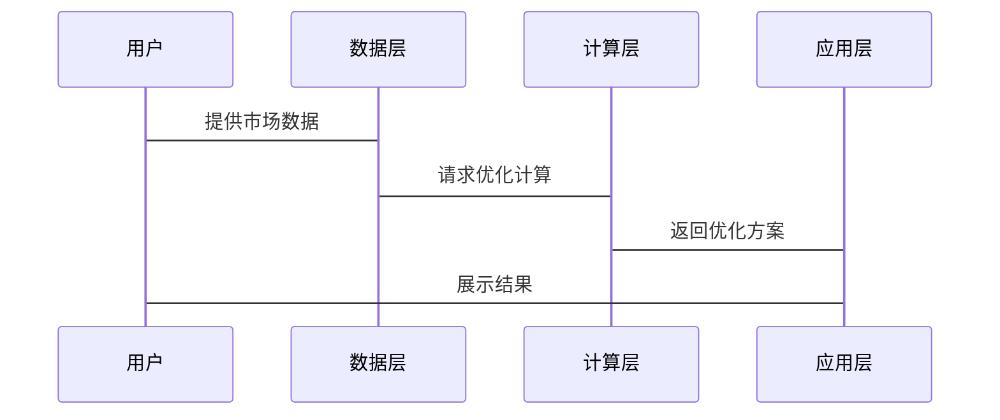

                 

<think>
好的，我需要帮用户撰写一篇技术博客文章，标题是《AI驱动的企业战略规划：情景模拟与优化》。用户希望文章结构清晰，逻辑严密，内容深入，适合专业人士阅读。我先分析一下用户的需求和具体要求。

首先，用户提供了详细的文章大纲，要求包含多个部分，如背景、核心概念、算法原理、系统架构、项目实战等。每个部分都需要有详细的子章节，并且使用特定的格式，如Markdown，包含mermaid图和Python代码示例。

我应该按照用户提供的大纲，逐一展开每个部分。比如，第一部分是背景介绍，需要涵盖问题背景、解决方法、概念结构等。这部分需要简明扼要地说明为什么企业需要AI驱动的战略规划，以及传统方法的不足。

接下来是核心概念，这部分需要详细讲解情景模拟和优化的基本原理，包括它们的定义、特点，以及与AI技术的结合。我可能需要使用表格和ER图来帮助读者理解这些概念之间的关系。

然后是算法原理部分，这部分需要深入讲解数学模型和优化算法。我需要使用mermaid流程图来展示算法步骤，并用Python代码示例来说明。同时，数学公式要用latex格式呈现，确保准确性和专业性。

接下来是系统分析与架构设计，这部分需要介绍项目的场景，设计系统的功能、架构、接口和交互。使用mermaid图来展示类图、架构图和序列图，这样读者可以更直观地理解系统结构。

然后是项目实战，这部分需要提供实际的应用环境、核心代码实现、案例分析等。代码示例应该详细解释，帮助读者理解和应用这些技术。

最后是总结与展望，包括最佳实践、小结、注意事项和扩展阅读，帮助读者巩固所学内容，并指导进一步的学习。

我需要确保每个部分都有足够的细节，并且逻辑连贯。可能遇到的挑战是如何将复杂的算法和系统架构部分用简明的方式表达出来，同时保持目录的结构完整。此外，数学公式的正确使用和代码的清晰展示也是关键。

总的来说，我需要系统地规划每个部分的内容，确保从背景到实战，逐步引导读者掌握AI驱动的企业战略规划的方法和应用。同时，注意使用专业术语，保持文章的学术性和可读性，满足用户对高质量技术博客的需求。
</think>

# AI驱动的企业战略规划：情景模拟与优化

## 关键词：AI驱动，企业战略规划，情景模拟，优化算法，系统架构，项目实战，技术博客

## 摘要：  
本文探讨了AI技术在企业战略规划中的应用，重点分析了情景模拟与优化的核心概念、算法原理、系统架构及实际案例。通过详细的技术分析和实战演示，揭示了AI如何赋能企业战略决策，提供了一个从理论到实践的全面指南。

---

# 第一部分：AI驱动的企业战略规划背景与概念

## 第1章：AI驱动的企业战略规划概述

### 1.1 问题背景与描述  
企业在复杂的市场环境中，面临着不确定性增加、竞争加剧、资源有限等挑战。传统的战略规划方法依赖于经验判断和静态分析，难以应对动态变化的市场环境。AI技术的引入为企业提供了更高效、更精准的决策支持工具。  

#### 1.1.1 传统企业战略规划的局限性  
- 依赖主观判断，缺乏数据支持。  
- 静态分析为主，难以应对动态变化。  
- 资源消耗大，效率较低。  

#### 1.1.2 AI技术对企业战略规划的变革  
- 数据驱动的决策支持。  
- 动态情景模拟与优化能力。  
- 提高战略规划的效率和准确性。  

#### 1.1.3 情景模拟与优化的核心价值  
- 情景模拟：通过构建虚拟场景，分析不同策略下的可能结果。  
- 优化算法：通过数学模型，寻找最优解，提升资源配置效率。  
- 综合应用：将两者结合，为企业提供动态、精准的战略规划支持。  

### 1.2 问题解决与边界  
#### 1.2.1 企业战略规划的典型问题  
- 市场预测不准确。  
- 资源分配不合理。  
- 竞争对手行为难以预测。  

#### 1.2.2 AI驱动的解决方案  
- 数据挖掘与预测模型：利用历史数据预测市场趋势。  
- 情景模拟：模拟不同策略下的结果。  
- 优化算法：寻找最优资源配置方案。  

#### 1.2.3 情景模拟与优化的适用范围与边界  
- 适用于中长期战略规划。  
- 适用于需要动态调整的复杂场景。  
- 不适用于完全确定性的简单决策。  

### 1.3 概念结构与核心要素  
#### 1.3.1 战略规划的基本框架  
1. 企业目标设定。  
2. 资源分配。  
3. 行动策略制定。  
4. 风险管理。  

#### 1.3.2 AI驱动的核心要素  
1. 数据采集与处理。  
2. 情景模拟模型。  
3. 优化算法。  
4. 可视化与决策支持。  

#### 1.3.3 情景模拟与优化的系统架构  
1. 数据层：数据采集、存储与预处理。  
2. 计算层：模型构建与优化计算。  
3. 应用层：情景模拟与结果展示。  

### 1.4 本章小结  
本章从问题背景、解决方法和概念结构三个方面，阐述了AI驱动的企业战略规划的核心思想，为后续内容奠定了基础。

---

# 第二部分：情景模拟与优化的核心概念

## 第2章：情景模拟与优化的基本原理

### 2.1 情景模拟的核心概念  
#### 2.1.1 情景模拟的定义与特点  
- 定义：通过构建虚拟场景，模拟不同策略下的结果。  
- 特点：动态性、可视化、可定制。  

#### 2.1.2 情景模拟的关键步骤  
1. 数据采集与分析。  
2. 场景构建。  
3. 模拟运行。  
4. 结果分析。  

#### 2.1.3 情景模拟与企业战略的关系  
情景模拟是企业战略规划的工具，帮助企业在不同假设下评估策略效果，优化资源配置。  

### 2.2 优化算法的基本原理  
#### 2.2.1 优化算法的分类与特点  
1. 确定性优化：线性规划、整数规划。  
2. 非确定性优化：遗传算法、模拟退火。  

#### 2.2.2 常用优化算法的比较  
| 算法类型 | 优点 | 缺点 |  
|----------|------|------|  
| 线性规划 | 高效性 | 仅适用于线性问题 |  
| 遗传算法 | 全局优化 | 计算成本高 |  
| 模拟退火 | 适应复杂问题 | 收敛速度慢 |  

#### 2.2.3 情景优化的数学模型  
$$ \text{目标函数：} \min f(x) $$  
$$ \text{约束条件：} g(x) \leq 0 $$  

### 2.3 AI在情景模拟与优化中的应用  
#### 2.3.1 AI驱动的情景模拟优势  
- 数据驱动：利用大数据提升预测准确性。  
- 自适应学习：动态调整模拟参数。  
- 高效计算：快速处理大规模数据。  

#### 2.3.2 机器学习在优化中的作用  
- 预测市场需求：基于历史数据建立预测模型。  
- 自动调整参数：优化算法参数以提高效率。  

#### 2.3.3 深度学习在情景模拟中的应用  
- 场景生成：通过GAN生成逼真的市场场景。  
- 结果预测：利用神经网络预测策略效果。  

### 2.4 核心概念对比表  
| 概念 | 情景模拟 | 优化算法 |  
|------|----------|----------|  
| 定义 | 模拟未来可能的场景 | 寻找最优解的方法 |  
| 特点 | 可视化、动态性 | 高效性、适应性 |  
| 应用 | 战略规划、风险管理 | 资源分配、成本控制 |  

### 2.5 ER实体关系图  
```mermaid
erDiagram
    actor 战略规划人员 {
        <属性> 战略目标
        <属性> 业务目标
    }
    scenario 情景模拟 {
        <关联> 战略规划人员
        <关联> 优化算法
    }
    algorithm 优化算法 {
        <属性> 参数设置
        <属性> 优化目标
    }
```

### 2.6 本章小结  
本章通过对比分析，揭示了情景模拟与优化算法的核心概念及其在企业战略规划中的应用价值。

---

# 第三部分：情景模拟与优化的算法原理

## 第3章：情景模拟与优化的算法实现

### 3.1 情景模拟的算法实现  
#### 3.1.1 基于机器学习的预测模型  
- 线性回归：预测市场需求。  
- 支持向量机：分类市场趋势。  

#### 3.1.2 基于深度学习的场景生成  
- GAN网络：生成逼真的市场场景。  
- Transformer：捕捉市场动态关系。  

#### 3.1.3 情景模拟的流程图  


### 3.2 优化算法的实现  
#### 3.2.1 线性规划的数学模型  
$$ \text{目标函数：} \min \sum c_i x_i $$  
$$ \text{约束条件：} \sum a_i x_i \leq b $$  

#### 3.2.2 遗传算法的实现步骤  
1. 初始化种群。  
2. 计算适应度。  
3. 选择与交叉。  
4. 变异与优化。  

#### 3.2.3 模拟退火算法的实现步骤  
1. 设置初始温度。  
2. 随机选择候选解。  
3. 计算能量差。  
4. 接受或拒绝候选解。  

### 3.3 AI驱动的优化算法  
#### 3.3.1 基于强化学习的优化策略  
- 状态空间：市场环境。  
- 动作空间：企业决策。  
- 奖励函数：战略目标达成度。  

#### 3.3.2 基于深度强化学习的优化框架  


### 3.4 优化算法的代码实现  
```python
import numpy as np
from scipy.optimize import minimize

def objective_function(x):
    return np.sum(x**2)

constraint = {'type': 'ineq', 'fun': lambda x: np.sum(x) - 1}

result = minimize(objective_function, x0=np.zeros(3), method='SLSQP', constraints=[constraint])
print(result)
```

### 3.5 本章小结  
本章详细讲解了情景模拟与优化算法的实现原理，并通过代码示例展示了具体应用。

---

# 第四部分：系统分析与架构设计

## 第4章：系统分析与架构设计

### 4.1 系统分析  
#### 4.1.1 项目场景介绍  
- 企业需要制定未来三年的市场扩展战略。  
- 目标：选择最优市场进入策略。  

#### 4.1.2 系统功能设计  
1. 数据采集：收集市场数据。  
2. 情景模拟：生成不同市场场景。  
3. 优化计算：寻找最优策略。  
4. 结果展示：可视化分析结果。  

### 4.2 系统架构设计  
#### 4.2.1 系统架构图  


#### 4.2.2 系统功能模块  
1. 数据采集模块：负责数据采集与预处理。  
2. 计算模块：负责情景模拟与优化计算。  
3. 应用模块：负责结果展示与决策支持。  

### 4.3 系统接口设计  
#### 4.3.1 数据接口  
- 输入：市场数据、策略参数。  
- 输出：模拟结果、优化方案。  

#### 4.3.2 用户接口  
- 输入：用户需求、参数设置。  
- 输出：可视化结果、决策建议。  

### 4.4 系统交互设计  


### 4.5 本章小结  
本章通过系统分析与架构设计，明确了AI驱动的企业战略规划系统的实现路径。

---

# 第五部分：项目实战

## 第5章：项目实战与案例分析

### 5.1 项目环境安装  
#### 5.1.1 环境要求  
- Python 3.8及以上版本。  
- 安装numpy、scipy、matplotlib。  

#### 5.1.2 安装命令  
```bash
pip install numpy scipy matplotlib
```

### 5.2 核心代码实现  
#### 5.2.1 数据采集与预处理  
```python
import numpy as np

market_data = np.random.randn(100, 5)
print(market_data)
```

#### 5.2.2 情景模拟与优化  
```python
from scipy.optimize import minimize

def objective(x):
    return np.sum(x**2)

constraint = {'type': 'eq', 'fun': lambda x: np.sum(x) - 1}

result = minimize(objective, x0=np.zeros(5), method='SLSQP', constraints=[constraint])
print(result)
```

### 5.3 案例分析与解读  
#### 5.3.1 案例背景  
某企业计划进入新兴市场，目标是选择最优的市场进入策略。  

#### 5.3.2 数据分析与模拟  
- 数据采集：收集市场规模、竞争强度、经济指标等数据。  
- 情景模拟：生成不同市场进入策略下的收益预测。  
- 优化计算：寻找最优资源配置方案。  

#### 5.3.3 结果展示  
- 情景模拟结果：不同策略下的市场表现。  
- 优化结果：最优市场进入策略。  

### 5.4 项目小结  
本章通过实际案例，展示了AI驱动的企业战略规划系统的应用价值。

---

# 第六部分：总结与展望

## 第6章：总结与展望

### 6.1 最佳实践  
- 数据质量是关键：确保数据的准确性和完整性。  
- 模型选择要谨慎：根据问题特点选择合适算法。  
- 结果验证必不可少：通过实际数据验证模型的有效性。  

### 6.2 小结  
本文从背景、概念、算法、系统架构到项目实战，全面探讨了AI驱动的企业战略规划的实现路径。  

### 6.3 注意事项  
- 避免过度依赖AI技术，结合专家经验。  
- 注意数据隐私与安全问题。  
- 定期更新模型以适应市场变化。  

### 6.4 拓展阅读  
- 《机器学习实战》  
- 《深度学习》  
- 《企业战略管理》  

### 6.5 本章小结  
本章总结了AI驱动的企业战略规划的核心要点，并提出了未来的发展方向。

---

# 作者：AI天才研究院 & 禅与计算机程序设计艺术

