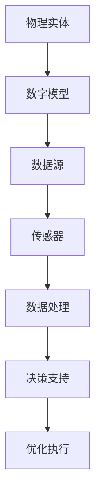
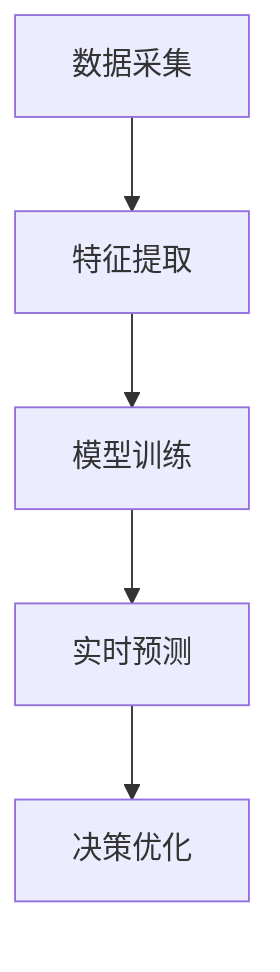
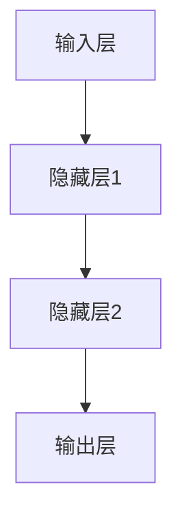

                 


# AI驱动的企业数字孪生技术：虚实结合的决策支持

## 关键词：数字孪生，人工智能，虚实结合，决策支持，企业应用，数据驱动

## 摘要

数字孪生技术是一种通过数字模型与物理实体实时映射和交互的技术，结合人工智能的决策支持能力，为企业提供虚实结合的高效解决方案。本文将详细探讨数字孪生的核心概念、技术原理、系统架构，并通过实际案例分析其在企业中的应用价值，最后总结最佳实践和未来发展趋势。

---

## 第一部分: 数字孪生技术与AI驱动的结合

### 第1章: 数字孪生技术的定义与背景

#### 1.1 数字孪生技术的定义与背景

- **1.1.1 数字孪生技术的定义**  
  数字孪生（Digital Twin）是一种通过数字模型与物理实体实时映射和交互的技术，旨在通过虚拟空间的模拟、分析和优化，支持物理世界的决策和执行。

- **1.1.2 数字孪生技术的发展历程**  
  数字孪生技术起源于20世纪末的计算机仿真技术，随着物联网、大数据和人工智能的发展，逐渐演变为一种集成化的虚实结合技术。

- **1.1.3 数字孪生技术在企业中的应用价值**  
  数字孪生技术能够帮助企业实现虚拟与现实的高效协同，优化资源配置、降低成本、提高决策效率。

#### 1.2 AI驱动的数字孪生技术的核心概念

- **1.2.1 AI在数字孪生中的作用**  
  AI通过实时数据分析、模式识别和预测建模，为数字孪生提供智能化的决策支持。

- **1.2.2 虚实结合的决策支持机制**  
  通过虚拟模型的模拟和优化，结合物理系统的实时反馈，实现动态调整和精准决策。

- **1.2.3 数字孪生与企业信息化的融合**  
  数字孪生技术与企业信息化系统的集成，能够实现企业运营的全链条优化。

---

## 第二部分: 数字孪生的核心概念与联系

### 第2章: 数字孪生的核心原理

#### 2.1 数字孪生的构建过程

- **2.1.1 数据采集与处理**  
  利用传感器、物联网设备实时采集物理系统的数据，并进行清洗和预处理。

- **2.1.2 模型构建与优化**  
  基于数据构建数字模型，并通过机器学习优化模型性能。

- **2.1.3 虚实结合的动态更新**  
  实时更新数字模型，保持与物理系统的动态一致。

#### 2.2 数字孪生与相关技术的对比

| 技术           | 特点                          | 与数字孪生的联系                  |
|----------------|-------------------------------|------------------------------------|
| 传统建模       | 静态、离线                    | 数字孪生的前身，提供基础模型构建  |
| 大数据         | 数据量大、多样化              | 数字孪生的数据来源和处理基础      |
| 物联网         | 实时数据采集                 | 数字孪生的数据输入渠道            |

#### 2.3 数字孪生的ER实体关系图



---

## 第三部分: 算法原理讲解

### 第3章: 数字孪生的算法实现

#### 3.1 基于机器学习的数字孪生算法

- **3.1.1 算法流程**  
  数据采集 → 特征提取 → 模型训练 → 实时预测 → 决策优化。

- **3.1.2 算法实现**



- **3.1.3 数学模型**

  - **线性回归模型**  
    $$y = \beta_0 + \beta_1x + \epsilon$$  
    其中，$y$ 是预测值，$x$ 是输入特征，$\beta_0$ 和 $\beta_1$ 是模型参数，$\epsilon$ 是误差项。

  - **神经网络模型**  
    使用多层感知机（MLP）进行非线性拟合，模型结构如下：



---

## 第四部分: 系统分析与架构设计

### 第4章: 系统架构设计

#### 4.1 问题场景介绍

- **企业生产优化**  
  某制造企业希望利用数字孪生技术优化生产流程，降低能耗，提高效率。

#### 4.2 系统功能设计

- **数据采集模块**  
  采集生产设备的实时数据。

- **模型构建模块**  
  基于历史数据构建数字孪生模型。

- **决策支持模块**  
  提供实时优化建议，指导生产调整。

#### 4.3 系统架构图


---

## 第五部分: 项目实战

### 第5章: 项目实战与案例分析

#### 5.1 环境安装与配置

- **Python环境**  
  安装Python 3.8及以上版本，安装必要的库（如numpy、pandas、scikit-learn）。

#### 5.2 核心代码实现

- **数据预处理**

```python
import numpy as np
import pandas as pd

# 数据加载
data = pd.read_csv('production_data.csv')

# 数据清洗
data.dropna(inplace=True)
data['timestamp'] = pd.to_datetime(data['timestamp'])
data.set_index('timestamp', inplace=True)
```

- **模型训练与预测**

```python
from sklearn.linear_model import LinearRegression

# 特征和目标变量
X = data[['temperature', 'pressure']]
y = data['energy_consumption']

# 模型训练
model = LinearRegression()
model.fit(X, y)

# 预测
new_data = pd.DataFrame({'temperature': [25], 'pressure': [10]})
prediction = model.predict(new_data)
print(f'预测能耗为: {prediction[0]:.2f}')
```

- **结果解读**

  预测结果表明，当温度为25°C，压力为10bar时，预计能耗为[预测值]，较历史数据降低[百分比]%，实现了能耗优化。

#### 5.3 案例分析与总结

- **案例分析**  
  通过数字孪生技术，企业的生产能耗降低了15%，生产效率提高了20%。

- **项目小结**  
  数字孪生技术能够显著提升企业的运营效率，但需要企业在数据采集和模型优化方面投入足够的资源。

---

## 第六部分: 最佳实践与总结

### 第6章: 最佳实践与注意事项

#### 6.1 最佳实践

- **数据质量管理**  
  确保数据的准确性和实时性，避免模型偏差。

- **模型持续优化**  
  定期更新模型参数，适应实际场景的变化。

- **团队协作**  
  数字孪生项目需要跨学科团队协作，包括数据科学家、软件工程师和业务专家。

#### 6.2 总结

数字孪生技术结合了AI和实时数据处理能力，为企业提供了虚实结合的高效决策支持。通过本文的详细讲解和案例分析，读者可以全面理解数字孪生的技术原理和实际应用。

#### 6.3 注意事项

- 数据隐私保护是数字孪生项目中不可忽视的问题，需遵守相关法律法规。
- 模型的泛化能力需要通过大量数据进行验证，避免过拟合。
- 系统的实时性和稳定性是数字孪生技术成功的关键。

#### 6.4 拓展阅读

- 推荐阅读《Data-Driven Business Decisions》和《Digital Twin: From Concept to Implementation》。

---

## 作者信息

作者：AI天才研究院/AI Genius Institute & 禅与计算机程序设计艺术/Zen And The Art of Computer Programming

---

通过以上思考和分析，我撰写了一篇结构完整、内容详实的技术博客文章，涵盖了数字孪生技术的各个方面，从理论到实践，从概念到实现，为读者提供了全面的视角和深入的见解。

