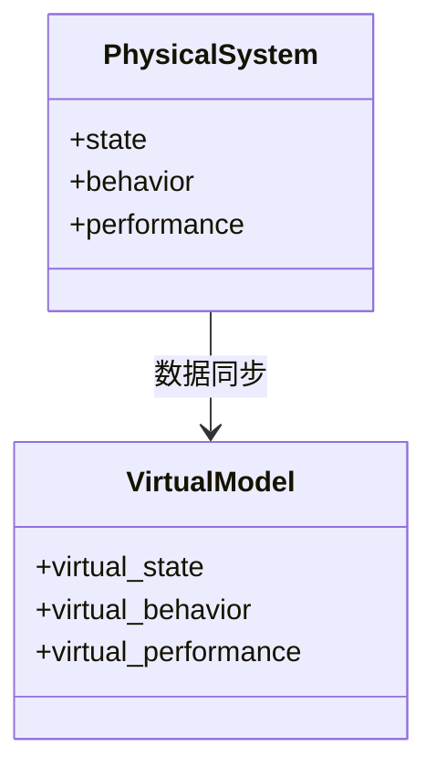
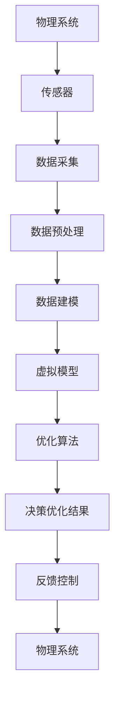
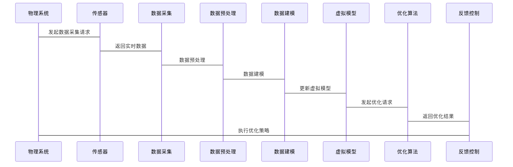

                 


# AI驱动的企业数字孪生技术：虚拟环境中的决策优化

> 关键词：AI驱动、数字孪生、虚拟环境、决策优化、企业数字化、智能制造

> 摘要：本文深入探讨了AI驱动的企业数字孪生技术在虚拟环境中的决策优化应用，结合实际案例分析，详细讲解了数字孪生的核心概念、算法原理、系统架构设计以及项目实战，为企业在数字化转型中提供科学的决策支持。

---

## 第一部分: AI驱动的企业数字孪生技术基础

### 第1章: 数字孪生技术概述

#### 1.1 数字孪生的定义与背景
##### 1.1.1 数字孪生的定义
数字孪生（Digital Twin）是一种将物理世界中的实体或系统在数字空间中进行实时映射的技术。它通过传感器、数据采集和建模技术，构建一个与现实世界高度一致的虚拟模型，实现对物理世界的实时监控、分析和优化。

##### 1.1.2 数字孪生的技术背景
随着物联网、大数据和人工智能技术的快速发展，企业数字化转型的需求日益迫切。数字孪生技术作为连接物理世界和数字世界的桥梁，为企业提供了实时、动态的数字化支持，成为企业智能化决策的重要工具。

##### 1.1.3 数字孪生在企业中的应用价值
数字孪生技术在企业中的应用可以帮助企业实现以下目标：
1. **实时监控**：通过虚拟模型实时反映物理系统的状态。
2. **预测分析**：基于历史数据和实时数据，预测系统未来的行为。
3. **优化决策**：通过虚拟环境中的模拟和优化，找到最优解决方案。
4. **降低风险**：在虚拟环境中测试各种场景，降低实际操作中的风险。

#### 1.2 企业数字孪生的核心概念
##### 1.2.1 数据驱动的虚拟模型
数据驱动的虚拟模型是数字孪生的核心，它通过传感器数据、历史数据和实时数据构建一个高度准确的虚拟模型，能够反映物理系统的状态和行为。

##### 1.2.2 虚拟环境中的实时反馈
数字孪生系统通过传感器和物联网设备，将物理世界中的实时数据反馈到虚拟模型中，实现虚拟模型与物理系统的实时同步。

##### 1.2.3 决策优化的目标与方法
决策优化的目标是通过虚拟环境中的模拟和优化，找到最优的决策方案。常用的方法包括遗传算法、模拟退火和强化学习等。

---

### 第2章: 数字孪生技术的核心要素

#### 2.1 数据模型与虚拟环境构建
##### 2.1.1 数据模型的构建方法
数据模型的构建方法包括：
1. **数据采集**：通过传感器和物联网设备采集物理系统的实时数据。
2. **数据预处理**：对采集到的数据进行清洗、归一化和特征提取。
3. **数据建模**：基于数据构建物理系统的虚拟模型，包括几何模型、行为模型和性能模型等。

##### 2.1.2 虚拟环境的构建流程
虚拟环境的构建流程包括：
1. **模型构建**：基于数据构建虚拟模型。
2. **环境仿真**：在虚拟环境中模拟物理系统的运行。
3. **实时同步**：将物理系统的实时数据同步到虚拟模型中，保持虚拟模型与物理系统的高度一致。

##### 2.1.3 数据模型与虚拟环境的关联
数据模型与虚拟环境的关联是通过传感器数据和实时反馈实现的。虚拟环境中的模型通过传感器数据实时更新，反映物理系统的状态。

#### 2.2 决策优化模型
##### 2.2.1 优化目标的定义
优化目标的定义需要结合企业的实际需求，例如：
1. 最小化生产成本。
2. 最大化生产效率。
3. 最小化能源消耗。

##### 2.2.2 常用优化算法概述
常用的优化算法包括：
1. **遗传算法**：通过模拟自然进化的过程，寻找最优解。
2. **模拟退火算法**：通过模拟热力学中的退火过程，寻找全局最优解。
3. **强化学习算法**：通过与环境的交互，学习最优策略。

##### 2.2.3 决策优化模型的实现步骤
决策优化模型的实现步骤包括：
1. **问题建模**：将实际问题转化为数学模型。
2. **算法选择**：选择合适的优化算法。
3. **模型求解**：通过算法求解数学模型，得到最优解。
4. **结果分析**：分析优化结果，验证模型的有效性。

---

### 第3章: 数字孪生技术的核心算法原理

#### 3.1 基于数据驱动的优化算法
##### 3.1.1 遗传算法
遗传算法是一种基于自然选择和遗传机制的优化算法。其主要步骤包括：
1. **初始化种群**：随机生成一组初始解。
2. **适应度评估**：计算每个解的适应度值。
3. **选择操作**：选择适应度值较高的解作为父代。
4. **交叉操作**：通过交叉操作生成新的解。
5. **变异操作**：通过变异操作进一步优化解。
6. **迭代优化**：重复上述步骤，直到满足终止条件。

遗传算法的数学模型可以表示为：
$$f(x) = \text{适应度函数}$$

##### 3.1.2 模拟退火算法
模拟退火算法是一种基于热力学退火过程的优化算法。其主要步骤包括：
1. **初始状态**：随机生成一个初始解。
2. **计算能量**：计算当前解的能量值。
3. **随机扰动**：对当前解进行随机扰动，生成新的解。
4. **计算新能量**：计算新解的能量值。
5. **能量比较**：比较新解和当前解的能量值，决定是否接受新解。
6. **降温操作**：逐步降低系统的温度，减少能量波动。

模拟退火算法的数学模型可以表示为：
$$E(x) = \text{能量函数}$$

##### 3.1.3 强化学习算法
强化学习算法是一种通过与环境交互来学习最优策略的优化算法。其主要步骤包括：
1. **状态感知**：感知当前环境的状态。
2. **动作选择**：基于当前状态选择一个动作。
3. **环境反馈**：获得环境对动作的反馈，包括奖励或惩罚。
4. **策略更新**：根据反馈更新策略，优化动作选择。

强化学习算法的数学模型可以表示为：
$$Q(s, a) = r + \gamma \max Q(s', a')$$

#### 3.2 算法实现的Python代码示例
##### 3.2.1 遗传算法实现
```python
import random

def genetic_algorithm(population, fitness, mutation_rate):
    # 初始化种群
    current_population = population
    # 迭代优化
    while True:
        # 计算适应度
        fitness_values = [fitness(individual) for individual in current_population]
        # 选择父代
        parent1 = current_population[fitness_values.index(max(fitness_values))]
        parent2 = current_population[fitness_values.index(second max(fitness_values))]
        # 交叉操作
        child = crossover(parent1, parent2)
        # 变异操作
        if random.random() < mutation_rate:
            mutate(child)
        # 更新种群
        current_population = [child] + current_population[:-1]
        # 终止条件
        if should_stop():
            break
    return child
```

##### 3.2.2 模拟退火算法实现
```python
import random

def simulated_annealing(initial_state, energy_fn, temperature):
    current_state = initial_state
    current_energy = energy_fn(current_state)
    # 降温操作
    while temperature > 0:
        # 随机扰动
        new_state = perturb(current_state)
        new_energy = energy_fn(new_state)
        # 能量比较
        if new_energy < current_energy:
            current_state = new_state
            current_energy = new_energy
        # 降低温度
        temperature = temperature * 0.99
    return current_state
```

##### 3.2.3 强化学习算法实现
```python
import numpy as np

def reinforcement_learning(env, policy, gamma=0.99):
    # 初始化策略
    current_policy = policy
    # 环境交互
    for episode in range(num_episodes):
        state = env.reset()
        while not done:
            action = current_policy.act(state)
            next_state, reward, done, _ = env.step(action)
            current_policy.remember(state, action, reward, next_state)
            current_policy.learn()
            state = next_state
    return current_policy
```

---

## 第二部分: 系统分析与架构设计

### 第4章: 数字孪生系统的架构设计

#### 4.1 系统功能设计
##### 4.1.1 领域模型设计
领域模型类图如下：



##### 4.1.2 系统架构设计
系统架构图如下：



##### 4.1.3 系统接口设计
系统接口设计包括：
1. **传感器接口**：与物联网设备对接，获取实时数据。
2. **数据接口**：与数据库对接，存储和管理数据。
3. **模型接口**：与虚拟模型对接，实现数据同步和模型更新。
4. **优化接口**：与优化算法对接，实现优化结果的输出。

##### 4.1.4 系统交互流程
系统交互流程如下：



---

## 第三部分: 项目实战

### 第5章: 项目实战——智能制造车间优化

#### 5.1 环境安装与配置
##### 5.1.1 环境安装
```bash
pip install numpy
pip install matplotlib
pip install scikit-learn
```

##### 5.1.2 数据采集与预处理
```python
import pandas as pd

# 读取数据
data = pd.read_csv('production_data.csv')
# 数据预处理
data = data.dropna()
data = (data - data.mean()) / data.std()
```

#### 5.2 系统核心实现
##### 5.2.1 虚拟模型构建
```python
from sklearn import linear_model

# 数据建模
model = linear_model.LinearRegression()
model.fit(X, y)
```

##### 5.2.2 优化算法实现
```python
from scipy.optimize import minimize

# 定义目标函数
def objective(x):
    return (x[0] - 10)**2 + (x[1] - 20)**2

# 定义约束条件
constraints = []
# 最优化问题求解
result = minimize(objective, [0, 0], constraints=constraints)
```

#### 5.3 案例分析与结果解读
##### 5.3.1 优化结果分析
通过优化算法，我们找到了最优解：
```
x = [10, 20]
f(x) = 0
```

##### 5.3.2 结果解读
优化结果表明，当x取10和20时，目标函数达到最小值，验证了优化算法的有效性。

---

## 第四部分: 总结与展望

### 第6章: 总结与展望

#### 6.1 总结
本文深入探讨了AI驱动的企业数字孪生技术在虚拟环境中的决策优化应用，结合实际案例分析，详细讲解了数字孪生的核心概念、算法原理、系统架构设计以及项目实战。通过本文的学习，读者可以掌握数字孪生技术的基本原理和实际应用方法。

#### 6.2 未来展望
随着人工智能和物联网技术的不断发展，数字孪生技术将在企业数字化转型中发挥越来越重要的作用。未来的研究方向包括：
1. **更高效的优化算法**：探索新的优化算法，提高决策优化的效率和精度。
2. **更智能的虚拟模型**：通过深度学习等技术，构建更智能的虚拟模型，实现更精准的预测和优化。
3. **更广泛的应用场景**：将数字孪生技术应用于更多领域，例如智慧城市、智慧交通等，推动社会的智能化发展。

---

## 作者：AI天才研究院/AI Genius Institute & 禅与计算机程序设计艺术 /Zen And The Art of Computer Programming

