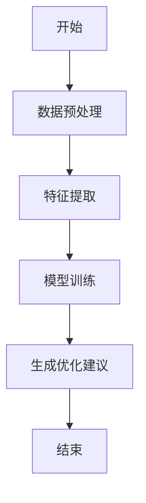
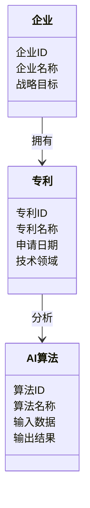
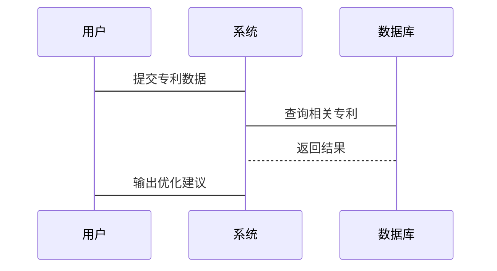

                 


# AI驱动的企业知识产权战略：专利组合优化与布局的智能化

## 关键词：AI, 知识产权, 专利组合优化, 智能化布局, 企业战略, 技术分析

## 摘要：  
随着人工智能技术的飞速发展，企业知识产权管理迎来了前所未有的变革。本文深入探讨AI在专利组合优化与布局中的智能化应用，分析其核心算法原理、系统架构设计以及实际项目中的应用案例。通过对比传统方法的局限性，结合AI技术的优势，为企业制定知识产权战略提供全新的视角和实践指导。

---

# 第一部分: AI驱动的企业知识产权战略概述

## 第1章: 企业知识产权战略的AI驱动背景

### 1.1 知识产权战略的重要性  
企业知识产权是衡量创新能力和市场竞争力的重要指标。专利布局不仅能够保护企业的创新成果，还能通过技术壁垒削弱竞争对手。然而，随着技术领域日益复杂，传统的人工专利管理方式已难以应对海量数据和复杂关系的挑战。  

### 1.2 AI驱动知识产权战略的核心价值  
AI技术的应用显著提升了专利管理的效率和精准度。通过数据挖掘、自然语言处理和机器学习算法，AI能够快速分析海量专利数据，识别技术趋势，预测潜在风险，并优化专利布局策略。  

### 1.3 本章小结  
本章介绍了AI技术在知识产权管理中的重要性，分析了传统方法的局限性，并提出了AI驱动战略的核心价值。

---

# 第二部分: 专利组合优化的核心概念与联系

## 第2章: 专利组合优化的核心要素

### 2.1 专利布局的关键维度  
专利布局需要考虑技术领域、时间跨度和地域覆盖。例如，AI技术可以将专利分布到关键的技术领域，确保企业在新兴领域的技术储备。  

### 2.2 AI在专利组合优化中的应用  
AI技术通过数据挖掘和预测模型，帮助企业识别高价值专利，优化专利组合的覆盖范围。例如，使用自然语言处理技术分析专利摘要，提取关键词，生成技术关联图。  

### 2.3 核心概念对比分析  
| 对比维度 | 传统方法 | AI驱动方法 |  
|----------|------------|-------------|  
| 数据处理 | 人工筛选 | 自动化分析 |  
| 知识关联 | 依赖专家经验 | 基于算法自动关联 |  
| 成本效率 | 高 | 低 |  

## 第3章: 专利组合优化的ER实体关系图

### 3.1 实体关系分析  
通过ER图分析企业、专利、技术领域和AI算法之间的关系。  

```mermaid
er
  classDiagram
    class 企业 {
      企业ID
      企业名称
      战略目标
    }
    class 专利 {
      专利ID
      专利名称
      申请日期
      技术领域
    }
    class 技术领域 {
      领域ID
      领域名称
      关键技术
    }
    class AI算法 {
      算法ID
      算法名称
      输入数据
      输出结果
    }
    企业 --> 专利: 拥有
    专利 --> 技术领域: 属于
    企业 --> AI算法: 使用
    AI算法 --> 专利: 分析
```

---

# 第三部分: AI驱动的专利组合优化算法

## 第3章: AI驱动的专利组合优化算法

### 3.1 算法原理  
AI算法通过分析专利数据，生成优化建议。例如，使用聚类算法将专利按技术领域分类，再使用遗传算法优化组合。  

### 3.2 算法流程图  


### 3.3 数学模型  
$$ 目标函数：\min \sum_{i=1}^{n} w_i x_i $$  
其中，$w_i$为权重，$x_i$为选择的专利组合。

---

# 第四部分: 系统分析与架构设计

## 第4章: 系统功能设计

### 4.1 领域模型  


### 4.2 系统架构图  
```mermaid
container 系统架构 {
    前端：用户界面
    后端：算法处理
    数据库：专利数据
}
```

### 4.3 接口设计  


---

# 第五部分: 项目实战

## 第5章: 项目实战与案例分析

### 5.1 环境配置  
安装Python和相关库：`pip install numpy pandas scikit-learn`  

### 5.2 代码实现  
```python
import numpy as np
from sklearn.cluster import KMeans

# 示例数据
data = np.array([[1, 2], [3, 4], [5, 6], [7, 8]])
model = KMeans(n_clusters=2)
model.fit(data)
print(model.labels_)
```

### 5.3 案例分析  
分析某企业的专利组合，通过AI算法优化布局，提升技术覆盖范围。  

### 5.4 项目总结  
AI技术显著提升了专利管理的效率和精准度，为企业制定知识产权战略提供了有力支持。

---

# 第六部分: 最佳实践与总结

## 第6章: 最佳实践与总结

### 6.1 实施中的注意事项  
确保数据质量和算法模型的准确性。  

### 6.2 成功案例分析  
某科技公司通过AI优化专利组合，提升了技术壁垒和市场竞争力。  

### 6.3 未来趋势  
AI技术将进一步融入知识产权管理，推动企业创新战略的智能化转型。

---

# 作者：AI天才研究院 & 禅与计算机程序设计艺术

---

通过以上内容，文章详细阐述了AI在企业知识产权战略中的应用，从理论到实践，为读者提供了全面的视角和深入的分析。

