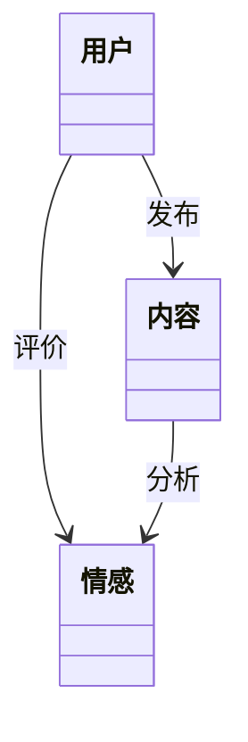
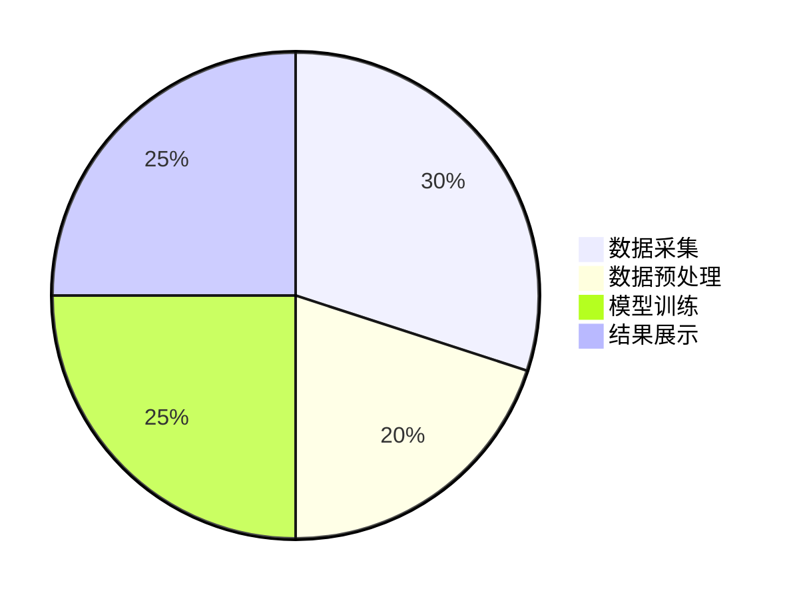
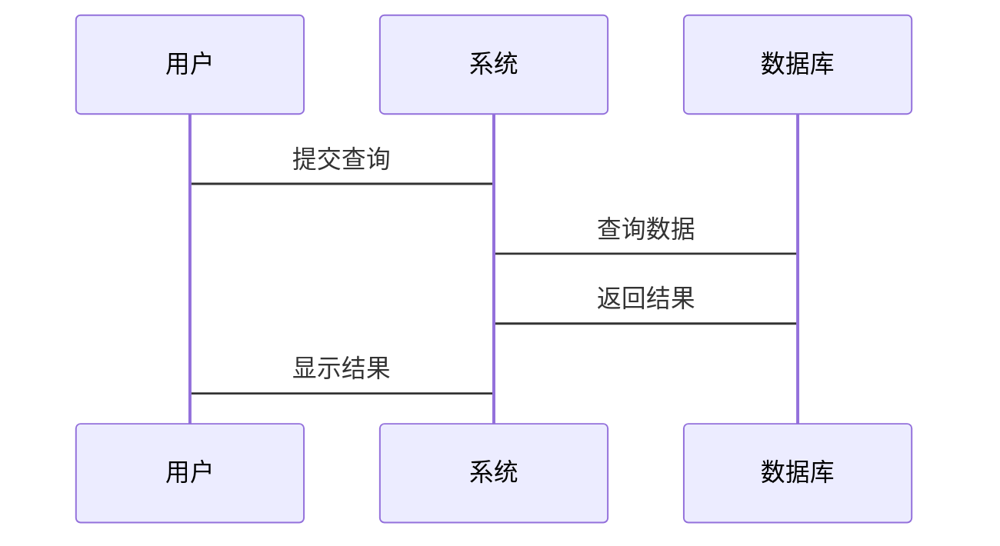

                 


# AI驱动的企业社交媒体管理：策略与实践

> 关键词：AI, 社会媒体管理, 自然语言处理, 机器学习, 系统架构

> 摘要：本文探讨了AI在企业社交媒体管理中的应用，从背景、核心概念到算法原理、系统架构，再到项目实战和最佳实践，全面解析AI驱动的企业社交媒体管理的策略与实践。通过详细的分析和实际案例，帮助读者理解如何利用AI技术提升企业社交媒体管理的效率和效果。

---

## 第1章: 背景与问题背景

### 1.1 企业社交媒体管理的现状与挑战

#### 1.1.1 传统社交媒体管理的局限性
传统的社交媒体管理方式主要依赖人工操作，存在以下问题：
- **效率低下**：人工处理大量社交媒体数据耗时耗力。
- **一致性差**：不同人员的处理方式可能导致不一致的结果。
- **数据孤岛**：缺乏统一的平台整合多渠道数据，难以进行深度分析。

#### 1.1.2 AI驱动的必要性与优势
AI技术的引入可以解决传统社交媒体管理的痛点，其优势包括：
- **自动化处理**：AI能够自动识别、分类和响应社交媒体内容。
- **高准确性**：通过机器学习算法，AI可以提高内容分析的准确性。
- **实时响应**：AI能够实时监控社交媒体数据，快速应对突发事件。

#### 1.1.3 企业社交媒体管理的核心问题
企业社交媒体管理的核心问题包括：
- 如何高效处理海量社交媒体数据。
- 如何快速识别用户情感和意图。
- 如何制定基于数据的精准营销策略。

---

### 1.2 AI在社交媒体管理中的应用背景

#### 1.2.1 AI技术的发展与成熟
AI技术近年来取得了显著进展，特别是在自然语言处理（NLP）和机器学习领域，为社交媒体管理提供了强大的技术支持。

#### 1.2.2 社会媒体数据的爆炸性增长
随着社交媒体的普及，每天产生的数据量巨大，传统方法难以处理如此庞大的数据量。

#### 1.2.3 企业对高效社交媒体管理的需求
企业希望通过社交媒体与用户互动、提升品牌形象和销售业绩，但传统管理方式难以满足这些需求。

---

## 第2章: 核心概念与联系

### 2.1 AI驱动的企业社交媒体管理的核心概念

#### 2.1.1 自然语言处理（NLP）在社交媒体分析中的应用
NLP技术可以用于情感分析、关键词提取和实体识别等任务。

#### 2.1.2 机器学习在用户行为预测中的作用
机器学习模型可以预测用户的购买行为、品牌偏好和社交影响力。

#### 2.1.3 社会媒体分析的框架与流程
社交媒体分析的流程包括数据采集、数据预处理、特征提取、模型训练和结果解读。

---

### 2.2 核心概念对比与ER实体关系图

#### 2.2.1 不同社交媒体分析方法的对比分析
| 方法         | 优势                     | 劣势                     |
|--------------|--------------------------|--------------------------|
| 情感分析     | 高准确性                   | 对复杂语境的处理能力有限 |
| 主题建模     | 可发现潜在主题             | 主题识别可能不够精准     |

#### 2.2.2 ER实体关系图展示（使用Mermaid）
```mermaid
erd
  多对多关联
  用户
    id
    用户名
    关注数
  内容
    id
    文本
    时间戳
  情感
    id
    情感极性
    强度
```

---

## 第3章: 算法原理讲解

### 3.1 情感分析算法

#### 3.1.1 情感分析的基本原理
情感分析的目标是判断文本的情感倾向（如正面、负面或中性）。常用算法包括基于词袋模型的朴素贝叶斯和基于深度学习的LSTM。

#### 3.1.2 基于深度学习的情感分析模型
深度学习模型（如BERT）可以捕捉文本的上下文信息，提高情感分析的准确性。

#### 3.1.3 情感分析的Python实现代码示例
```python
from sklearn.feature_extraction.text import TfidfVectorizer
from sklearn.naive_bayes import MultinomialNB

# 数据预处理
vectorizer = TfidfVectorizer()
X = vectorizer.fit_transform(texts)

# 模型训练
model = MultinomialNB()
model.fit(X, labels)

# 预测
test_text = ["I love this product!"]
test_X = vectorizer.transform([test_text])
predicted_label = model.predict(test_X)
print(predicted_label)
```

---

### 3.2 主题建模算法

#### 3.2.1 主题建模的原理与方法
主题建模旨在发现文本中的主题分布，常用算法包括LDA（Latent Dirichlet Allocation）和NMF（Non-negative Matrix Factorization）。

#### 3.2.2 基于LDA的主题建模流程
LDA模型假设每个文档由多个主题组成，每个主题由多个词语组成，模型通过迭代优化主题分布。

#### 3.2.3 主题建模的Python代码实现
```python
from gensim import corpora, models

# 建立词典
dictionary = corpora.Dictionary(texts)

# 创建语料库
corpus = [dictionary.doc2bow(text) for text in texts]

# 训练LDA模型
 lda = models.LdaModel(corpus, num_topics=5, id2word=dictionary)
 topics = lda.print_topics()
 print(topics)
```

---

## 第4章: 系统分析与架构设计方案

### 4.1 系统功能设计

#### 4.1.1 领域模型类图（使用Mermaid）


### 4.2 系统架构设计

#### 4.2.1 系统架构图（使用Mermaid）


### 4.3 系统接口与交互设计

#### 4.3.1 系统交互流程（使用Mermaid序列图）


---

## 第5章: 项目实战

### 5.1 环境安装与配置

#### 5.1.1 Python环境的安装与配置
安装Python 3.8及以上版本，并配置虚拟环境。

#### 5.1.2 相关库的安装
安装必要的库：
```bash
pip install numpy pandas scikit-learn gensim
```

### 5.2 核心代码实现

#### 5.2.1 情感分析模型的实现
```python
from sklearn.pipeline import Pipeline
from sklearn.feature_extraction.text import TfidfVectorizer
from sklearn.linear_model import LogisticRegression

# 创建管道
pipeline = Pipeline([
    ('tfidf', TfidfVectorizer()),
    ('clf', LogisticRegression())
])

# 训练模型
pipeline.fit(X_train, y_train)

# 预测
y_pred = pipeline.predict(X_test)
print(y_pred)
```

---

## 第6章: 最佳实践与小结

### 6.1 小结
本文详细探讨了AI驱动的企业社交媒体管理的策略与实践，从理论到实践，全面解析了如何利用AI技术提升企业社交媒体管理的效率和效果。

### 6.2 注意事项
- 数据隐私和安全问题需要高度重视。
- 模型的可解释性和鲁棒性需要进一步优化。

### 6.3 拓展阅读
推荐阅读《深度学习》和《自然语言处理实战》等书籍，深入理解AI技术的核心原理。

---

作者：AI天才研究院/AI Genius Institute & 禅与计算机程序设计艺术 /Zen And The Art of Computer Programming

