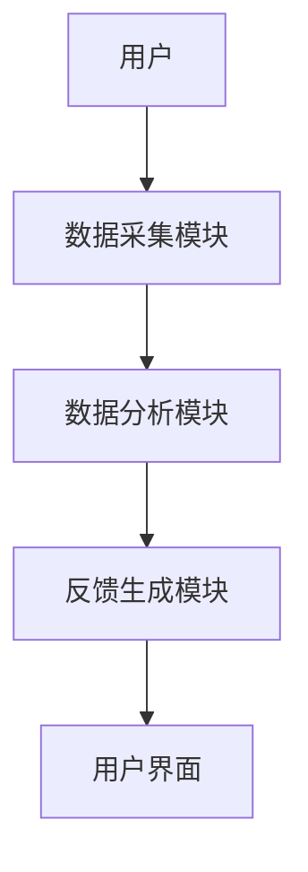

                 

<think>
嗯，用户希望我写一篇关于AI驱动的企业绩效管理的技术博客，特别是360度反馈和实时Coaching。他们给出了一个详细的目录结构，但其实他们更希望我按照他们的具体要求来写。首先，我需要理解用户的需求，他们可能是一位CTO或者技术专家，想要深入探讨如何利用AI技术优化绩效管理。

他们提到关键词有7个，包括企业绩效管理、AI驱动、360度反馈、实时Coaching、NLP、机器学习、数据隐私。摘要部分需要涵盖文章的核心内容，即AI如何改变绩效管理，特别是实时反馈和动态Coaching。

接下来，我需要按照目录结构逐步填充内容。首先是背景介绍，我需要详细解释传统绩效管理的挑战，然后引入AI的重要性。这部分要让读者明白为什么传统方法不够高效，AI如何解决这些问题。

然后是核心概念，我需要详细描述360度反馈和实时Coaching，包括它们的特点和优势。可能需要画一些图表，比如对比表或流程图，帮助读者理解。

接下来是算法原理，这里可能需要涉及自然语言处理和机器学习模型，比如如何从文本中提取情感和主题。这部分需要详细讲解，可能需要代码示例和数学公式。

数学模型部分，我需要解释绩效评分的计算方法，可能使用加权模型和动态调整模型，给出具体的公式。这部分需要清晰且易于理解，可能还需要图表辅助。

系统分析与设计部分，我需要设计系统的架构，包括数据采集、分析和反馈模块。这部分可能需要类图和架构图，展示系统各个部分的交互和结构。

项目实战部分，我需要提供代码示例，解释如何安装环境，实现关键功能，并分析案例。这部分要实用，让读者能够实际操作。

最后，最佳实践和小结部分，我需要讨论数据隐私、模型迭代等问题，并总结全文，同时推荐进一步阅读的资料。

整个过程中，我需要确保语言专业但不晦涩，结构清晰，逻辑严密。可能还需要多次检查，确保每个部分都符合用户的要求，特别是格式和内容的完整性。

总之，我需要一步步按照用户提供的目录结构，详细展开每个部分，确保内容全面且深入，帮助读者理解AI在企业绩效管理中的应用和价值。
</think>

# AI驱动的企业绩效管理：360度反馈与实时Coaching

## 关键词：企业绩效管理，AI驱动，360度反馈，实时Coaching，自然语言处理，机器学习，数据隐私

## 摘要：  
本文深入探讨了AI技术如何 revolutionize 企业绩效管理，特别是通过360度反馈与实时Coaching的创新应用。文章首先介绍了传统绩效管理的挑战，然后详细阐述了AI驱动的360度反馈与实时Coaching的核心概念、算法原理、数学模型、系统设计与项目实战。通过具体案例分析和代码实现，展示了如何利用自然语言处理和机器学习技术实现智能化绩效管理，并提出了数据隐私保护、模型迭代优化等关键问题的解决方案。本文为企业的数字化转型提供了重要的理论与实践参考。

---

# 第一部分: 企业绩效管理的背景与AI的引入

## 第1章: 传统企业绩效管理的挑战

### 1.1 绩效管理的定义与核心目标  
绩效管理是企业管理中的核心环节，旨在通过设定目标、评估员工表现、提供反馈与指导，从而提升员工能力和企业整体绩效。传统绩效管理主要依赖人工填写评估表和管理者主观判断，存在以下痛点：

#### 1.1.1 传统绩效管理的痛点与局限性  
- 数据收集耗时且主观性强：依赖人工填写表格，难以确保数据的客观性和全面性。  
- 反馈滞后：传统评估周期长，员工无法及时获得反馈，影响改进效果。  
- 缺乏个性化：统一的评估标准难以满足不同岗位和员工的个性化需求。  

#### 1.1.2 AI技术如何解决传统绩效管理的难题  
AI技术通过自动化数据处理、实时分析与个性化反馈，能够显著提升绩效管理的效率与精准度。例如，自然语言处理（NLP）技术可以自动解析员工反馈，机器学习算法可以预测员工表现并提供建议。

#### 1.1.3 360度反馈与实时Coaching的核心价值  
360度反馈通过整合多维度的评价数据，帮助管理者全面了解员工表现；实时Coaching则通过AI驱动的实时反馈，为员工提供即时指导，提升绩效改进的效果。

---

## 第2章: AI驱动绩效管理的背景与趋势

### 2.1 AI技术在企业管理中的应用现状  
AI技术已经在企业管理的多个领域得到广泛应用，包括客户关系管理、供应链优化和员工绩效管理等。AI驱动的绩效管理是企业管理数字化转型的重要方向。

### 2.2 绩效管理领域的数字化转型需求  
随着企业对效率和灵活性的要求不断提高，传统绩效管理的局限性日益凸显。数字化转型需求推动了AI在绩效管理中的应用。

### 2.3 AI驱动绩效管理的未来发展趋势  
AI技术将继续推动绩效管理的智能化与个性化，360度反馈与实时Coaching将成为企业绩效管理的核心工具。

---

# 第二部分: AI驱动绩效管理的核心概念与原理

## 第3章: 360度反馈的AI实现原理

### 3.1 360度反馈的核心概念  
360度反馈是指从员工的上级、下级、同事以及客户等多个维度收集反馈，以全面评估员工表现。

#### 3.1.1 360度反馈的多维度特征对比表  
| 维度       | 优势                       | 局限性                     |
|------------|----------------------------|---------------------------|
| 上级反馈   | 权威性高                   | 受主观影响较大             |
| 下级反馈   | 了解员工真实需求           | 可能缺乏客观性             |
| 同级反馈   | 公平性高                   | 容易受到团队氛围影响       |
| 客户反馈   | 客观性强                   | 获取成本较高               |

#### 3.1.2 基于AI的反馈整合流程  
使用NLP技术对多维度反馈进行情感分析与主题识别，结合权重模型生成综合评分。

---

## 第4章: 实时Coaching的AI实现机制

### 4.1 实时Coaching的核心概念  
实时Coaching是指在工作过程中，系统根据员工的表现实时提供反馈与指导。

#### 4.1.1 实时数据采集与分析  
通过传感器或系统日志采集员工实时行为数据，结合机器学习模型进行分析。

#### 4.1.2 基于AI的实时反馈生成  
系统根据分析结果生成个性化的反馈建议，并通过界面或通知形式实时推送。

---

## 第5章: AI驱动绩效管理的算法原理

### 5.1 基于NLP的反馈分析算法  
#### 5.1.1 文本预处理与特征提取  
- 文本清洗：去除停用词和标点符号。  
- 特征提取：使用TF-IDF提取关键词。  

#### 5.1.2 情感分析与主题识别  
- 情感分析：使用双向LSTM进行文本分类，识别反馈的情感倾向。  
- 主题识别：使用LDA模型提取反馈主题。

#### 5.1.3 代码实现  
```python
from sklearn.feature_extraction.text import TfidfVectorizer
from sklearn.decomposition import LatentDirichletAllocation

vectorizer = TfidfVectorizer(max_features=1000)
tfidf = vectorizer.fit_transform(feedbacks)
lda = LatentDirichletAllocation(n_components=5)
lda.fit(tfidf)
```

### 5.2 绩效评分的数学模型  
#### 5.2.1 多维度加权评分模型  
$$ 绩效评分 = \sum_{i=1}^{n} (权重_i \times 评分_i) $$  

#### 5.2.2 动态调整模型  
$$ 动态评分 = 基础评分 + \Delta 评分 $$  

---

# 第三部分: 系统设计与项目实战

## 第6章: 系统架构设计

### 6.1 系统功能模块  
- 数据采集模块：收集多维度反馈数据。  
- 数据分析模块：使用NLP和机器学习算法处理数据。  
- 反馈生成模块：生成实时反馈与个性化建议。  

### 6.2 系统架构图  


## 第7章: 项目实战

### 7.1 环境安装  
- Python 3.8+  
- NLP库（如spaCy、NLTK）  
- 机器学习库（如Scikit-learn、XGBoost）  

### 7.2 核心代码实现  
```python
import numpy as np
from sklearn.model_selection import train_test_split
from sklearn.linear_model import LinearRegression

# 假设feedbacks为反馈数据，labels为目标评分
X_train, X_test, y_train, y_test = train_test_split(feedbacks, labels, test_size=0.2)
model = LinearRegression()
model.fit(X_train, y_train)
```

---

## 第8章: 最佳实践与注意事项

### 8.1 数据隐私保护  
- 确保反馈数据的匿名化处理。  
- 遵守数据隐私相关法律法规。  

### 8.2 模型迭代与优化  
- 定期更新模型参数。  
- 通过A/B测试验证模型效果。  

### 8.3 用户反馈与持续改进  
- 收集用户反馈，优化系统功能。  
- 提供用户友好的操作界面。  

---

## 作者：AI天才研究院 & 禅与计算机程序设计艺术

