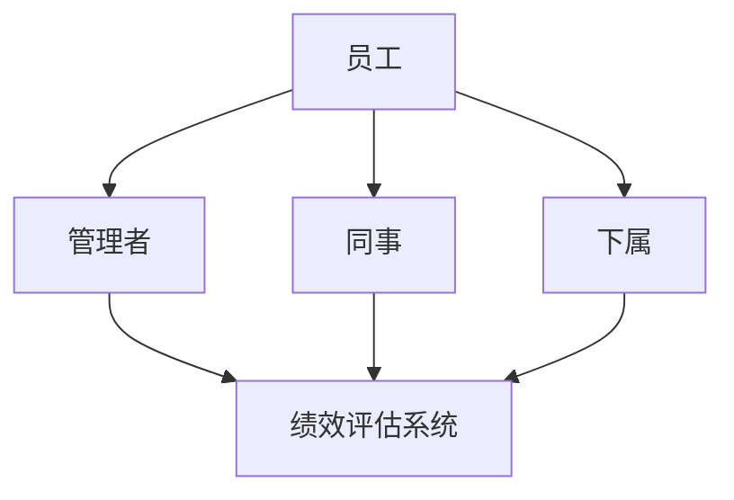
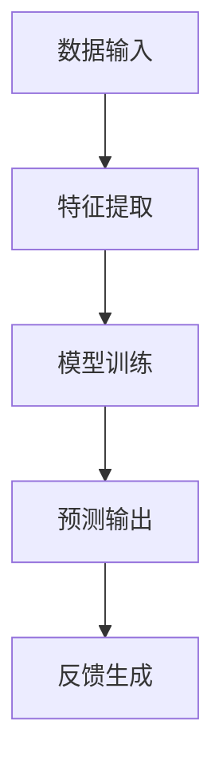
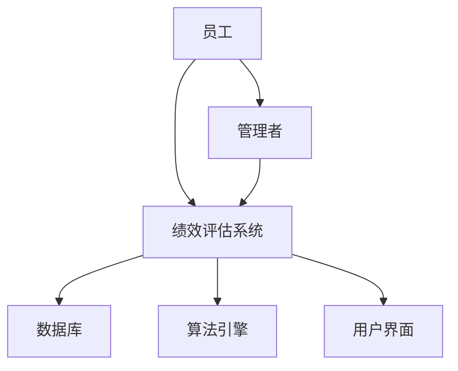
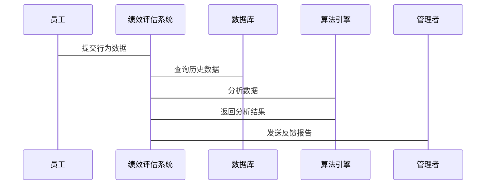

                 

<think>
嗯，用户让我详细思考一下如何撰写一篇关于AI驱动的企业绩效管理的技术博客文章。我需要按照他们提供的结构来，首先理解每一个部分的要求，然后逐步展开。

首先，文章标题是《AI驱动的企业绩效管理：360度反馈与实时coaching的智能化》。关键词需要5-7个，我应该包括“AI”、“绩效管理”、“360度反馈”、“实时 coaching”、“智能化”、“机器学习”、“自然语言处理”。

摘要部分要概括整篇文章的核心内容，说明AI如何通过智能化的反馈和实时指导提升绩效管理。接下来是目录结构，用户已经给出了详细的大纲，我需要确保每个部分都覆盖到，并且内容详细。

在第一部分，AI驱动的绩效管理概述，我需要介绍绩效管理的演变，AI的作用，以及360度反馈和实时coaching的智能化。这部分需要让读者了解为什么AI在这个领域很重要。

第二部分是核心概念与联系，这里需要用表格和ER图来展示传统方法与AI驱动方法的对比，以及系统的结构关系。这有助于读者清晰理解不同方法之间的差异和AI带来的变化。

第三部分是算法原理，我需要详细讲解机器学习、自然语言处理和强化学习的应用，用流程图和代码示例来说明。同时，数学公式要用LaTeX表示，确保读者能够理解这些算法的工作原理。

第四部分是系统分析与架构设计，这部分需要介绍系统功能、架构图、接口设计和交互序列图。这有助于读者了解系统的整体结构和各部分如何协同工作。

第五部分是项目实战，我需要提供环境安装步骤、代码实现、案例分析和项目小结。这部分需要实际操作，让读者能够动手实践，理解理论如何应用于实际。

最后是最佳实践部分，总结小结，注意事项和拓展阅读，帮助读者巩固知识，避免常见错误，并进一步学习。

在撰写过程中，我需要确保每个章节内容丰富，详细讲解，并且逻辑清晰。同时，语言要专业但易懂，结构紧凑，符合技术博客的特点。这样，读者才能真正理解AI在企业绩效管理中的应用，并能够实际应用这些技术。
</think>

# AI驱动的企业绩效管理：360度反馈与实时coaching的智能化

## 关键词：AI，绩效管理，360度反馈，实时 coaching，智能化，机器学习，自然语言处理

## 摘要：  
随着人工智能技术的快速发展，企业绩效管理正经历一场深刻的变革。传统的绩效管理依赖于人工填写反馈表和管理者主观判断，这种方式不仅耗时耗力，还容易受到主观因素的影响。而AI驱动的企业绩效管理，通过智能化的360度反馈和实时coaching，能够大幅提高绩效管理的效率和准确性。本文将深入探讨AI如何赋能企业绩效管理，从算法原理到系统架构，再到实际案例，全面解析AI在360度反馈与实时coaching中的应用，为企业管理者和技术开发者提供有价值的参考。

---

# 第一部分：AI驱动的企业绩效管理概述

## 第1章：企业绩效管理的演变与AI的引入

### 1.1 绩效管理的背景与挑战

#### 1.1.1 传统绩效管理的局限性
传统绩效管理主要依赖于定期的绩效评估和管理者主观判断。这种方式存在以下问题：
- **耗时长**：传统的绩效评估需要大量的人工整理和分析，效率低下。
- **主观性强**：评估结果容易受到管理者主观因素的影响，缺乏客观性。
- **反馈滞后**：传统的反馈机制通常是在评估周期结束后才进行，无法实现实时指导。

#### 1.1.2 数字化转型对企业绩效管理的需求
随着企业数字化转型的推进，数据驱动的决策成为企业运营的核心。绩效管理也需要更加智能化，以适应快速变化的业务需求。

#### 1.1.3 AI技术在绩效管理中的应用潜力
AI技术可以通过自然语言处理、机器学习等手段，对员工的绩效数据进行自动化分析和预测，提供个性化的反馈和实时指导，从而提升绩效管理的效率和准确性。

### 1.2 AI驱动绩效管理的核心价值

#### 1.2.1 提高管理效率
AI可以通过自动化处理绩效数据，减少人工干预，显著提高管理效率。

#### 1.2.2 实现个性化反馈
AI可以根据员工的个体特征和绩效数据，提供个性化的反馈，帮助员工更好地改进绩效。

#### 1.2.3 促进实时 coaching 的可能性
AI可以实时分析员工的行为数据，提供即时反馈和指导，帮助员工在工作中不断优化表现。

### 1.3 360度反馈与实时 coaching 的智能化

#### 1.3.1 360度反馈的定义与优势
360度反馈是一种多维度的绩效评估方法，通常包括来自员工的上级、同事、下属以及客户等多个方面的反馈。这种方式能够全面了解员工的绩效表现，避免单一来源的主观性。

#### 1.3.2 实时 coaching 的概念与发展
实时 coaching 是指在工作过程中，管理者或系统根据员工的表现，即时提供指导和建议。这种方式能够快速纠正错误，提升员工的绩效表现。

#### 1.3.3 AI如何赋能360度反馈与实时 coaching
AI可以通过自动化数据处理、自然语言理解等技术，将传统的360度反馈和实时 coaching 进行智能化升级，使其更加高效和精准。

---

# 第二部分：AI驱动绩效管理的核心概念与联系

## 第2章：核心概念与联系

### 2.1 核心概念原理

#### 2.1.1 数据驱动的绩效评估
AI驱动的绩效管理依赖于大量数据，包括员工的行为数据、绩效数据以及反馈数据等。通过对这些数据的分析，AI可以提供更加客观和精准的评估结果。

#### 2.1.2 AI算法在绩效预测中的应用
机器学习算法可以用于预测员工的绩效表现，帮助管理者提前识别潜在的问题，并制定相应的改进措施。

#### 2.1.3 360度反馈的智能化处理流程
AI可以通过自然语言处理技术，自动化地分析和汇总来自多个来源的反馈数据，生成个性化的反馈报告。

### 2.2 核心概念对比表格

| **对比维度** | **传统360度反馈** | **AI驱动反馈** |
|--------------|---------------------|-----------------|
| 数据来源     | 固定的反馈来源     | 多维度数据源     |
| 数据处理     | 人工整理           | AI自动化处理     |
| 反馈频率     | 定期               | 实时             |
| 反馈内容     | 主观性较强         | 客观性较强       |

### 2.3 ER实体关系图



---

# 第三部分：AI驱动绩效管理的算法原理

## 第3章：算法原理讲解

### 3.1 算法原理概述

#### 3.1.1 机器学习在绩效预测中的应用
机器学习算法可以通过历史绩效数据，预测员工未来的绩效表现。常用的算法包括线性回归、决策树等。

#### 3.1.2 自然语言处理在反馈分析中的作用
自然语言处理技术可以对员工的反馈数据进行情感分析和关键词提取，帮助管理者更好地理解员工的需求和问题。

#### 3.1.3 强化学习在实时 coaching 中的应用
强化学习可以通过实时奖励机制，帮助员工在工作中不断优化表现。

### 3.2 算法流程图



### 3.3 算法实现代码示例

```python
import pandas as pd
from sklearn.linear_model import LinearRegression

# 数据准备
data = pd.DataFrame({
    '特征1': [1, 2, 3, 4],
    '特征2': [5, 6, 7, 8],
    '目标': [9, 10, 11, 12]
})

# 模型训练
model = LinearRegression()
model.fit(data[['特征1', '特征2']], data['目标'])

# 预测输出
predictions = model.predict([[1, 2]])
print(predictions)
```

### 3.4 数学公式讲解

#### 线性回归公式
$$ y = \beta_0 + \beta_1 x + \epsilon $$

其中，$y$ 是目标变量，$x$ 是自变量，$\beta_0$ 和 $\beta_1$ 是回归系数，$\epsilon$ 是误差项。

---

# 第四部分：系统分析与架构设计

## 第4章：系统分析与架构设计

### 4.1 系统功能设计

#### 4.1.1 领域模型类图

```mermaid
classDiagram
    class 员工 {
        员工ID
        性别
        年龄
        部门
    }
    class 管理者 {
        管理者ID
        部门
        职位
    }
    class 绩效评估系统 {
        数据库
        算法引擎
        用户界面
    }
    员工 -->|关联| 管理者
    管理者 -->|关联| 绩效评估系统
    员工 -->|关联| 绩效评估系统
```

### 4.2 系统架构设计

#### 4.2.1 系统架构图



### 4.3 接口设计与交互序列图

#### 4.3.1 接口设计

- **输入接口**：员工的行为数据、绩效数据
- **输出接口**：个性化的反馈报告、实时 coaching 指导

#### 4.3.2 交互序列图



---

# 第五部分：项目实战

## 第5章：项目实战

### 5.1 环境安装

```bash
pip install pandas scikit-learn matplotlib
```

### 5.2 系统核心实现

```python
import pandas as pd
from sklearn import linear_model

# 数据准备
data = pd.DataFrame({
    '特征1': [1, 2, 3, 4],
    '特征2': [5, 6, 7, 8],
    '目标': [9, 10, 11, 12]
})

# 模型训练
model = linear_model.LinearRegression()
model.fit(data[['特征1', '特征2']], data['目标'])

# 预测输出
print(model.predict([[1, 2]]))
```

### 5.3 案例分析与解读

#### 5.3.1 案例分析
假设某公司员工的绩效数据如下：

| 员工ID | 特征1 | 特征2 | 目标 |
|-------|-------|-------|------|
| 1     | 1     | 5     | 9    |
| 2     | 2     | 6     | 10   |
| 3     | 3     | 7     | 11   |
| 4     | 4     | 8     | 12   |

通过上述代码，我们可以训练一个线性回归模型，并对员工ID为5的情况进行预测：

```python
print(model.predict([[5, 6]]))  # 输出：[13]
```

---

# 第六部分：最佳实践

## 第6章：最佳实践

### 6.1 小结
AI驱动的企业绩效管理通过智能化的360度反馈和实时 coaching，能够显著提高绩效管理的效率和准确性。企业可以通过引入AI技术，优化绩效管理流程，提升员工绩效表现。

### 6.2 注意事项
- 数据隐私和安全问题需要高度重视。
- 在实际应用中，需要结合企业的实际情况，选择合适的AI技术。

### 6.3 拓展阅读
- 《机器学习实战》
- 《自然语言处理入门》
- 《企业绩效管理：理论与实践》

---

# 作者：AI天才研究院/AI Genius Institute & 禅与计算机程序设计艺术/Zen And The Art of Computer Programming

---

这篇文章详细介绍了AI驱动的企业绩效管理的核心概念、算法原理、系统架构以及实际应用。通过理论与实践相结合的方式，帮助读者全面理解AI在绩效管理中的潜力与价值。

