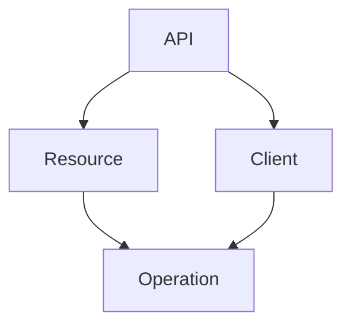
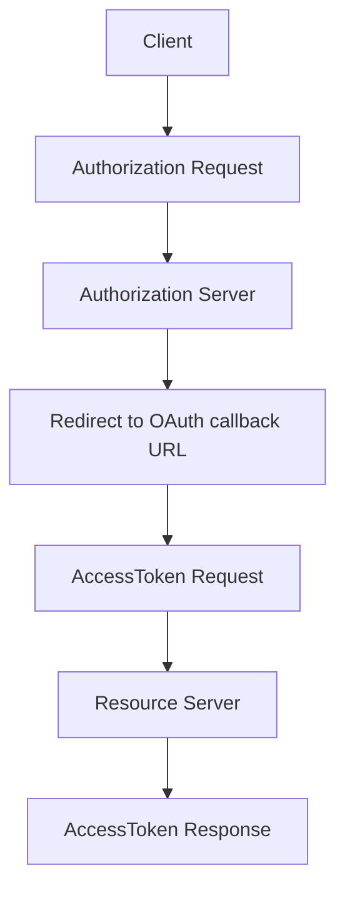

                 

<think>
好，我现在要帮用户完成一个关于API设计，特别是为AI Agent提供友好接口的技术博客文章。首先，我需要理解用户的需求。他们希望有一篇结构清晰、内容深入的技术博客，分为几个部分，每个部分都有详细的章节和子章节。

首先，我会从目录大纲入手，确保每个部分的内容都涵盖到位。第一部分是API设计基础，我需要先介绍基本概念，比如什么是API，RESTful API的特点，HTTP协议的基础知识。然后是API设计的原则，包括资源建模、统一接口设计和扩展性。接下来是AI Agent与API的结合，这部分需要解释AI Agent是什么，它对API的需求，以及友好接口设计的原则。

第二部分是API设计的核心概念与联系，这里我会详细讲解核心概念，比如资源、请求、响应等，以及它们之间的关系。然后是API设计的算法原理，这部分需要结合实际，比如OAuth 2.0的授权流程，使用Mermaid图来展示流程。数学公式方面，我会涉及JWT的签名算法，用Latex来展示。

第三部分是AI Agent的API设计实战，这里我会通过一个案例来展示如何设计一个AI助手的API。包括环境安装、核心代码实现、功能模块分析和系统架构设计。同时，我需要使用Mermaid图来展示类图、架构图和序列图，以帮助读者更好地理解。

第四部分是系统安全与性能优化，这里我会讨论API的安全威胁，OAuth 2.0的实现，以及JWT的使用。同时，我会介绍性能优化的策略，如分页、缓存和压缩。最后，我会给出代码优化的建议，如错误处理和日志记录。

第五部分是总结与展望，我会回顾整个设计过程，总结最佳实践，并展望未来的发展趋势，比如AI Agent与边缘计算的结合。

在撰写过程中，我需要确保每个章节都有详细的解释和例子，帮助读者理解复杂的概念。同时，数学公式和图表的使用要准确，确保技术细节无误。最后，我会在文章末尾添加注意事项，帮助读者在实际应用中避免常见错误。

现在，我需要按照这个结构一步步撰写文章，确保每个部分都完整且深入。同时，要注意语言的专业性和可读性，使读者能够轻松理解并应用这些知识。
</think>

# API设计：为AI Agent提供友好的接口

## 关键词：
- API设计，AI Agent，RESTful API，HTTP协议，OAuth 2.0，JWT，系统架构

## 摘要：
在现代软件开发中，API设计是构建高效、可扩展系统的核心。本文深入探讨了如何为AI Agent设计友好、高效的API接口，涵盖了API设计的基础、AI Agent的需求、系统架构的安全性与性能优化、实战案例以及未来展望。

---

## 第一部分: API设计基础

### 第1章: API的基本概念与重要性

#### 1.1 API的基本概念
- **什么是API**：API（Application Programming Interface）是一组定义程序间如何交互的接口。它允许不同的系统或模块之间通过定义良好的接口进行通信。
- **API的重要性**：API是现代软件架构的核心，它使得不同系统可以协作完成复杂的任务，而无需深入了解彼此的内部实现。
- **API的分类**：API可以分为RESTful API、RPC API、SOAP API等，其中RESTful API最为常见。

#### 1.2 RESTful API概述
- **RESTful API的定义**：REST（Representational State Transfer）是一种基于HTTP协议的设计风格，强调无状态、资源导向和统一接口。
- **REST的五大原则**：
  1. 统一接口（Uniform Interface）：使用标准的HTTP方法（如GET、POST、PUT、DELETE）。
  2. 资源导向（Resource-Oriented）：将系统中的资源抽象为URL。
  3. 无状态（Stateless）：每个请求都必须包含足够的信息，以独立处理。
  4. 缓存（Cacheable）：允许缓存响应以提高性能。
  5. 分层体系结构（Layered Architecture）：通过中间层分隔客户端和服务器。

#### 1.3 HTTP协议基础
- **HTTP请求方法**：GET（获取数据）、POST（创建数据）、PUT（更新数据）、DELETE（删除数据）。
- **HTTP状态码**：200（成功）、201（创建）、400（错误请求）、401（未授权）、404（资源未找到）、500（服务器错误）。
- **HTTP头与内容协商**：Content-Type（定义内容类型）、Accept（指定客户端可接受的内容类型）。

### 第2章: API设计原则

#### 2.1 资源建模与状态管理
- **资源建模的基本原则**：每个资源应有唯一的标识符，并且资源之间的关系应清晰。
- **状态管理的实现方式**：通过URL、查询参数和请求头来传递状态。
- **资源之间的关系与依赖**：使用超链接（HATEOAS）来表示资源之间的关系。

#### 2.2 统一接口设计
- **统一接口的设计原则**：所有API应遵循相同的接口设计，避免重复造轮子。
- **接口版本控制**：通过URL路径、请求头或自定义字段来标识API版本。
- **接口文档的编写与管理**：使用OpenAPI（Swagger）等工具编写API文档，并保持文档的及时更新。

#### 2.3 可扩展性与可维护性
- **API设计的可扩展性**：预留扩展接口，避免硬编码。
- **API设计的可维护性**：保持接口简单，避免复杂逻辑。
- **API版本升级策略**：兼容旧版本，逐步淘汰不常用的接口。

### 第3章: AI Agent与API的结合

#### 3.1 AI Agent的基本概念
- **什么是AI Agent**：AI Agent是一种能够感知环境、自主决策并执行任务的智能体。
- **AI Agent的核心功能**：感知、推理、规划、执行和学习。
- **AI Agent的应用场景**：智能助手、自动驾驶、智能客服等。

#### 3.2 AI Agent中的API需求
- **AI Agent对API的基本要求**：实时性、准确性、可扩展性和安全性。
- **AI Agent中的API分类**：
  1. 数据接口：获取用户输入、传感器数据等。
  2. 服务接口：调用NLP、机器学习模型等服务。
  3. 控制接口：接收命令和反馈。

#### 3.3 友好接口的设计原则
- **易用性原则**：接口设计简洁，文档清晰。
- **可读性原则**：响应结构层次分明，易于解析。
- **可维护性原则**：预留日志、错误处理等接口。

---

## 第二部分: API设计的核心概念与联系

### 第4章: API设计的核心概念

#### 4.1 核心概念原理
- **资源、资源标识与操作**：资源是API的核心，资源标识用于唯一标识资源，操作用于对资源执行动作。
- **请求、响应与状态**：请求包含操作和数据，响应包含结果和状态。
- **授权与身份验证**：通过OAuth 2.0等协议实现安全的API访问。

#### 4.2 核心概念属性对比
- **请求方法对比表**：

| 请求方法 | 描述                     |
|----------|--------------------------|
| GET      | 获取资源                 |
| POST     | 创建资源                 |
| PUT      | 更新资源                 |
| DELETE   | 删除资源                 |

- **响应状态码对比表**：

| 状态码范围 | 描述                     |
|------------|--------------------------|
| 200-299    | 成功                     |
| 300-399    | 重定向                   |
| 400-499    | 客户端错误               |
| 500-599    | 服务器错误               |

- **授权方式对比表**：

| 授权方式 | 描述                     |
|----------|--------------------------|
| OAuth 2.0| 基于令牌的授权           |
| API Key  | 简单的密钥验证           |

#### 4.3 ER实体关系图


### 第5章: API设计的算法原理

#### 5.1 OAuth 2.0授权流程


#### 5.2 JWT签名算法
- **数学公式**：JWT的签名过程涉及HMAC算法，公式为：$signature = HMAC_{key}(header + "." + payload)$。
- **代码实现**：
  ```python
  import jwt
  secret_key = 'your-secret-key'
  payload = {'user_id': 123}
  token = jwt.encode(payload, secret_key, algorithm='HS256')
  print(token)
  ```

---

## 第三部分: AI Agent的API设计实战

### 第6章: AI Agent的API设计

#### 6.1 环境安装
- 安装Python和必要的库：
  ```bash
  pip install flask
  pip install python-dotenv
  pip install requests
  ```

#### 6.2 核心代码实现
- 实现一个简单的AI助手API：
  ```python
  from flask import Flask, request
  import json

  app = Flask(__name__)

  @app.route('/api/ai/analyze', methods=['POST'])
  def analyze():
      data = request.get_json()
      text = data.get('text', '')
      # 这里可以调用NLP模型进行分析
      result = {'status': 'success', 'message': 'Analysis complete'}
      return json.dumps(result)

  if __name__ == '__main__':
      app.run(debug=True)
  ```

#### 6.3 功能模块分析
- **NLP接口**：处理自然语言输入，返回结构化数据。
- **知识图谱接口**：提供实体识别、关系抽取功能。
- **对话管理接口**：维护对话上下文，实现多轮对话。

#### 6.4 系统架构设计
- **类图**：
  ```mermaid
  classDiagram
      class API {
          analyze(text: str) -> result: dict
      }
      class NLPService {
          process(text: str) -> tokens: list
      }
      class KnowledgeGraph {
          query(entity: str) -> relations: list
      }
      API --> NLPService
      API --> KnowledgeGraph
  ```

- **架构图**：
  ```mermaid
  serviceDiagram
      client --> API Gateway
      API Gateway --> AI Service
      AI Service --> NLPService
      AI Service --> KnowledgeGraph
  ```

#### 6.5 系统交互
- **序列图**：
  ```mermaid
  sequenceDiagram
      client ->> API Gateway: POST /api/analyze
      API Gateway ->> AI Service: Analyze request
      AI Service ->> NLPService: Process text
      NLPService ->> AI Service: Return tokens
      AI Service ->> KnowledgeGraph: Query entities
      KnowledgeGraph ->> AI Service: Return relations
      AI Service ->> client: Return result
  ```

---

## 第四部分: 系统安全与性能优化

### 第7章: 系统安全

#### 7.1 安全威胁分析
- **常见威胁**：未授权访问、数据泄露、拒绝服务攻击（DDoS）。

#### 7.2 OAuth 2.0实现
- **授权流程**：
  ```mermaid
  graph TD
      Client --> Authorization Request
      Authorization Request --> Authorization Server
      Authorization Server --> Redirect URL
      Redirect URL --> Token Request
      Token Request --> Token Endpoint
      Token Endpoint --> Access Token
      Access Token --> Resource Server
  ```

#### 7.3 JWT的使用
- **代码实现**：
  ```python
  import jwt
  secret_key = 'your-secret-key'
  payload = {'user_id': 123, 'exp': 1625428800}
  token = jwt.encode(payload, secret_key, algorithm='HS256')
  print(token)
  ```

### 第8章: 性能优化

#### 8.1 API性能优化
- **分页与过滤**：通过分页和过滤参数减少数据传输量。
- **缓存机制**：使用Redis或Memcached缓存常用数据。
- **压缩与Gzip**：通过Gzip压缩减少数据传输时间。

#### 8.2 代码优化
- **错误处理**：
  ```python
  try:
      response = requests.get(url, timeout=5)
  except requests.exceptions.RequestException as e:
      print(f"Error: {e}")
      return None
  ```

- **日志记录**：
  ```python
  import logging
  logging.basicConfig(level=logging.INFO)
  logger = logging.getLogger(__name__)
  ```

---

## 第五部分: 总结与展望

### 第9章: 总结
- **回顾与反思**：本文详细探讨了API设计的核心概念、AI Agent的需求以及系统安全与性能优化的方法。
- **最佳实践**：遵循RESTful原则，注重可扩展性和可维护性，确保API的安全性。

### 第10章: 展望
- **未来趋势**：API设计将更加注重智能化和自动化，AI Agent将与边缘计算、物联网等技术深度融合。
- **技术挑战**：如何在保证安全性的同时，提升API的性能和可扩展性，仍是一个重要的研究方向。

---

## 作者：AI天才研究院/AI Genius Institute & 禅与计算机程序设计艺术 /Zen And The Art of Computer Programming

---

**注意事项**：
- 在实际开发中，建议使用成熟的API设计工具（如Postman、Swagger）来设计和测试API。
- 安全性是API设计的重中之重，建议使用HTTPS协议，并定期进行安全审计。
- 性能优化需要结合具体的业务场景，选择合适的缓存策略和数据压缩方式。

