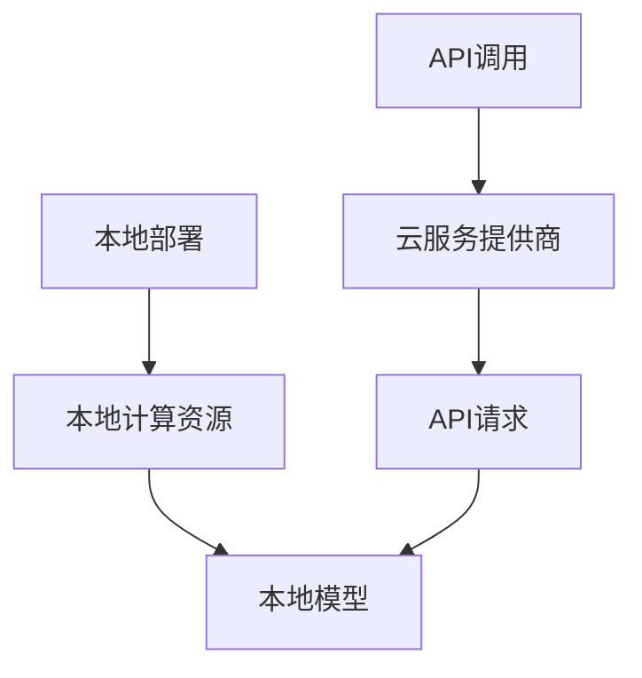
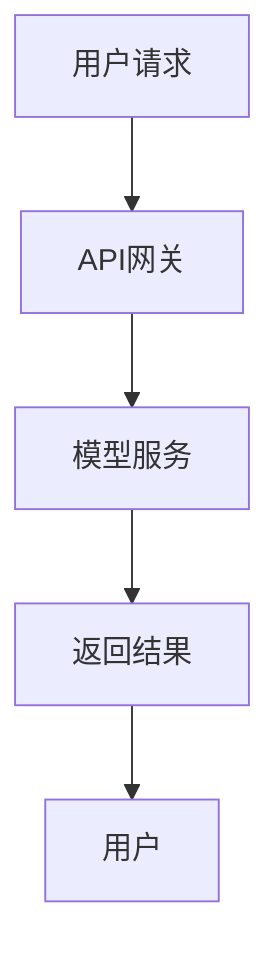
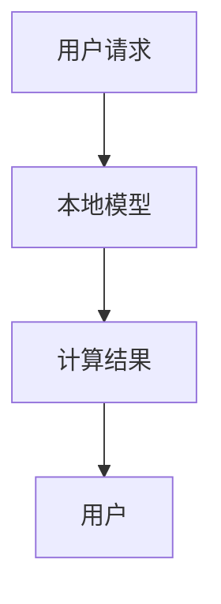
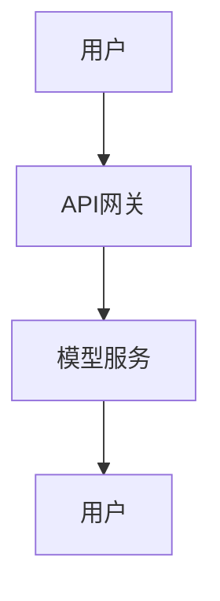
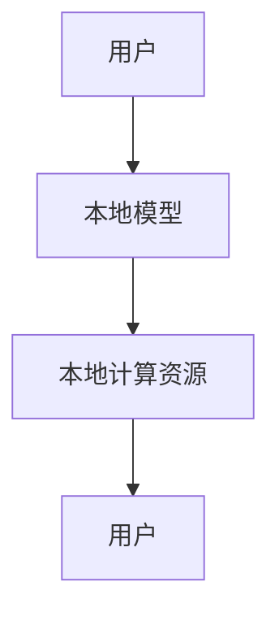

                 

<think>
好的，现在我要帮用户撰写一篇关于《API调用还是本地部署？LLM使用策略对比》的技术博客文章。用户已经提供了详细的大纲，我需要按照这个大纲来逐步展开内容。

首先，我需要理解每个部分的要求。用户希望文章结构清晰，内容专业，每个章节都要有详细的解释和对比。文章需要涵盖背景介绍、核心概念对比、技术实现、系统架构设计、项目实战以及总结与展望。

在开始撰写之前，我需要确保每个部分都包含必要的内容，比如定义LLM，对比API调用和本地部署的优缺点，分析它们的技术实现，绘制相应的流程图和架构图，以及提供实际案例和代码示例。

接下来，我会按照大纲逐一展开每个章节，确保内容详实，结构合理。同时，我需要使用专业的技术语言，同时保持文章的易读性和逻辑性。

现在，我开始撰写文章，确保每个部分都符合用户的要求，并且内容完整，逻辑清晰。
</think>

# API调用还是本地部署？LLM使用策略对比

## 关键词：
LLM, API调用, 本地部署, 对比分析, 技术实现, 系统架构

## 摘要：
本文通过对比分析API调用和本地部署两种LLM使用策略，探讨其优缺点、适用场景及技术实现。结合实际案例，深入分析两者在性能、成本、安全性和灵活性上的差异，帮助读者选择最适合的策略。

---

## 第一部分: API调用与本地部署的背景与对比

### 第1章: LLM使用策略概述

#### 1.1 LLM的基本概念
##### 1.1.1 什么是LLM
大语言模型（LLM，Large Language Model）是基于深度学习的自然语言处理模型，能够理解和生成人类语言文本。LLM通过大量数据训练，可以执行多种任务，如文本生成、翻译、问答等。

##### 1.1.2 LLM的核心特点
- **大规模训练数据**：通常使用数百万条数据进行训练。
- **深度神经网络**：多层结构，能够捕捉复杂语言模式。
- **上下文理解**：能理解上下文，生成连贯文本。
- **可扩展性**：支持多种语言和领域。

##### 1.1.3 LLM的应用场景
- **文本生成**：创意写作、新闻报道生成。
- **自动回复**：客服系统、聊天机器人。
- **代码生成**：生成编程代码。
- **数据分析**：从文本中提取信息。

#### 1.2 API调用与本地部署的背景
##### 1.2.1 API调用的兴起
随着云计算的发展，API调用变得简单高效。企业通过API访问公共云服务，快速部署模型，节省开发时间和成本。

##### 1.2.2 本地部署的需求
对于数据隐私、性能优化或特定功能需求，企业可能选择本地部署模型。本地部署提供更高的控制权和定制化能力。

##### 1.2.3 两种策略的对比维度
| 对比维度 | API调用 | 本地部署 |
|----------|----------|-----------|
| 成本      | 按使用付费，初期投入低 | 高额硬件和维护成本 |
| 性能      | 受网络延迟影响 | 更高的性能和响应速度 |
| 安全性    | 数据可能在云端处理 | 数据本地存储，安全性高 |
| 灵活性    | 易于扩展和维护 | 需要较高的技术投入 |

---

### 第2章: API调用与本地部署的对比分析

#### 2.1 核心概念对比
##### 2.1.1 API调用的优缺点
**优点**：
- **快速部署**：无需本地资源，直接调用API。
- **节省成本**：按需付费，避免前期投入。
- **易于维护**：云服务提供商负责更新和维护。

**缺点**：
- **网络延迟**：受网络状况影响，响应时间不稳定。
- **依赖第三方**：依赖云服务提供商的稳定性和服务质量。
- **数据隐私**：数据传输过程中可能面临安全风险。

##### 2.1.2 本地部署的优缺点
**优点**：
- **高性能**：本地计算资源充足，响应速度快。
- **数据隐私**：数据本地存储，减少数据泄露风险。
- **定制化**：可以根据需求进行高度定制。

**缺点**：
- **高成本**：硬件和维护成本高昂。
- **技术门槛**：需要专业的技术团队进行部署和维护。
- **扩展性差**：资源不足时，扩展性受限。

##### 2.1.3 对比维度表格
（如前所述）

#### 2.2 实体关系图


---

## 第3章: LLM使用策略的技术实现

### 3.1 API调用的技术细节

#### 3.1.1 API调用流程


##### 3.1.2 API调用的实现步骤
1. 用户向API网关发送请求。
2. 网关将请求转发到模型服务。
3. 模型处理请求，生成响应。
4. 响应返回给用户。

#### 3.1.3 API调用的延迟计算
$$T_{\text{总}} = T_{\text{网络}} + T_{\text{处理}} + T_{\text{返回}}$$

### 3.2 本地部署的技术细节

#### 3.2.1 本地部署流程


##### 3.2.2 本地部署的实现步骤
1. 用户向本地模型发送请求。
2. 模型处理请求，生成响应。
3. 响应直接返回给用户。

#### 3.2.3 本地部署的性能优化
- 使用GPU加速计算。
- 并行处理多个请求。

---

### 第4章: 算法原理与数学模型

#### 4.1 API调用的算法原理
##### 4.1.1 请求处理流程
1. 接收用户请求。
2. 解析请求内容。
3. 调用LLM生成响应。
4. 返回响应结果。

#### 4.1.2 响应时间计算
$$T_{\text{响应}} = T_{\text{网络}} + T_{\text{处理}}$$

#### 4.1.3 示例
假设网络延迟为200ms，处理时间为500ms，总响应时间为700ms。

---

#### 4.2 本地部署的算法原理
##### 4.2.1 模型加载优化
- 使用缓存技术，减少重复加载时间。
- 预加载常用模型，提高响应速度。

##### 4.2.2 并行计算加速
$$T_{\text{处理}} = \frac{T_{\text{总任务}}}{N_{\text{核心}}}$$

##### 4.2.3 示例
假设总任务数为1000，核心数为4，每个核心处理250个任务，总处理时间为250ms。

---

## 第5章: 系统架构与设计

### 5.1 系统架构设计

#### 5.1.1 API调用架构


#### 5.1.2 本地部署架构


---

### 5.2 系统交互设计

#### 5.2.1 API调用交互
```mermaid
sequenceDiagram
用户->>+API网关: 发送请求
API网关->>+模型服务: 请求处理
模型服务->>-<API网关: 返回结果
API网关->>-<用户: 返回响应
```

#### 5.2.2 本地部署交互
```mermaid
sequenceDiagram
用户->>+本地模型: 发送请求
本地模型->>-<用户: 返回响应
```

---

## 第6章: 项目实战

### 6.1 环境安装

#### 6.1.1 API调用环境
- 安装Python和相关库（如requests）。
- 配置API密钥。

#### 6.1.2 本地部署环境
- 安装Python和TensorFlow/PyTorch。
- 配置GPU驱动和计算框架。

### 6.2 核心代码实现

#### 6.2.1 API调用代码
```python
import requests

def call_api(prompt):
    api_key = "your_api_key"
    url = "https://api.example.com/v1/generate"
    headers = {"Authorization": f"Bearer {api_key}"}
    payload = {"prompt": prompt}
    response = requests.post(url, headers=headers, json=payload)
    return response.json()['result']
```

#### 6.2.2 本地部署代码
```python
import tensorflow as tf

def load_model():
    model = tf.load_model('local_model.h5')
    return model

def process_request(prompt, model):
    result = model.generate_response(prompt)
    return result
```

### 6.3 案例分析与代码解读
- **API调用案例**：生成一段文本。
- **本地部署案例**：本地识别图像。

### 6.4 项目小结
- API调用适合快速开发和小型项目。
- 本地部署适合对性能和隐私要求高的场景。

---

## 第7章: 总结与展望

### 7.1 总结
- API调用和本地部署各有优劣。
- 选择策略需根据实际需求权衡成本、性能和安全性。

### 7.2 未来展望
- 结合API调用和本地部署的优势，探索混合部署模式。
- 提升模型性能和安全性，推动LLM技术发展。

### 7.3 最佳实践 Tips
- **API调用**：适用于开发初期和资源有限的企业。
- **本地部署**：适用于对性能和隐私要求高的场景。
- **混合模式**：结合两种策略，灵活应对不同需求。

### 7.4 小结
本文通过全面对比API调用和本地部署，帮助读者选择最适合的LLM使用策略。

---

## 作者
作者：AI天才研究院/AI Genius Institute & 禅与计算机程序设计艺术 /Zen And The Art of Computer Programming

