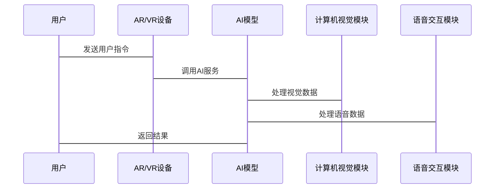

                 


# AR/VR+AI：沉浸式体验中的智能助手

> 关键词：AR/VR, AI, 智能助手, 沉浸式体验, 计算机视觉, 语音交互, 多模态融合

> 摘要：本文深入探讨了AR/VR与AI的结合，特别是智能助手在沉浸式体验中的应用。通过分析计算机视觉、语音交互和多模态融合等关键技术，结合实际案例和系统设计，展示了如何利用AI技术提升AR/VR体验的智能化水平。

---

# 第1章: AR/VR与AI的结合概述

## 1.1 AR/VR的基本概念与技术背景

### 1.1.1 增强现实（AR）的基本概念
- AR是一种将数字信息叠加在真实环境中的技术，通过摄像头、传感器和显示设备实现。
- AR的核心特征：实时性、交互性、三维注册和跟踪。
- AR的主要应用场景：游戏、教育、医疗、工业等。

### 1.1.2 虚拟现实（VR）的基本概念
- VR是一种完全沉浸式的数字环境，通过头显设备、手柄和传感器实现。
- VR的核心特征：沉浸感、交互性和实时性。
- VR的主要应用场景：游戏、培训、虚拟会议等。

### 1.1.3 AR/VR的核心技术与应用领域
- AR/VR的核心技术：计算机视觉、3D建模、渲染技术、传感器融合。
- AR/VR的应用领域：教育、医疗、娱乐、工业、军事等。

## 1.2 AI在沉浸式体验中的作用

### 1.2.1 AI在AR/VR中的核心地位
- AI为AR/VR提供了智能化的交互方式，使其更具人性化。
- AI技术：自然语言处理、计算机视觉、语音识别、推荐系统等。
- AI在AR/VR中的应用：实时翻译、手势识别、智能推荐等。

### 1.2.2 AI如何提升沉浸式体验的智能性
- AI通过实时分析用户行为和环境数据，优化AR/VR体验。
- AI实现的智能特性：个性化推荐、动态调整、实时反馈。
- AI在沉浸式体验中的优势：提高用户体验、降低开发成本。

### 1.2.3 智能助手在AR/VR中的应用场景
- 智能助手在AR/VR中的角色：用户交互的桥梁、信息的提供者、任务的执行者。
- 智能助手的功能：实时翻译、语音交互、物体识别、路径规划。
- 智能助手的典型案例：教育中的虚拟讲解员、医疗中的手术辅助系统。

## 1.3 AR/VR+AI的结合与发展趋势

### 1.3.1 AR/VR+AI的融合趋势
- AR/VR与AI的深度融合将推动沉浸式体验的智能化升级。
- AI在AR/VR中的应用将更加广泛，涵盖教育、医疗、娱乐等多个领域。
- AR/VR+AI将推动新一代人机交互方式的创新。

### 1.3.2 智能助手在沉浸式体验中的未来发展
- 智能助手将更加智能化，具备更强的自然语言处理能力和实时响应能力。
- 智能助手将与AR/VR设备深度融合，提供更加沉浸式的交互体验。
- 智能助手将支持更多模态的数据输入，实现更全面的用户需求满足。

### 1.3.3 技术挑战与机遇
- 技术挑战：实时性、准确性和设备兼容性。
- 机遇：AI技术的快速发展为AR/VR提供了更多的可能性。

---

# 第2章: AR/VR中的计算机视觉技术

## 2.1 计算机视觉在AR/VR中的应用

### 2.1.1 基于AI的图像识别技术
- 图像识别在AR/VR中的应用：物体识别、场景分割、目标检测。
- 基于深度学习的图像识别模型：卷积神经网络（CNN）。
- 图像识别的流程：数据采集、特征提取、分类器训练。

### 2.1.2 姿态估计与动作捕捉
- 姿态估计的基本原理：基于深度学习的2D/3D姿态估计。
- 动作捕捉的技术：基于惯性传感器和摄像头的混合捕捉。
- 姿态估计在AR/VR中的应用：虚拟角色控制、手势识别。

### 2.1.3 3D物体检测与跟踪
- 3D物体检测的基本原理：基于激光雷达和摄像头的3D检测。
- 3D物体跟踪的技术：基于特征点的跟踪和基于深度学习的跟踪。
- 3D物体检测在AR/VR中的应用：虚拟试衣、增强现实广告。

---

## 2.2 AR/VR中的目标检测与识别

### 2.2.1 YOLO算法在AR/VR中的应用
- YOLO算法的基本原理：基于深度学习的实时目标检测。
- YOLO算法在AR/VR中的应用：实时物体识别、场景分割。
- YOLO算法的优化：轻量化模型设计。

### 2.2.2 基于深度学习的目标检测流程
- 数据采集与标注：使用LabelImg等工具进行标注。
- 模型训练：基于Faster R-CNN或YOLO等模型进行训练。
- 模型部署：将训练好的模型部署到AR/VR设备中。

### 2.2.3 实际案例分析
- 案例：AR游戏中的目标识别。
- 技术细节：使用YOLO算法实时检测游戏中的目标物体。
- 优化建议：优化模型的检测速度和准确性。

---

# 第3章: AR/VR中的语音交互技术

## 3.1 语音识别与合成在AR/VR中的应用

### 3.1.1 基于AI的语音识别技术
- 语音识别的基本原理：基于深度学习的端到端语音识别。
- 语音识别在AR/VR中的应用：语音控制、实时翻译。
- 语音识别的挑战：噪声环境下的识别精度。

### 3.1.2 语音合成与自然语言处理
- 语音合成的基本原理：基于波形生成模型（如Wavenet）和文本到语音模型（如Tacotron）。
- 语音合成在AR/VR中的应用：虚拟助手的语音输出、实时翻译。
- 自然语言处理在语音交互中的作用：理解用户的意图并生成合适的回复。

### 3.1.3 语音交互的实时性与准确性
- 语音交互的实时性要求：毫秒级响应。
- 语音交互的准确性优化：基于上下文的理解和多模态数据的融合。
- 语音交互的挑战：多语种支持、方言识别、噪声环境下的识别精度。

---

## 3.2 声纹识别与语音情感分析

### 3.2.1 声纹识别的基本原理
- 声纹识别的定义：基于语音特征的 speaker recognition。
- 声纹识别的应用：身份验证、情感分析。
- 声纹识别的实现：基于GMM的 speaker diarization 和基于深度学习的 speaker embedding。

### 3.2.2 语音情感分析的应用场景
- 语音情感分析的定义：基于语音特征的情感识别。
- 语音情感分析的应用：智能助手的情感反馈、虚拟角色的情感表达。
- 语音情感分析的实现：基于深度学习的多模态情感分析模型。

### 3.2.3 基于AI的语音交互优化
- 基于反馈机制的语音交互优化。
- 基于上下文理解的语音交互优化。
- 基于多模态数据融合的语音交互优化。

---

# 第4章: AR/VR中的多模态融合技术

## 4.1 多模态数据的采集与处理

### 4.1.1 视觉、听觉与触觉数据的融合
- 多模态数据的定义：视觉、听觉、触觉等多种数据类型的融合。
- 多模态数据的采集：基于摄像头、麦克风、触觉传感器的数据采集。
- 多模态数据的处理：基于深度学习的多模态融合模型。

### 4.1.2 基于AI的多模态数据处理流程
- 数据预处理：数据清洗、特征提取。
- 模型训练：基于深度学习的多模态融合模型训练。
- 模型部署：将训练好的模型部署到AR/VR设备中。

### 4.1.3 多模态数据融合的挑战与解决方案
- 数据同步的挑战：不同模态数据的时间同步问题。
- 数据融合的挑战：如何有效融合多种模态数据。
- 解决方案：基于时间戳的同步方法、基于深度学习的多模态融合方法。

---

## 4.2 多模态融合在智能助手中的应用

### 4.2.1 基于多模态数据的用户行为预测
- 用户行为预测的定义：基于多模态数据预测用户的下一步操作。
- 用户行为预测的应用：智能助手的主动服务、虚拟角色的行为模拟。
- 用户行为预测的实现：基于深度学习的多模态行为预测模型。

### 4.2.2 多模态数据驱动的智能决策
- 多模态数据驱动的智能决策的定义：基于多模态数据进行智能决策。
- 多模态数据驱动的智能决策的应用：智能助手的决策优化、虚拟角色的自主决策。
- 多模态数据驱动的智能决策的实现：基于深度学习的多模态决策模型。

### 4.2.3 实际案例分析
- 案例：智能助手在AR游戏中的应用。
- 技术细节：基于多模态数据的用户行为预测和智能决策。
- 优化建议：优化模型的准确性和响应速度。

---

# 第5章: 智能助手系统分析与设计

## 5.1 项目背景与目标

### 5.1.1 项目背景介绍
- 项目背景：AR/VR技术的快速发展和AI技术的深度融合。
- 项目目标：设计并实现一个基于AR/VR和AI的智能助手系统。
- 项目范围：涵盖计算机视觉、语音交互和多模态融合技术。

### 5.1.2 项目目标与核心功能
- 核心功能：实时物体识别、语音交互、多模态数据融合。
- 项目目标：实现一个智能化的AR/VR智能助手系统。
- 项目约束：设备性能限制、算法实时性要求。

## 5.2 系统功能设计

### 5.2.1 领域模型设计（Mermaid类图）
```mermaid
classDiagram
    class User {
        id: integer
        name: string
        role: string
    }
    class AR/VR设备 {
        device_id: integer
        type: string
        status: string
    }
    class AI模型 {
        model_name: string
        model_version: integer
        model_type: string
    }
    class 用户交互 {
        input_type: string
        output_type: string
        interaction_log: string
    }
    User --> AR/VR设备: 使用
    AR/VR设备 --> AI模型: 调用
    用户交互 --> AI模型: 处理
```

### 5.2.2 系统架构设计（Mermaid架构图）


### 5.2.3 接口设计与交互流程图


---

# 第6章: 项目实战

## 6.1 环境安装与配置

### 6.1.1 开发环境安装
- 操作系统：Windows/Linux/MacOS
- 开发工具：PyCharm/VSCode
- 依赖安装：安装Python、TensorFlow、OpenCV、Keras等。

### 6.1.2 AR/VR设备驱动安装
- 安装AR/VR设备驱动：如Oculus SDK、OpenVR等。
- 配置设备权限：确保设备能够被程序调用。

## 6.2 系统核心实现源代码

### 6.2.1 计算机视觉模块代码
```python
import cv2
import numpy as np

def detect_objects(image):
    # 假设使用YOLO算法进行目标检测
    model = load_model()  # 加载训练好的YOLO模型
    boxes, labels, _ = model.predict(image)
    return boxes, labels
```

### 6.2.2 语音交互模块代码
```python
import speech_recognition as sr

def recognize_speech():
    r = sr.Recognizer()
    with sr.Microphone() as source:
        audio = r.listen(source)
        return r.recognize_google(audio)
```

### 6.2.3 多模态融合模块代码
```python
import numpy as np

def fuse_modalities(image, audio):
    # 假设image是计算机视觉模块返回的结果，audio是语音交互模块返回的结果
    # 这里只是一个示例，实际实现需要根据具体需求设计
    return np.concatenate((image, audio))
```

## 6.3 代码解读与分析

### 6.3.1 计算机视觉模块解读
- 代码功能：使用YOLO算法进行目标检测。
- 输入：图像数据。
- 输出：目标检测结果。

### 6.3.2 语音交互模块解读
- 代码功能：使用Speech Recognition库进行语音识别。
- 输入：麦克风输入的语音数据。
- 输出：识别后的文本。

### 6.3.3 多模态融合模块解读
- 代码功能：将计算机视觉和语音交互的结果进行融合。
- 输入：计算机视觉模块返回的图像数据，语音交互模块返回的文本数据。
- 输出：融合后的数据。

## 6.4 实际案例分析与优化建议

### 6.4.1 实际案例分析
- 案例：智能助手在AR游戏中的应用。
- 技术细节：使用YOLO算法进行目标检测，使用Speech Recognition进行语音识别，基于多模态数据进行用户行为预测。
- 优化建议：优化模型的检测速度和准确性。

### 6.4.2 优化建议
- 模型优化：使用轻量化模型提高实时性。
- 数据优化：增加训练数据量，提高模型的泛化能力。
- 系统优化：优化设备的性能，减少延迟。

---

# 第7章: 最佳实践与总结

## 7.1 最佳实践 tips

### 7.1.1 系统设计
- 系统设计要注重模块化，便于后续的维护和扩展。
- 系统设计要考虑设备的兼容性，确保在不同设备上都能正常运行。

### 7.1.2 算法优化
- 算法优化要注重实时性，确保在AR/VR设备上能够快速响应。
- 算法优化要考虑模型的轻量化，减少计算资源的消耗。

### 7.1.3 人机交互
- 人机交互要注重用户体验，确保用户能够方便地使用智能助手。
- 人机交互要注重反馈的及时性，确保用户能够得到实时的反馈。

## 7.2 小结

- 本文深入探讨了AR/VR与AI的结合，特别是智能助手在沉浸式体验中的应用。
- 通过分析计算机视觉、语音交互和多模态融合等关键技术，结合实际案例和系统设计，展示了如何利用AI技术提升AR/VR体验的智能化水平。

## 7.3 注意事项

- 在实际应用中，要注意设备的性能限制，确保系统的实时性。
- 在实际应用中，要注意数据的安全性，确保用户数据不被泄露。
- 在实际应用中，要注意用户体验，确保用户能够方便地使用系统。

## 7.4 拓展阅读

- 推荐阅读《深度学习》（Deep Learning, Ian Goodfellow等著）。
- 推荐阅读《计算机视觉入门》（Computer Vision: A Modern Approach, Richard Szeliski著）。
- 推荐阅读《语音处理与识别》（Speech and Language Processing, Daniel Jurafsky等著）。

---

# 作者：AI天才研究院/AI Genius Institute & 禅与计算机程序设计艺术 /Zen And The Art of Computer Programming

---

> **总结**：通过本文的分析与实践，我们可以看到AR/VR与AI的结合为沉浸式体验带来了巨大的可能性。智能助手作为AR/VR中的重要组成部分，将在未来的沉浸式体验中发挥越来越重要的作用。

