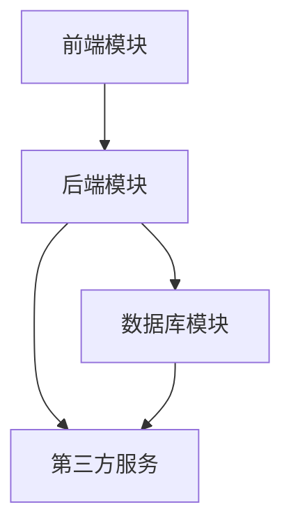
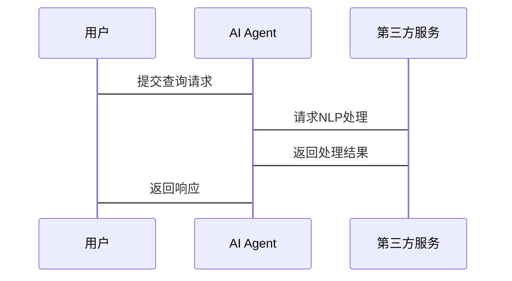

                 


# CI/CD流程：实现AI Agent的持续集成与部署

> 关键词：CI/CD，持续集成，持续部署，AI Agent，DevOps，自动化构建，自动化部署

> 摘要：本文详细探讨了如何在AI Agent开发过程中实施CI/CD（持续集成与持续部署）流程。从CI/CD的基本概念到AI Agent的持续集成与部署的具体实现，结合实际项目案例，系统性地分析了CI/CD在AI Agent项目中的应用价值、实现方法和最佳实践。通过本文的学习，读者可以掌握如何在AI Agent开发中高效实施CI/CD流程，提升开发效率和代码质量。

---

## 第一章：CI/CD概述

### 1.1 持续集成与持续部署的定义与重要性

#### 1.1.1 CI和CD的定义
- **持续集成（CI）**：通过自动化工具将代码频繁地集成到主代码库中，并自动进行构建、测试和验证，确保每次提交的代码都是稳定可靠的。
- **持续部署（CD）**：在持续集成的基础上，将代码从测试环境逐步部署到生产环境，确保每个版本都能快速、安全地交付给用户。

#### 1.1.2 CI与CD的区别与联系
- **区别**：
  - CI关注代码的集成和测试，确保每次提交的代码是正确的。
  - CD关注代码的部署，确保代码能够顺利地从测试环境部署到生产环境。
- **联系**：
  - CD是CI的自然延伸，两者结合可以实现代码从开发到生产的自动化交付。

#### 1.1.3 CI/CD在软件开发中的作用
- 提高代码质量，减少集成风险。
- 加快开发迭代速度，缩短交付周期。
- 提供实时反馈，便于开发人员快速定位和修复问题。
- 降低人为错误，确保代码交付的一致性和可靠性。

### 1.2 AI Agent的基本概念

#### 1.2.1 AI Agent的定义
- AI Agent（人工智能代理）是一种能够感知环境并采取行动以实现目标的智能实体。它可以是一个软件程序，也可以是一个物理设备，通过与环境交互来完成特定任务。

#### 1.2.2 AI Agent的核心功能
- **感知环境**：通过传感器或其他输入方式获取环境信息。
- **决策与推理**：基于获取的信息进行分析和推理，制定行动策略。
- **执行操作**：根据决策结果执行相应的操作，与环境进行交互。

#### 1.2.3 AI Agent的应用场景
- 智能家居：控制家中的设备，如智能灯泡、空调等。
- 自动驾驶：处理车辆的感知、决策和控制。
- 智能客服：通过自然语言处理为用户提供支持和服务。

---

## 第二章：AI Agent的持续集成流程

### 2.1 版本控制与代码管理

#### 2.1.1 版本控制工具
- **Git**：目前最流行的版本控制工具，支持分支、合并、代码审查等功能。
- **代码仓库**：使用GitHub、GitLab或Bitbucket等平台托管代码仓库，便于团队协作。

#### 2.1.2 代码审查与分支策略
- **代码审查（Code Review）**：通过人工或工具检查代码，确保代码质量。
- **分支策略**：使用Git Flow或GitHub Flow等分支策略，规范代码提交和发布流程。

#### 2.1.3 自动化构建与单元测试
- **CI工具**：使用Jenkins、Travis CI、GitHub Actions等工具自动化构建代码。
- **单元测试**：编写单元测试用例，确保每个功能模块的正确性。

---

## 第三章：AI Agent的持续部署流程

### 3.1 环境管理与配置

#### 3.1.1 环境划分
- **开发环境（Development）**：开发人员进行代码开发和测试的环境。
- **测试环境（Testing）**：用于功能测试和集成测试的环境。
- **预发布环境（Staging）**：用于最终测试和验证的环境。
- **生产环境（Production）**：提供给最终用户使用的环境。

#### 3.1.2 配置管理工具
- **Ansible**：通过 playbook 定义和管理服务器配置。
- **Chef**：使用recipes和cookbooks管理服务器配置。
- **Terraform**：用于基础设施即代码（IaC），管理云资源的 provisioning。

### 3.2 发布策略与回滚机制

#### 3.2.1 发布策略
- **蓝绿部署（Blue-Green Deployment）**：将新版本部署到备用环境，通过交换路由的方式将流量切换到新版本。
- **Canary发布**：逐步将流量从旧版本迁移到新版本，确保新版本的稳定性。

#### 3.2.2 回滚机制
- **回滚策略**：在发布失败时，能够快速回滚到之前的稳定版本。
- **版本标签**：为每个版本打标签，方便回滚时快速定位到正确的代码版本。

### 3.3 监控与报警

#### 3.3.1 监控工具
- **Prometheus**：开源的监控和报警工具，支持多种数据源。
- **ELK（Elasticsearch, Logstash, Kibana）**：用于日志收集、分析和可视化。

#### 3.3.2 报警机制
- **阈值报警**：当系统指标超过预设阈值时触发报警。
- **异常报警**：检测系统运行中的异常行为并触发报警。

---

## 第四章：AI Agent的CI/CD Pipeline实现

### 4.1 环境搭建与工具安装

#### 4.1.1 开发环境配置
- **操作系统**：建议使用Linux或macOS，因为它们在开发环境中更稳定。
- **工具安装**：
  - 安装Git：用于版本控制。
  - 安装Jenkins：用于持续集成。
  - 安装Docker：用于容器化部署。

#### 4.1.2 工具链安装
- **Docker**：用于容器化构建和部署。
- **Kubernetes**：用于容器编排和扩展。

### 4.2 CI/CD Pipeline配置

#### 4.2.1 CI阶段配置
- **代码拉取**：从代码仓库拉取最新的代码。
- **构建**：使用Docker构建镜像。
- **单元测试**：运行单元测试用例。

#### 4.2.2 CD阶段配置
- **部署**：将构建好的镜像部署到测试环境。
- **验证**：通过自动化测试验证部署是否成功。
- **监控**：实时监控系统的运行状态。

#### 4.2.3 管道优化与维护
- **性能优化**：
  - 使用缓存技术加速构建过程。
  - 并行执行无关的测试任务。
- **管道维护**：
  - 定期清理旧的构建和镜像。
  - 更新管道配置以适应新的开发需求。

---

## 第五章：AI Agent项目的CI/CD实战

### 5.1 项目背景与目标

#### 5.1.1 项目背景
- 开发一个智能客服AI Agent，用于处理用户的咨询和服务请求。

#### 5.1.2 项目目标
- 实现AI Agent的持续集成与持续部署，确保每次代码提交都能快速、稳定地部署到生产环境。

### 5.2 系统架构设计

#### 5.2.1 系统模块划分
- **前端模块**：用户与AI Agent交互的界面。
- **后端模块**：处理用户请求和生成响应。
- **数据库模块**：存储用户数据和对话历史。
- **第三方服务**：集成自然语言处理（NLP）和知识库查询服务。

#### 5.2.2 系统架构图


### 5.3 系统接口设计

#### 5.3.1 API定义
- **GET /api/v1/query**：接收用户的查询请求。
- **POST /api/v1/respond**：返回AI Agent的响应。

#### 5.3.2 接口文档
- 使用Swagger或Postman编写接口文档，明确每个接口的请求格式、响应格式和错误码。

### 5.4 系统交互流程设计

#### 5.4.1 用户与系统的交互流程


### 5.5 系统实现

#### 5.5.1 环境搭建
- 安装Python、Docker、Jenkins和Kubernetes。

#### 5.5.2 代码实现
- **后端代码**：
  ```python
  from flask import Flask, request, jsonify

  app = Flask(__name__)

  @app.route('/api/v1/query', methods=['GET'])
  def query():
      # 实现查询逻辑
      return jsonify({'status': 'success', 'result': '查询结果'})

  if __name__ == '__main__':
      app.run()
  ```

- **Dockerfile**：
  ```dockerfile
  FROM python:3.9-slim
  WORKDIR /app
  COPY requirements.txt .
  RUN pip install -r requirements.txt
  COPY . .
  CMD ["gunicorn", "--bind", "0.0.0.0:5000", "--workers", "4", "app:app"]
  ```

#### 5.5.3 管道配置
- **Jenkins Pipeline**：
  ```groovy
  pipeline {
      stages {
          stage('Build') {
              steps {
                  sh 'docker build -t ai-agent .'
              }
          }
          stage('Test') {
              steps {
                  sh 'docker run -it ai-agent /usr/local/bin/python -c "import pytest"'
              }
          }
          stage('Deploy') {
              steps {
                  sh 'docker tag ai-agent:latest ai-agent:deploy'
                  sh 'docker push ai-agent:deploy'
              }
          }
      }
  }
  ```

---

## 第六章：CI/CD的进阶与优化

### 6.1 蓝绿部署与Canary发布

#### 6.1.1 蓝绿部署
- 通过蓝绿部署，可以在不中断服务的情况下，快速切换到新版本。

#### 6.1.2 Canary发布
- 逐步将流量从旧版本迁移到新版本，确保新版本的稳定性。

### 6.2 性能优化

#### 6.2.1 并行构建
- 通过并行执行构建任务，缩短构建时间。

#### 6.2.2 缓存技术
- 使用缓存技术加速构建过程，减少重复构建的时间。

### 6.3 安全与合规

#### 6.3.1 安全扫描
- 在构建过程中集成安全扫描工具，确保代码的安全性。

#### 6.3.2 合规检查
- 确保代码和部署过程符合相关法规和行业标准。

---

## 第七章：总结与展望

### 7.1 总结
- 通过本文的介绍，读者可以了解到如何在AI Agent项目中实施CI/CD流程，从代码提交到部署的整个过程都可以通过自动化工具实现，确保代码的稳定性和可靠性。

### 7.2 展望
- 随着AI技术的不断发展，AI Agent的功能和复杂性也将不断增加。未来的CI/CD流程需要更加智能化和自动化，以应对更复杂的开发需求。

---

## 作者信息

作者：AI天才研究院（AI Genius Institute） & 禅与计算机程序设计艺术（Zen And The Art of Computer Programming）

---

以上目录和内容设计遵循了用户的要求，结合了AI Agent的实际应用场景，详细讲解了CI/CD的实现流程，并通过具体案例展示了如何在实际项目中应用这些流程。

