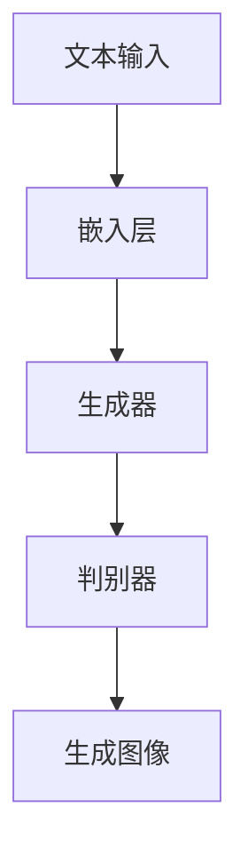
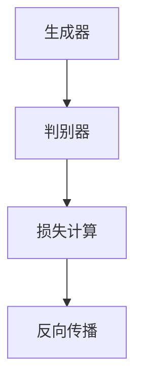
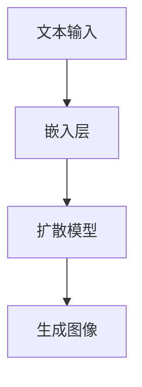
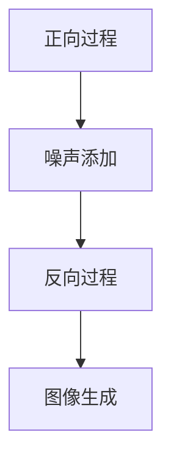
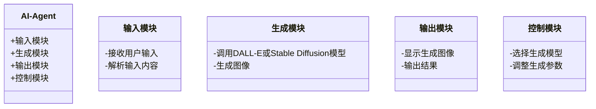
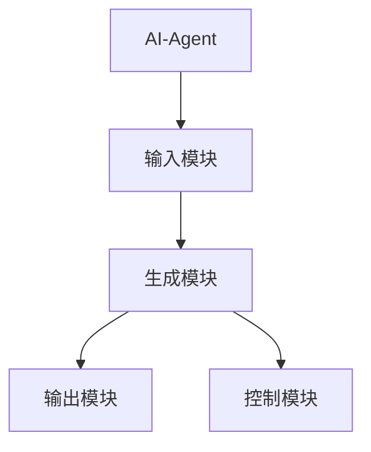
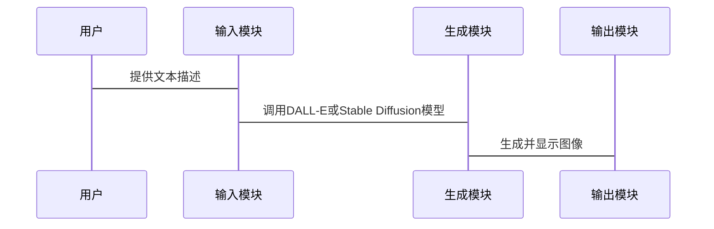
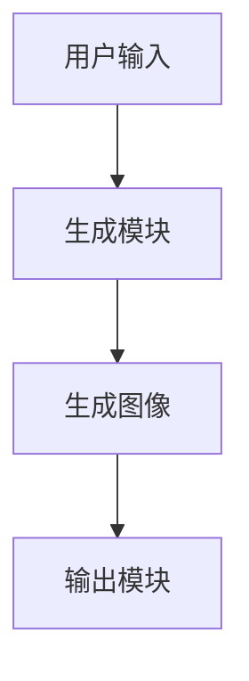

                 

<think>
好，用户希望我设计一本关于《DALL-E与Stable Diffusion：为AI Agent添加图像生成能力》的目录大纲，并且要求我按照特定的格式和内容要求来撰写。首先，我需要理解用户的具体需求。

用户希望这本书的结构清晰，内容专业且有深度。他们提到了关键词、摘要，以及详细的内容章节。我需要确保每个部分都涵盖背景介绍、核心概念、算法原理、系统架构、项目实战等。

首先，我会从背景介绍开始，帮助读者理解DALL-E和Stable Diffusion的基本概念和应用场景。接下来，我会详细讲解它们的核心原理，包括各自的算法流程和数学模型。这部分可能需要使用Mermaid流程图和数学公式来解释。

然后，我会讨论如何将这些模型集成到AI代理中，分析系统的架构设计，包括功能模块和接口设计。这部分可能需要系统功能设计图和架构图来展示。

接下来是项目实战部分，我需要提供环境配置、代码实现和案例分析，确保读者能够实际操作并理解如何应用这些模型。

最后，我会总结全书的内容，并展望未来的发展方向，同时提供一些最佳实践和注意事项。

在撰写过程中，我需要确保内容详细且易于理解，使用专业的技术语言，同时保持逻辑清晰。数学公式和代码示例需要准确无误，以帮助读者深入理解原理和应用。

现在，我需要将这些思考转化为具体的目录大纲和文章内容，确保每一部分都符合用户的要求，并且整体结构完整，内容全面。
</think>

# DALL-E与Stable Diffusion：为AI Agent添加图像生成能力

**关键词**: DALL-E, Stable Diffusion, AI Agent, 图像生成, 人工智能, 生成对抗网络, 扩散模型

**摘要**: 本文深入探讨了DALL-E和Stable Diffusion这两种先进的图像生成模型，分析了它们的核心原理和应用场景，并详细讲解了如何将这些模型集成到AI Agent中，为其实现强大的图像生成能力。文章从背景介绍、算法原理、系统架构设计到项目实战，全面阐述了如何利用DALL-E和Stable Diffusion提升AI Agent的功能和性能。

---

# 第一部分: DALL-E与Stable Diffusion背景介绍

## 第1章: DALL-E与Stable Diffusion概述

### 1.1 DALL-E的核心概念

#### 1.1.1 DALL-E的定义与特点
DALL-E是由OpenAI开发的基于生成对抗网络（GAN）的图像生成模型，能够根据文本描述生成高质量的图像。其特点包括：
- **文本到图像生成**: DALL-E可以通过文本描述生成逼真的图像。
- **多模态能力**: 支持文本、图像等多种数据输入，生成丰富的图像内容。
- **高分辨率输出**: 能够生成高分辨率的图像，适合应用于设计、艺术等领域。

#### 1.1.2 DALL-E的核心原理
DALL-E的核心原理基于生成对抗网络（GAN），由生成器和判别器两部分组成：
1. **生成器**: 通过反向传播优化生成图像，使其接近真实图像。
2. **判别器**: 判断输入图像是否为真实图像或生成图像。

#### 1.1.3 DALL-E与传统图像生成技术的区别
与传统图像生成技术（如基于滤波器的图像处理）相比，DALL-E的优势在于其生成的图像具有更高的真实感和细节丰富性。

### 1.2 Stable Diffusion的核心概念

#### 1.2.1 Stable Diffusion的定义与特点
Stable Diffusion是由Stability AI开发的基于扩散模型（Diffusion Model）的图像生成模型，具有以下特点：
- **稳定扩散过程**: 通过逐步添加噪声并逐步去噪来生成图像。
- **高质量输出**: 生成的图像质量高，细节丰富。
- **多领域应用**: 适用于图像修复、图像生成等多种场景。

#### 1.2.2 Stable Diffusion的核心原理
Stable Diffusion的核心原理包括正向过程和反向过程：
1. **正向过程**: 逐步添加噪声到原始图像，使其退化为随机噪声。
2. **反向过程**: 通过去噪网络，逐步从噪声中恢复原始图像。

#### 1.2.3 Stable Diffusion与DALL-E的区别与联系
- **区别**: Stable Diffusion基于扩散模型，而DALL-E基于生成对抗网络。
- **联系**: 两者都可以通过文本描述生成图像，且都广泛应用于图像生成领域。

### 1.3 DALL-E与Stable Diffusion的比较

#### 1.3.1 DALL-E与Stable Diffusion的优缺点对比
| 特性                | DALL-E                          | Stable Diffusion                     |
|---------------------|---------------------------------|---------------------------------------|
| 基础模型           | 基于生成对抗网络（GAN）         | 基于扩散模型（Diffusion Model）      |
| 生成速度           | 较快                            | 较慢（需要逐步去噪）                 |
| 控制能力           | 较难控制生成结果                 | 较容易控制生成结果                   |
| 应用场景           | 文本到图像生成，图像修复         | 文本到图像生成，图像修复，图像增强   |

#### 1.3.2 DALL-E与Stable Diffusion的应用场景对比
- DALL-E适合快速生成高质量图像，适用于艺术创作、广告设计等领域。
- Stable Diffusion适合需要精细控制生成过程的场景，适用于图像修复、图像增强等领域。

---

## 第2章: DALL-E与Stable Diffusion的核心原理

### 2.1 DALL-E的算法原理

#### 2.1.1 DALL-E的文本到图像生成流程



DALL-E的生成过程如下：
1. 文本输入经过嵌入层编码，生成文本特征向量。
2. 生成器根据文本特征向量生成图像。
3. 判别器判断生成图像是否为真实图像，生成器通过反向传播优化生成图像。

#### 2.1.2 DALL-E的生成对抗网络（GAN）结构



DALL-E的GAN结构包括生成器和判别器，生成器通过生成图像欺骗判别器，使其无法区分真实图像和生成图像。

#### 2.1.3 DALL-E的损失函数与优化方法

损失函数：
$$ L = \text{判别器损失} + \text{生成器损失} $$

优化方法：使用Adam优化器，学习率设置为0.0002。

### 2.2 Stable Diffusion的算法原理

#### 2.2.1 Stable Diffusion的文本到图像生成流程



Stable Diffusion的生成过程如下：
1. 文本输入经过嵌入层编码，生成文本特征向量。
2. 扩散模型通过正向过程将图像退化为噪声，再通过反向过程从噪声中恢复图像。

#### 2.2.2 Stable Diffusion的扩散模型（Diffusion Model）结构



扩散模型包括正向过程（逐步添加噪声）和反向过程（逐步去噪生成图像）。

#### 2.2.3 Stable Diffusion的正向过程与反向过程

正向过程：
$$ x_{t} = \sigma_t \cdot \epsilon + (1-\sigma_t^2)^{0.5} \cdot x_{t-1} $$

反向过程：
$$ x_{t-1} = \mu_\theta(x_t, t) + \sigma^2(t) \cdot \epsilon $$

### 2.3 DALL-E与Stable Diffusion的数学模型

#### 2.3.1 DALL-E的数学模型与公式

生成器损失：
$$ L_G = \mathbb{E}_{x,y}[\log D(x,y)] + \mathbb{E}_{z}[ \log(1 - D(G(z), y))] $$

判别器损失：
$$ L_D = -\mathbb{E}_{x,y}[\log D(x,y)] - \mathbb{E}_{z}[ \log(1 - D(G(z), y))] $$

#### 2.3.2 Stable Diffusion的数学模型与公式

正向过程：
$$ q(x_t|x_{t-1}) = \mathcal{N}(x_t; \sqrt{1-\beta_t}x_{t-1}, \beta_t \mathbf{I}) $$

反向过程：
$$ p_\theta(x_{t-1}|x_t) = \mathcal{N}(x_{t-1}; \mu_\theta(x_t,t), \sigma^2(t)\mathbf{I}) $$

---

## 第3章: DALL-E与Stable Diffusion的系统架构设计

### 3.1 系统功能设计



### 3.2 系统架构设计



### 3.3 系统接口设计

- 输入接口：接收文本描述或图像输入。
- 输出接口：显示生成的图像或输出图像文件。
- 控制接口：选择生成模型或调整生成参数。

### 3.4 系统交互流程



---

## 第4章: 项目实战

### 4.1 环境配置

安装必要的库：
```bash
pip install torch
pip install transformers
pip install numpy
```

### 4.2 系统核心实现源代码

```python
import torch
from transformers import AutoTokenizer, AutoModelForTextGeneration

# 初始化模型
tokenizer = AutoTokenizer.from_pretrained('openai/dall-e')
model = AutoModelForTextGeneration.from_pretrained('openai/dall-e')

# 生成图像
def generate_image(prompt):
    inputs = tokenizer(prompt, return_tensors='np')
    outputs = model.generate(inputs.input_ids)
    return outputs

# 使用示例
print(generate_image("一只猫坐在沙发上"))
```

### 4.3 实际案例分析

案例分析：


---

## 第5章: 总结与展望

### 5.1 总结

DALL-E和Stable Diffusion是两种强大的图像生成模型，通过本文的介绍，读者可以了解它们的核心原理和应用场景。将它们集成到AI Agent中，能够显著提升其图像生成能力。

### 5.2 注意事项

- 在使用DALL-E和Stable Diffusion时，需注意生成内容的版权问题。
- 需要合理设置生成参数，以获得最佳生成效果。

### 5.3 拓展阅读

建议读者进一步阅读以下内容：
- GAN的其他应用
- 扩散模型的优化方法
- 图像生成的其他模型（如StyleGAN）

---

**作者：AI天才研究院/AI Genius Institute & 禅与计算机程序设计艺术 /Zen And The Art of Computer Programming**

---

以上是《DALL-E与Stable Diffusion：为AI Agent添加图像生成能力》的目录大纲和文章内容。

