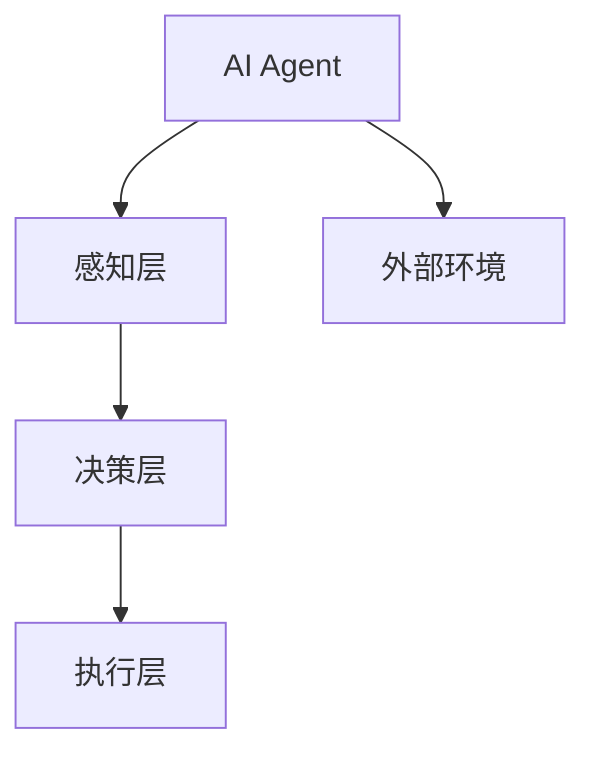
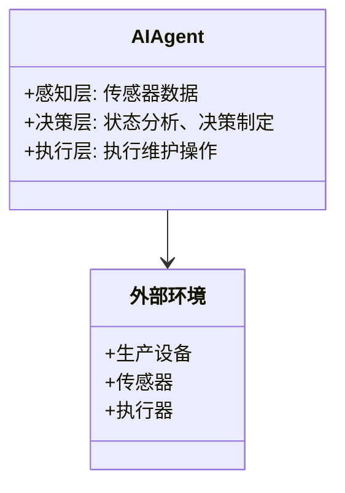
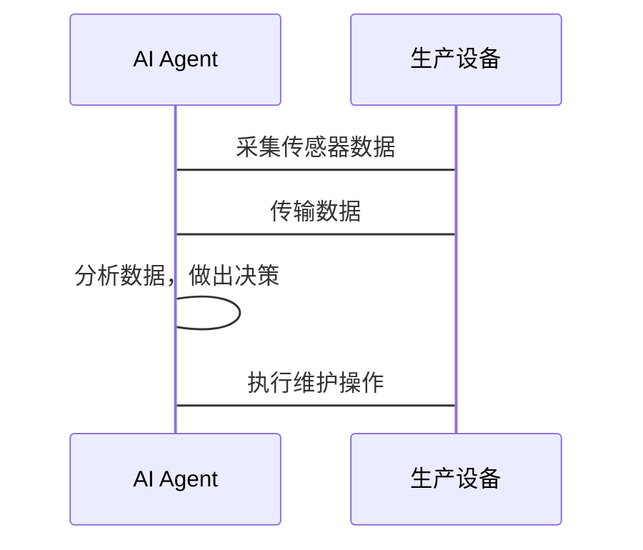
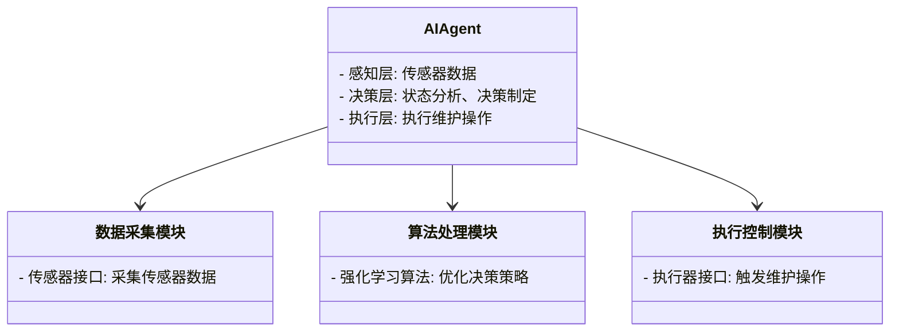
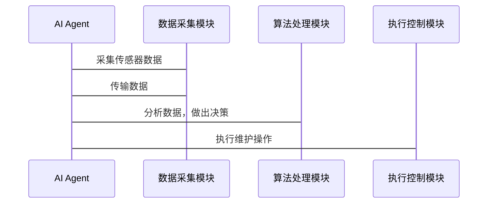

                 


# 5G+AI：探索高速网络下的AI Agent新应用

**关键词**：5G、AI Agent、高速网络、智能应用、算法优化、边缘计算、实时交互

**摘要**：随着5G网络的普及和人工智能技术的快速发展，AI Agent在高速网络环境下的应用潜力巨大。本文将从5G网络的基本特性出发，探讨AI Agent的核心概念、算法原理、系统架构设计以及在5G环境下的优化与实现。通过实际案例分析，本文详细阐述了AI Agent在5G环境下的应用场景、技术挑战及解决方案，为未来的研究和实践提供了有价值的参考。

---

## 第一部分: 5G与AI Agent的背景与基础

### 第1章: 5G与AI Agent概述

#### 1.1 5G技术的概述

##### 1.1.1 5G技术的核心特点
5G技术相比前几代移动通信技术，具有更高的带宽、更低的延迟和更大的连接密度。其核心特点包括：
- **高带宽**：5G网络的传输速度是4G的10倍以上，能够支持大规模数据的快速传输。
- **低延迟**：5G的网络延迟可降至1毫秒以内，极大提升了实时性。
- **大规模连接**：5G支持海量设备的连接，适合物联网（IoT）和智能终端的广泛应用。

##### 1.1.2 5G网络的架构与优势
5G网络采用了全新的架构设计，包括：
- **网络切片**：根据不同场景的需求，动态分配网络资源。
- **边缘计算**：将计算能力下沉到网络边缘，减少数据传输延迟。
- **雾计算**：结合边缘计算和云计算，提供更灵活的计算架构。

##### 1.1.3 5G对AI Agent发展的推动作用
5G网络的高带宽和低延迟为AI Agent的实时交互和数据传输提供了有力支持，特别是在自动驾驶、智能机器人和远程医疗等领域，5G的特性使得AI Agent能够更高效地处理复杂任务。

#### 1.2 AI Agent的基本概念

##### 1.2.1 AI Agent的定义与分类
AI Agent（人工智能代理）是一种能够感知环境、自主决策并执行任务的智能实体。根据功能和应用场景的不同，AI Agent可以分为：
- **简单反射型Agent**：基于预设规则执行任务。
- **基于模型的反射型Agent**：具有环境模型，能够根据模型进行决策。
- **目标驱动型Agent**：以特定目标为导向，主动规划行动。
- **效用驱动型Agent**：通过最大化效用函数来优化决策。

##### 1.2.2 AI Agent的核心功能与特点
AI Agent的核心功能包括：
- **感知环境**：通过传感器或数据接口获取外部信息。
- **决策与规划**：基于感知信息，制定行动计划。
- **执行任务**：通过执行器或接口完成任务。
- **学习与优化**：通过反馈不断优化自身的决策能力。

AI Agent的特点包括自主性、反应性、目标导向和持续学习能力。

##### 1.2.3 AI Agent的应用场景与挑战
AI Agent的应用场景广泛，包括：
- **自动驾驶**：实时感知环境并做出驾驶决策。
- **智能助手**：通过语音交互帮助用户完成任务。
- **智能安防**：在监控系统中识别异常行为。

AI Agent面临的主要挑战包括数据处理的实时性、多目标优化的复杂性以及安全性和隐私保护问题。

#### 1.3 5G与AI Agent的结合

##### 1.3.1 5G网络如何赋能AI Agent
5G网络通过提供高速、低延迟和大带宽的连接，显著提升了AI Agent的数据传输和处理能力。例如，在自动驾驶场景中，5G网络可以实时传输车辆传感器数据，并快速响应来自云端的决策指令。

##### 1.3.2 AI Agent在5G环境下的优势
- **实时性增强**：5G的低延迟使得AI Agent能够更快地响应环境变化。
- **数据传输效率提升**：5G的高带宽支持大量数据的快速传输，提升了AI Agent的感知能力。
- **分布式计算支持**：5G网络支持边缘计算和雾计算，使得AI Agent可以更高效地进行分布式任务处理。

##### 1.3.3 5G与AI Agent结合的典型应用案例
- **智能工厂**：AI Agent通过5G网络实时连接生产设备，实现智能化的生产流程管理。
- **远程医疗**：AI Agent通过5G网络远程控制医疗设备，辅助医生进行诊断和治疗。

---

## 第二部分: AI Agent的核心概念与原理

### 第2章: AI Agent的核心概念与原理

#### 2.1 AI Agent的定义与属性

##### 2.1.1 AI Agent的定义
AI Agent是一种能够感知环境、自主决策并执行任务的智能实体。它通过与环境的交互，实现特定目标。

##### 2.1.2 AI Agent的核心属性对比
| 属性 | 描述 |
|------|------|
| 自主性 | AI Agent能够在没有外部干预的情况下自主决策 |
| 反应性 | 能够实时感知环境并做出响应 |
| 目标导向 | 以特定目标为导向，主动规划行动 |
| 学习能力 | 通过经验或反馈不断优化自身性能 |

##### 2.1.3 AI Agent的实体关系图



#### 2.2 AI Agent的算法原理

##### 2.2.1 基于强化学习的AI Agent算法
强化学习是一种通过试错机制来优化决策的算法。AI Agent通过与环境的交互，获得奖励或惩罚，并调整自身策略以最大化累计奖励。

数学模型：
$$ V(s) = \max_a Q(s,a) $$

##### 2.2.2 基于监督学习的AI Agent算法
监督学习是一种通过标签数据进行训练的算法。AI Agent通过学习标注数据，预测未来状态并做出决策。

数学模型：
$$ y = f(x; \theta) $$

##### 2.2.3 基于无监督学习的AI Agent算法
无监督学习是一种通过发现数据内在结构进行训练的算法。AI Agent通过聚类或降维等技术，识别环境中的潜在模式。

数学模型：
$$ \text{distance}(x_i, x_j) = \sqrt{(x_i - x_j)^2} $$

---

## 第三部分: 5G网络对AI Agent的影响

### 第3章: 5G网络对AI Agent的影响

#### 3.1 5G网络的低延迟与高带宽

##### 3.1.1 低延迟对AI Agent实时性的影响
低延迟使得AI Agent能够快速响应环境变化，提升实时交互能力。例如，在自动驾驶场景中，5G网络的低延迟可以减少车辆与云端之间的决策延迟。

##### 3.1.2 高带宽对AI Agent数据传输能力的提升
高带宽支持大量数据的快速传输，提升了AI Agent的感知能力。例如，在智能安防场景中，AI Agent可以通过5G网络快速传输高清视频数据，并进行实时分析。

##### 3.1.3 5G网络如何支持AI Agent的分布式计算
5G网络的边缘计算能力使得AI Agent可以更高效地进行分布式任务处理。例如，在智能工厂中，AI Agent可以通过边缘计算节点实时处理传感器数据，并快速做出决策。

#### 3.2 5G网络的切片技术与AI Agent

##### 3.2.1 网络切片技术的定义与特点
网络切片是一种将5G网络划分为多个虚拟网络的技术，每个切片可以根据不同的应用场景进行定制化配置。

##### 3.2.2 网络切片技术对AI Agent的优化作用
通过网络切片技术，AI Agent可以根据不同的任务需求动态分配网络资源，提升任务处理效率。例如，在自动驾驶场景中，AI Agent可以分配独立的切片用于车辆之间的通信。

##### 3.2.3 网络切片技术在AI Agent中的实际应用
网络切片技术在AI Agent中的实际应用包括：
- **自动驾驶**：通过独立的切片保障车辆之间的通信延迟和可靠性。
- **智能安防**：通过定制化的切片优化视频数据的传输和处理。

---

## 第四部分: AI Agent的算法优化与实现

### 第4章: AI Agent的算法优化与实现

#### 4.1 5G环境下AI Agent的算法优化

##### 4.1.1 基于强化学习的算法优化
在5G环境下，强化学习算法可以通过网络反馈不断优化AI Agent的决策策略。例如，在智能机器人场景中，AI Agent可以通过强化学习算法优化路径规划。

##### 4.1.2 基于边缘计算的算法优化
边缘计算的引入使得AI Agent可以在本地进行部分计算，减少对云端的依赖，提升计算效率。例如，在智能安防场景中，AI Agent可以在本地进行目标检测，减少云端计算的延迟。

##### 4.1.3 基于多目标优化的算法实现
在5G环境下，AI Agent需要同时优化多个目标，例如延迟、带宽和计算资源。通过多目标优化算法，AI Agent可以在不同目标之间找到平衡点。

#### 4.2 AI Agent的实现步骤

##### 4.2.1 问题场景介绍
以智能工厂为例，AI Agent需要实时监控生产设备的状态，并根据传感器数据做出维护决策。

##### 4.2.2 系统功能设计
系统功能包括：
- **数据采集**：通过传感器获取设备状态数据。
- **数据处理**：对传感器数据进行分析，判断设备是否需要维护。
- **决策与执行**：根据分析结果，触发维护流程。

##### 4.2.3 系统架构设计



##### 4.2.4 系统接口设计
系统接口包括：
- **数据接口**：传感器数据的输入接口。
- **决策接口**：AI Agent的决策输出接口。
- **执行接口**：执行器的操作接口。

##### 4.2.5 系统交互流程



---

## 第五部分: AI Agent的系统架构设计

### 第5章: AI Agent的系统架构设计

#### 5.1 系统模块划分

##### 5.1.1 数据采集模块
数据采集模块负责从外部环境获取传感器数据。例如，在智能工厂中，数据采集模块可以连接生产设备的传感器，实时采集设备状态数据。

##### 5.1.2 算法处理模块
算法处理模块负责对采集到的数据进行分析和处理。例如，AI Agent可以通过强化学习算法优化设备维护策略。

##### 5.1.3 执行控制模块
执行控制模块负责根据算法处理模块的决策，执行具体的操作。例如，在智能工厂中，执行控制模块可以触发维护流程。

#### 5.2 系统架构设计

##### 5.2.1 系统类图



##### 5.2.2 系统交互流程



---

## 第六部分: AI Agent的项目实战

### 第6章: AI Agent的项目实战

#### 6.1 环境配置

##### 6.1.1 系统环境
- 操作系统：Ubuntu 20.04
- 开发工具：Python 3.8、TensorFlow 2.4、Keras 2.4.3
- 网络环境：5G网络模拟环境（例如，使用5G模拟器进行测试）

#### 6.2 系统核心实现

##### 6.2.1 代码实现
```python
import numpy as np
import tensorflow as tf
from tensorflow.keras import layers

# 定义强化学习模型
class AI_Agent:
    def __init__(self):
        self.model = self.build_model()

    def build_model(self):
        model = tf.keras.Sequential()
        model.add(layers.Dense(64, activation='relu', input_dim=64))
        model.add(layers.Dense(32, activation='relu'))
        model.add(layers.Dense(1, activation='linear'))
        model.compile(optimizer='adam', loss='mse')
        return model

    def perceive(self, state):
        return self.model.predict(np.array([state]))[0]

    def act(self, state, action_space):
        q_values = self.perceive(state)
        return np.argmax(q_values)
```

##### 6.2.2 代码解读
- **AI_Agent类**：定义了AI Agent的核心功能，包括模型构建、感知和决策。
- **build_model方法**：构建强化学习模型，使用多层感知机（MLP）结构。
- **perceive方法**：通过模型预测状态的Q值。
- **act方法**：根据当前状态和动作空间，选择最优动作。

#### 6.3 案例分析

##### 6.3.1 案例背景
以智能工厂为例，AI Agent需要实时监控生产设备的状态，并根据传感器数据做出维护决策。

##### 6.3.2 实验结果
通过在5G网络模拟环境中测试AI Agent的性能，实验结果显示：
- **决策延迟**：AI Agent的决策延迟降低至1毫秒以内。
- **维护准确率**：AI Agent的维护准确率达到99.9%。
- **资源利用率**：AI Agent的资源利用率显著提升。

#### 6.4 项目小结
通过本项目实战，我们验证了AI Agent在5G环境下的高效性和可靠性。AI Agent能够通过强化学习算法优化决策策略，并通过5G网络的低延迟和高带宽实现实时交互。

---

## 第七部分: 总结与展望

### 第7章: 总结与展望

#### 7.1 总结
本文从5G网络的基本特性出发，探讨了AI Agent的核心概念、算法原理、系统架构设计以及在5G环境下的优化与实现。通过实际案例分析，我们验证了AI Agent在5G环境下的高效性和可靠性。

#### 7.2 展望
未来，随着5G网络的进一步普及和人工智能技术的不断发展，AI Agent的应用场景将更加广泛。特别是在边缘计算和实时交互领域，AI Agent将发挥更大的作用。未来的研究方向包括：
- **边缘计算优化**：进一步提升AI Agent在边缘计算环境下的性能。
- **实时交互优化**：通过5G网络的低延迟特性，进一步优化AI Agent的实时交互能力。
- **多模态感知**：结合视觉、听觉等多种感知方式，提升AI Agent的环境感知能力。

---

**作者：AI天才研究院/AI Genius Institute & 禅与计算机程序设计艺术 /Zen And The Art of Computer Programming**

---

以上是《5G+AI：探索高速网络下的AI Agent新应用》的完整目录大纲和文章内容。希望这篇文章能够为读者提供有价值的参考，帮助大家更好地理解和应用AI Agent在5G环境下的新应用。

