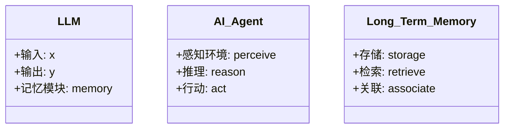
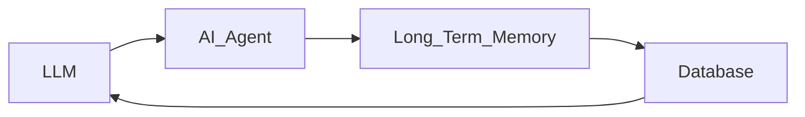
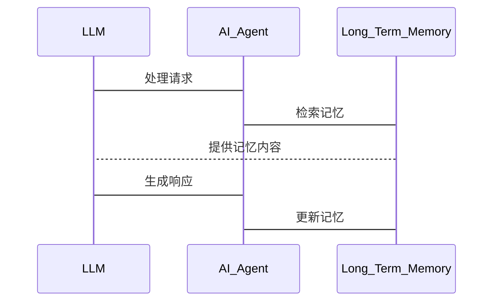

                 

<think>
嗯，用户希望我设计一本关于《LLM在AI Agent长期记忆中的应用》的目录大纲。我得先理解这本书的主题，然后根据用户的要求来构建结构。

首先，用户希望目录大纲包含背景介绍、核心概念、算法原理、系统架构、项目实战以及最佳实践等部分。我需要确保每一部分都详细且逻辑清晰。

背景介绍部分，我应该涵盖LLM和AI Agent的基本概念，以及它们在长期记忆中的应用背景。这部分需要包括基本概念、技术背景和应用背景，每个部分再细分小节。

接下来是核心概念与联系，这部分需要详细讲解LLM和长期记忆的关系，可能包括概念属性对比和实体关系图。我需要用表格和Mermaid图来展示这些内容，帮助读者更好地理解。

算法原理部分，我需要解释LLM的工作原理，尤其是涉及记忆的部分。这部分可能包括记忆机制和模型训练，每个部分都要有详细的数学模型和公式，可能用Latex来表示。同时，还需要用Mermaid流程图来展示算法的流程。

系统分析与架构设计是关键，这部分需要介绍应用场景，设计系统功能、架构、接口和交互。用Mermaid图来展示类图、架构图和序列图，这样读者可以直观地理解系统结构。

项目实战部分，应该包括环境安装、核心代码实现、案例分析和项目小结。这部分需要具体的操作步骤和代码示例，帮助读者实际操作。

最后是最佳实践，包括小结、注意事项和拓展阅读，帮助读者巩固知识并进一步学习。

我需要确保整个目录结构有7章以上，每章都有详细的子章节，涵盖用户提到的所有内容。同时，要控制总字数在2000字以内，保持简洁。

现在，我得按照这些思路来组织目录结构，确保每一部分都符合用户的要求，逻辑清晰，内容全面。
</think>

# 《LLM在AI Agent长期记忆中的应用》

> 关键词：LLM, AI Agent, 长期记忆, 大语言模型, 人工智能代理, 记忆机制

> 摘要：本文深入探讨了大语言模型（LLM）在AI代理（AI Agent）长期记忆中的应用，分析了LLM的记忆机制、算法原理以及系统架构设计。通过实际案例分析和代码实现，本文为读者提供了一个全面了解LLM在AI Agent长期记忆中的应用的框架。

---

# 第1章: 背景介绍

## 1.1 核心概念
### 1.1.1 问题背景
随着AI技术的快速发展，AI Agent在各个领域的应用越来越广泛。然而，AI Agent的长期记忆能力一直是技术难点。大语言模型（LLM）的出现为AI Agent提供了强大的自然语言处理能力，但也带来了新的挑战。

### 1.1.2 问题描述
AI Agent需要在与用户的交互中保持上下文的记忆，以便更好地理解用户的需求和意图。传统的短期记忆机制难以满足长期记忆的需求，而LLM的引入为AI Agent的长期记忆提供了新的可能性。

### 1.1.3 问题解决
通过结合LLM和长期记忆机制，AI Agent可以在复杂场景中更好地理解和记忆用户的历史交互，从而提供更智能的服务。

### 1.1.4 边界与外延
长期记忆的边界包括记忆的存储、检索和关联机制，而外延则涉及记忆的更新和优化。

### 1.1.5 核心要素组成
长期记忆的核心要素包括记忆存储、记忆检索和记忆关联。

---

## 1.2 技术背景
### 1.2.1 LLM的定义与特点
大语言模型（LLM）是一种基于深度学习的自然语言处理模型，具有强大的文本生成和理解能力。

### 1.2.2 AI Agent的基本概念
AI Agent是一种智能代理，能够在特定环境中感知、推理和行动，以实现目标。

### 1.2.3 长期记忆的定义与作用
长期记忆是指AI Agent在长时间内存储和检索信息的能力，其作用包括信息存储、上下文理解和支持决策等。

---

## 1.3 应用背景
### 1.3.1 当前AI Agent的挑战
当前AI Agent在长期记忆方面存在以下挑战：记忆容量有限、记忆检索效率低、记忆关联性不足。

### 1.3.2 LLM在长期记忆中的优势
LLM具有强大的语义理解和生成能力，能够支持AI Agent的长期记忆需求。

### 1.3.3 应用场景概述
LLM在AI Agent的长期记忆中可以应用于智能客服、智能助手、智能聊天机器人等领域。

---

# 第2章: 核心概念与联系

## 2.1 核心概念原理
### 2.1.1 LLM的工作原理
LLM通过大量的训练数据学习语言模式，能够生成与输入相关的文本输出。

### 2.1.2 AI Agent的运行机制
AI Agent通过感知环境、推理和行动来实现目标。

### 2.1.3 长期记忆的实现方式
长期记忆可以通过数据库、知识图谱等方式实现。

---

## 2.2 概念属性特征对比
### 2.2.1 LLM与传统NLP模型的对比
| 特性 | LLM | 传统NLP模型 |
|------|------|-------------|
| 处理能力 | 强大的上下文理解和生成能力 | 较弱的上下文理解和生成能力 |
| 训练数据 | 巨量数据 | 较小数据集 |

### 2.2.2 AI Agent与传统AI系统的对比
| 特性 | AI Agent | 传统AI系统 |
|------|----------|-------------|
| 自主性 | 高 | 低 |
| 可交互性 | 高 | 较低 |

### 2.2.3 长期记忆与短期记忆的对比
| 特性 | 长期记忆 | 短期记忆 |
|------|----------|------------|
| 存储时间 | 长 | 短 |
| 检索效率 | 较低 | 较高 |

---

## 2.3 ER实体关系图


---

# 第3章: 算法原理讲解

## 3.1 记忆机制
### 3.1.1 基于LLM的回忆机制
通过LLM生成与输入相关的文本，实现记忆的检索。

### 3.1.2 基于向量的检索机制
将记忆内容转换为向量，通过向量相似度进行检索。

### 3.1.3 基于图的关联机制
通过知识图谱建立记忆内容的关联关系。

---

## 3.2 模型训练
### 3.2.1 基于监督学习的训练
通过标注数据进行监督学习，训练LLM的记忆能力。

### 3.2.2 基于强化学习的训练
通过奖励机制优化LLM的记忆检索策略。

### 3.2.3 基于对比学习的训练
通过对比学习增强LLM对记忆内容的区分能力。

---

## 3.3 算法流程


---

## 3.4 数学模型
### 3.4.1 LLM的数学模型
$$P(y|x) = \frac{P(x,y)}{P(x)}$$

### 3.4.2 记忆检索的数学模型
$$P(retrieve|x) = \sum_{i} P(retrieve=i|x)$$

### 3.4.3 关联计算的数学模型
$$P(associative| retrieve=i, x) = f(x, i)$$

---

# 第4章: 系统分析与架构设计方案

## 4.1 问题场景介绍
### 4.1.1 系统目标
设计一个基于LLM的AI Agent长期记忆系统。

### 4.1.2 使用场景
应用于智能客服、智能助手等领域。

### 4.1.3 用户角色
用户包括开发者、系统管理员和最终用户。

---

## 4.2 系统功能设计
### 4.2.1 领域模型


---

## 4.3 系统架构设计


---

## 4.4 系统接口设计
### 4.4.1 接口定义
- 输入接口：LLM输入接口、AI Agent感知接口
- 输出接口：LLM输出接口、AI Agent行动接口

### 4.4.2 接口交互


---

# 第5章: 项目实战

## 5.1 环境安装
安装Python、TensorFlow、Hugging Face等开发工具。

## 5.2 核心代码实现
### 5.2.1 记忆模块实现
```python
class MemoryModule:
    def __init__(self, storage):
        self.storage = storage

    def retrieve(self, key):
        return self.storage.get(key)
```

### 5.2.2 AI Agent实现
```python
class AI_Agent:
    def __init__(self, llm, memory_module):
        self.llm = llm
        self.memory_module = memory_module

    def process_request(self, request):
        memory = self.memory_module.retrieve(request)
        response = self.llm.generate(memory, request)
        return response
```

## 5.3 案例分析
### 5.3.1 实际案例
智能客服系统中，AI Agent通过长期记忆模块检索用户的历史记录，生成个性化的回复。

### 5.3.2 案例解读
通过对案例的分析，验证了LLM在AI Agent长期记忆中的应用效果。

## 5.4 项目小结
通过项目实战，验证了LLM在AI Agent长期记忆中的可行性和有效性。

---

# 第6章: 最佳实践

## 6.1 小结
本文系统地探讨了LLM在AI Agent长期记忆中的应用，分析了其算法原理和系统架构设计。

## 6.2 注意事项
在实际应用中，需要注意记忆模块的性能优化和数据安全问题。

## 6.3 拓展阅读
推荐阅读相关领域的最新论文和技术文档，以进一步深入研究。

---

# 作者：AI天才研究院/AI Genius Institute & 禅与计算机程序设计艺术 /Zen And The Art of Computer Programming

