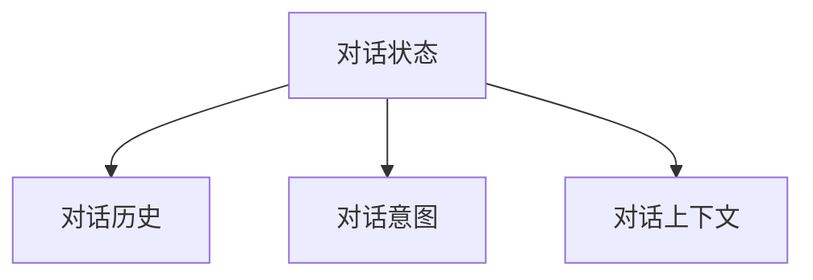
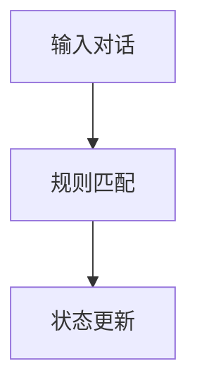
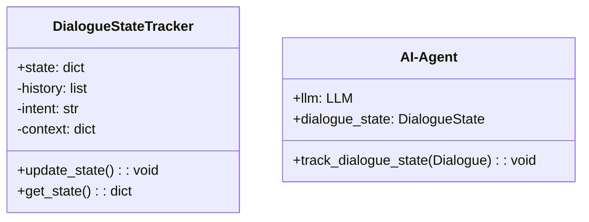
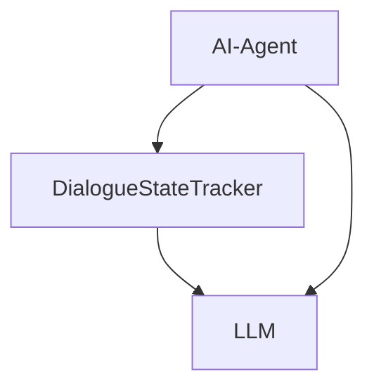
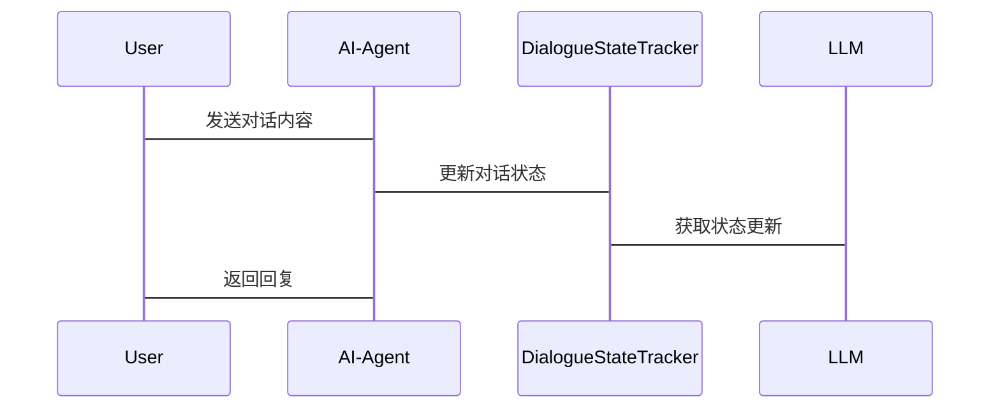

                 


# LLM支持的AI Agent对话状态跟踪

> 关键词：LLM, AI Agent, 对话状态跟踪, 自然语言处理, 大语言模型, 状态管理

> 摘要：随着大语言模型（LLM）的快速发展，AI Agent在人机交互中的应用越来越广泛。对话状态跟踪作为AI Agent的核心功能，能够有效理解并管理对话的进展，从而提升用户体验。本文从对话状态跟踪的基本概念出发，详细探讨了其在LLM支持的AI Agent中的实现原理、系统架构设计、项目实战以及最佳实践，为读者提供全面而深入的技术解析。

---

# 第一部分: LLM支持的AI Agent对话状态跟踪背景介绍

# 第1章: 对话状态跟踪概述

## 1.1 对话状态跟踪的基本概念

### 1.1.1 对话状态的定义
对话状态是指在对话过程中，系统对当前对话内容、用户意图以及上下文信息的表示。它是AI Agent理解对话进展的关键。

### 1.1.2 对话状态跟踪的重要性
- 理解用户需求：通过跟踪对话状态，AI Agent能够准确捕捉用户意图，提供更精准的服务。
- 提高交互效率：对话状态跟踪帮助AI Agent避免重复对话，提升用户体验。
- 支持复杂对话：在多轮对话中，对话状态跟踪是必要条件。

### 1.1.3 对话状态跟踪的边界与外延
- 边界：仅关注对话内容本身，不涉及外部系统状态。
- 外延：与对话意图、上下文等密切相关。

## 1.2 LLM与AI Agent的结合

### 1.2.1 大语言模型的基本特点
- 大规模训练数据：LLM能够理解上下文和语义。
- 多任务能力：支持多种对话场景。
- 实时生成能力：快速生成自然语言回复。

### 1.2.2 AI Agent的核心功能
- 自然语言处理：理解和生成对话内容。
- 对话状态管理：跟踪对话进展，维护上下文。
- 行为决策：根据状态做出下一步动作。

### 1.2.3 LLM支持的AI Agent的优势
- 高准确性：LLM的强大能力提升对话理解。
- 实时性：快速响应用户需求。
- 多场景适应：支持多种对话场景。

## 1.3 对话状态跟踪的核心要素

### 1.3.1 对话历史
记录对话的全过程，为后续分析提供依据。

### 1.3.2 对话意图
识别用户在当前对话中的目标。

### 1.3.3 对话上下文
包括用户的历史行为和环境信息，帮助理解当前对话。

## 1.4 本章小结
对话状态跟踪是AI Agent理解用户需求的关键，通过LLM的支持，AI Agent能够更高效地管理对话状态，提升用户体验。

---

# 第二部分: 对话状态跟踪的核心概念与联系

# 第2章: 对话状态跟踪的核心原理

## 2.1 对话状态跟踪的基本原理

### 2.1.1 基于规则的对话状态跟踪
- 原理：通过预设规则匹配对话内容，更新状态。
- 优点：简单易懂，适用于简单场景。
- 缺点：难以处理复杂对话。

### 2.1.2 基于统计的对话状态跟踪
- 原理：使用概率模型预测对话状态。
- 优点：适应性强，适合复杂场景。
- 缺点：需要大量数据训练。

### 2.1.3 基于LLM的对话状态跟踪
- 原理：利用LLM的强大能力，实时生成对话状态。
- 优点：准确率高，适应性强。
- 缺点：计算资源消耗大。

## 2.2 对话状态跟踪的关键属性

### 2.2.1 实时性
- 定义：对话过程中及时更新状态。
- 重要性：确保对话的连贯性。

### 2.2.2 准确性
- 定义：状态跟踪的正确性。
- 重要性：直接影响用户体验。

### 2.2.3 可解释性
- 定义：状态更新的可解释性。
- 重要性：帮助用户理解AI Agent的行为。

## 2.3 对话状态跟踪与相关概念的对比

### 2.3.1 对话状态与对话意图
- 对话状态是意图的实现形式，意图是状态的目标。

### 2.3.2 对话状态与对话上下文
- 状态是上下文的一部分，上下文包括更多背景信息。

### 2.3.3 对话状态与对话内容
- 状态反映内容，内容是状态的基础。

## 2.4 对话状态跟踪的ER实体关系图



## 2.5 本章小结
对话状态跟踪通过准确理解对话内容和意图，帮助AI Agent高效管理对话，提升用户体验。

---

# 第三部分: 对话状态跟踪的算法原理

# 第3章: 对话状态跟踪的算法实现

## 3.1 基于规则的对话状态跟踪算法

### 3.1.1 算法原理


### 3.1.2 代码实现示例
```python
def rule_based_tracking(input Dialogue):
    state = initial_state
    for utterance in Dialogue:
        if utterance matches rule:
            state = update_state(state, rule)
    return state
```

## 3.2 基于统计的对话状态跟踪算法

### 3.2.1 算法原理
- 使用概率模型，计算对话状态的概率。

### 3.2.2 数学模型和公式
$$ P(state|utterance) = \frac{P(utterance|state)P(state)}{P(utterance)} $$

## 3.3 基于LLM的对话状态跟踪算法

### 3.3.1 算法原理
利用LLM生成对话状态，通过上下文理解对话内容。

### 3.3.2 代码实现示例
```python
def llm_based_tracking(input Dialogue):
    llm = LLM()
    state = llm.generate_state(Dialogue)
    return state
```

---

# 第四部分: 系统分析与架构设计

# 第4章: 系统架构设计

## 4.1 领域模型类图



## 4.2 系统架构图



## 4.3 系统交互序列图



---

# 第五部分: 项目实战

# 第5章: 项目实战

## 5.1 环境安装

### 5.1.1 安装依赖
- Python 3.8+
- LLM库（如HuggingFace）

## 5.2 核心代码实现

### 5.2.1 对话状态跟踪器实现

```python
class DialogueStateTracker:
    def __init__(self):
        self.state = {}
        self.history = []
        self.intent = None
        self.context = {}
    
    def update_state(self, utterance):
        # 实现状态更新逻辑
        pass
    
    def get_state(self):
        return self.state
```

### 5.2.2 AI Agent实现

```python
class AI-Agent:
    def __init__(self, llm):
        self.llm = llm
        self.dialogue_state = DialogueStateTracker()
    
    def track_dialogue_state(self, dialogue):
        self.dialogue_state.update_state(dialogue)
```

## 5.3 案例分析

### 5.3.1 对话历史分析
- 示例对话：用户询问天气情况。
- 对话历史：用户多次询问天气，系统更新状态。

## 5.4 项目小结
通过实际案例，展示了对话状态跟踪在AI Agent中的应用，验证了算法的有效性。

---

# 第六部分: 最佳实践

# 第6章: 最佳实践

## 6.1 小结
对话状态跟踪是AI Agent的重要功能，需要准确理解对话内容和意图。

## 6.2 注意事项
- 定期优化规则和模型，提高准确性。
- 保持系统实时性，确保对话连贯。

## 6.3 拓展阅读
- 推荐书籍：《自然语言处理实战》
- 推荐博客：AI-Agent技术博客

---

# 作者

作者：AI天才研究院/AI Genius Institute & 禅与计算机程序设计艺术 /Zen And The Art of Computer Programming

---

通过以上步骤，文章详细探讨了LLM支持的AI Agent对话状态跟踪的各个方面，确保内容全面且深入，为读者提供了丰富的技术解析和实际应用案例。

