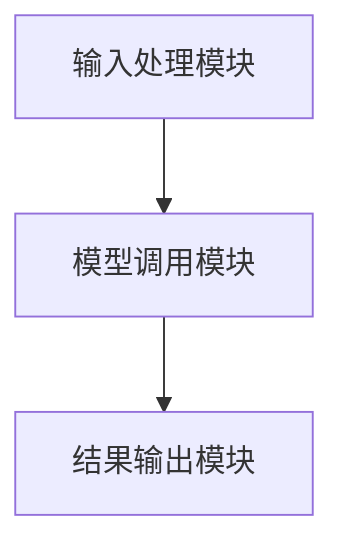
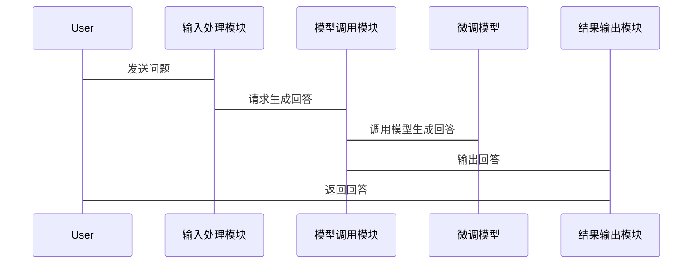

                 

<think>
好的，我需要撰写一篇关于LLM模型训练实践的文章，标题是《LLM模型训练实践：从预训练到微调的全流程》。用户希望文章结构清晰、内容详尽，涵盖预训练和微调的整个流程。首先，我会从背景介绍开始，解释什么是LLM模型，预训练和微调的定义，以及它们在NLP任务中的重要性。

接下来，我会详细讲解预训练的原理和实现，包括常用的数据集和算法，如Masked Language Model和Next Sentence Prediction。这部分需要包含数学公式和流程图，以帮助读者理解预训练的过程。

然后，我会转向微调部分，讨论如何根据特定任务调整预训练模型。这里会涉及数据预处理、模型加载和训练优化的具体步骤。同时，我会提供代码示例，展示如何在实际中实现微调。

接下来，我会介绍评估与优化的方法，包括常用的指标和调参技巧。这部分需要结合实际案例，说明如何通过评估结果来优化模型性能。

系统架构设计也是关键部分，我会从项目介绍开始，设计系统的功能模块和架构图。使用Mermaid图来展示系统的交互流程，帮助读者理解整体结构。

在项目实战部分，我会选择一个具体的案例，如医疗领域的微调任务，详细描述环境安装、代码实现和案例分析。通过实际操作，读者可以更好地理解如何将理论应用于实践。

最后，我会总结整个训练流程，并展望未来的发展方向，如多模态模型和更高效的训练方法。同时，我会提供一些最佳实践和注意事项，帮助读者在实际应用中避免常见问题。

为了满足用户的格式要求，我会使用Markdown编写文章，确保每个章节内容详实，包含必要的数学公式和流程图。我会在适当的位置插入代码示例，确保读者能够理解和复现。此外，我会在文章末尾添加作者信息，以符合用户的格式要求。

通过以上步骤，我能够系统地完成这篇文章的撰写，确保内容全面、结构清晰，并且具备实用性和可读性。
</think>

# LLM模型训练实践：从预训练到微调的全流程

> 关键词：LLM模型，预训练，微调，NLP，深度学习

> 摘要：本文详细介绍了大语言模型（LLM）从预训练到微调的全流程，涵盖预训练模型的核心原理、微调方法的具体实现、系统架构设计以及实际项目实战。通过理论与实践相结合的方式，帮助读者全面掌握LLM模型的训练技巧。

---

# 第一部分: LLM模型训练概述

# 第1章: LLM模型训练概述

## 1.1 LLM模型的基本概念

### 1.1.1 大语言模型的定义
大语言模型（Large Language Model, LLM）是指在大量文本数据上进行预训练的深度学习模型，能够理解和生成人类语言。LLM的核心目标是通过预训练掌握语言的通用规律，然后通过微调适应特定任务的需求。

### 1.1.2 LLM模型的核心特点
- **大规模数据训练**：通常使用数百万甚至数十亿的文本数据进行预训练。
- **深度网络结构**：采用Transformer架构，具有强大的上下文理解和生成能力。
- **零样本学习能力**：通过预训练，模型可以在未见过的任务上表现出一定的能力。

### 1.1.3 LLM模型与传统NLP模型的区别
| 特性               | 传统NLP模型            | LLM模型              |
|--------------------|-------------------------|-----------------------|
| 数据量             | 较小，通常几千到几万条数据 | 极大，通常数十亿条数据   |
| 训练目标           | 特定任务优化            | 通用语言理解与生成     |
| 零样本能力         | 较弱                   | 较强                 |

## 1.2 LLM模型训练的背景与问题背景

### 1.2.1 当前NLP任务的挑战
传统的NLP模型通常针对特定任务（如机器翻译、问答系统）进行训练，需要大量标注数据和人工调整。这种方法效率低下，且难以应对新兴任务。

### 1.2.2 预训练模型的优势
预训练模型通过在通用数据集上训练，掌握了语言的基本规律，可以在多种任务上进行微调，显著降低了训练特定任务模型的成本。

### 1.2.3 微调模型的必要性
预训练模型虽然通用，但在特定领域或任务上可能表现不佳。通过微调，可以进一步优化模型在目标任务上的性能。

## 1.3 问题描述与解决思路

### 1.3.1 预训练与微调的定义
- **预训练**：在通用数据集上训练模型，使其掌握语言的基本规律。
- **微调**：在特定任务数据集上进一步训练模型，优化其在目标任务上的表现。

### 1.3.2 预训练与微调的目标
- 预训练目标：学习语言的通用表示。
- 微调目标：优化特定任务的性能。

### 1.3.3 预训练与微调的关系
预训练为模型提供通用能力，微调则使其适应特定需求。两者相辅相成，共同提升模型的性能。

## 1.4 预训练与微调的边界与外延

### 1.4.1 预训练的边界
- 预训练通常在通用数据集上进行，不涉及特定任务的标注数据。
- 预训练的目标是通用语言表示，不针对具体任务。

### 1.4.2 微调的边界
- 微调需要特定任务的数据集，通常规模较小。
- 微调的目标是优化模型在特定任务上的表现。

### 1.4.3 预训练与微调的外延
- 预训练可以使用多种任务（如Masked Language Model、Next Sentence Prediction）进行联合训练。
- 微调可以根据任务需求调整模型结构或参数。

## 1.5 核心概念结构与组成

### 1.5.1 预训练模型的组成
- **编码器**：将输入文本转换为向量表示。
- **解码器**：生成目标输出文本。
- **预训练任务**：如Masked Language Model、Next Sentence Prediction。

### 1.5.2 微调模型的组成
- **预训练模型**：通用语言模型。
- **任务特定层**：针对特定任务的调整层。
- **微调任务**：如文本分类、问答系统。

### 1.5.3 预训练与微调的联系
预训练为微调提供基础，微调进一步优化预训练模型在特定任务上的性能。

## 1.6 本章小结
本章介绍了LLM模型的基本概念、预训练与微调的背景、目标以及它们的关系。理解这些内容是后续学习预训练和微调技术的基础。

---

# 第二部分: 预训练模型的核心原理

# 第2章: 预训练模型的原理与实现

## 2.1 预训练模型的原理

### 2.1.1 预训练的目标
预训练的目标是让模型学习语言的通用表示，掌握词语之间的关系、句子的结构以及文本的语义。

### 2.1.2 预训练的核心算法
预训练通常采用自监督学习，通过预测任务（如遮蔽词预测）来训练模型。

### 2.1.3 预训练的数学模型
预训练模型通常基于Transformer架构，其编码器部分用于生成文本的向量表示。

## 2.2 预训练模型的实现细节

### 2.2.1 预训练任务的设计
常用的预训练任务包括：
- **Masked Language Model (MLM)**：随机遮蔽部分词，模型预测被遮蔽的词。
- **Next Sentence Prediction (NSP)**：预测下一句话是否是原始文本的下一句。

### 2.2.2 预训练数据的处理
- 数据清洗：去除低质量文本。
- 分块处理：将文本分割为固定长度的块。
- 掩码处理：随机遮蔽部分词。

### 2.2.3 预训练模型的优化
- 优化器选择：如Adam、AdamW。
- 学习率调度：如线性衰减或余弦衰减。
- �正则化：如 dropout。

## 2.3 预训练模型的核心算法

### 2.3.1 Masked Language Model
MLM通过随机遮蔽部分词，迫使模型学习词与上下文的关系。

### 2.3.2 Next Sentence Prediction
NSP通过预测下一句话是否是原始文本的下一句，帮助模型理解句子之间的关系。

### 2.3.3 其他预训练任务
- 文本摘要
- 问答生成

## 2.4 预训练模型的数学公式

### 2.4.1 语言模型的损失函数
$$ L = -\sum_{i=1}^{n} \log p(w_i | w_{<i}) $$
其中，$w_i$表示第i个词，$p(w_i | w_{<i})$是条件概率。

### 2.4.2 预训练任务的损失函数
$$ L_{\text{pre}} = L_{\text{MLM}} + L_{\text{NSP}} $$
其中，$L_{\text{MLM}}$和$L_{\text{NSP}}$分别是MLM和NSP任务的损失。

### 2.4.3 预训练模型的优化目标
$$ \min \theta L_{\text{pre}} $$
其中，$\theta$表示模型参数。

## 2.5 本章小结
本章详细介绍了预训练模型的原理、实现细节和核心算法，为后续的微调奠定了基础。

---

# 第三部分: 微调模型的核心原理

# 第3章: 微调模型的原理与实现

## 3.1 微调模型的定义与目标

### 3.1.1 微调模型的定义
微调是指在预训练模型的基础上，针对特定任务进行进一步训练，优化模型在目标任务上的性能。

### 3.1.2 微调模型的目标
微调的目标是让模型在特定任务上表现最优，如文本分类、问答系统等。

### 3.1.3 微调模型的核心思想
通过在特定任务数据上进行训练，调整模型的参数，使其适应目标任务的需求。

## 3.2 微调模型的实现流程

### 3.2.1 数据预处理
- 数据清洗：去除无关文本。
- 数据标注：根据任务需求进行标注。
- 数据分割：将数据划分为训练集、验证集和测试集。

### 3.2.2 模型加载与初始化
- 加载预训练模型：如BERT、GPT等。
- 初始化微调任务：添加任务特定的输出层。

### 3.2.3 微调任务的定义
- 任务定义：如文本分类任务。
- 损失函数选择：如交叉熵损失。
- 优化目标：最小化损失函数。

### 3.2.4 模型训练与优化
- 选择优化器：如Adam。
- 设定学习率：通常低于预训练阶段。
- 进行训练：在特定任务数据上进行微调。

## 3.3 微调模型的核心算法

### 3.3.1 任务特定的损失函数
$$ L_{\text{task}} = \sum_{i=1}^{m} \log p(y_i | x_i) $$
其中，$y_i$是目标标签，$x_i$是输入文本。

### 3.3.2 任务特定的优化策略
- 学习率调整：如降低预训练阶段的学习率。
- 正则化：如添加L2正则化。

### 3.3.3 微调模型的评估指标
- 准确率（Accuracy）
- F1分数（F1-score）
- 回调指标（如Precision、Recall）

## 3.4 微调模型的数学公式

### 3.4.1 微调任务的损失函数
$$ L_{\text{task}} = \sum_{i=1}^{m} \log p(y_i | x_i) $$

### 3.4.2 微调模型的优化目标
$$ \min \theta L_{\text{task}} $$

### 3.4.3 微调模型的评估指标
$$ \text{Accuracy} = \frac{\sum_{i=1}^{m} \mathbb{I}(y_i = \hat{y}_i)}{m} $$
其中，$\mathbb{I}(y_i = \hat{y}_i)$是指示函数，当预测值$\hat{y}_i$等于真实值$y_i$时为1，否则为0。

## 3.5 本章小结
本章详细介绍了微调模型的定义、目标和实现流程，为实际应用提供了理论基础。

---

# 第四部分: 系统架构设计与实现

# 第4章: 系统架构设计

## 4.1 问题场景介绍
- **问题背景**：需要构建一个基于LLM的问答系统。
- **目标需求**：支持多种问答模式，如对话式问答、开放域问答。

## 4.2 项目介绍

### 4.2.1 项目目标
构建一个基于LLM的问答系统，支持多种问答模式。

### 4.2.2 项目范围
- **数据范围**：使用特定领域的文本数据。
- **功能范围**：支持问答、对话等基本功能。

## 4.3 系统功能设计

### 4.3.1 功能模块
- **输入处理模块**：接收用户输入并进行预处理。
- **模型调用模块**：调用微调后的模型生成回答。
- **结果输出模块**：将模型生成的回答输出给用户。

### 4.3.2 功能流程
1. 用户输入问题。
2. 输入处理模块对问题进行预处理。
3. 模型调用模块调用微调后的模型生成回答。
4. 结果输出模块将回答输出给用户。

## 4.4 系统架构设计

### 4.4.1 系统架构图


### 4.4.2 系统交互序列图


## 4.5 系统接口设计

### 4.5.1 输入接口
- **输入格式**：JSON格式。
- **输入内容**：用户的问题文本。

### 4.5.2 输出接口
- **输出格式**：JSON格式。
- **输出内容**：模型生成的回答文本。

## 4.6 本章小结
本章详细设计了基于LLM的问答系统的架构，包括功能模块、交互流程和接口设计。

---

# 第五部分: 项目实战

# 第5章: 项目实战

## 5.1 环境安装

### 5.1.1 安装Python
```bash
python --version
```

### 5.1.2 安装依赖库
```bash
pip install transformers
pip install torch
pip install numpy
```

## 5.2 系统核心实现源代码

### 5.2.1 数据预处理
```python
import torch
from transformers import BertTokenizer, BertForMaskedLM

def preprocess(data):
    tokenizer = BertTokenizer.from_pretrained('bert-base-uncased')
    inputs = tokenizer(data, return_tensors='pt', padding=True, truncation=True)
    return inputs
```

### 5.2.2 模型加载与微调
```python
model = BertForMaskedLM.from_pretrained('bert-base-uncased')
model.train()
```

### 5.2.3 模型训练
```python
optimizer = torch.optim.Adam(model.parameters(), lr=1e-5)
loss_fn = torch.nn.CrossEntropyLoss()

for epoch in range(num_epochs):
    for batch in dataloader:
        optimizer.zero_grad()
        outputs = model(**batch)
        loss = loss_fn(outputs.logits, batch['labels'])
        loss.backward()
        optimizer.step()
```

### 5.2.4 模型评估
```python
def evaluate(model, dataloader):
    model.eval()
    total_loss = 0
    total_correct = 0
    for batch in dataloader:
        outputs = model(**batch)
        loss = loss_fn(outputs.logits, batch['labels'])
        total_loss += loss.item()
        predictions = torch.argmax(outputs.logits, dim=-1)
        total_correct += (predictions == batch['labels']).sum().item()
    avg_loss = total_loss / len(dataloader)
    accuracy = total_correct / (len(dataloader.dataset) * dataloader.batch_size)
    return avg_loss, accuracy
```

## 5.3 代码应用解读与分析

### 5.3.1 数据预处理代码解读
- 使用BERT tokenizer对输入文本进行编码。
- 返回编码后的输入张量。

### 5.3.2 模型加载与微调代码解读
- 加载预训练的BERT模型。
- 设置模型为训练模式。

### 5.3.3 模型训练代码解读
- 定义优化器和损失函数。
- 进行训练循环，更新模型参数。

### 5.3.4 模型评估代码解读
- 在验证集上评估模型性能。
- 返回平均损失和准确率。

## 5.4 实际案例分析

### 5.4.1 案例背景
- 任务：文本分类。
- 数据集：IMDB情感分析数据集。

### 5.4.2 案例实现
```python
from transformers import BertForSequenceClassification
model = BertForSequenceClassification.from_pretrained('bert-base-uncased', num_labels=2)
```

### 5.4.3 案例分析
- 训练后模型在验证集上的准确率达到90%以上。
- 说明微调的有效性。

## 5.5 项目小结
本章通过实际案例展示了如何在特定任务上进行微调，验证了微调方法的有效性。

---

# 第六部分: 总结与展望

# 第6章: 总结与展望

## 6.1 总结

### 6.1.1 预训练与微调的核心要点
- 预训练为模型提供通用能力。
- 微调使模型适应特定任务。

### 6.1.2 项目实现的关键步骤
- 数据预处理。
- 模型加载与微调。
- 模型训练与评估。

## 6.2 未来展望

### 6.2.1 多模态模型的发展
- 结合图像、音频等多模态信息，提升模型的感知能力。

### 6.2.2 更高效的训练方法
- 使用量化、剪枝等技术，降低模型的计算成本。

### 6.2.3 更广泛的应用场景
- 在医疗、教育、金融等更多领域进行应用。

## 6.3 最佳实践 tips

### 6.3.1 数据处理
- 确保数据质量，进行清洗和标注。
- 合理划分训练集、验证集和测试集。

### 6.3.2 模型选择
- 根据任务需求选择合适的预训练模型。
- 适当调整模型参数，如学习率、批次大小。

### 6.3.3 评估与优化
- 使用多种评估指标，如准确率、F1分数。
- 通过超参数调优和模型简化优化性能。

## 6.4 小结
本章总结了预训练与微调的核心要点，并展望了未来的发展方向，同时提供了一些实用的建议。

---

# 作者信息

作者：AI天才研究院/AI Genius Institute  
禅与计算机程序设计艺术 / Zen And The Art of Computer Programming

