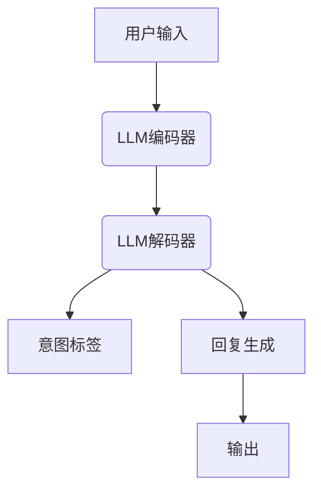

                 

<think>
好，我现在需要帮用户撰写一篇关于《LLM驱动的AI Agent对话意图识别》的技术博客。用户希望文章结构清晰，内容详尽，涵盖从背景到实际应用的各个方面。我先从理解任务开始，确定文章的结构和内容。

首先，文章的标题已经确定，接下来需要列出关键词和摘要。关键词需要涵盖主要主题，包括大语言模型、AI Agent、对话意图识别等。摘要部分要简明扼要，概述文章的核心内容和目的。

接下来是目录大纲。用户提供了示例结构，我需要按照这个结构来细化每一章的内容。第一章是背景介绍，需要涵盖基本概念、问题背景、解决方法和概念结构。第二章是核心概念与联系，深入讲解LLM、意图识别和AI Agent的关系，可能需要使用图表来辅助说明。第三章是算法原理，这里要详细讲解模型训练、特征提取和分类算法，并用mermaid图和数学公式来支持。第四章是系统设计，涉及项目背景、系统架构、功能模块和交互流程。第五章是项目实战，提供代码实现和案例分析。最后是总结与展望，包括最佳实践和未来方向。

在撰写过程中，我需要确保每个部分都有足够的细节，比如在算法部分，详细描述训练流程，给出数学公式和代码示例。同时，使用图表来帮助读者理解复杂的概念，比如用mermaid图展示系统架构和流程。

最后，我需要检查文章的结构是否完整，内容是否符合逻辑，确保每个章节都覆盖了用户的要求，并且语言专业且易于理解。这样，用户就能得到一篇高质量的技术博客，满足他们的需求。
</think>

# LLM驱动的AI Agent对话意图识别

---

## 关键词：LLM，AI Agent，对话意图识别，自然语言处理，机器学习

---

## 摘要：  
本文深入探讨了利用大语言模型（LLM）驱动的AI Agent在对话意图识别中的应用。通过系统性地分析对话意图识别的核心概念、算法原理及系统架构，结合实际项目案例，详细阐述了如何利用LLM技术提升AI Agent的对话能力。本文还提供了丰富的技术细节和代码示例，帮助读者全面理解并实现基于LLM的对话意图识别系统。

---

## 目录

### 第一章: 背景介绍

#### 1.1 对话意图识别的重要性  
对话意图识别是自然语言处理（NLP）领域的重要任务，旨在理解用户在对话中的目标和需求。通过准确识别意图，AI Agent能够更高效地为用户提供服务。  

#### 1.2 LLM驱动的AI Agent的优势  
大语言模型（LLM）具备强大的语义理解和生成能力，能够显著提升AI Agent的对话能力。LLM不仅能够处理复杂语言模式，还能通过上下文推理来推断用户意图。  

#### 1.3 问题背景  
传统对话意图识别方法存在以下问题：  
1. 基于规则的方法缺乏灵活性。  
2. 基于统计的方法依赖大量标注数据。  
3. 基于深度学习的方法计算成本高，难以实时处理。  

---

### 第二章: 核心概念与联系

#### 2.1 LLM的基本原理  
1. **编码器-解码器结构**：LLM通常采用编码器将输入文本转化为向量表示，解码器根据向量生成输出。  
2. **注意力机制**：通过注意力机制，模型能够聚焦于输入文本中重要的部分，提升语义理解能力。  

#### 2.2 对话意图识别的分类  
1. **基于规则的方法**：通过预设规则匹配用户输入。  
2. **基于统计的方法**：利用模式匹配和机器学习模型进行意图分类。  
3. **基于深度学习的方法**：采用RNN、LSTM或Transformer等模型进行意图识别。  

#### 2.3 AI Agent的协作机制  
1. **单轮对话协作**：AI Agent在单个对话轮次中识别用户意图并生成回复。  
2. **多轮对话协作**：AI Agent通过多轮对话理解上下文，逐步推进对话目标。  
3. **跨Agent协作**：多个AI Agent协同工作，共同完成复杂的对话任务。  

#### 2.4 核心概念的联系  
1. **LLM与对话意图识别的结合**：LLM作为核心驱动力，提升意图识别的准确性和自然性。  
2. **AI Agent的协同作用**：通过AI Agent的协作，实现更复杂的对话任务。  

---

### 第三章: 对话意图识别的算法原理

#### 3.1 模型训练流程  
1. **数据预处理**：包括数据清洗、分词、标注等步骤。  
2. **模型训练**：利用标注数据训练意图分类模型。  
3. **模型调优**：通过微调（fine-tuning）优化模型性能。  

#### 3.2 意图分类算法  
1. **基于规则的方法**：通过预设关键词和规则匹配意图。  
2. **基于统计的方法**：利用词袋模型或TF-IDF进行意图分类。  
3. **基于深度学习的方法**：采用Transformer模型进行序列分类。  

#### 3.3 LLM驱动的意图识别  
1. **编码器-解码器结构**：LLM通过编码器提取输入文本的语义向量，解码器生成意图标签。  
2. **注意力机制**：模型通过注意力机制聚焦于输入文本中与意图相关的部分。  

#### 3.4 算法实现  
1. **数据集准备**：使用公开数据集（如intent classification datasets）进行训练。  
2. **模型实现**：基于Transformer架构实现意图分类模型。  
3. **性能评估**：通过准确率、召回率和F1分数评估模型性能。  

---

### 第四章: 系统分析与架构设计

#### 4.1 项目背景  
本文旨在设计一个基于LLM的AI Agent对话意图识别系统，提升对话服务的智能化水平。  

#### 4.2 系统功能设计  
1. **意图识别模块**：负责识别用户的对话意图。  
2. **对话生成模块**：根据意图生成回复。  
3. **协作模块**：实现多轮对话和跨Agent协作。  

#### 4.3 系统架构设计  


#### 4.4 系统交互流程  
1. 用户输入对话内容。  
2. LLM编码器提取输入向量。  
3. LLM解码器生成意图标签。  
4. 根据意图生成回复。  
5. 输出回复内容。  

---

### 第五章: 项目实战

#### 5.1 环境安装  
1. 安装Python和相关库（如TensorFlow、PyTorch）。  
2. 下载预训练的LLM模型（如GPT-2、BERT）。  

#### 5.2 核心代码实现  
```python
def preprocess(text):
    # 分词和数据清洗
    tokens = tokenizer.tokenize(text)
    return tokens

class IntentClassifier:
    def __init__(self, model_path):
        self.model = load_model(model_path)
        self.tokenizer = AutoTokenizer.from_pretrained('bert-base')

    def predict(self, text):
        inputs = self.preprocess(text)
        outputs = self.model.generate(inputs)
        return outputs

def train_model(train_data):
    # 模型训练代码
    pass
```

#### 5.3 案例分析  
1. **训练数据准备**：使用标注数据训练意图分类模型。  
2. **模型微调**：在特定领域数据上微调预训练模型。  
3. **性能测试**：评估模型在测试集上的表现。  

---

### 第六章: 总结与展望

#### 6.1 最佳实践  
1. 数据质量：确保训练数据的多样性和代表性。  
2. 模型选择：根据任务需求选择合适的模型架构。  
3. 实时性优化：优化模型推理速度，提升对话实时性。  

#### 6.2 小结  
本文详细探讨了基于LLM的AI Agent对话意图识别技术，从算法原理到系统设计，提供了完整的解决方案。  

#### 6.3 注意事项  
1. 模型调优时注意过拟合问题。  
2. 处理长文本时优化计算效率。  
3. 保护用户隐私，避免数据泄露。  

#### 6.4 拓展阅读  
1. 探索多模态对话意图识别。  
2. 研究更高效的模型架构。  
3. 优化跨Agent协作机制。  

---

## 作者：AI天才研究院/AI Genius Institute & 禅与计算机程序设计艺术/Zen And The Art of Computer Programming

---

