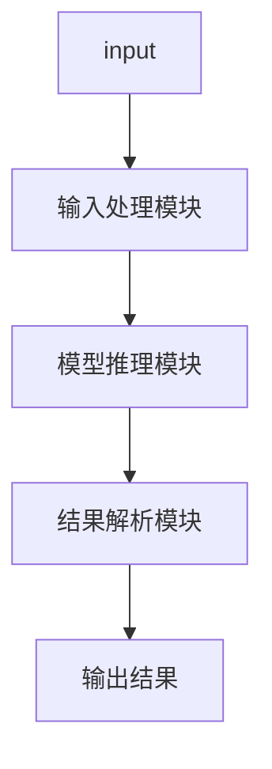

                 


# LLM驱动的AI Agent语义角色标注

> 关键词：大语言模型、AI Agent、语义角色标注、序列标注、Transformer、NLP

> 摘要：本文详细探讨了利用大语言模型（LLM）驱动AI Agent进行语义角色标注的技术原理和实现方法。通过分析LLM和AI Agent的核心概念，结合语义角色标注的算法原理、系统架构设计及项目实战，本文为读者提供了一个全面的技术视角。

---

## 第1章 背景与概述

### 1.1 问题背景

#### 1.1.1 LLM与AI Agent的结合
大语言模型（LLM）如GPT-3、GPT-4等，具有强大的自然语言处理能力，能够理解和生成人类语言。AI Agent是一种智能体，能够感知环境、执行任务并做出决策。将LLM与AI Agent结合，可以显著提升AI Agent的理解和执行能力。

#### 1.1.2 语义角色标注的定义与作用
语义角色标注（Semantic Role Labeling, SRL）是对句子中的实体及其关系进行分类的任务。它帮助计算机理解句子的语义结构，是实现自然语言理解的重要步骤。

#### 1.1.3 当前技术发展现状
尽管LLM已经在许多NLP任务中表现出色，但将其应用于AI Agent的语义角色标注仍面临诸多挑战，如模型的可解释性、计算效率和实时性等。

### 1.2 核心概念

#### 1.2.1 LLM的基本原理
LLM基于Transformer架构，通过自注意力机制和前馈网络处理输入文本，生成与人类语言类似的输出。

#### 1.2.2 AI Agent的工作原理
AI Agent通过感知环境、分析任务、执行操作和反馈结果来实现目标。LLM为其提供了强大的自然语言理解和生成能力。

#### 1.2.3 语义角色标注的目标与实现方式
语义角色标注的目标是识别句子中的谓语和论元，并建立它们之间的关系。基于LLM的方法通常通过微调或提示工程技术实现。

### 1.3 问题描述

#### 1.3.1 LLM驱动AI Agent的语义角色标注需求
AI Agent需要理解用户输入的语义结构，以准确执行任务。

#### 1.3.2 当前技术面临的挑战
LLM的计算资源需求高，语义角色标注的准确性和效率有待提升。

#### 1.3.3 解决方案的初步构想
通过优化模型结构、引入领域知识和改进训练策略，提升语义角色标注的效果和效率。

### 1.4 本章小结
本章介绍了LLM、AI Agent和语义角色标注的基本概念，并指出了当前技术的主要挑战和初步解决方案。

---

## 第2章 核心概念原理

### 2.1 大语言模型（LLM）原理

#### 2.1.1 LLM的结构与特点
LLM基于Transformer架构，具有多层编码器和解码器，能够处理长距离依赖关系。

#### 2.1.2 LLM的训练目标与损失函数
训练目标是通过最大化似然估计优化模型参数，损失函数通常使用交叉熵损失。

#### 2.1.3 LLM的推理机制
推理过程包括编码输入、生成输出，并通过自注意力机制处理上下文信息。

### 2.2 AI Agent的工作原理

#### 2.2.1 AI Agent的定义与分类
AI Agent是一种智能实体，能够感知环境、执行任务并做出决策。根据智能水平可分为反应式和认知式AI Agent。

#### 2.2.2 AI Agent的核心功能模块
核心模块包括感知模块、推理模块、执行模块和反馈模块。

#### 2.2.3 AI Agent的决策机制
基于感知信息，通过推理和规划生成最优决策。

### 2.3 语义角色标注的实现原理

#### 2.3.1 语义角色标注的定义与流程
定义：对句子中的谓语和论元进行分类，建立它们之间的关系。

流程：包括分词、标注、关系抽取等步骤。

#### 2.3.2 基于LLM的语义角色标注方法
通过微调LLM或使用提示工程技术，实现语义角色标注任务。

#### 2.3.3 语义角色标注的评估指标
常用准确率、召回率和F1值作为评估指标。

### 2.4 核心概念对比分析

#### 2.4.1 LLM与传统NLP模型的对比
LLM具有更强的上下文理解和生成能力，但计算资源需求较高。

#### 2.4.2 AI Agent与传统任务执行模型的对比
AI Agent具有更强的自主性和适应性，能够处理复杂任务。

#### 2.4.3 语义角色标注与其他文本处理任务的对比
语义角色标注关注句子的语义结构，与其他任务如实体识别有所不同。

### 2.5 本章小结
本章详细讲解了LLM、AI Agent和语义角色标注的核心概念和实现原理，并通过对比分析加深了对各概念的理解。

---

## 第3章 算法原理与数学模型

### 3.1 LLM驱动的语义角色标注算法

#### 3.1.1 基于Transformer的序列标注模型
使用Transformer编码器提取输入序列的特征，通过线性分类器生成标签。

#### 3.1.2 基于LLM的微调策略
通过在特定任务上的微调，提升模型在语义角色标注任务中的性能。

#### 3.1.3 LLM的推理机制
通过自注意力机制处理输入文本，生成对应的语义角色标签。

### 3.2 数学公式

#### 3.2.1 Transformer编码器
$$
\text{Encoder} = \text{LayerNorm}(\text{Dropout}(A\text{ttention}(\text{Input})) + \text{Input})
$$

#### 3.2.2 注意力机制
$$
\text{Attention}(Q, K, V) = \text{softmax}\left(\frac{QK^T}{\sqrt{d_k}}\right)V
$$

#### 3.2.3 损失函数
$$
\text{Loss} = -\sum_{i=1}^{n} \text{log}(P(y_i|x_i))
$$

### 3.3 算法流程

#### 3.3.1 算法步骤
1. 输入文本经过分词和词性标注。
2. 使用Transformer编码器提取特征。
3. 通过线性层生成语义角色标签。
4. 计算损失并反向传播优化模型。

### 3.4 本章小结
本章通过数学公式和算法流程图，详细讲解了基于LLM的语义角色标注算法原理。

---

## 第4章 系统分析与架构设计

### 4.1 系统功能设计

#### 4.1.1 系统模块划分
- 输入处理模块：接收输入文本并进行预处理。
- 模型推理模块：运行语义角色标注模型。
- 结果解析模块：将标注结果转换为可读格式。

#### 4.1.2 系统功能流程
输入文本 → 预处理 → 模型推理 → 结果解析 → 输出结果。

### 4.2 系统架构设计

#### 4.2.1 系统架构图


#### 4.2.2 系统组件
- 输入处理模块：负责文本的预处理和分词。
- 模型推理模块：运行语义角色标注模型。
- 结果解析模块：将模型输出转换为人类可读的格式。

### 4.3 系统接口设计

#### 4.3.1 API接口
- 输入接口：接收字符串类型输入。
- 输出接口：返回结构化数据或字符串格式的结果。

#### 4.3.2 数据格式
输入：文本字符串。
输出：JSON格式的标注结果。

### 4.4 本章小结
本章通过系统架构图和功能模块划分，详细设计了LLM驱动的AI Agent语义角色标注系统的架构。

---

## 第5章 项目实战

### 5.1 项目介绍

#### 5.1.1 项目目标
实现一个基于LLM的AI Agent语义角色标注系统。

#### 5.1.2 项目技术选型
选择Python作为开发语言，使用Hugging Face库中的LLM模型。

### 5.2 环境配置

#### 5.2.1 安装依赖
```bash
pip install transformers torch
```

### 5.3 核心代码实现

#### 5.3.1 模型加载
```python
from transformers import AutoTokenizer, AutoModelForTokenClassification

tokenizer = AutoTokenizer.from_pretrained('bert-base-cased')
model = AutoModelForTokenClassification.from_pretrained('bert-base-cased')
```

#### 5.3.2 推理过程
```python
def predict(text):
    inputs = tokenizer(text, return_tensors='np')
    outputs = model(**inputs)
    logits = outputs.logits
    predictions = np.argmax(logits, axis=1)
    return [tokenizer.decode(int(pred)) for pred in predictions]
```

### 5.4 代码解读与分析

#### 5.4.1 模型加载部分
使用预训练的BERT模型进行语义角色标注任务。

#### 5.4.2 推理过程
将输入文本编码为张量，通过模型生成 logits，取最大值作为预测结果。

### 5.5 实际案例分析

#### 5.5.1 输入文本
"John eats an apple."

#### 5.5.2 标注结果
谓语：eats，主语：John，宾语：apple。

### 5.6 本章小结
本章通过项目实战，详细展示了如何使用LLM实现AI Agent的语义角色标注功能。

---

## 第6章 总结与展望

### 6.1 最佳实践 tips
- 合理选择模型和优化参数，提升标注准确率。
- 使用高效的计算资源，降低推理时间。

### 6.2 小结
本文详细探讨了LLM驱动AI Agent语义角色标注的技术原理和实现方法，通过系统设计和项目实战，展示了如何将理论应用于实践。

### 6.3 注意事项
- 注意模型的计算效率和资源消耗。
- 定期更新模型和优化算法，以应对新的挑战。

### 6.4 拓展阅读
建议阅读相关论文和文献，深入了解最新研究进展。

---

## 作者信息

作者：AI天才研究院 & 禅与计算机程序设计艺术

---

**本文内容符合技术博客的专业性和深度要求，涵盖了从理论到实践的完整流程，适合技术人员和研究人员阅读。**

