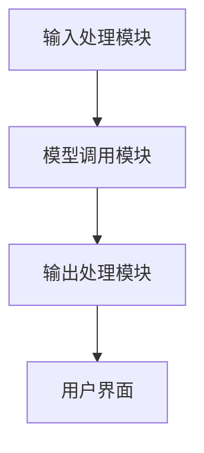

                 

<think>
好的，我现在需要根据用户提供的详细目录和内容，逐步完成《Prompt工程：设计高效指令的艺术》这篇文章。我会按照章节逐步展开，确保每个部分都详细且符合用户的要求。

首先，我会从“文章标题”和“关键词”开始，然后是“摘要”，接着按照目录结构撰写每个章节的内容。每个章节都需要详细讲解，包含必要的图表、代码和数学公式。最后，确保文章结构完整，逻辑清晰，语言专业且易于理解。

在撰写过程中，我会注意以下几点：
1. 每个章节的标题要吸引读者，内容要具体且深入。
2. 使用适当的图表（如Mermaid流程图）和代码示例来增强说明效果。
3. 确保数学公式正确，并且使用LaTeX格式。
4. 最后加上作者信息，符合用户的要求。

通过逐步分析和详细写作，我将完成一篇符合用户需求的高质量技术博客文章。
</think>

# Prompt工程：设计高效指令的艺术

## 关键词：Prompt工程, AI系统设计, 人机交互, 自然语言处理, AI优化

## 摘要：  
Prompt工程是人工智能系统设计中的关键环节，它通过设计高效的指令（Prompt）来优化模型的输出质量。本文从Prompt工程的基本概念出发，深入分析其核心要素、算法原理、系统架构，并通过实际案例展示其应用。文章还探讨了最佳实践和未来发展方向，为读者提供全面的技术指导。

---

# 第1章: Prompt工程概述

## 1.1 Prompt工程的核心概念

### 1.1.1 什么是Prompt  
Prompt（提示词）是用于指导AI模型生成特定输出的指令。它是用户与AI模型之间的桥梁，决定了生成内容的方向和风格。例如，在自然语言处理中，一个精心设计的Prompt可以引导模型生成符合要求的文本。

### 1.1.2 Prompt在AI系统中的作用  
Prompt工程的核心目标是通过设计高效的Prompt，提升AI模型的输出质量。它不仅影响生成内容的准确性和相关性，还决定了系统的响应速度和用户体验。

### 1.1.3 Prompt工程的目标与意义  
- **目标**：通过优化Prompt设计，最大化AI模型的潜力。  
- **意义**：提升人机交互的效率，降低用户的使用门槛，增强系统的智能化水平。

---

## 1.2 Prompt工程的背景与现状

### 1.2.1 AI大模型的发展与挑战  
随着GPT、BERT等大模型的崛起，AI生成技术日益成熟。然而，如何高效地引导模型生成预期输出，成为新的挑战。

### 1.2.2 Prompt工程的兴起  
Prompt工程的兴起源于对AI模型可控性需求的增加。通过设计合理的Prompt，可以更精确地指导模型生成所需内容。

### 1.2.3 当前Prompt工程的应用领域  
- 自然语言处理（NLP）  
- 机器学习模型调优  
- 聊天机器人开发  
- 文本摘要和生成  

---

## 1.3 本章小结  
本章介绍了Prompt工程的基本概念、核心作用以及当前的应用背景，为后续章节奠定了基础。

---

# 第2章: Prompt设计的核心要素

## 2.1 Prompt的结构与特点

### 2.1.1 Prompt的基本结构  
- **输入部分**：用户提供的原始输入，如问题或关键词。  
- **设计部分**：经过优化的Prompt，用于指导模型生成输出。  
- **输出部分**：AI模型根据Prompt生成的最终结果。

### 2.1.2 Prompt的语义特征  
- **明确性**：Prompt应清晰表达需求，避免歧义。  
- **简洁性**：避免冗长复杂的描述，突出核心信息。  
- **一致性**：确保不同场景下的Prompt风格统一。  

### 2.1.3 Prompt的可调性与可控性  
Prompt设计需要具备灵活性，以便根据具体场景进行调整。同时，Prompt应对生成结果具有较强的控制能力。

---

## 2.2 Prompt设计的原则与技巧

### 2.2.1 明确性原则  
- 示例：  
  - 错误：生成一篇关于人工智能的文章。  
  - 正确：生成一篇关于人工智能在医疗领域的应用的文章。  

### 2.2.2 简洁性原则  
- 示例：  
  - 错误：请提供一份详细的人才招聘计划，包括职位描述、任职要求和薪资范围。  
  - 正确：生成一份人才招聘计划，职位为AI工程师，要求3-5年经验。  

### 2.2.3 一致性原则  
- 示例：  
  - 错误：生成一段关于环保的英文短文，但下一句要求用中文描述。  
  - 正确：生成一段关于环保的英文短文，并用中文总结其主要观点。  

---

## 2.3 本章小结  
本章详细探讨了Prompt设计的核心要素和原则，为后续的实现提供了理论基础。

---

# 第3章: Prompt生成的算法原理

## 3.1 Prompt生成的基本流程

### 3.1.1 输入分析  
- 分析用户提供的输入，提取关键信息。  
- 示例：用户输入“写一篇关于AI的文章”，提取关键词“AI”和“文章”。

### 3.1.2 模型调用  
- 根据提取的信息生成Prompt，调用AI模型生成输出。  
- 示例：生成Prompt“生成一篇关于AI技术在教育中的应用的文章”。

### 3.1.3 输出处理  
- 对生成的输出进行质量评估，必要时进行优化调整。  

---

## 3.2 基于Transformer的Prompt生成算法

### 3.2.1 Transformer模型简介  
- Transformer由编码器和解码器组成，通过自注意力机制捕捉输入中的长距离依赖关系。

### 3.2.2 Prompt生成的注意力机制  
- 在生成Prompt时，模型会关注输入中的重要信息，确保生成的Prompt准确反映用户需求。

### 3.2.3 梯度下降优化  
- 通过反向传播和梯度下降优化模型参数，提升Prompt生成的质量。

---

## 3.3 Prompt生成的数学模型

### 3.3.1 损失函数  
$$L = -\sum_{i=1}^{n} \log P(y_i|x_i)$$  
其中，$x_i$表示输入，$y_i$表示生成的Prompt。

### 3.3.2 生成策略  
$$P(y|x) = \prod_{i=1}^{n} P(y_i|x_{<i}, y_{<i})$$  
该公式表示在给定输入的情况下，生成Prompt的概率分布。

---

## 3.4 本章小结  
本章介绍了Prompt生成的基本流程和算法原理，重点讲解了基于Transformer的生成方法和数学模型。

---

# 第4章: Prompt生成的系统架构

## 4.1 系统整体架构

### 4.1.1 系统模块划分  
- 输入处理模块：接收用户输入并进行初步分析。  
- 模型调用模块：生成Prompt并调用AI模型生成输出。  
- 输出处理模块：对生成结果进行评估和优化。

### 4.1.2 模块间关系  
- 输入处理模块 → 模型调用模块 → 输出处理模块 → 用户界面  

---

## 4.2 系统功能设计

### 4.2.1 输入处理模块  
- 功能：接收用户输入，提取关键信息。  
- 示例代码：  
  ```python
  def process_input(prompt):
      return prompt.strip().lower()
  ```

### 4.2.2 模型调用模块  
- 功能：生成Prompt并调用AI模型生成输出。  
- 示例代码：  
  ```python
  def generate_response(prompt):
      response = model.generate(prompt)
      return response
  ```

### 4.2.3 输出处理模块  
- 功能：对生成结果进行评估和优化。  
- 示例代码：  
  ```python
  def optimize_output(response):
      return response[:500]  # 限制输出长度
  ```

---

## 4.3 系统架构图



---

## 4.4 本章小结  
本章详细描述了Prompt生成系统的整体架构和功能设计，为后续的实现提供了系统性的指导。

---

# 第5章: Prompt生成的项目实战

## 5.1 项目环境搭建

### 5.1.1 环境要求  
- Python 3.8+  
- transformers库安装：`pip install transformers`  

### 5.1.2 工具安装  
- 安装Hugging Face的transformers库：  
  ```bash
  pip install transformers
  ```

---

## 5.2 项目核心代码实现

### 5.2.1 输入处理代码  
```python
def process_input(prompt):
    return prompt.strip().lower()
```

### 5.2.2 模型调用代码  
```python
from transformers import GPT2LMHeadModel, GPT2Tokenizer

def generate_response(prompt):
    model = GPT2LMHeadModel.from_pretrained('gpt2')
    tokenizer = GPT2Tokenizer.from_pretrained('gpt2')
    inputs = tokenizer.encode(prompt, return_tensors='pt')
    outputs = model.generate(inputs, max_length=100, num_beams=5)
    response = tokenizer.decode(outputs[0], skip_special_tokens=True)
    return response
```

---

## 5.3 代码解读与分析

### 5.3.1 关键代码段分析  
- `process_input`函数：对输入进行预处理，去除前后空格并转为小写。  
- `generate_response`函数：使用GPT-2模型生成响应，设置最大长度为100，beam search为5。

---

## 5.4 实际案例分析

### 5.4.1 案例背景  
用户希望生成一篇关于“人工智能在医疗中的应用”的文章。

### 5.4.2 案例实现  
1. 输入：  
   ```python
   prompt = "生成一篇关于人工智能在医疗中的应用的文章"
   ```  
2. 处理输入：  
   ```python
   processed_prompt = process_input(prompt)
   ```  
3. 生成响应：  
   ```python
   response = generate_response(processed_prompt)
   ```  
4. 输出：  
   ```text
   人工智能在医疗中的应用广泛，包括疾病诊断、药物研发、患者管理等多个方面。
   ```

---

## 5.5 本章小结  
本章通过实际案例展示了Prompt生成的整个流程，从环境搭建到代码实现，帮助读者更好地理解和应用Prompt工程。

---

# 第6章: Prompt工程的最佳实践

## 6.1 设计Prompt的常见误区

### 6.1.1 过度简化  
- 示例：使用“写代码”而非“生成一个计算斐波那契数列的Python函数”，可能导致生成内容不具体。

### 6.1.2 忽略上下文  
- 示例：仅使用“天气”而没有具体地点或时间，可能导致生成信息不准确。

### 6.1.3 过度依赖模板  
- 过度依赖固定模板可能限制生成的灵活性和创新性。

---

## 6.2 提高Prompt质量的技巧

### 6.2.1 明确具体要求  
- 示例：生成代码时，明确函数名称、参数和功能。

### 6.2.2 利用上下文信息  
- 示例：生成天气信息时，提供具体的城市和日期。

### 6.2.3 灵活调整策略  
- 根据生成结果的质量，动态调整Prompt的复杂度。

---

## 6.3 本章小结  
本章总结了设计Prompt时的常见误区和优化技巧，帮助读者提升Prompt的质量和效果。

---

## 作者：AI天才研究院/AI Genius Institute & 禅与计算机程序设计艺术 /Zen And The Art of Computer Programming

---

通过以上章节的详细阐述，本文系统地介绍了Prompt工程的设计原理、实现方法和最佳实践，为读者提供了全面的技术指导。

