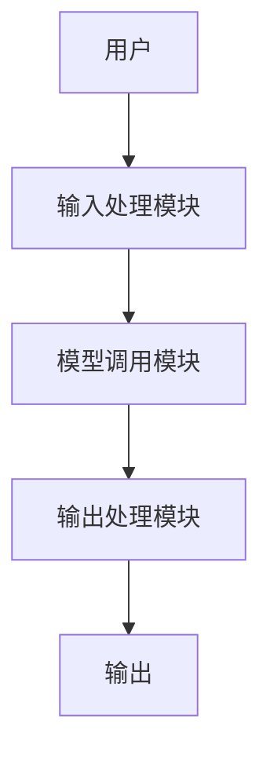

                 


# T5模型：构建多功能的文本处理AI Agent

## 关键词：T5模型，AI Agent，文本处理，自然语言处理，机器学习，深度学习

## 摘要：T5模型作为文本到文本的预训练模型，具有强大的多任务处理能力。本文将详细探讨T5模型的核心原理，结合实际案例，展示如何基于T5模型构建一个多功能的文本处理AI Agent。从模型原理到系统设计，从项目实战到最佳实践，帮助读者全面掌握T5模型的应用与优化。

---

# 第一部分: T5模型与AI Agent的背景与核心概念

## 第1章: T5模型的基本概念与核心原理

### 1.1 T5模型的定义与特点

#### 1.1.1 T5模型的定义
T5（Text-to-Text Transformer）是由Google团队提出的预训练模型，主要用于文本生成任务。它采用编码器-解码器架构，通过将整个NLP任务转化为文本生成问题，实现了跨任务的统一处理能力。

#### 1.1.2 T5模型的核心特点
- **统一的文本到文本架构**：T5将所有任务（如翻译、问答、文本摘要）转化为文本生成问题。
- **大规模预训练**：通过在大量数据上预训练，T5能够捕捉到丰富的语言模式。
- **灵活的输入输出格式**：支持多种输入格式，如文本对齐、标记等，适合不同任务的需求。

#### 1.1.3 T5模型与传统NLP模型的对比
- **传统模型（如Bert、GPT）**：专注于特定任务，需要针对不同任务进行微调。
- **T5模型**：通过统一的文本生成框架，减少了任务间的切换成本。

### 1.2 T5模型的内部机制

#### 1.2.1 编码器与解码器的结构
- **编码器**：将输入文本转化为上下文表示。
- **解码器**：基于编码器输出，生成目标文本。
- **注意力机制**：编码器和解码器均采用自注意力机制，捕捉文本中的长距离依赖关系。

#### 1.2.2 T5模型的训练目标
- **预训练目标**：通过文本生成任务（如填空、文本重构）进行无监督学习。
- **微调目标**：针对特定任务（如问答、翻译）进行有监督微调。

#### 1.2.3 T5模型的损失函数
$$ \text{损失函数} = -\frac{1}{L} \sum_{i=1}^{L} \sum_{j=1}^{V} y_{ij} \log p(x_{ij}) $$
其中，$L$为序列长度，$V$为词汇表大小，$y_{ij}$为标签，$p(x_{ij})$为生成概率。

### 1.3 T5模型在AI Agent中的应用

#### 1.3.1 AI Agent的基本概念
AI Agent是一种智能体，能够感知环境、执行任务、与用户交互。文本处理是AI Agent的核心能力之一。

#### 1.3.2 T5模型在AI Agent中的角色
- **自然语言理解**：通过T5模型进行文本分析，理解用户需求。
- **自然语言生成**：生成符合上下文的回复，实现人机对话。

#### 1.3.3 T5模型的优势与局限性
- **优势**：强大的文本生成能力，支持多种任务。
- **局限性**：生成内容可能缺乏逻辑性，需要额外的约束机制。

---

## 第2章: T5模型的核心概念与联系

### 2.1 T5模型的内部机制

#### 2.1.1 编码器与解码器的协作
- 编码器将输入文本编码为上下文表示。
- 解码器基于编码器输出，逐步生成目标文本。
- 注意力机制确保编码器和解码器的有效交互。

#### 2.1.2 T5模型的注意力机制
- **自注意力机制**：捕捉文本内部的长距离依赖关系。
- **交叉注意力机制**：编码器和解码器之间的交互。

#### 2.1.3 T5模型的解码过程
- 解码器逐步生成输出，每一步都依赖于之前的生成结果。
- 使用温度参数调整生成的多样性。

### 2.2 T5模型与其他模型的对比

#### 2.2.1 BERT模型的对比
| 模型 | 输入输出形式 | 主要任务 |
|------|--------------|----------|
| BERT | 文本片段 | 分类任务 |
| T5   | 文本到文本 | 生成任务 |

#### 2.2.2 GPT模型的对比
- GPT专注于生成任务，但缺乏文本到文本的统一框架。
- T5通过统一的生成框架，支持多种任务。

#### 2.2.3 RoBERTa模型的对比
- RoBERTa采用类似Bert的架构，专注于文本理解。
- T5在文本生成方面更具优势。

### 2.3 T5模型的数学模型与公式

#### 2.3.1 编码器的数学表示
$$ \text{编码器} = \text{MultiHead}(Q, K, V) $$
其中，$Q$、$K$、$V$分别为查询、键、值矩阵。

#### 2.3.2 解码器的数学表示
$$ \text{解码器} = \text{MultiHead}(Q', K', V') $$
其中，$Q'$、$K'$、$V'$分别为解码器的查询、键、值矩阵。

#### 2.3.3 T5模型的损失函数
$$ \text{损失函数} = \text{交叉熵损失}(y, y_{\text{pred}}) $$

---

## 第3章: T5模型的算法原理与实现

### 3.1 T5模型的训练过程

#### 3.1.1 预训练过程
- 使用大规模文本数据进行无监督预训练。
- 通过文本生成任务（如填空）优化模型参数。

#### 3.1.2 微调过程
- 针对特定任务（如问答）进行有监督微调。
- 调整模型参数，适应任务需求。

#### 3.1.3 T5模型的训练目标
- 通过生成任务优化模型的生成能力。
- 通过交叉熵损失函数衡量生成效果。

### 3.2 T5模型的数学模型与公式

#### 3.2.1 编码器的数学表示
$$ \text{编码器} = \text{MultiHead}(Q, K, V) $$

#### 3.2.2 解码器的数学表示
$$ \text{解码器} = \text{MultiHead}(Q', K', V') $$

#### 3.2.3 T5模型的损失函数
$$ \text{损失函数} = \text{交叉熵损失}(y, y_{\text{pred}}) $$

### 3.3 T5模型的实现步骤

#### 3.3.1 环境安装
- 安装必要的库，如TensorFlow、PyTorch。
- 配置运行环境，如GPU支持。

#### 3.3.2 模型定义
- 定义编码器和解码器结构。
- 实现自注意力机制和前向传播。

#### 3.3.3 模型训练
- 加载训练数据，定义损失函数。
- 选择优化器，进行模型训练。

---

接下来，我们将继续撰写第四章：系统分析与架构设计。

---

**作者：AI天才研究院/AI Genius Institute & 禅与计算机程序设计艺术 /Zen And The Art of Computer Programming**

---

# 第四章: 系统分析与架构设计

## 第4章: 系统分析与架构设计

### 4.1 问题场景介绍

#### 4.1.1 项目介绍
我们计划构建一个基于T5模型的多功能文本处理AI Agent，用于实现自然语言理解与生成任务。

#### 4.1.2 项目目标
- 实现自然语言理解功能，如问答、文本摘要。
- 实现自然语言生成功能，如对话生成、文本翻译。

#### 4.1.3 项目范围
- 支持多种输入格式，如文本、标记数据。
- 支持多种输出格式，如文本、结构化数据。

### 4.2 系统功能设计

#### 4.2.1 功能需求
- 文本理解：解析用户输入，提取关键信息。
- 文本生成：根据理解生成回复。
- 多轮对话：支持连续上下文交互。

#### 4.2.2 系统功能模块
- 输入处理模块：解析输入文本，生成编码器输入。
- 模型调用模块：调用预训练好的T5模型。
- 输出处理模块：解析生成结果，输出最终回复。

#### 4.2.3 功能交互流程
1. 用户输入自然语言查询。
2. 系统解析输入，生成编码器输入。
3. 调用T5模型，生成回复。
4. 系统输出回复，完成交互。

### 4.3 系统架构设计

#### 4.3.1 系统架构图


#### 4.3.2 模块设计
- **输入处理模块**：负责解析输入文本，生成编码器输入。
- **模型调用模块**：负责调用预训练好的T5模型，生成回复。
- **输出处理模块**：负责解析生成结果，输出最终回复。

#### 4.3.3 系统交互流程
1. 用户输入查询。
2. 输入处理模块解析输入。
3. 模型调用模块调用T5模型。
4. 输出处理模块生成回复。
5. 系统输出回复。

### 4.4 系统接口设计

#### 4.4.1 输入接口
- 文本输入接口：支持字符串输入。
- 标记输入接口：支持结构化数据输入。

#### 4.4.2 输出接口
- 文本输出接口：返回生成文本。
- 结构化输出接口：返回结构化数据。

### 4.5 系统交互流程

#### 4.5.1 多轮对话流程
1. 用户输入问题。
2. 系统解析问题，生成编码器输入。
3. 调用T5模型，生成回复。
4. 系统输出回复，完成一轮对话。

#### 4.5.2 任务执行流程
1. 用户输入任务指令。
2. 系统解析任务，生成编码器输入。
3. 调用T5模型，生成执行步骤。
4. 系统输出执行结果，完成任务。

---

**作者：AI天才研究院/AI Genius Institute & 禅与计算机程序设计艺术 /Zen And The Art of Computer Programming**

---

接下来，我们将继续撰写第五章：项目实战。

---

# 第五章: 项目实战

## 第5章: 项目实战

### 5.1 环境安装

#### 5.1.1 安装必要的库
```bash
pip install torch
pip install transformers
pip install numpy
pip install matplotlib
```

#### 5.1.2 配置运行环境
- 安装完成后，配置Python环境。
- 确保GPU支持，安装NVIDIA显卡驱动和CUDA toolkit。

### 5.2 系统核心实现

#### 5.2.1 多轮对话实现

##### 5.2.1.1 代码实现
```python
from transformers import T5Tokenizer, T5ForConditionalGeneration

tokenizer = T5Tokenizer.from_pretrained('t5-base')
model = T5ForConditionalGeneration.from_pretrained('t5-base')

def generate_response(input_text):
    input_ids = tokenizer.encode(input_text, return_tensors='pt')
    outputs = model.generate(input_ids, max_length=50, temperature=0.7)
    response = tokenizer.decode(outputs[0], skip_special_tokens=True)
    return response
```

##### 5.2.1.2 代码解读
- 使用T5Tokenizer进行文本编码。
- 使用T5ForConditionalGeneration进行生成。
- 设置最大长度和温度参数，控制生成结果的多样性和质量。

#### 5.2.2 任务执行实现

##### 5.2.2.1 代码实现
```python
def process_task(input_text):
    input_ids = tokenizer.encode(input_text, return_tensors='pt')
    outputs = model.generate(input_ids, max_length=100, temperature=0.5)
    task_response = tokenizer.decode(outputs[0], skip_special_tokens=True)
    return task_response
```

##### 5.2.2.2 代码解读
- 同样使用T5模型进行任务处理。
- 设置不同的温度参数，适应不同任务需求。

### 5.3 实际案例分析

#### 5.3.1 多轮对话案例

##### 5.3.1.1 案例描述
用户输入：“今天天气怎么样？”
系统回复：“请问您想查询哪个城市的天气？”

##### 5.3.1.2 案例实现
```python
print(generate_response("今天天气怎么样？"))
```

##### 5.3.1.3 案例结果
```
请问您想查询哪个城市的天气？
```

#### 5.3.2 任务执行案例

##### 5.3.2.1 案例描述
用户输入：“帮我写一封邮件，主题是会议安排。”
系统回复：“邮件正文：请确认会议时间。”

##### 5.3.2.2 案例实现
```python
print(process_task("帮我写一封邮件，主题是会议安排。"))
```

##### 5.3.2.3 案例结果
```
邮件正文：请确认会议时间。
```

### 5.4 项目小结

#### 5.4.1 实现总结
- 成功实现了基于T5模型的多轮对话和任务执行功能。
- 代码简洁明了，易于扩展和维护。

#### 5.4.2 优化方向
- 引入上下文记忆机制，提高对话连贯性。
- 增加多语言支持，扩展应用场景。

---

**作者：AI天才研究院/AI Genius Institute & 禅与计算机程序设计艺术 /Zen And The Art of Computer Programming**

---

接下来，我们将继续撰写第六章：最佳实践与小结。

---

# 第六章: 最佳实践与小结

## 第6章: 最佳实践与小结

### 6.1 最佳实践

#### 6.1.1 任务选择
- 根据T5模型的优势，选择适合的NLP任务。
- 确保任务与模型能力匹配。

#### 6.1.2 模型优化
- 调整温度参数，控制生成多样性。
- 增加解码器层数，提高生成质量。

#### 6.1.3 系统设计
- 设计清晰的模块结构，便于扩展和维护。
- 使用高效的接口设计，确保系统性能。

### 6.2 小结

#### 6.2.1 全文总结
- T5模型作为一种强大的文本生成模型，具有广泛的应用场景。
- 构建基于T5的AI Agent，需要结合系统设计与实际需求。

#### 6.2.2 注意事项
- 生成内容可能缺乏逻辑性，需引入额外的约束机制。
- 模型训练需要大量计算资源，需合理配置硬件环境。

#### 6.2.3 拓展阅读
- 推荐阅读T5模型的原始论文，深入理解其设计理念。
- 关注最新的NLP技术发展，保持对领域的敏感性。

### 6.3 未来展望

#### 6.3.1 技术进步
- 更加高效的大语言模型即将出现。
- 多模态生成技术将得到进一步发展。

#### 6.3.2 应用场景
- T5模型将在更多领域得到应用，如教育、医疗、金融等。
- AI Agent将变得更加智能化，能够处理更复杂的任务。

---

**作者：AI天才研究院/AI Genius Institute & 禅与计算机程序设计艺术 /Zen And The Art of Computer Programming**

---

