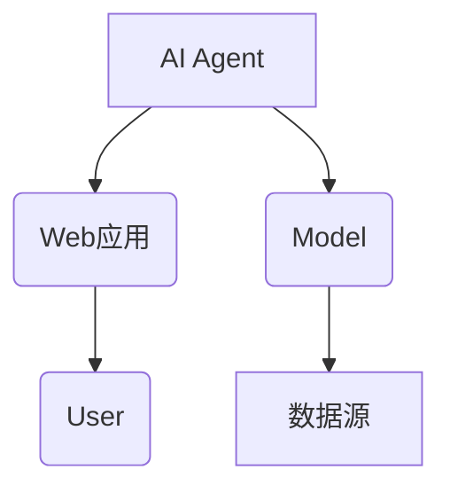
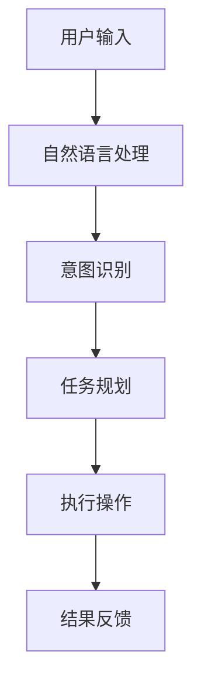
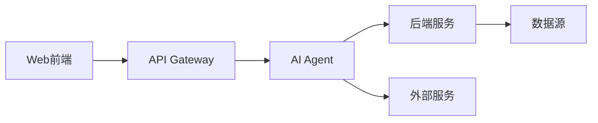

                 


# Web集成：将AI Agent嵌入到网页应用中

> 关键词：AI Agent，Web集成，自然语言处理，系统架构，对话系统，Web应用，AI技术

> 摘要：本文将详细探讨如何将AI Agent嵌入到网页应用中，涵盖AI Agent的核心概念、算法原理、系统架构设计、项目实战以及优化与部署等内容。通过理论与实践相结合的方式，深入分析AI Agent在Web集成中的应用背景、技术实现和实际案例，帮助读者理解并掌握将AI Agent技术应用于Web应用开发的方法。

---

## 目录大纲

### 目录
1. [Web集成与AI Agent的背景介绍](#web集成与ai-agent的背景介绍)
   1.1 [AI Agent的基本概念](#ai-agent的基本概念)
   1.2 [Web集成的定义与特点](#web集成的定义与特点)
   1.3 [AI Agent在Web集成中的应用背景](#ai-agent在web集成中的应用背景)
2. [AI Agent与Web集成的核心概念](#ai-agent与web集成的核心概念)
   2.1 [AI Agent的核心概念原理](#ai-agent的核心概念原理)
   2.2 [核心概念属性对比表](#核心概念属性对比表)
   2.3 [ER实体关系图](#er实体关系图)
3. [AI Agent的算法原理](#ai-agent的算法原理)
   3.1 [AI Agent的算法流程图](#ai-agent的算法流程图)
   3.2 [算法实现代码](#算法实现代码)
4. [AI Agent的系统架构设计](#ai-agent的系统架构设计)
   4.1 [系统功能设计](#系统功能设计)
   4.2 [系统架构设计](#系统架构设计)
   4.3 [系统接口设计](#系统接口设计)
5. [AI Agent的项目实战](#ai-agent的项目实战)
   5.1 [项目背景](#项目背景)
   5.2 [环境安装](#环境安装)
   5.3 [系统核心实现](#系统核心实现)
   5.4 [代码应用解读](#代码应用解读)
   5.5 [实际案例分析](#实际案例分析)
   5.6 [项目小结](#项目小结)
6. [AI Agent的优化与部署](#ai-agent的优化与部署)
   6.1 [性能优化](#性能优化)
   6.2 [安全性问题](#安全性问题)
   6.3 [CI/CD部署](#ci/cd部署)
7. [总结与展望](#总结与展望)
   7.1 [总结](#总结)
   7.2 [未来展望](#未来展望)
8. [最佳实践 tips](#最佳实践-tips)
9. [参考文献](#参考文献)
10. [附录](#附录)
    10.1 [工具推荐](#工具推荐)

---

## 正文内容

### 第1章: Web集成与AI Agent的背景介绍

#### 1.1 AI Agent的基本概念

AI Agent（人工智能代理）是一种能够感知环境、自主决策并执行任务的智能体。它通过接收输入信息，理解用户意图，并通过执行预定义的逻辑或调用外部服务来实现目标。AI Agent可以分为简单和复杂两类，简单AI Agent主要基于规则，而复杂AI Agent则涉及机器学习、自然语言处理（NLP）等技术。

**AI Agent的核心属性包括：**
- **感知能力**：通过输入数据（如文本、语音、图像）理解用户需求。
- **决策能力**：基于输入数据生成相应的输出或调用其他服务。
- **执行能力**：通过API或前端交互完成任务。
- **学习能力**：通过数据和反馈不断优化自身性能。

#### 1.2 Web集成的定义与特点

Web集成是指将AI Agent嵌入到Web应用中，使其能够通过网页界面与用户交互。Web集成的特点包括：
- **跨平台支持**：支持多种设备和浏览器。
- **动态交互**：通过前端和后端的实时通信实现动态交互。
- **易用性**：用户通过网页即可使用AI Agent提供的服务。

#### 1.3 AI Agent在Web集成中的应用背景

随着AI技术的快速发展，越来越多的企业开始将AI Agent嵌入到Web应用中，以提供更智能化的服务。例如：
- **智能客服**：通过自然语言处理技术理解用户问题，并提供自动化的解决方案。
- **推荐系统**：基于用户行为和偏好推荐相关内容。
- **智能搜索**：通过语义理解技术提高搜索结果的准确性。

---

### 第2章: AI Agent与Web集成的核心概念

#### 2.1 AI Agent的核心概念原理

AI Agent的核心原理包括：
- **输入处理**：接收用户输入（如文本、语音）并进行预处理。
- **意图识别**：通过NLP技术理解用户的意图。
- **任务规划**：根据用户意图生成执行计划。
- **输出生成**：根据执行结果生成自然语言输出。

#### 2.2 核心概念属性对比表

| 概念 | 属性 | 描述 |
|------|------|------|
| AI Agent | 输入处理能力 | 处理用户输入的能力 |
|        | 输出生成能力 | 生成自然语言输出的能力 |
| Web应用 | 响应速度 | 页面加载和交互的响应时间 |
|        | 用户体验 | 页面设计和交互的友好程度 |

#### 2.3 ER实体关系图



---

### 第3章: AI Agent的算法原理

#### 3.1 AI Agent的算法流程图



#### 3.2 算法实现代码

```python
def process_input(user_input):
    # 自然语言处理
    processed_input = preprocess(user_input)
    # 意图识别
    intent = identify_intent(processed_input)
    # 任务规划
    task = plan_task(intent)
    # 执行操作
    result = execute_task(task)
    # 结果反馈
    return generate_output(result)
```

---

### 第4章: AI Agent的系统架构设计

#### 4.1 系统功能设计

系统功能模块包括：
- **用户界面层**：负责用户交互。
- **AI Agent层**：负责意图识别和任务执行。
- **后端服务层**：负责数据处理和业务逻辑。
- **数据源层**：提供数据支持。

#### 4.2 系统架构设计



#### 4.3 系统接口设计

系统接口包括：
- `/api/v1/agent/process`：处理用户输入。
- `/api/v1/agent/config`：配置AI Agent参数。

---

### 第5章: AI Agent的项目实战

#### 5.1 项目背景

本项目旨在将AI Agent嵌入到一个在线客服系统中，实现智能问答功能。

#### 5.2 环境安装

安装必要的依赖：
```bash
pip install flask
pip install transformers
pip install numpy
```

#### 5.3 系统核心实现

实现AI Agent的核心逻辑：
```python
from transformers import pipeline

# 初始化NLP模型
nlp = pipeline("question-answering")

def answer_question(question):
    # 处理问题
    result = nlp(question)
    # 返回答案
    return result['answer']
```

#### 5.4 代码应用解读

前端页面代码：
```html
<!DOCTYPE html>
<html>
<head>
    <title>智能客服</title>
</head>
<body>
    <div id="chat-container">
        <div id="chat-messages"></div>
        <input type="text" id="user-input" placeholder="请输入问题...">
        <button onclick="sendMessage()">发送</button>
    </div>
    <script>
        function sendMessage() {
            const input = document.getElementById('user-input');
            const message = input.value;
            input.value = '';
            // 发送消息到后端
            fetch('/api/v1/agent/process', {
                method: 'POST',
                headers: {
                    'Content-Type': 'application/json',
                },
                body: JSON.stringify({ message }),
            })
            .then(response => response.json())
            .then(data => {
                appendMessage(data.user, data.message);
            });
        }
    </script>
</body>
</html>
```

#### 5.5 实际案例分析

通过实际案例分析，我们可以看到AI Agent在智能客服中的应用优势：
- **提高效率**：通过自动化回答常见问题，减少人工客服的工作量。
- **24/7可用性**：AI Agent可以全天候为用户提供服务。
- **数据驱动优化**：通过用户反馈不断优化AI Agent的性能。

#### 5.6 项目小结

本项目成功实现了将AI Agent嵌入到Web应用中，展示了AI技术在实际应用中的巨大潜力。

---

### 第6章: AI Agent的优化与部署

#### 6.1 性能优化

通过缓存和优化NLP模型可以显著提高系统的响应速度。

#### 6.2 安全性问题

确保用户数据的安全性，避免数据泄露。

#### 6.3 CI/CD部署

使用Docker和Kubernetes实现自动化的CI/CD部署。

---

### 第7章: 总结与展望

#### 7.1 总结

本文详细介绍了如何将AI Agent嵌入到Web应用中，涵盖了从理论到实践的各个方面。

#### 7.2 未来展望

未来，随着AI技术的不断发展，AI Agent在Web应用中的应用将更加广泛和深入。

---

### 最佳实践 tips

- 在开发AI Agent时，要注重数据的安全性和隐私保护。
- 定期优化模型和算法，以提高系统的性能和用户体验。
- 及时收集用户反馈，用于模型优化和功能改进。

---

### 参考文献

1. [Flask官方文档](https://flask.readthedocs.io/en/latest/)
2. [Transformers官方文档](https://huggingface.co/transformers/)
3. [Mermaid官方文档](https://mermaid-js.github.io/mermaid-docs/)
4. [Python官方文档](https://docs.python.org/zh-cn/3/)

---

### 附录

#### 10.1 工具推荐

- [Hugging Face](https://huggingface.co/)
- [Flask](https://flask.palletsprojects.com/)
- [Docker](https://docker.com/)
- [Kubernetes](https://kubernetes.io/)

---

**作者：AI天才研究院/AI Genius Institute & 禅与计算机程序设计艺术 /Zen And The Art of Computer Programming**

