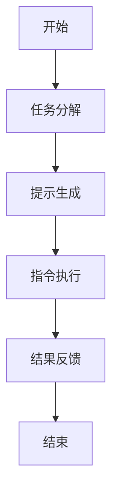
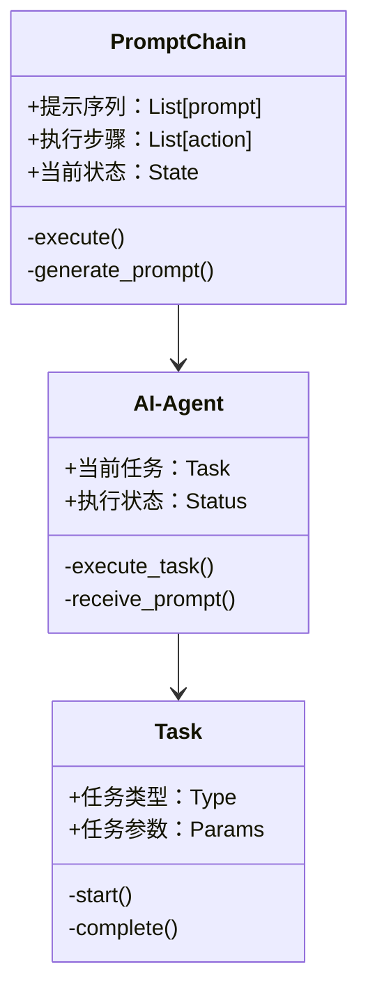
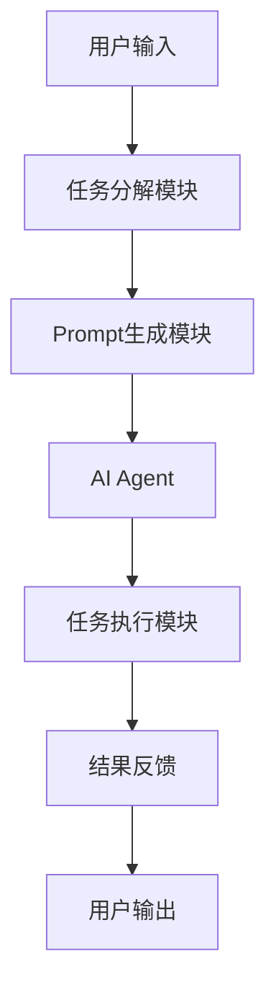

                 


# Prompt链：构建复杂AI Agent工作流

## 关键词：Prompt链，AI Agent，工作流，系统架构，算法原理

## 摘要：本文详细探讨了Prompt链在构建复杂AI Agent工作流中的作用，从核心概念到算法原理，再到系统架构和项目实战，全面解析了如何利用Prompt链优化AI Agent的工作流程。通过丰富的案例和详细的代码实现，本文为读者提供了从理论到实践的完整指南。

---

## 第一部分：Prompt链与AI Agent工作流的背景与基础

### 第1章：Prompt链与AI Agent概述

#### 1.1 Prompt链的基本概念

##### 1.1.1 什么是Prompt链
Prompt链是一种通过序列化的提示（Prompts）来驱动AI Agent执行复杂任务的技术。它通过将多个提示串联起来，形成一个工作流，从而实现任务的自动化和智能化。每个提示都是一个具体的指令，AI Agent根据这些指令逐步完成任务。

##### 1.1.2 Prompt链的核心作用
Prompt链的核心作用在于将复杂的任务分解为多个简单的步骤，通过提示的方式引导AI Agent逐步完成。这种方式不仅提高了任务的可分解性，还增强了AI Agent的灵活性和适应性。

##### 1.1.3 Prompt链与AI Agent的关系
Prompt链是AI Agent的一种驱动方式，通过提供有序的提示，帮助AI Agent更好地理解和执行任务。AI Agent通过Prompt链接收指令，逐步完成从输入到输出的整个流程。

---

#### 1.2 AI Agent工作流的基础知识

##### 1.2.1 AI Agent的定义与分类
AI Agent是一种能够感知环境、自主决策并执行任务的智能实体。它可以分为简单AI Agent和复杂AI Agent，后者通常需要处理多个任务和复杂的交互。

##### 1.2.2 AI Agent的工作流程
AI Agent的工作流程通常包括感知环境、分析任务、制定计划、执行操作和反馈结果。通过Prompt链，AI Agent可以更高效地完成这些步骤。

##### 1.2.3 AI Agent在实际场景中的应用
AI Agent广泛应用于智能助手、自动化系统、机器人控制等领域。通过Prompt链，AI Agent可以更好地适应复杂的任务需求。

---

### 第2章：Prompt链的背景与重要性

#### 2.1 AI Agent工作流的复杂性

##### 2.1.1 复杂AI Agent工作流的挑战
复杂AI Agent工作流通常涉及多个任务和复杂的交互。传统的单步提示方式难以应对这种复杂性，需要引入更高效的方法。

##### 2.1.2 Prompt链在复杂工作流中的作用
Prompt链通过将任务分解为多个提示，帮助AI Agent逐步完成复杂任务。这种方式不仅提高了任务的可分解性，还增强了AI Agent的灵活性。

##### 2.1.3 Prompt链的重要性
Prompt链的重要性在于它能够将复杂的任务分解为多个简单的步骤，通过提示的方式引导AI Agent逐步完成。这种方式不仅提高了任务的可分解性，还增强了AI Agent的灵活性和适应性。

---

## 第二部分：Prompt链的核心概念与联系

### 第3章：Prompt链的核心概念与原理

#### 3.1 Prompt链的基本原理

##### 3.1.1 Prompt链的定义与组成
Prompt链是由多个提示组成的序列，每个提示都是一个具体的指令。AI Agent通过逐步执行这些指令，完成整个任务。

##### 3.1.2 Prompt链的工作流程
Prompt链的工作流程包括任务分解、提示生成、指令执行和结果反馈。AI Agent通过这些步骤逐步完成任务。

##### 3.1.3 Prompt链的关键特性
Prompt链的关键特性包括可分解性、灵活性和可扩展性。这些特性使得Prompt链能够适应各种复杂的任务需求。

---

#### 3.2 Prompt链与AI Agent的关系

##### 3.2.1 Prompt链如何驱动AI Agent
Prompt链通过提供有序的提示，驱动AI Agent逐步完成任务。AI Agent通过解析这些提示，执行相应的操作。

##### 3.2.2 Prompt链在AI Agent中的作用
Prompt链在AI Agent中起到了任务分解和流程控制的作用。通过Prompt链，AI Agent可以更高效地完成复杂的任务。

##### 3.2.3 Prompt链如何优化AI Agent的工作
Prompt链通过分解任务和优化流程，帮助AI Agent提高效率和准确性。这种方式不仅降低了任务的复杂性，还增强了AI Agent的可扩展性。

---

## 第三部分：算法原理讲解

### 第4章：Prompt链的算法原理

#### 4.1 Prompt链的算法流程

##### 4.1.1 算法概述
Prompt链的算法流程包括任务分解、提示生成、指令执行和结果反馈。通过这些步骤，AI Agent可以逐步完成任务。

##### 4.1.2 算法步骤分解
1. **任务分解**：将复杂任务分解为多个简单的步骤。
2. **提示生成**：为每个步骤生成相应的提示。
3. **指令执行**：AI Agent根据提示执行操作。
4. **结果反馈**：根据结果调整后续步骤。

##### 4.1.3 算法流程图


---

#### 4.2 算法的数学模型与公式

##### 4.2.1 算法的数学表达
Prompt链的算法可以通过以下公式表示：
$$
P = p_1 \rightarrow p_2 \rightarrow \cdots \rightarrow p_n
$$
其中，$P$ 表示Prompt链，$p_i$ 表示第 $i$ 个提示。

##### 4.2.2 算法优化公式
为了优化Prompt链的效率，可以引入权重系数：
$$
w_i = \alpha \cdot p_i + \beta \cdot f(p_i)
$$
其中，$\alpha$ 和 $\beta$ 是权重系数，$f(p_i)$ 表示提示的复杂度。

---

## 第四部分：系统分析与架构设计方案

### 第5章：Prompt链的系统架构设计

#### 5.1 项目背景介绍

##### 5.1.1 项目目标
本项目旨在通过Prompt链优化AI Agent的工作流程，提高任务执行的效率和准确性。

##### 5.1.2 项目需求
- 实现复杂任务的分解与执行
- 提供灵活的提示生成机制
- 支持多种任务类型

---

#### 5.2 系统功能设计

##### 5.2.1 领域模型设计


##### 5.2.2 系统架构设计


##### 5.2.3 系统接口设计
- **输入接口**：用户输入任务需求。
- **输出接口**：任务执行结果。
- **内部接口**：任务分解模块与Prompt生成模块之间的交互。

##### 5.2.4 系统交互流程
```mermaid
sequenceDiagram
    participant 用户
    participant 任务分解模块
    participant Prompt生成模块
    participant AI Agent
    用户->任务分解模块：提交任务
    任务分解模块->Prompt生成模块：生成提示
    Prompt生成模块->AI Agent：发送提示
    AI Agent->任务执行模块：执行任务
    任务执行模块->用户：反馈结果
```

---

## 第五部分：项目实战

### 第6章：基于Prompt链的AI Agent实现

#### 6.1 项目实战环境安装

##### 6.1.1 环境要求
- Python 3.8+
- OpenAI API
- Mermaid工具

##### 6.1.2 安装依赖
```bash
pip install openai mermaid4j
```

---

#### 6.2 系统核心代码实现

##### 6.2.1 代码结构
```python
class PromptChain:
    def __init__(self):
        self.prompts = []
        self.actions = []
        self.current_state = "idle"

    def add_prompt(self, prompt):
        self.prompts.append(prompt)

    def generate_prompt(self, task):
        # 根据任务生成提示
        pass

    def execute(self):
        # 执行提示链
        pass

class AI-Agent:
    def __init__(self):
        self.current_task = None
        self.status = "idle"

    def receive_prompt(self, prompt):
        # 接收提示并执行任务
        pass
```

##### 6.2.2 核心代码实现
```python
def execute_task(task):
    # 分解任务
    prompts = generate_prompts(task)
    # 执行提示链
    for prompt in prompts:
        action = execute_prompt(prompt)
        append_action(action)
    return feedback
```

##### 6.2.3 代码解读与分析
- **PromptChain类**：负责生成和管理提示链。
- **AI-Agent类**：接收提示并执行任务。
- **execute_task函数**：分解任务并执行提示链。

---

#### 6.3 案例分析与详细讲解

##### 6.3.1 案例介绍
假设任务是“生成一份年度报告”。分解为以下提示：
1. 收集数据
2. 整理数据
3. 撰写报告
4. 审核报告

##### 6.3.2 代码实现与分析
```python
def generate_prompts(task):
    prompts = []
    if task == "年度报告":
        prompts.append("收集2023年销售数据")
        prompts.append("整理数据并生成图表")
        prompts.append("撰写报告初稿")
        prompts.append("审核报告并提交")
    return prompts
```

##### 6.3.3 项目小结
通过案例分析，我们可以看到Prompt链在分解任务和优化流程方面的重要作用。

---

## 第六部分：高级主题与最佳实践

### 第7章：Prompt链的高级主题

#### 7.1 优化技巧与注意事项

##### 7.1.1 提示链的优化
- 使用权重系数优化提示的重要性。
- 通过反馈机制动态调整提示链。

##### 7.1.2 安全性考虑
- 避免恶意提示的干扰。
- 确保数据的安全性和隐私性。

##### 7.1.3 可扩展性设计
- 支持多种任务类型。
- 提供灵活的提示生成机制。

---

#### 7.2 最佳实践

##### 7.2.1 提示链的设计原则
- 明确任务目标。
- 分解任务为简单的步骤。
- 确保提示的清晰性和明确性。

##### 7.2.2 提示链的使用技巧
- 通过反馈机制优化提示链。
- 使用权重系数调整提示的重要性。

##### 7.2.3 注意事项
- 定期检查和优化提示链。
- 确保数据的安全性和隐私性。

---

## 第七部分：结论

### 第8章：总结与展望

#### 8.1 总结
通过本文的详细讲解，我们可以看到Prompt链在构建复杂AI Agent工作流中的重要作用。Prompt链不仅提高了任务的可分解性，还增强了AI Agent的灵活性和适应性。

#### 8.2 展望
随着AI技术的不断发展，Prompt链的应用前景将更加广阔。未来，Prompt链将进一步优化和扩展，为AI Agent的工作流提供更高效的支持。

---

## 作者信息

作者：AI天才研究院/AI Genius Institute & 禅与计算机程序设计艺术 /Zen And The Art of Computer Programming

