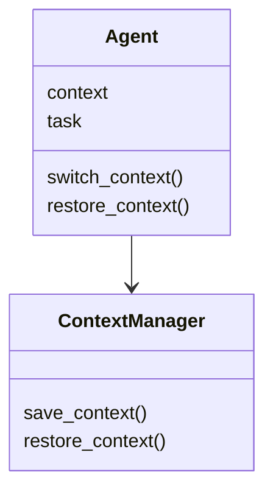

                 


# 上下文切换：让AI Agent更灵活地处理复杂场景

> 关键词：上下文切换、AI Agent、复杂场景、任务切换、状态管理

> 摘要：本文深入探讨了上下文切换在AI Agent中的重要性，分析了其核心概念、算法原理、系统架构，并通过实战案例展示了如何实现上下文切换，使AI Agent在复杂场景中更灵活地处理任务。

---

## 第一部分：上下文切换的背景与概念

### 第1章：上下文切换的背景与问题背景

#### 1.1 问题背景
在人工智能（AI）快速发展的今天，AI Agent（智能体）的应用场景日益广泛。然而，AI Agent在处理复杂场景时，常常面临上下文切换的挑战。上下文切换指的是AI Agent在处理不同任务或场景时，能够快速切换并适应的能力。这种能力对于提高AI Agent的灵活性和效率至关重要。

#### 1.2 问题描述
AI Agent在复杂场景中的局限性主要体现在以下方面：
- **任务切换困难**：AI Agent在处理多个任务时，难以快速切换上下文，导致效率低下。
- **状态管理复杂**：不同任务之间的状态难以协调，容易出现冲突或遗漏。
- **场景切换不灵活**：AI Agent在不同场景之间切换时，缺乏有效的机制来维护和恢复上下文。

#### 1.3 问题解决
上下文切换的目标是通过引入有效的机制，使AI Agent能够在不同任务和场景之间快速切换，并保持上下文的一致性和完整性。实现这一目标的关键在于：
- **状态管理**：通过有效的状态管理，确保AI Agent在切换上下文时能够快速恢复和维护状态。
- **任务切换机制**：设计高效的算法，使AI Agent能够快速切换任务，并在切换过程中保持上下文的一致性。

#### 1.4 边界与外延
上下文切换的边界条件包括：
- **任务切换**：仅涉及任务之间的切换，不涉及其他方面。
- **状态管理**：仅涉及状态的保存和恢复，不涉及其他功能。
- **场景切换**：涉及多个任务和场景的切换。

与任务切换和场景切换相比，上下文切换具有更强的灵活性和适应性。通过上下文切换，AI Agent能够在复杂场景中更灵活地处理任务。

#### 1.5 核心概念与结构
上下文切换的核心要素包括：
- **上下文**：任务或场景所需的状态和信息。
- **切换机制**：任务或场景切换时的算法和流程。
- **状态管理**：上下文切换过程中状态的保存和恢复。

通过核心概念的ER实体关系图，可以清晰地理解上下文切换的核心要素及其关系。

---

## 第二部分：上下文切换的核心概念与原理

### 第2章：上下文切换的核心概念

#### 2.1 上下文切换的定义与特征
上下文切换是指AI Agent在处理不同任务或场景时，能够快速切换并适应的能力。其主要特征包括：
- **快速切换**：AI Agent能够在短时间内完成上下文的切换。
- **上下文一致性**：切换后的上下文保持一致性和完整性。
- **灵活性**：能够适应不同的任务和场景。

通过表格对比，可以更清晰地理解上下文切换与其他相关概念的区别和联系。

---

## 第三部分：上下文切换的算法原理与实现

### 第3章：上下文切换的算法原理

#### 3.1 算法原理
上下文切换的实现依赖于任务切换算法和状态管理算法。任务切换算法负责在不同任务之间切换，而状态管理算法负责保存和恢复上下文。

#### 3.2 算法实现
以下是任务切换算法的实现代码：

```python
class Agent:
    def __init__(self):
        self.context = None
        self.task = None

    def switch_context(self, new_context):
        self.context = new_context
        # 恢复上下文
        self.restore_context()

    def restore_context(self):
        # 根据上下文恢复状态
        pass
```

---

## 第四部分：系统分析与架构设计

### 第4章：系统分析与架构设计

#### 4.1 系统功能设计
系统功能设计包括任务切换、上下文保存与恢复、状态管理等功能。

#### 4.2 系统架构设计
以下是系统架构的类图：



---

## 第五部分：项目实战

### 第5章：项目实战

#### 5.1 环境安装
项目实战需要以下环境：
- Python 3.8+
- Mermaid图生成工具

#### 5.2 核心代码实现
以下是核心代码实现：

```python
class Agent:
    def __init__(self):
        self.context = None
        self.task = None

    def switch_context(self, new_context):
        self.context = new_context
        self.restore_context()

    def restore_context(self):
        # 恢复上下文
        pass
```

#### 5.3 实际案例分析
通过具体案例分析，可以更清晰地理解上下文切换的实现和应用。

---

## 第六部分：总结与展望

### 6.1 总结
上下文切换是AI Agent在复杂场景中灵活处理任务的关键。通过有效的算法和架构设计，可以实现高效的上下文切换。

### 6.2 未来展望
未来，上下文切换技术将在更多领域得到应用，AI Agent的能力将更加智能化和灵活。

---

作者：AI天才研究院/AI Genius Institute & 禅与计算机程序设计艺术 /Zen And The Art of Computer Programming

