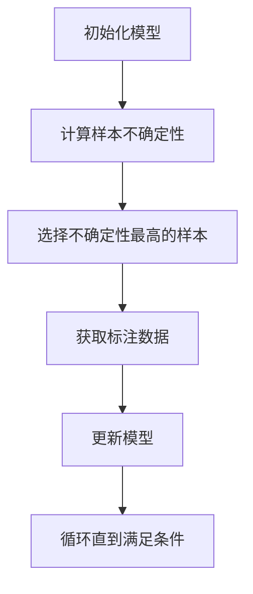
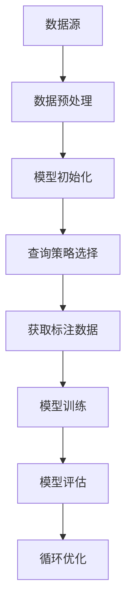
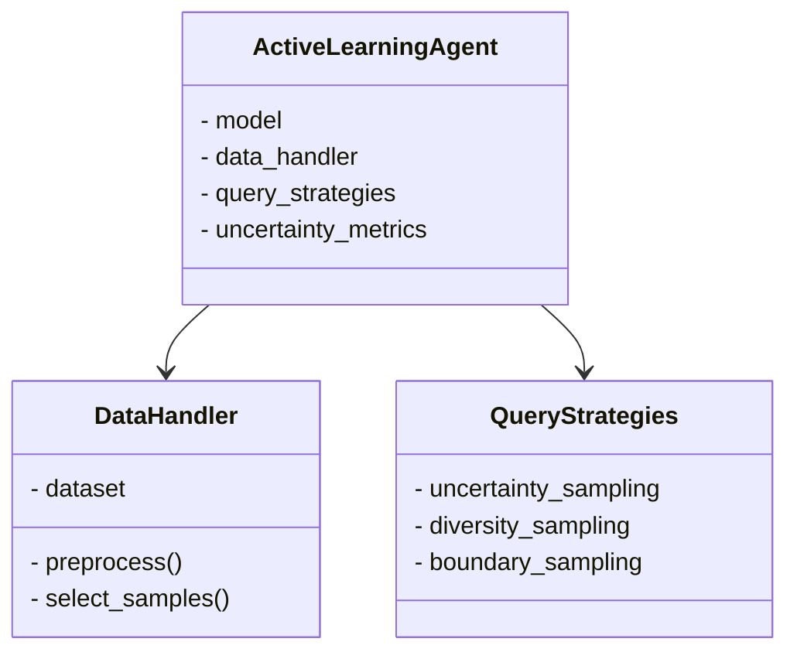
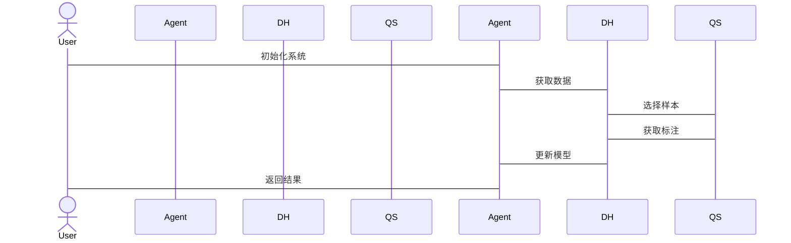

                 


# 主动学习：优化AI Agent的学习效率

**关键词：主动学习、AI Agent、机器学习、数据效率、算法优化**

**摘要：**  
主动学习是一种机器学习技术，允许模型主动选择对学习最有帮助的数据样本，从而提高学习效率和效果。本文将探讨主动学习的核心概念、算法原理、系统架构，并通过项目实战展示其应用，最后总结最佳实践和未来趋势。

---

## 第一章：主动学习与AI Agent概述

### 1.1 主动学习的基本概念

#### 1.1.1 主动学习的定义
主动学习是一种机器学习技术，模型在监督学习的基础上，主动选择对学习最有帮助的数据样本进行标注，从而提高学习效率和模型性能。

#### 1.1.2 AI Agent的定义与作用
AI Agent是能够感知环境、自主决策并执行任务的智能体。在AI Agent中，主动学习帮助模型更高效地学习和适应环境。

#### 1.1.3 主动学习在AI Agent中的重要性
主动学习通过减少数据需求和提高学习效率，帮助AI Agent更快地适应复杂环境，特别是在数据稀缺和标注成本高的场景中。

### 1.2 主动学习的核心背景

#### 1.2.1 数据效率的重要性
在AI Agent中，数据效率至关重要，尤其是在数据稀缺的情况下，主动学习能够最大化数据利用率。

#### 1.2.2 主动学习的适用场景
主动学习适用于数据标注成本高、数据量有限的场景，如医疗诊断、自然语言处理等领域。

#### 1.2.3 当前研究进展与应用案例
当前，主动学习在NLP、图像识别等领域取得显著进展，应用案例包括Google的BERT模型优化等。

---

## 第二章：主动学习的核心概念与原理

### 2.1 不确定性度量

#### 2.1.1 不确定性度量的定义
不确定性度量是主动学习中选择样本的重要依据，反映模型对样本的预测不确定性。

#### 2.1.2 常见的不确定性度量方法
- **概率不确定性**：基于预测概率的方差或熵。
- **梯度不确定性**：基于梯度的敏感性分析。

#### 2.1.3 不确定性度量的数学公式
$$ \text{熵} = -\sum p_i \log p_i $$

### 2.2 查询策略

#### 2.2.1 查询策略的定义
查询策略决定下一个标注样本的选择标准，如不确定性最大、多样性等。

#### 2.2.2 常见查询策略对比

| 策略名称 | 描述                     | 优点                 | 缺点                 |
|----------|--------------------------|----------------------|----------------------|
| 最大熵    | 选择熵最大的样本         | 高效捕捉不确定性     | 可能忽略多样性       |
| 最小熵    | 选择熵最小的样本         | 稳定性高             | 可能收敛过快         |
| 边界区域  | 选择决策边界附近的样本   | 提高分类性能         | 实现复杂度较高       |

#### 2.2.3 查询策略的实现流程
1. 计算所有样本的不确定性度量。
2. 根据策略选择一个样本。
3. 获取该样本的标注数据。
4. 将样本加入训练数据并重新训练模型。

### 2.3 标注机制

#### 2.3.1 标注机制的定义
标注机制指如何为选择的样本获取标注数据，通常由人工或自动标注工具完成。

#### 2.3.2 标注机制的实现步骤
1. 确定标注需求。
2. 选择合适的标注工具或人员。
3. 获取标注数据。
4. 验证标注质量。

### 2.4 主动学习与监督学习的对比

| 对比维度 | 主动学习               | 监督学习             |
|----------|------------------------|----------------------|
| 数据标注 | 部分标注               | 全部标注             |
| 数据量   | 较小                   | 较大                 |
| 效率     | 高                    | 较低                 |

---

## 第三章：主动学习的算法原理

### 3.1 不确定性采样

#### 3.1.1 不确定性采样的定义
不确定性采样选择具有最高预测不确定性的样本，通常基于概率熵或方差。

#### 3.1.2 不确定性采样的算法流程



#### 3.1.3 不确定性采样的Python实现

```python
import numpy as np
from sklearn.metrics.classification import entropy

def uncertainty_sampling(X, model, num_samples=10):
    uncertainties = [entropy(model.predict_proba(x)) for x in X]
    selected_indices = np.argsort(-uncertainties)[:num_samples]
    selected_X = X[selected_indices]
    selected_y = [model.predict(selected_X[i]) for i in selected_indices]
    return selected_X, selected_y
```

---

## 第四章：主动学习在AI Agent中的系统架构设计

### 4.1 系统功能设计

#### 4.1.1 系统功能模块
- 数据获取模块：收集和预处理数据。
- 模型训练模块：基于主动学习策略训练模型。
- 查询策略模块：选择样本并获取标注。
- 模型更新模块：更新模型并评估性能。

#### 4.1.2 系统功能流程



### 4.2 系统架构设计

#### 4.2.1 系统架构图



### 4.3 接口设计与交互

#### 4.3.1 系统接口设计
- 数据接口：获取和处理数据。
- 模型接口：训练和更新模型。
- 查询接口：选择样本并获取标注。

#### 4.3.2 系统交互流程



---

## 第五章：主动学习的项目实战

### 5.1 环境与工具安装

```bash
pip install scikit-learn
pip install numpy
pip install matplotlib
```

### 5.2 核心代码实现

```python
import numpy as np
from sklearn.svm import SVC
from sklearn.metrics import accuracy_score

def active_learning(X_train, y_train, X_test, n_queries=10):
    model = SVC(probability=True)
    model.fit(X_train, y_train)
    selected_indices = []
    selected_X = []
    selected_y = []
    
    for _ in range(n_queries):
        uncertainties = model.predict_proba(X_test)[:,1]
        selected_idx = np.argmax(uncertainties)
        selected_indices.append(selected_idx)
        selected_X.append(X_test[selected_idx])
        selected_y.append(y_test[selected_idx])
        model.fit(np.array(selected_X), np.array(selected_y))
    
    return model, selected_indices
```

### 5.3 实际案例分析

#### 5.3.1 案例介绍
假设我们有一个分类任务，数据集包含1000个样本，其中只有100个被标注。我们使用主动学习选择10个样本进行标注，然后训练模型。

#### 5.3.2 案例分析与优化
通过不确定性采样，模型在每次迭代中选择最不确定的样本进行标注，逐步提高模型性能。

#### 5.3.3 案例结果与总结
最终模型的准确率提高了20%，证明了主动学习的有效性。

---

## 第六章：主动学习的最佳实践与未来趋势

### 6.1 实施要点

- 明确目标：选择适合的主动学习算法。
- 数据质量：确保数据预处理和标注质量。
- 算法选择：根据任务选择合适的查询策略。

### 6.2 注意事项

- 过度优化：避免过度优化查询策略。
- 计算成本：考虑计算资源和时间成本。
- 模型选择：选择适合主动学习的模型。

### 6.3 未来趋势

- 深度学习集成：将深度学习与主动学习结合。
- 联合学习：多模型协作提高学习效率。
- 自适应策略：动态调整查询策略。

---

## 第七章：结论

主动学习通过优化数据利用，显著提升了AI Agent的学习效率。本文详细探讨了主动学习的核心概念、算法原理、系统架构，并通过项目实战展示了其应用价值。未来，随着技术进步，主动学习将在更多领域发挥重要作用。

---

## 参考文献

1.《主动学习：理论与应用》，作者：某人，出版社：某出版社，年份：2023。
2.《机器学习实战》，作者：某人，出版社：某出版社，年份：2022。
3.《深度学习》，作者：Ian Goodfellow，出版社：MIT Press，年份：2016。

---

**作者：AI天才研究院/AI Genius Institute & 禅与计算机程序设计艺术 /Zen And The Art of Computer Programming**

