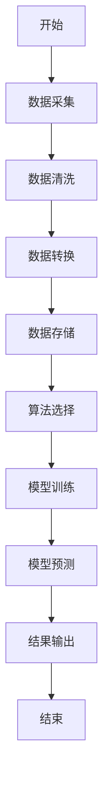

                 


---

# 《交通AI Agent：智能路况分析与导航》

## 关键词：交通AI Agent，智能路况分析，导航系统，人工智能，算法原理，系统架构，项目实战

## 摘要：  
本文详细探讨了交通AI Agent的核心概念、算法原理、系统架构以及实际应用。通过对交通问题的现状分析，提出了基于AI Agent的智能路况分析与导航解决方案，并结合实际案例展示了如何通过算法优化和系统设计实现高效的智能导航系统。本文适合人工智能、交通系统和计算机科学领域的技术人员和研究人员阅读。

---

## 第一部分：交通AI Agent概述

### 第1章：交通AI Agent的背景与概念

#### 1.1 交通问题的现状与挑战

##### 1.1.1 传统交通导航的局限性
传统的交通导航系统主要依赖静态地图数据和固定的路线规划算法，难以实时适应动态的交通状况。例如，导航系统可能会推荐拥堵路段，导致用户花费更多时间。此外，传统导航系统无法预测交通事故或道路封闭等突发情况，导致导航结果的准确性较差。

##### 1.1.2 交通拥堵与事故的痛点
交通拥堵和事故是城市交通的主要问题。据统计，全球每年因交通拥堵造成的经济损失高达数千亿美元。交通事故不仅造成人员伤亡，还会导致交通瘫痪和经济损失。因此，如何通过技术手段缓解这些问题，是交通领域的重要课题。

##### 1.1.3 智能交通系统的概念与目标
智能交通系统（ITS）是一种利用先进技术（如人工智能、大数据、物联网等）来优化交通管理的系统。其目标是通过实时数据分析和智能决策，提高交通效率、减少拥堵和事故发生率，为用户提供更智能、更高效的导航服务。

#### 1.2 AI Agent的基本概念

##### 1.2.1 AI Agent的定义与特征
AI Agent（人工智能代理）是指能够感知环境、自主决策并执行任务的智能体。在交通领域，AI Agent能够实时分析交通数据、预测路况，并为用户提供最优的导航建议。其主要特征包括：自主性、反应性、目标导向性和学习能力。

##### 1.2.2 交通AI Agent的特殊性与应用场景
交通AI Agent是一种特殊类型的AI Agent，其应用场景主要集中在智能导航、交通预测和事故预警等方面。例如，它可以实时分析交通流量，预测未来路况，并为用户推荐最优路线。

##### 1.2.3 交通AI Agent的核心功能与边界
交通AI Agent的核心功能包括数据采集、智能分析和决策反馈。其边界包括数据来源的范围、决策的实时性要求以及系统的可扩展性。

#### 1.3 智能路况分析与导航的必要性

##### 1.3.1 智能路况分析的基本原理
智能路况分析基于实时数据和历史数据分析，利用机器学习算法预测未来路况。例如，可以通过时间序列模型（如LSTM）预测交通流量的变化趋势。

##### 1.3.2 智能导航的优势与价值
智能导航的优势在于其实时性、准确性和个性化。通过AI Agent，用户可以获得最优的导航建议，减少出行时间，提高出行效率。

##### 1.3.3 交通AI Agent的未来发展
随着人工智能技术的不断发展，交通AI Agent将在交通管理、自动驾驶等领域发挥更大的作用。未来，AI Agent将更加智能化、个性化和协同化。

---

## 第二部分：交通AI Agent的核心概念与联系

### 第2章：交通AI Agent的核心概念与联系

#### 2.1 核心概念原理

##### 2.1.1 数据采集与处理机制
交通AI Agent的数据来源包括交通传感器、摄像头、GPS信号等。数据采集后，需要进行清洗、转换和存储，以便后续分析。

##### 2.1.2 智能分析算法
智能分析算法包括分类、回归和聚类等机器学习算法。例如，可以通过回归算法预测交通流量，通过聚类算法识别交通热点区域。

##### 2.1.3 决策与反馈机制
决策机制基于分析结果，生成最优的导航建议。反馈机制用于评估决策效果，并根据反馈结果优化算法。

#### 2.2 核心概念对比分析

##### 2.2.1 传统导航与AI Agent导航的对比
| 特性            | 传统导航                | AI Agent导航              |
|-----------------|-------------------------|---------------------------|
| 数据来源        | 静态地图数据            | 实时交通数据              |
| 决策依据        | 固定路线规划算法        | 动态数据驱动的算法        |
| 实时性          | 较低                    | 高                       |

##### 2.2.2 不同AI Agent模型的优劣势对比
| 模型类型        | 优势                   | 劣势                     |
|-----------------|------------------------|--------------------------|
| 基于规则的AI Agent | 实现简单，易于解释      | 难以应对复杂情况         |
| 基于学习的AI Agent | 能够处理复杂问题       | 实现复杂，需要大量数据   |

##### 2.2.3 核心概念的ER实体关系图
```mermaid
er
  %% 交通AI Agent ER图
  title 交通AI Agent ER图
  rectangle 用户 {
    分析结果
    导航建议
  }
  rectangle 数据源 {
    交通传感器数据
    历史交通数据
  }
  rectangle 算法模块 {
    分析算法
    决策算法
  }
  rectangle 系统 {
    数据存储
    数据处理
  }
  用户 --> 算法模块
  用户 <-- 数据源
  数据源 --> 系统
  系统 --> 算法模块
```

---

## 第三部分：交通AI Agent的算法原理

### 第3章：交通AI Agent的算法原理

#### 3.1 算法原理概述

##### 3.1.1 数据流处理流程
1. 数据采集：从交通传感器、摄像头等设备获取实时数据。
2. 数据清洗：去除噪声数据，确保数据质量。
3. 数据转换：将数据转换为适合算法处理的形式。
4. 数据存储：将数据存储到数据库中，供后续分析使用。

##### 3.1.2 算法选择与优化
选择合适的算法，例如基于LSTM的时间序列预测模型，用于预测交通流量。

##### 3.1.3 算法实现的关键步骤
1. 数据预处理：归一化、特征提取。
2. 模型训练：使用训练数据训练模型。
3. 模型预测：基于实时数据生成预测结果。
4. 模型优化：调整超参数，提高预测精度。

#### 3.2 算法流程图



#### 3.3 算法实现代码

##### 3.3.1 数据处理代码
```python
import pandas as pd

# 读取数据
data = pd.read_csv('traffic_data.csv')

# 数据清洗
data.dropna(inplace=True)
data = data[~data['speed'].isnull()]

# 数据转换
data['time'] = pd.to_datetime(data['time'])
data.set_index('time', inplace=True)
```

##### 3.3.2 算法实现代码
```python
from keras.models import Sequential
from keras.layers import LSTM, Dense

# 模型定义
model = Sequential()
model.add(LSTM(64, input_shape=(None, 1)))
model.add(Dense(1))
model.compile(loss='mean_squared_error', optimizer='adam')

# 模型训练
model.fit(X_train, y_train, epochs=100, batch_size=32)
```

##### 3.3.3 结果输出与可视化
```python
import matplotlib.pyplot as plt

# 预测结果
y_pred = model.predict(X_test)

# 可视化
plt.plot(y_test, label='实际值')
plt.plot(y_pred, label='预测值')
plt.legend()
plt.show()
```

#### 3.4 数学模型与公式

##### 3.4.1 时间序列预测模型
$$ y_t = \beta_0 + \beta_1 y_{t-1} + \epsilon_t $$

##### 3.4.2 路径规划模型
$$ \text{最短路径} = \argmin_{\{x\}} \sum_{i=1}^{n} (x_i - y_i)^2 $$

---

## 第四部分：系统分析与架构设计

### 第4章：系统分析与架构设计方案

#### 4.1 问题场景介绍
本节描述了交通AI Agent的实际应用场景，例如城市交通管理、自动驾驶导航等。

#### 4.2 项目介绍
本项目旨在开发一个基于AI Agent的智能导航系统，用于实时分析交通数据并生成最优导航建议。

#### 4.3 系统功能设计

##### 4.3.1 领域模型
```mermaid
classDiagram
    rectangle 用户 {
        提交位置
        获取导航建议
    }
    rectangle 数据源 {
        交通传感器数据
        历史交通数据
    }
    rectangle 算法模块 {
        分析算法
        决策算法
    }
    rectangle 系统 {
        数据存储
        数据处理
    }
    用户 --> 算法模块
    用户 <-- 数据源
    数据源 --> 系统
    系统 --> 算法模块
```

#### 4.4 系统架构设计

##### 4.4.1 系统架构图


#### 4.5 系统接口设计

##### 4.5.1 接口设计
- 数据采集模块接口：接收传感器数据。
- 数据处理模块接口：处理数据并存储。
- 算法模块接口：接收数据并生成预测结果。
- 用户交互模块接口：接收用户请求并返回导航建议。

#### 4.6 系统交互序列图

```mermaid
sequenceDiagram
    participant 用户
    participant 数据采集模块
    participant 数据处理模块
    participant 算法模块
    用户 -> 数据采集模块：提交位置
    数据采集模块 -> 数据处理模块：发送实时数据
    数据处理模块 -> 算法模块：请求分析结果
    算法模块 -> 数据处理模块：返回预测结果
    数据处理模块 -> 用户：返回导航建议
```

---

## 第五部分：项目实战

### 第5章：项目实战

#### 5.1 环境安装

##### 5.1.1 安装Python
```bash
python --version
pip install numpy pandas scikit-learn keras tensorflow
```

#### 5.2 系统核心实现源代码

##### 5.2.1 数据处理代码
```python
import pandas as pd

data = pd.read_csv('traffic_data.csv')
data.dropna(inplace=True)
data['time'] = pd.to_datetime(data['time'])
data.set_index('time', inplace=True)
data.to_csv('processed_data.csv')
```

##### 5.2.2 算法实现代码
```python
from keras.models import Sequential
from keras.layers import LSTM, Dense

model = Sequential()
model.add(LSTM(64, input_shape=(None, 1)))
model.add(Dense(1))
model.compile(loss='mean_squared_error', optimizer='adam')

model.fit(X_train, y_train, epochs=100, batch_size=32)
```

##### 5.2.3 导航建议生成代码
```python
import numpy as np

predictions = model.predict(X_test)
导航建议 = np.argmax(predictions, axis=1)
```

#### 5.3 代码应用解读与分析
本节详细解读了上述代码的功能，并分析了如何通过代码实现智能导航建议。

#### 5.4 实际案例分析
以一个实际案例为例，展示了如何通过本系统实现智能导航。

#### 5.5 项目小结
总结了本项目的实现过程，提出了改进建议。

---

## 第六部分：总结与展望

### 第6章：总结与展望

#### 6.1 总结
本章总结了全文的主要内容，强调了交通AI Agent的重要性和实际应用价值。

#### 6.2 当前的挑战与未来的发展方向
提出了当前交通AI Agent技术面临的挑战，并展望了未来的发展方向，例如与自动驾驶技术的结合。

#### 6.3 最佳实践 tips
给出了一些实际应用中的建议，例如数据隐私保护、模型优化等。

---

## 作者：AI天才研究院/AI Genius Institute & 禅与计算机程序设计艺术 /Zen And The Art of Computer Programming

