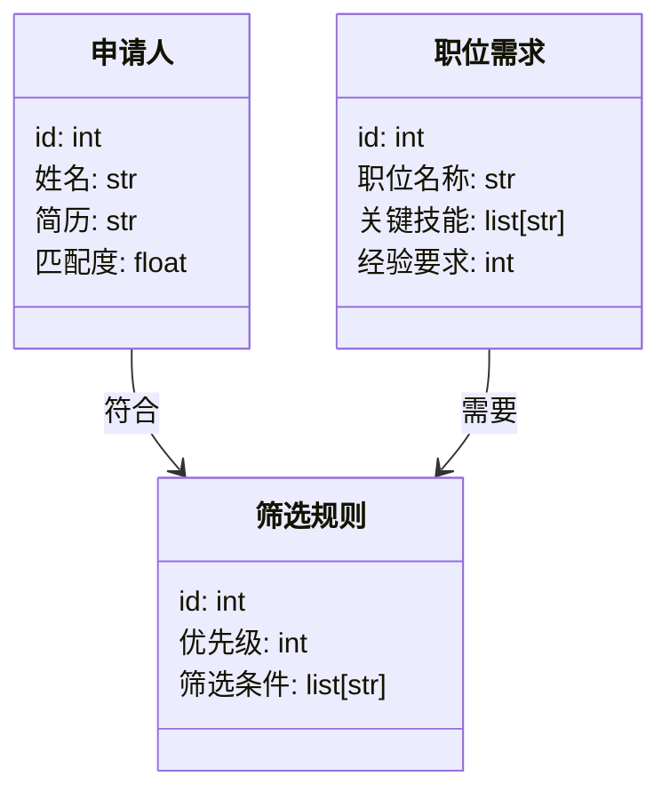
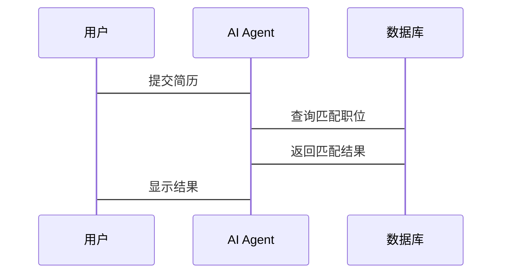

                 


# 《人力资源管理中的AI Agent筛选系统》

## 关键词：
- AI Agent, 人力资源管理, 招聘筛选, 人工智能, 系统架构

## 摘要：
本文详细探讨了在人力资源管理中应用AI Agent进行招聘筛选的系统设计与实现。通过分析传统招聘筛选过程中的痛点，提出AI Agent的应用价值，并从算法原理、系统架构、项目实战等多个维度展开，结合具体案例，深入剖析AI Agent在提升招聘效率和精准度方面的作用。

---

# 第一部分: 人力资源管理中的AI Agent筛选系统概述

## 第1章: 人力资源管理中的AI Agent筛选系统背景介绍

### 1.1 问题背景
#### 1.1.1 传统人力资源管理的痛点
传统招聘筛选过程存在以下痛点：
- **效率低**：人工筛选简历耗时耗力，尤其是在处理大量候选人时。
- **主观性强**：招聘人员的经验和偏好可能影响筛选结果的客观性。
- **成本高**：招聘成本（时间+金钱）在企业预算中占比显著。
- **信息不对称**：候选人的真实能力和潜力难以通过简历全面反映。

#### 1.1.2 招聘筛选过程中的效率瓶颈
- 简历筛选的重复性工作导致效率低下。
- 面试安排的复杂性增加招聘周期。
- 人才匹配度的不准确影响招聘质量。

#### 1.1.3 企业用人需求的多样性与复杂性
- 不同岗位对技能要求差异大。
- 企业对文化匹配度和潜力的关注增加。

### 1.2 问题描述
#### 1.2.1 招聘筛选中的信息不对称问题
- 企业难以全面了解候选人的真实能力。
- 候选人难以准确匹配岗位需求。

#### 1.2.2 人工筛选的主观性和误差
- 招聘人员的经验和情绪影响筛选结果。
- 简历中“软性”能力（如团队合作）难以量化。

#### 1.2.3 高效精准筛选的需求
- 企业希望快速找到合适的候选人。
- 筛选过程需要更加客观和数据驱动。

### 1.3 问题解决
#### 1.3.1 引入AI Agent的必要性
- AI Agent可以通过数据分析提高筛选效率和准确性。
- AI Agent可以24/7工作，减少人力资源成本。

#### 1.3.2 AI Agent在招聘筛选中的应用价值
- 自动化简历筛选，减少人工工作量。
- 提供数据驱动的候选人匹配度评分。
- 基于历史数据优化招聘策略。

#### 1.3.3 解决方案的可行性分析
- 技术可行性：AI技术已成熟，可以应用于招聘筛选。
- 经济可行性：长期来看，AI Agent可以降低招聘成本。
- 社会可行性：员工和企业都对高效招聘工具持开放态度。

### 1.4 边界与外延
#### 1.4.1 AI Agent在招聘中的边界
- 不处理具体的面试安排。
- 不直接与候选人互动，仅提供筛选建议。

#### 1.4.2 与传统筛选方法的区分
- 传统方法依赖人工经验，AI Agent依赖数据和算法。

#### 1.4.3 系统的扩展性与适应性
- 系统可以扩展到更多岗位类型。
- 系统可以根据企业需求定制化。

### 1.5 核心要素组成
#### 1.5.1 数据来源与处理
- 数据来源：候选人简历、岗位描述、历史招聘数据。
- 数据处理：清洗、特征提取、数据建模。

#### 1.5.2 AI算法与模型
- 使用机器学习算法（如协同过滤、聚类分析）。
- 构建候选人-岗位匹配模型。

#### 1.5.3 系统架构与交互
- 系统架构：模块化设计，包括数据输入、算法处理、结果输出。
- 交互设计：用户友好的界面，便于招聘人员使用。

---

## 第2章: AI Agent的核心概念与联系

### 2.1 核心概念原理
#### 2.1.1 AI Agent的基本定义
- AI Agent是一种能够感知环境并采取行动以实现目标的智能实体。

#### 2.1.2 知识表示与推理机制
- 知识表示：将问题转化为数据结构（如图、树）。
- 推理机制：基于知识库进行逻辑推理。

#### 2.1.3 任务分解与目标设定
- 任务分解：将招聘筛选分解为多个子任务（如简历解析、评分计算）。
- 目标设定：确保每个子任务符合整体招聘目标。

### 2.2 核心概念属性对比
#### 2.2.1 实体属性对比表
| 实体 | 属性 | 描述 |
|------|------|------|
| 申请人 | 职位匹配度 | AI Agent计算的匹配分数 |
| 职位需求 | 关键技能 | 必须具备的核心技能 |
| 筛选规则 | 优先级 | 筛选条件的权重排序 |

### 2.3 ER实体关系图
```mermaid
er
  actor: 用户
  role: A

  actor -> A: 使用
  A -> actor: 提供服务
```

---

## 第3章: AI Agent的算法原理

### 3.1 推荐算法
#### 3.1.1 协同过滤算法
- **基于用户的协同过滤**：
  ```markdown
  给定用户u，找到与u相似的用户v，推荐v喜欢的物品。
  相似度计算：余弦相似度。
  $$ sim(u, v) = \frac{\sum u_i v_i}{\sqrt{\sum u_i^2} \sqrt{\sum v_i^2}} $$
  ```
- **基于物品的协同过滤**：
  ```markdown
  给定物品i，找到与i相似的物品j，推荐给喜欢i的用户。
  ```

#### 3.1.2 基于内容的推荐算法
- **算法步骤**：
  1. 提取物品特征（如岗位关键词）。
  2. 使用向量空间模型计算相似度。
  3. 推荐相似度高的物品。

#### 3.1.3 深度学习模型
- 使用神经网络（如CNN、RNN）处理非结构化数据（如简历内容）。

### 3.2 数学模型
#### 3.2.1 协同过滤模型
- 矩阵分解：
  ```markdown
  R = P \times Q^T
  其中，R是用户-物品评分矩阵，P是用户嵌入矩阵，Q是物品嵌入矩阵。
  ```

#### 3.2.2 基于内容的模型
- 词袋模型（Bag-of-Words）：
  ```markdown
  向量表示：$v = [w_1, w_2, ..., w_n]$
  其中，$w_i$是词i的权重。
  ```

### 3.3 算法实现
#### 3.3.1 协同过滤算法实现
```python
def cosine_similarity(user_vector, item_vector):
    dot_product = np.dot(user_vector, item_vector)
    user_norm = np.linalg.norm(user_vector)
    item_norm = np.linalg.norm(item_vector)
    return dot_product / (user_norm * item_norm)

# 示例
user_vector = np.array([1, 2, 3])
item_vector = np.array([2, 4, 6])
print(cosine_similarity(user_vector, item_vector))  # 输出：1.0
```

---

## 第4章: 系统分析与架构设计

### 4.1 系统功能设计
#### 4.1.1 领域模型


### 4.2 系统架构设计
#### 4.2.1 系统架构图


### 4.3 接口设计
#### 4.3.1 API接口
- `POST /api/screen/resumes`：上传简历。
- `GET /api/screen/results`：获取筛选结果。

### 4.4 交互流程图


---

## 第5章: 项目实战

### 5.1 环境安装
- 安装Python、TensorFlow、Scikit-learn、Flask。

### 5.2 核心代码实现
#### 5.2.1 数据预处理
```python
import pandas as pd

data = pd.read_csv('resumes.csv')
data.head()
```

#### 5.2.2 算法实现
```python
from sklearn.metrics.pairwise import cosine_similarity

resume_embeddings = ...  # 简历向量化表示
job_embeddings = ...     # 职位向量化表示

similarities = cosine_similarity(resume_embeddings, job_embeddings)
```

### 5.3 代码解读与分析
- `cosine_similarity`：计算简历和职位的相似度。
- `similarities`：相似度矩阵，用于匹配候选人和职位。

### 5.4 实际案例分析
- 案例：某科技公司招聘数据分析师。
- 步骤：
  1. 收集简历和职位描述。
  2. 提取关键词并生成向量。
  3. 计算相似度，筛选Top 5候选人。

---

## 第6章: 最佳实践

### 6.1 小结
- AI Agent可以显著提高招聘效率和精准度。
- 系统设计需要结合企业需求和数据质量。

### 6.2 注意事项
- 数据隐私保护。
- 算法的可解释性。
- 系统的可扩展性。

### 6.3 拓展阅读
- 《机器学习实战》。
- 《自然语言处理入门》。

---

## 第7章: 综合案例分析

### 7.1 案例背景
- 某企业招聘Python开发工程师。

### 7.2 数据准备
- 简历数据：包含技术栈、项目经验、教育背景。
- 职位描述：要求熟悉Python、有后端开发经验。

### 7.3 系统实现
- 使用协同过滤算法筛选Top 3候选人。

### 7.4 分析结果
- 筛选出3名高度匹配的候选人。
- 提供详细匹配报告。

---

## 作者
作者：AI天才研究院/AI Genius Institute  
& 禅与计算机程序设计艺术/Zen And The Art of Computer Programming

