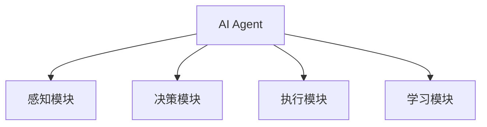
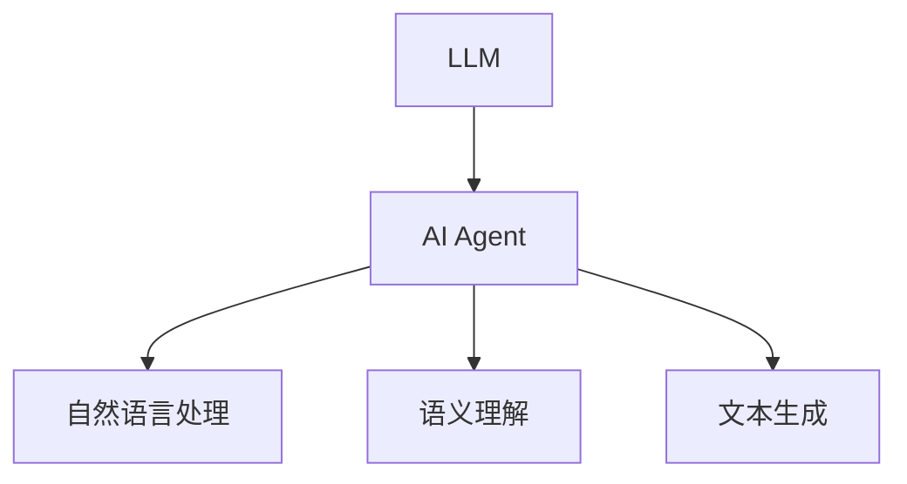
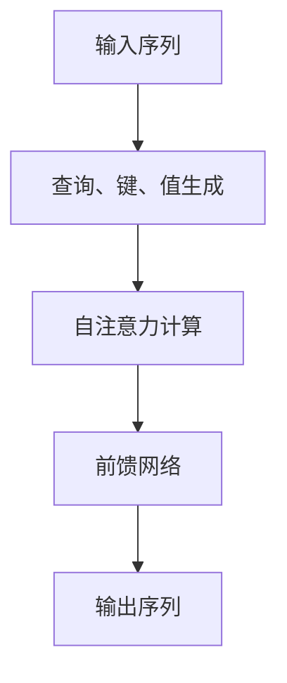
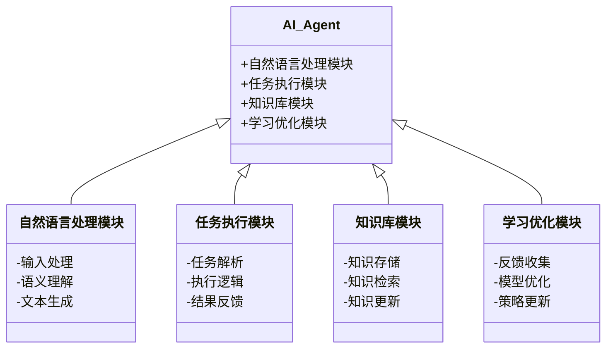
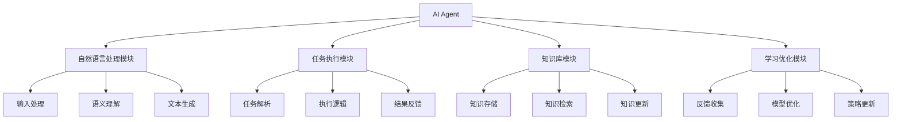
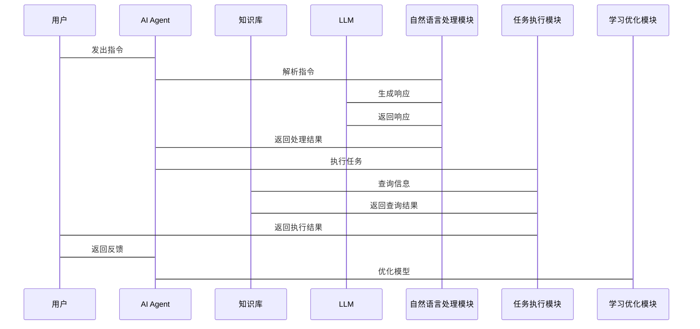

                 


# 从零构建 AI Agent：LLM 大模型应用开发实践

> 关键词：AI Agent, LLM, 大语言模型, 人工智能, 自然语言处理, 系统架构, 项目实战

> 摘要：本文将详细探讨从零开始构建一个基于大语言模型（LLM）的AI Agent的全过程。通过系统化的分析与实践，我们将从背景介绍、核心概念、算法原理、系统架构到项目实战，逐步展开讲解，帮助读者全面理解AI Agent的构建过程，并掌握相关技术要点与实践技巧。

---

## 第一部分: 从零构建 AI Agent 的背景与基础

### 第1章: AI Agent 与 LLM 大模型概述

#### 1.1 AI Agent 的基本概念
##### 1.1.1 AI Agent 的定义与特点
AI Agent（人工智能代理）是指能够感知环境、自主决策并执行任务的智能实体。它具备以下特点：
- **自主性**：能够在没有外部干预的情况下独立运行。
- **反应性**：能够根据环境变化动态调整行为。
- **目标导向**：以实现特定目标为导向执行任务。
- **学习能力**：通过经验或数据优化自身的决策能力。

##### 1.1.2 AI Agent 的分类与应用场景
AI Agent 可以分为以下几类：
1. **简单反射型 Agent**：基于预设规则执行任务，适用于简单的自动化场景。
2. **基于模型的反应型 Agent**：通过内部模型感知环境并做出决策，适用于复杂任务。
3. **目标驱动型 Agent**：以明确的目标为导向，通过规划和推理完成任务。
4. **实用驱动型 Agent**：通过效用函数优化决策，追求最大化的效用值。

应用场景包括智能助手、机器人控制、自动驾驶、智能客服等。

##### 1.1.3 LLM 在 AI Agent 中的角色与优势
大语言模型（LLM）通过自然语言处理技术，赋予AI Agent强大的语言理解和生成能力。LLM 在 AI Agent 中的主要作用包括：
- **语义理解**：通过LLM理解用户意图或环境信息。
- **生成能力**：通过LLM生成自然语言文本，实现人机交互。
- **知识推理**：通过LLM进行上下文推理，辅助决策。

---

#### 1.2 LLM 大模型的背景与发展
##### 1.2.1 大语言模型的起源与演进
大语言模型的发展始于传统的NLP任务，如词性标注、句法分析等。近年来，随着深度学习技术的进步，基于Transformer架构的模型（如BERT、GPT）逐渐成为主流。

##### 1.2.2 LLM 的核心能力与技术突破
LLM 的核心能力包括：
- **大规模数据训练**：通过海量数据训练，模型具备广泛的知识覆盖。
- **自注意力机制**：通过自注意力机制，模型能够捕捉文本中的长距离依赖关系。
- **生成与理解能力**：模型具备强大的文本生成和语义理解能力。

技术突破主要体现在模型规模的扩大、训练效率的提升以及生成质量的优化。

##### 1.2.3 LLM 在 AI Agent 中的应用潜力
LLM 为 AI Agent 提供了强大的语言处理能力，使其能够更好地理解和生成自然语言，从而在更复杂的场景中实现人机交互和任务执行。

---

#### 1.3 从零构建 AI Agent 的意义与挑战
##### 1.3.1 构建 AI Agent 的核心价值
从零构建 AI Agent 的核心价值在于：
- **技术积累**：掌握AI Agent 的核心技术和实现方法。
- **应用落地**：通过实践，探索AI Agent 在实际场景中的应用潜力。
- **创新能力**：通过构建 AI Agent，探索新的应用场景和技术方向。

##### 1.3.2 构建 AI Agent 的主要挑战
构建 AI Agent 的主要挑战包括：
- **技术复杂性**：需要结合NLP、机器学习、系统架构等多方面的知识。
- **资源需求**：训练和部署大模型需要大量的计算资源。
- **应用场景的多样性**：不同场景对AI Agent 的需求差异较大。

##### 1.3.3 本书的目标与读者定位
本书旨在通过系统化的讲解和实践，帮助读者掌握从零构建 AI Agent 的核心技术和实现方法。读者定位为具备一定编程和机器学习基础的技术从业者。

---

#### 1.4 本章小结
本章从AI Agent 和 LLM 的基本概念出发，介绍了AI Agent 的分类、应用场景以及LLM 在 AI Agent 中的角色与优势。同时，阐述了从零构建 AI Agent 的意义与挑战，并明确了本书的目标与读者定位。

---

## 第二部分: AI Agent 核心概念与 LLM 的关系

### 第2章: AI Agent 的核心概念与体系结构

#### 2.1 AI Agent 的核心概念
##### 2.1.1 AI Agent 的问题背景与问题描述
AI Agent 的问题背景在于如何通过智能体实现特定目标。问题描述包括：
- 如何通过感知环境获取信息。
- 如何基于信息做出决策并执行任务。
- 如何通过反馈优化自身行为。

##### 2.1.2 AI Agent 的问题解决思路
AI Agent 的问题解决思路包括：
1. **感知环境**：通过传感器或API获取环境信息。
2. **目标设定**：明确 AI Agent 的目标和优先级。
3. **决策与规划**：基于当前状态和目标，制定行动计划。
4. **执行任务**：通过执行动作影响环境。
5. **反馈与优化**：通过反馈信息优化自身的决策和行为。

##### 2.1.3 AI Agent 的边界与外延
AI Agent 的边界在于其能力范围和应用场景的限制。外延则包括与外部系统、用户或其他智能体的交互。

---

#### 2.2 AI Agent 的核心要素与概念结构
##### 2.2.1 AI Agent 的核心要素分析
AI Agent 的核心要素包括：
1. **感知模块**：负责获取环境信息。
2. **决策模块**：负责制定行动计划。
3. **执行模块**：负责执行具体任务。
4. **学习模块**：负责优化自身的决策能力。

##### 2.2.2 AI Agent 的概念结构与关系图


##### 2.2.3 AI Agent 的核心属性与特征对比表
| 属性 | 描述 |
|------|------|
| 自主性 | 能够独立运行 |
| 反应性 | 能够动态调整行为 |
| 目标导向 | 以目标为导向执行任务 |
| 学习能力 | 能够通过经验优化决策 |

---

#### 2.3 LLM 在 AI Agent 中的角色与联系
##### 2.3.1 LLM 作为 AI Agent 的核心驱动力
LLM 通过语义理解和生成能力，为 AI Agent 提供强大的语言处理能力。

##### 2.3.2 LLM 与 AI Agent 的关系图


##### 2.3.3 LLM 在 AI Agent 中的应用场景分析
LLM 在 AI Agent 中的应用场景包括：
1. **人机交互**：通过自然语言对话与用户互动。
2. **任务执行**：通过理解任务指令生成执行计划。
3. **知识推理**：通过上下文推理辅助决策。

---

#### 2.4 本章小结
本章通过分析AI Agent 的核心概念和体系结构，明确了AI Agent 的核心要素和实现思路。同时，阐述了LLM 在 AI Agent 中的角色与联系，为后续章节的实现奠定了理论基础。

---

## 第三部分: LLM 的算法原理与数学模型

### 第3章: LLM 的算法原理与流程

#### 3.1 LLM 的核心算法概述
##### 3.1.1 变换层（Transform）的原理
Transform 层通过自注意力机制和前馈网络对输入序列进行变换。

##### 3.1.2 变换层的数学模型
$$ \text{Attention}(Q, K, V) = \text{softmax}\left(\frac{QK^T}{\sqrt{d_k}}\right)V $$

其中，$Q$、$K$、$V$ 分别是查询、键和值向量，$d_k$ 是向量的维度。

##### 3.1.3 变换层的实现流程


---

#### 3.2 LLM 的训练过程
##### 3.2.1 LLM 的训练目标
LLM 的训练目标是通过最小化预测概率的负对数似然来优化模型参数。

##### 3.2.2 LLM 的训练流程
1. **输入处理**：将输入序列转换为词向量。
2. **自注意力计算**：计算自注意力权重。
3. **前馈网络**：对注意力加权的结果进行非线性变换。
4. **损失计算**：计算预测概率的负对数似然。
5. **反向传播**：通过梯度下降优化模型参数。

##### 3.2.3 LLM 的训练代码示例
```python
import torch
import torch.nn as nn

class TransformerBlock(nn.Module):
    def __init__(self, d_model, n_head, d_ff):
        super(TransformerBlock, self).__init__()
        self.n_head = n_head
        self.d_k = d_model // n_head
        self.d_v = d_model // n_head
        self.W_q = nn.Linear(d_model, n_head * d_k)
        self.W_k = nn.Linear(d_model, n_head * d_k)
        self.W_v = nn.Linear(d_model, n_head * d_v)
        self.W_o = nn.Linear(n_head * d_v, d_model)
        self.dropout = nn.Dropout(0.1)
    
    def forward(self, x, mask=None):
        batch_size, seq_len, d_model = x.size()
        # 计算查询、键、值
        q = self.W_q(x).view(batch_size, seq_len, self.n_head, self.d_k)
        k = self.W_k(x).view(batch_size, seq_len, self.n_head, self.d_k)
        v = self.W_v(x).view(batch_size, seq_len, self.n_head, self.d_v)
        
        # 展开维度
        q = q.permute(1, 2, 0, 3)
        k = k.permute(1, 2, 0, 3)
        v = v.permute(1, 2, 0, 3)
        
        # 自注意力计算
        d_k = self.d_k ** 0.5
        attn_weights = torch.bmm(q, k.transpose(-2, -1)) / d_k
        attn_weights = attn_weights.masked_fill(mask == 0, -inf)
        attn_weights = attn_weights.softmax(dim=-1)
        attn_output = torch.bmm(attn_weights, v)
        
        # 展开并连接
        attn_output = attn_output.permute(2, 0, 1, 3)
        attn_output = attn_output.view(batch_size, seq_len, -1)
        
        # 前馈网络
        output = self.W_o(attn_output)
        output = self.dropout(output)
        return output
```

---

#### 3.3 LLM 的推理过程
##### 3.3.1 LLM 的推理机制
LLM 的推理过程包括：
1. **输入处理**：将输入文本转换为词向量。
2. **自注意力计算**：计算自注意力权重。
3. **前馈网络**：对注意力加权的结果进行非线性变换。
4. **输出生成**：通过 softmax 层生成概率分布，并选择概率最高的词作为输出。

##### 3.3.2 LLM 的推理代码示例
```python
import torch

def generate_text(model, tokenizer, max_length=50):
    input_ids = tokenizer.encode("生成一段关于AI Agent的文本。", return_tensors="pt")
    input_ids = input_ids.to(torch.device("cuda" if torch.cuda.is_available() else "cpu"))
    
    for _ in range(max_length):
        outputs = model.generate(input_ids)
        input_ids = outputs[-1].unsqueeze(0)
    
    generated_text = tokenizer.decode(input_ids[0], skip_special_tokens=True)
    return generated_text
```

---

#### 3.4 本章小结
本章通过详细讲解 LLM 的算法原理与数学模型，帮助读者理解大语言模型的核心机制。通过代码示例，读者可以进一步掌握 LLM 的实现细节。

---

## 第四部分: 系统分析与架构设计

### 第4章: AI Agent 的系统分析与架构设计

#### 4.1 系统分析
##### 4.1.1 问题场景介绍
AI Agent 的典型应用场景包括智能客服、自动化助手、智能对话系统等。

##### 4.1.2 项目介绍
本项目旨在构建一个基于 LLM 的 AI Agent，能够通过自然语言交互完成特定任务。

##### 4.1.3 系统功能设计
系统功能包括：
1. **用户交互**：通过自然语言与用户互动。
2. **任务处理**：根据用户指令执行具体任务。
3. **知识库查询**：通过知识库获取相关信息。
4. **反馈优化**：通过用户反馈优化自身行为。

---

#### 4.2 系统架构设计
##### 4.2.1 领域模型设计


##### 4.2.2 系统架构图


##### 4.2.3 系统交互流程


---

#### 4.3 本章小结
本章通过系统分析与架构设计，明确了 AI Agent 的功能模块、系统架构和交互流程，为后续的项目实现奠定了基础。

---

## 第五部分: 项目实战

### 第5章: 从零到落地的 AI Agent 实战

#### 5.1 环境安装与配置
##### 5.1.1 安装依赖
```bash
pip install torch transformers
```

##### 5.1.2 配置运行环境
```bash
export CUDA_VISIBLE_DEVICES=0
```

---

#### 5.2 系统核心实现
##### 5.2.1 自然语言处理模块实现
```python
from transformers import AutoTokenizer, AutoModelForCausalLM

tokenizer = AutoTokenizer.from_pretrained("gpt2")
model = AutoModelForCausalLM.from_pretrained("gpt2")
```

##### 5.2.2 任务执行模块实现
```python
def execute_task(task):
    # 具体任务执行逻辑
    pass
```

##### 5.2.3 知识库模块实现
```python
class KnowledgeBase:
    def __init__(self, knowledge_file):
        self.knowledge = self.load_knowledge(knowledge_file)
    
    def load_knowledge(self, knowledge_file):
        # 加载知识库内容
        pass
    
    def retrieve(self, query):
        # 检索相关信息
        pass
    
    def update(self, new_knowledge):
        # 更新知识库
        pass
```

##### 5.2.4 学习优化模块实现
```python
class LearningOptimizer:
    def __init__(self, model):
        self.model = model
    
    def optimize(self, feedback):
        # 根据反馈优化模型
        pass
```

---

#### 5.3 功能测试与验证
##### 5.3.1 功能测试
测试AI Agent 的核心功能，包括自然语言处理、任务执行和知识库查询。

##### 5.3.2 测试结果分析
分析测试结果，优化系统性能和用户体验。

---

#### 5.4 项目小结
本章通过具体的代码实现和功能测试，帮助读者掌握从零构建 AI Agent 的核心实现方法。

---

## 第六部分: 最佳实践与拓展

### 第6章: 最佳实践与总结

#### 6.1 最佳实践 tips
##### 6.1.1 系统设计
- 明确系统目标，模块化设计，便于扩展和维护。
##### 6.1.2 技术实现
- 选择合适的 NLP 模型，优化模型性能。
##### 6.1.3 项目管理
- 建立完善的项目管理流程，确保项目顺利推进。

#### 6.2 小结
通过本章的讲解，读者可以掌握从零构建 AI Agent 的核心技术和实现方法，并能够将其应用于实际场景中。

#### 6.3 注意事项
- 确保数据安全与隐私保护。
- 优化系统性能，提升用户体验。
- 定期更新模型，保持技术领先。

#### 6.4 拓展阅读
推荐读者阅读以下书籍和论文：
1. 《Deep Learning》
2. 《Effective Python》
3. 《Transformers Are All You Need》

---

## 作者

作者：AI天才研究院/AI Genius Institute & 禅与计算机程序设计艺术 /Zen And The Art of Computer Programming

---

**注**：由于篇幅限制，上述内容仅为文章的部分章节，完整文章将涵盖更多细节和代码示例。

