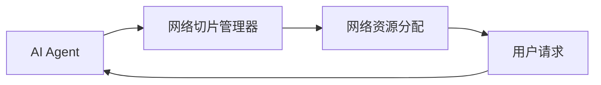
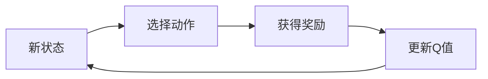
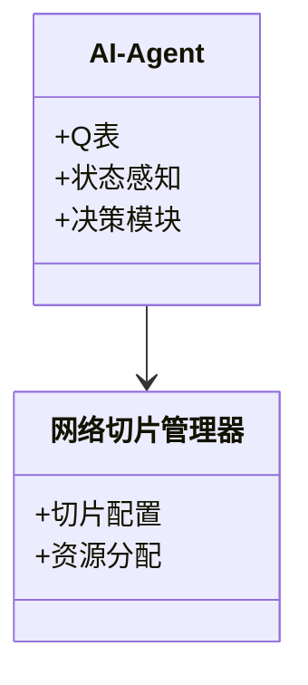
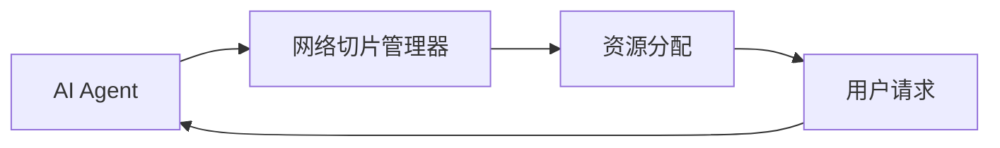
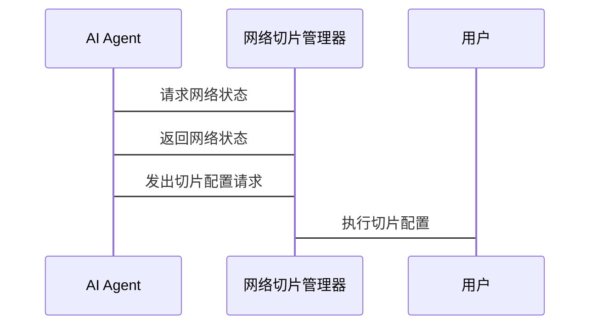

                 


# 企业AI Agent的5G网络智能切片技术

> 关键词：AI Agent, 5G网络, 智能切片, 网络管理, 强化学习

> 摘要：本文探讨了AI Agent在5G网络中的智能切片技术，分析了其核心概念、算法原理、系统架构，并通过实际案例展示了其应用和优势。

---

## 第一部分：企业AI Agent的5G网络智能切片技术概述

### 第1章：5G网络智能切片技术概述

#### 1.1 5G网络智能切片技术的背景与意义

##### 1.1.1 5G网络的特性与需求
5G网络具有高速度、低延迟和大规模连接的特点，支持多样化的应用场景，如工业自动化、智能交通和远程医疗。这些场景要求网络资源能够灵活分配，以满足不同服务的需求。

##### 1.1.2 网络切片技术的定义与作用
网络切片是将物理网络分割成多个虚拟网络的技术，每个切片独立运行，满足不同用户或应用的需求。它通过虚拟化技术实现，提升了网络资源的利用率和灵活性。

##### 1.1.3 智能切片技术的必要性
传统网络切片依赖静态配置，难以适应动态变化的网络需求。智能切片技术利用AI Agent实时优化资源分配，提高了网络的效率和响应速度。

#### 1.2 AI Agent在5G网络中的应用

##### 1.2.1 AI Agent的定义与特点
AI Agent是一种智能体，能够感知环境、自主决策并执行任务。其特点包括自主性、反应性、目标导向和学习能力。

##### 1.2.2 AI Agent在5G网络中的应用场景
AI Agent在5G网络中的应用包括动态资源分配、故障检测与恢复、用户体验优化等，能够显著提升网络性能。

##### 1.2.3 AI Agent与网络切片技术的结合
AI Agent通过实时分析网络状态，动态调整切片配置，优化网络性能。这种结合使网络能够更灵活地应对多样化的需求。

#### 1.3 本章小结
本章介绍了5G网络智能切片技术的背景、定义及其在AI Agent中的应用，强调了智能切片技术的重要性。

---

## 第二部分：智能切片与AI Agent的核心概念

### 第2章：智能切片技术的核心原理

#### 2.1 智能切片技术的定义与特点

##### 2.1.1 切片管理策略的对比分析
| 特性     | 传统切片 | 智能切片 |
|----------|----------|----------|
| 配置方式 | 静态配置 | 动态优化 |
| 响应速度 | 较慢     | 实时调整 |

##### 2.1.2 智能切片技术的优势与挑战
优势包括灵活性高、资源利用率提升，挑战则包括复杂性增加和安全性问题。

#### 2.2 AI Agent的核心原理

##### 2.2.1 AI Agent的决策机制
AI Agent通过感知网络状态，利用强化学习算法做出决策，优化网络切片配置。

##### 2.2.2 AI Agent的学习与优化过程
AI Agent通过与环境的交互，不断优化其策略，提升决策能力。

#### 2.3 智能切片与AI Agent的实体关系图


---

## 第三部分：AI Agent的算法原理

### 第3章：AI Agent的强化学习算法

#### 3.1 强化学习的基本原理

##### 3.1.1 Q-learning算法的公式推导
$$ Q(s, a) = r + \gamma \max Q(s', a') $$

##### 3.1.2 Q-learning算法的工作流程


##### 3.1.3 算法的Python实现
```python
import numpy as np

class AI-Agent:
    def __init__(self, state_space, action_space):
        self.Q = np.zeros((state_space, action_space))
    
    def choose_action(self, state):
        return np.argmax(self.Q[state])
    
    def update_Q(self, state, action, reward, next_state):
        self.Q[state, action] = reward + 0.9 * max(self.Q[next_state])
```

#### 3.2 强化学习在AI Agent中的应用
AI Agent通过强化学习优化切片配置，提高网络性能。

---

## 第四部分：系统架构与设计

### 第4章：系统架构设计方案

#### 4.1 系统组成与功能模块

##### 4.1.1 领域模型类图


##### 4.1.2 系统架构设计


#### 4.2 系统接口与交互设计

##### 4.2.1 系统交互序列图


---

## 第五部分：项目实战与案例分析

### 第5章：项目实战

#### 5.1 项目环境搭建
- 安装必要的Python库和工具。
- 配置5G网络模拟环境。

#### 5.2 代码实现
```python
def main():
    agent = AI-Agent(状态空间, 动作空间)
    网络切片管理器 = 网络切片管理器()
    while True:
        状态 = 网络切片管理器.get_state()
        动作 = agent.choose_action(状态)
        奖励 = 网络切片管理器.execute_action(动作)
        agent.update_Q(状态, 动作, 奖励, 新状态)
```

#### 5.3 案例分析
通过具体案例分析AI Agent如何优化网络切片配置，提升性能。

---

## 第六部分：最佳实践与总结

### 第6章：最佳实践

#### 6.1 项目经验总结
总结项目中的经验和教训，提出改进建议。

#### 6.2 小结
简要总结文章内容，强调AI Agent在5G网络中的重要性。

#### 6.3 注意事项
提醒读者注意切片安全性和算法优化等问题。

#### 6.4 拓展阅读
推荐相关领域的书籍和资源，供读者深入学习。

---

## 作者：AI天才研究院 & 禅与计算机程序设计艺术

---

通过以上结构，文章详细探讨了企业AI Agent在5G网络中的智能切片技术，从理论到实践，全面分析了其应用和实现。

