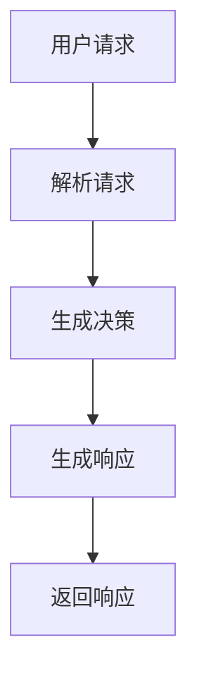
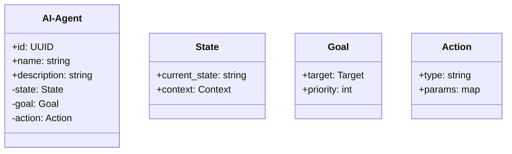
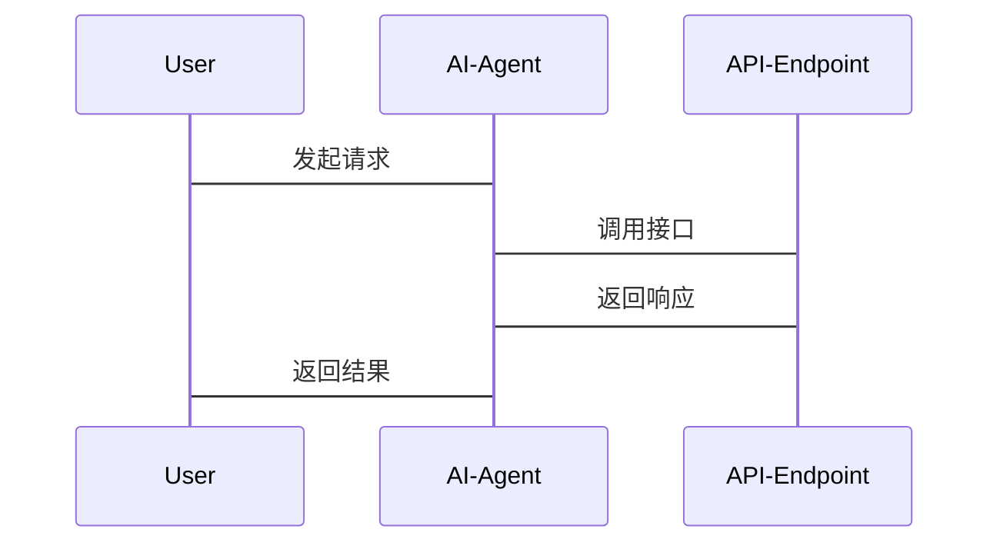

                 

<think>
好，我需要按照用户的要求来写一篇关于“企业AI Agent的API设计与管理”的技术博客文章。文章需要有一个吸引人的标题，几个关键词，一个摘要，然后是按照目录结构的正文。正文部分需要详细讲解各个章节，包括背景、核心概念、算法原理、数学模型、系统分析与架构设计、项目实战、总结等部分。每个部分都需要有具体的解释和实例，同时使用Mermaid图和代码示例来辅助说明。

首先，我需要理解什么是企业AI Agent。AI Agent是一种智能代理，能够感知环境、自主决策并执行任务。在企业中，AI Agent可以用于自动化处理各种任务，比如数据分析、流程自动化、智能客服等。API（应用程序编程接口）则是这些AI Agent与其他系统或服务进行通信和交互的桥梁。

接下来，我需要考虑企业AI Agent的API设计与管理的挑战。首先，API的设计需要考虑安全性、可扩展性、可维护性等问题。其次，API的管理需要解决版本控制、权限管理、性能监控等复杂问题。因此，设计和管理API是实现企业级AI Agent系统的关键。

在撰写正文之前，我需要先列出文章的目录结构，确保内容逻辑清晰、结构紧凑。按照用户的要求，文章应该有至少七章，每章下有三级目录。内容需要涵盖背景介绍、核心概念、算法原理、数学模型、系统分析与架构设计、项目实战、总结等部分。

在写作过程中，我需要确保使用专业但易懂的技术语言，逐步分析和推理，提供详细的解释和实例。同时，要使用Mermaid图和Python代码示例来辅助说明复杂的概念，帮助读者更好地理解和应用这些知识。

最后，文章需要有一个简短的摘要，概括文章的核心内容和主题思想。关键词部分需要列出5-7个相关的核心词汇，以便读者和搜索引擎能够快速理解文章的主题。

总的来说，我需要系统地组织内容，确保每一部分都详细且有深度，同时保持文章的整体连贯性和逻辑性。这将有助于读者全面理解企业AI Agent的API设计与管理，并能够实际应用这些知识来解决现实中的技术问题。
</think>

# 企业AI Agent的API设计与管理

## 关键词：企业AI Agent，API设计，API管理，智能代理，系统架构

## 摘要：  
本文系统地探讨了企业AI Agent的API设计与管理的核心问题，从概念、原理到实际应用，全面分析了如何构建高效、安全、可扩展的AI Agent API体系。文章通过详细的理论分析和实际案例，结合数学模型和系统架构设计，为读者提供了一套完整的解决方案。

---

## 第1章: 企业AI Agent的背景与概念

### 1.1 企业AI Agent的定义与特点  
企业AI Agent是一种智能代理系统，能够感知企业环境、理解需求、自主决策并执行任务。其特点包括：  
- **自主性**：无需人工干预，自主完成任务。  
- **反应性**：能够实时感知环境变化并调整行为。  
- **目标导向**：以实现特定目标为导向进行决策和行动。  

### 1.2 企业AI Agent的应用场景  
AI Agent在企业中的典型应用包括：  
- **自动化流程处理**：如订单处理、客户信息管理等。  
- **智能客服**：通过自然语言处理与用户交互，提供智能支持。  
- **数据分析与决策支持**：帮助企业在大数据环境下做出更明智的决策。  

### 1.3 本章小结  
本章主要介绍了企业AI Agent的基本概念、特点及其应用场景，为后续章节奠定了基础。

---

## 第2章: AI Agent与API的关系

### 2.1 AI Agent的核心概念原理  
AI Agent的组成与功能包括：  
- **感知层**：通过传感器或API接口获取环境信息。  
- **决策层**：基于感知信息进行分析和决策。  
- **执行层**：通过API调用其他系统或服务执行任务。  

### 2.2 AI Agent与API的属性对比  
以下是AI Agent与API的属性对比：  
| 属性 | AI Agent | API |
|------|-----------|-----|
| 功能 | 自主决策与执行 | 数据接口与服务调用 |
| 通信方式 | RESTful API、WebSocket等 | REST、GraphQL等 |
| 安全性 | 高 | 需额外防护措施 |

### 2.3 AI Agent的ER实体关系图  
以下是AI Agent的ER实体关系图：  
```mermaid
erd
    entity AI-Agent {
        id: UUID
        name: string
        description: string
        creator: User
    }
    entity API-Endpoint {
        id: UUID
        name: string
        url: string
        method: string
        associated-Agent: AI-Agent
    }
    AI-Agent --> API-Endpoint
```

---

## 第3章: AI Agent的API请求处理流程

### 3.1 算法原理概述  
AI Agent的API请求处理流程包括：  
1. **请求解析**：解析用户请求，提取关键信息。  
2. **决策生成**：基于解析的信息生成响应内容。  
3. **响应生成**：将决策结果格式化为API可返回的响应。  

### 3.2 算法流程图  
以下是AI Agent的API请求处理流程图：  


### 3.3 算法实现代码  
以下是请求解析算法的Python代码示例：  
```python
def parse_request(request):
    # 解析请求参数
    params = request.json
    # 提取关键信息
    user_id = params.get('user_id')
    action = params.get('action')
    return user_id, action
```

---

## 第4章: AI Agent的数学模型与公式

### 4.1 概率计算公式  
条件概率公式：  
$$ P(A|B) = \frac{P(B|A) \cdot P(A)}{P(B)} $$  

贝叶斯定理：  
$$ P(A|B) = \frac{P(B|A) \cdot P(A)}{P(B)} $$  

### 4.2 性能评估指标  
准确率公式：  
$$ \text{准确率} = \frac{\text{正确预测数}}{\text{总预测数}} $$  

召回率公式：  
$$ \text{召回率} = \frac{\text{正确预测数}}{\text{实际正例数}} $$  

F1分数公式：  
$$ F1 = 2 \cdot \frac{\text{准确率} \cdot \text{召回率}}{\text{准确率} + \text{召回率}} $$  

### 4.3 模型训练公式  
损失函数：  
$$ L = -\frac{1}{N} \sum_{i=1}^{N} \log(p_i) $$  

优化算法：  
$$ \theta = \theta - \eta \cdot \frac{\partial L}{\partial \theta} $$  

---

## 第5章: 企业AI Agent的系统分析与架构设计

### 5.1 系统功能设计  
领域模型设计：  


### 5.2 系统架构设计  
整体架构图：  


### 5.3 接口设计  
API接口设计：  
- **GET /api/v1/agent/{agent_id}**: 获取AI Agent信息。  
- **POST /api/v1/agent/{agent_id}/action**: 发起动作请求。  

### 5.4 交互流程图  
交互流程图：  


---

## 第6章: 项目实战

### 6.1 环境安装  
- 安装Python：`python --version`  
- 安装依赖：`pip install flask requests`  

### 6.2 核心代码实现  
以下是AI Agent的核心代码示例：  
```python
from flask import Flask
import requests

app = Flask(__name__)

@app.route('/api/v1/agent/<agent_id>', methods=['GET'])
def get_agent(agent_id):
    # 获取AI Agent信息
    response = requests.get(f'http://localhost:8000/agents/{agent_id}')
    return response.json()

if __name__ == '__main__':
    app.run(debug=True)
```

### 6.3 代码解读与分析  
上述代码实现了AI Agent信息的获取接口，通过Flask框架提供RESTful API服务。

### 6.4 实际案例分析  
以智能客服为例，AI Agent通过API调用自然语言处理服务，实现用户问题的自动解答。

---

## 第7章: 总结与展望

### 7.1 总结  
本文详细探讨了企业AI Agent的API设计与管理的核心问题，从概念、原理到实际应用，为读者提供了一套完整的解决方案。

### 7.2 展望  
未来，随着AI技术的不断发展，企业AI Agent的API设计与管理将更加智能化和自动化，需要进一步研究如何在复杂环境下实现高效的API管理和优化。

---

## 作者  
**作者：AI天才研究院 & 禅与计算机程序设计艺术**

